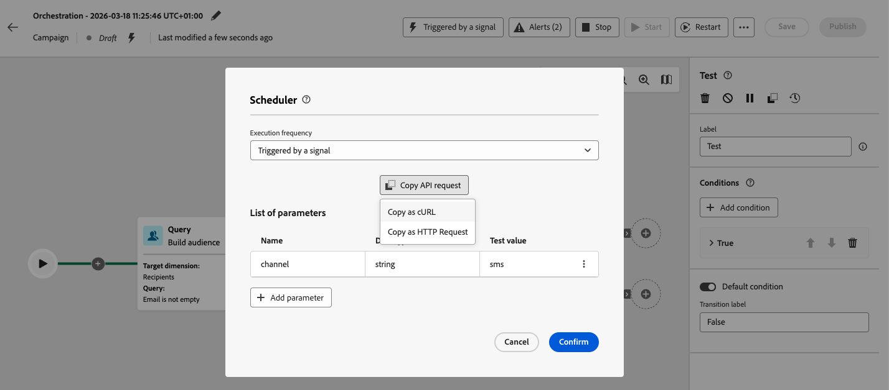

# 使用信号触发编排的营销活动 {#trigger-signal}

您可以通过发送信号而不是按计划运行来触发编排的营销活动。 信号通过来自外部系统或应用程序的API调用发送。 使用信号时，可以传递参数。 然后，它们可在编排的营销活动中作为执行上下文中的事件变量使用 — 用于定位、条件或表达式。

有关触发器端点的完整REST规范（路径、标头、正文、响应和错误），请参阅Adobe Journey Optimizer API文档中的[触发器编排的营销活动API](https://developer.adobe.com/journey-optimizer-apis/references/oc-trigger){target="_blank"}。

使用信号触发编排营销活动的端到端流程：

1. [计划由信号触发的营销活动](#set-an-orchestrated-campaign-to-wait-for-a-signal-configure-signal)
1. [添加信号有效负载的参数](#add-parameters-for-the-signal-payload-optional-parameters)（可选）
1. [构建和测试活动](#build-and-test-the-campaign-build-and-test)
1. [发布并触发营销活动](#publish-and-trigger-the-campaign-publish)

>[!NOTE]
>
>要使用信号触发编排的营销活动，您需要&#x200B;**[!DNL Publish orchestrated campaigns]**&#x200B;权限(`orchestrated-campaign.publish`)。 查看[内置权限](../administration/ootb-permissions.md)。

## 计划由信号触发的营销活动 {#configure-signal}

要将编排的营销活动设置为在信号而不是计划上启动，请执行以下步骤：

1. 使用信号打开要触发的已编排营销活动。

1. 打开计划配置。 [了解如何计划编排的营销活动](create-orchestrated-campaign.md#schedule)。

1. 选择&#x200B;**[!UICONTROL 由信号]**&#x200B;触发，以便营销活动等待信号而不是按计划运行。

   {zoomable="yes"}

## 添加信号有效负载的参数（可选） {#parameters}

您可以在触发信号中传递参数，并在执行上下文中的促销活动中使用这些参数，例如，在定位、条件或表达式中。 首先在计划设置中定义每个参数，然后在调用触发器API时传递其值。

1. 打开活动计划程序并选择&#x200B;**[!UICONTROL 添加参数]**。

1. 定义要在信号有效负载中发送的每个参数的名称和数据类型。 您还可以提供在测试模式下触发营销活动时将使用的&#x200B;**测试值**。 [了解如何测试触发的营销活动](#build-and-test)。

   {zoomable="yes"}

>[!NOTE]
>
>如果您在API调用中传递了未在调度程序中定义的参数，则API调用仍会成功，并且会传播该参数，您可以在表达式中使用它。 但是，编排的活动界面不会帮助您使用它，例如，测试活动不会列出或显示未在调度程序中定义的参数。

## 构建和测试活动 {#build-and-test}

在画布上构建营销活动，然后（可选）在发布之前通过API触发信号，以草稿形式测试营销活动。

1. 在画布上添加并连接活动（受众、定位、投放）。 [了解如何精心策划营销活动](orchestrate-activities.md)

1. 如果您在信号中定义了参数，则可以将它们引入画布逻辑（例如，在条件或定位中）。 在此示例中，“channel”参数用作&#x200B;**[!UICONTROL 测试]**&#x200B;活动中的条件。

   

   要在表达式编辑器中使用信号参数（例如，在&#x200B;**[!UICONTROL 构建受众]**&#x200B;活动中构建查询），请在表达式字段中键入`$(vars/@<parameterName>)`。 将`<parameterName>`替换为调度程序中定义的参数名称，例如`$(vars/@channel)`。 [了解如何使用表达式编辑器](edit-expressions.md)。

1. 打开活动计划程序，选择&#x200B;**[!UICONTROL 复制API请求]**，然后选择格式（cURL或HTTP请求）。

   复制的信息包括编排的营销活动ID、沙盒名称、组织ID以及参数的测试值（如果您已添加某些值）。

   在计划配置中

   +++带参数和测试值的示例cURL请求

   ```bash
   POST https://platform.adobe.io/ajo/campaign-orchestration/orchestratedCampaigns/1c7529c7-7a8c-491a-a2c6-3d8131d2e17d/trigger
   
   Headers:
   Authorization: Bearer ## Access token ##
   Content-Type: application/json
   x-api-key: ## Provide API Key here ##
   x-api-version: 1
   x-gw-ims-org-id: 123456ABCDEFG@LumaOrg
   x-sandbox-name: prod
   
   Body:
   {
   "variables": {
      "channel": "sms"
   }
   }
   ```

   +++

1. 单击&#x200B;**[!UICONTROL 开始]**&#x200B;以开始营销活动。

1. 使用您从调度程序复制的示例请求发送触发器API调用。 有关请求和响应详细信息，请参阅[触发编排的营销活动API](https://developer.adobe.com/journey-optimizer-apis/references/oc-trigger){target="_blank"}。

如果对测试结果满意，[发布营销活动](#publish)。

## 发布并触发营销活动 {#publish}

在您[构建并测试营销活动](#build-and-test)后，发布该营销活动以便从您的应用程序触发它。

1. 在营销活动画布中单击&#x200B;**[!UICONTROL 发布]**。 必须先发布营销策划，然后才能从外部系统触发它。 [了解有关启动和监视营销活动的更多信息](start-monitor-campaigns.md#publish)。

1. 打开活动计划程序，选择&#x200B;**[!UICONTROL 复制API请求]**，然后选择格式（cURL或HTTP请求）。

   复制的信息包括编排的营销活动ID、沙盒名称、组织ID和参数（如果您已添加某些内容）。

   

1. 从系统中调用触发器API。 请参阅[触发编排的营销活动API](https://developer.adobe.com/journey-optimizer-apis/references/oc-trigger){target="_blank"}，了解实时终结点规范。

   >[!IMPORTANT]
   >
   >对于实时编排的营销活动，限制护栏强制在两个API触发器执行之间有&#x200B;**最小一小时间隔**。 如果您在该间隔过去之前再次调用API，则API返回&#x200B;**HTTP 429**&#x200B;错误（请求过多）。 触发草稿版本进行测试时，不应用此护栏。

   如果您向信号有效负载添加了参数，则在营销活动运行时，您在API调用中传递的值将显示为营销活动事件变量。 要检查这些活动，请从活动画布工具栏中打开活动日志。 在&#x200B;**[!UICONTROL 任务]**&#x200B;选项卡中，识别与信号对应的任务，然后单击铅笔图标以访问相关事件变量。 [了解如何访问日志和任务](start-monitor-campaigns.md#logs-tasks)。

   {zoomable="yes"}
