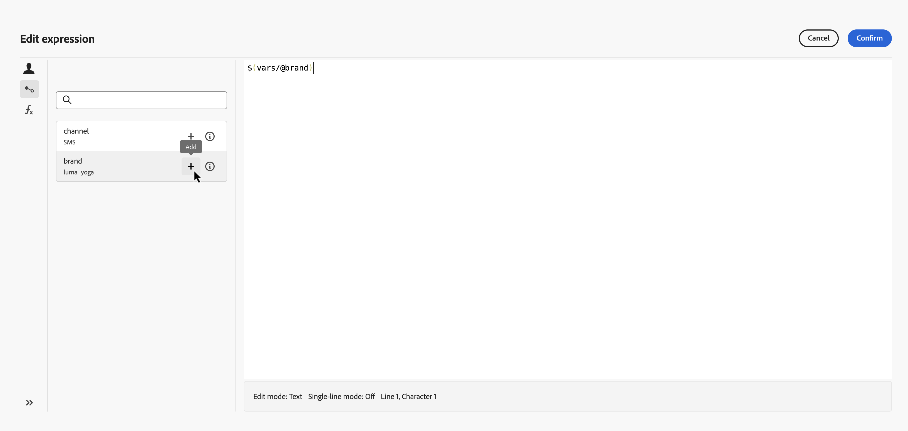

# 在编排的营销活动中使用变量 {#variables-oc}

## 如何设置变量 {#set}

在编排的营销活动中，您可以使用变量，即推动定位的值、**[!UICONTROL 测试]**&#x200B;条件以及其他画布逻辑。 这些值可能来自两个位置：

* **信号** — 如果营销活动计划是&#x200B;**[!UICONTROL 由信号]**&#x200B;触发，则可以在触发营销活动时传递参数。 这些参数将作为该运行的触发式编排营销活动中的变量使用。 [了解如何使用信号触发编排的营销活动](trigger-orchestrated-campaign.md)

* **全局变量** — 您可以使用&#x200B;**[!UICONTROL 编辑变量]**&#x200B;菜单直接在营销活动中定义名称 — 值对，无需API或信号。 [了解如何在编排的营销活动中定义全局变量](global-variables.md)

>[!NOTE]
>
>目前，变量仅支持&#x200B;**text**&#x200B;值。
>
>变量驱动&#x200B;**画布逻辑**（规则、条件），无法用于消息个性化。

## 在画布中使用变量 {#use}

变量在画布上的以下位置可用：

* **规则生成器** — 打开规则的表达式编辑器，并使用&#x200B;**事件变量**&#x200B;选取器选择一个变量并将其引用插入到您的表达式中。 [了解如何编辑表达式](edit-expressions.md)

  在下面的示例中，传入了一个名为`brand`的变量，规则将其用作筛选条件。

  使用事件变量中的品牌变量的{zoomable="yes"}

* **[!UICONTROL 测试]活动** — 当您定义条件时，**[!UICONTROL 条件类型]**&#x200B;下拉列表会与&#x200B;**[!UICONTROL 群体计数]**&#x200B;一起列出范围内的所有变量。 选择一个变量以将其用作测试分支的基础。 [了解如何配置&#x200B;**[!UICONTROL 测试]**&#x200B;活动](activities/test.md)

  在下面的示例中，`channel`变量用于根据流的值将其路由到不同的过渡。

  {zoomable="yes"}
