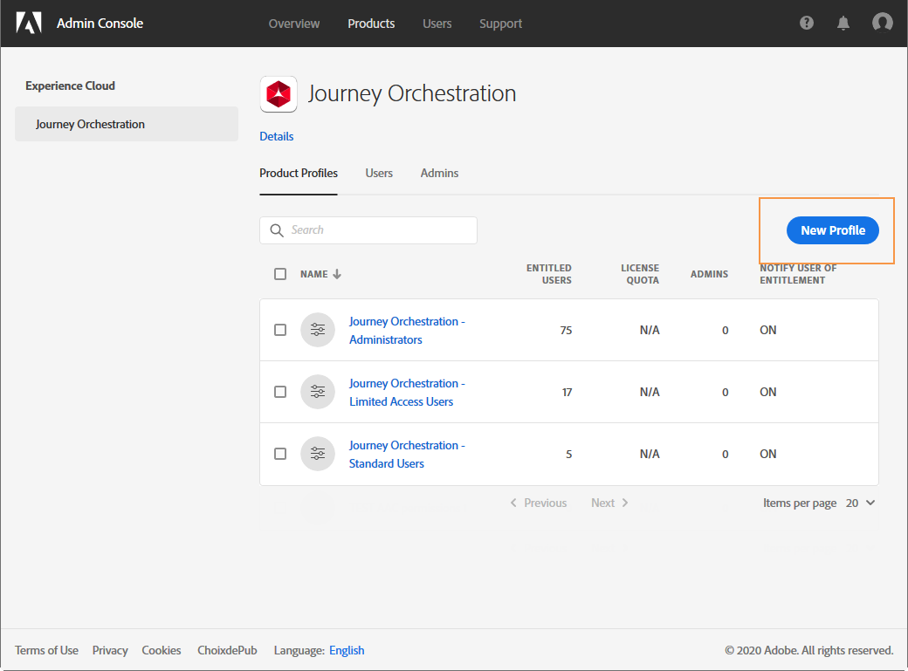
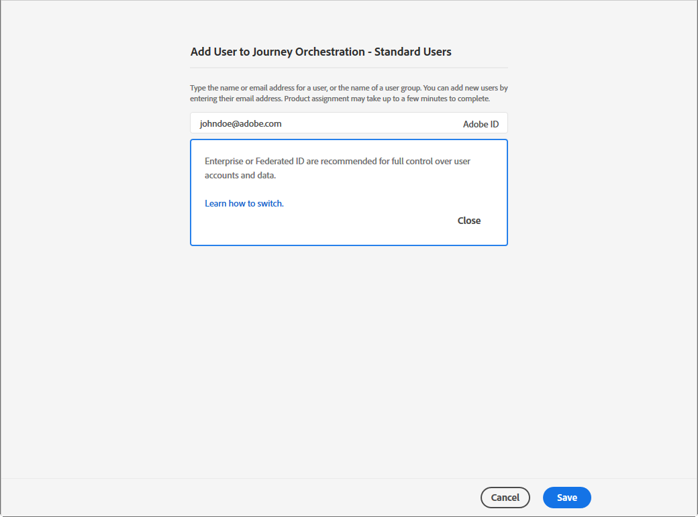

# 管理权限 {#manage-permissions}

## 访问 Journey Optimizer {#access-CJM}

[!DNL Journey Optimizer] 允许您为用户分配一组权限，以定义他们可以访问的界面部分。

他们可由有权访问 Admin Console 的管理员管理。[进一步了解 Adobe Admin Console](https://helpx.adobe.com/cn/enterprise/managing/user-guide.html)。

要能够访问 [!DNL Journey Optimizer]，用户必须是：

* 与权限 [!DNL Journey Optimizer]关联&#x200B;**[!UICONTROL product profile]**&#x200B;的一 [!DNL Journey Optimizer]部分。

* [!DNL Adobe Experience Platform]**[!UICONTROL product profile]** 的一部分。无需强制许可。用户应具有从 [!DNL Journey Optimizer] 界面创建和编辑 Platform 区段的 **[!UICONTROL profile management]** 权限。[进一步了解访问控制](https://experienceleague.adobe.com/docs/experience-platform/access-control/home.html?lang=zh-Hans#adobe-admin-console)。

在 Admin Console 中，您可以向用户分配以下现成的产品用户档案之一：

* **[!UICONTROL Limited Access User]**：对历程和报告具有只读访问权限的用户。此产品用户档案包括以下权限：
   * 阅读历程
   * 阅读报告

* **[!UICONTROL Administrators]**：用户可访问管理菜单，并可以管理历程、事件和报告。此产品用户档案包括以下权限：
   * 管理历程
   * 发布历程
   * 管理事件、数据源和操作
   * 管理报告

* **[!UICONTROL Standard User]**：具有基本访问权限的用户，如历程管理。此产品用户档案包括以下权限：
   * 管理历程
   * 发布历程
   * 管理报告
   * 读取事件、数据源和操作

如果现成的用户档案不足以管理用户，您还可以创建自己的产品用户档案。
用户必须始终链接到产品用户档案，以便您为他们分配特定的内置权限，例如：

* **[!UICONTROL Read journeys]**
* **[!UICONTROL Read reports]**
* **[!UICONTROL Manage events, data sources and actions]**
* **[!UICONTROL Read events, data sources and actions]**
* **[!UICONTROL Manage journeys]**
* **[!UICONTROL Publish journeys]**
* **[!UICONTROL Manage reports]**

>[!NOTE]
>
> 权限管理不包括消息：每个用户都可以创建或修改消息。

### 创建产品用户档案 {#create-product-profile}

[!DNL Journey Optimizer] 允许您创建自己的产品用户档案，并为用户分配一组权限和沙箱。通过产品用户档案，您可以授权或拒绝对界面中特定功能或对象的访问。

有关如何创建和管理沙箱的更多信息，请参阅 [Adobe Experience Platform 文档](https://experienceleague.adobe.com/docs/experience-platform/sandbox/ui/user-guide.html?lang=zh-Hans)。

要创建产品用户档案并分配一组权限和沙箱，请执行以下操作：

1. 在 Admin Console 中，选择 **[!UICONTROL Journey Orchestration]**。在选项卡 **[!UICONTROL Product profile]** 中，单击 **[!UICONTROL New Profile]**。

   

1. 为新的产品用户档案添加 **[!UICONTROL Profile Name]** 和 **[!UICONTROL Description]**。如果希望用户档案的 **[!UICONTROL Display name]** 不同，请取消选中 **[!UICONTROL Same as Profile Name]** 并键入 **[!UICONTROL Display name]**。

1. 在类别 **[!UICONTROL User Notifications]** 中，选择在添加用户或从此产品用户档案中删除用户时，是否会通过电子邮件通知用户。

1. 完成后，单击 **[!UICONTROL Done]**。您的新产品用户档案现已创建。

   

1. 选择您的新产品用户档案以开始管理权限。在选项卡 **[!UICONTROL Users]** 中，将用户添加到您的产品用户档案。[了解如何分配产品用户档案](permissions.md#assigning-product-profile)。

1. 执行与上述步骤相同的步骤，以将 **[!UICONTROL Admin]** 添加到您的产品用户档案。

1. 从 **[!UICONTROL Permissions]** 选项卡中，选择两个类别 **[!UICONTROL Sandbox]** 或 **[!UICONTROL Authoring]** 之一，打开 **[!UICONTROL Edit Permissions]** 页面并添加或删除您的产品用户档案的权限。

   

1. 在 **[!UICONTROL Sandboxes]** 权限类别中，选择要分配给产品用户档案的沙箱。在 **[!UICONTROL Available Permissions Items]** 下，单击加号 (+) 图标，将沙箱分配给用户档案。[进一步了解沙箱](https://experienceleague.adobe.com/docs/experience-platform/sandbox/home.html?lang=zh-Hans)。

   

1. 如果需要，请在 **[!UICONTROL Included Permission Items]** 下，单击删除您的产品用户档案权限旁边的 X 图标。

   

1. 在 **[!UICONTROL Authoring]** 权限类别中，执行与上述步骤相同的步骤，向产品用户档案添加权限。

   

1. 完成后，单击 **[!UICONTROL Save]**。

您的产品用户档案现已创建并配置。链接到此用户档案的用户现在可以连接到 [!DNL Journey Optimizer]。

### 分配产品用户档案 {#assigning-product-profile}

产品用户档案会分配给您组织内共享相同权限的一组用户。本部分提供每个现成产品用户档案及已分配权限的列表。

要为用户分配产品用户档案以访问历程，请执行以下操作：

1. 在 Admin Console 中，选择 **[!UICONTROL Journey Orchestration]**。

   

1. 选择新用户将链接到的产品用户档案。

   

1. 单击 **[!UICONTROL Add user]**。

   您还可以将新用户添加到用户组以微调共享的权限集。[进一步了解用户组](https://helpx.adobe.com/cn/enterprise/using/user-groups.html)。

   

1. 键入新用户的电子邮件地址，然后单击 **[!UICONTROL Save]**。

   

随后，您的用户将收到一封重定向到您的实例的电子邮件。

## 使用沙箱 {#sandboxes}

[!DNL Journey Optimizer] 允许您将实例分区为称为沙箱的分隔虚拟环境。
沙箱通过 Admin Console 中的产品用户档案进行分配。[了解如何分配沙箱](permissions.md#create-product-profile)。

[!DNL Journey Optimizer] 反映为给定组织创建的 Adobe Experience Platform 沙箱。
可以从 Adobe Experience Platform 实例创建或重置 Adobe Experience Platform 沙箱。[在沙箱用户指南中了解详情](https://experienceleague.adobe.com/docs/experience-platform/sandbox/ui/user-guide.html?lang=zh-Hans)。

您可以在屏幕左上角找到沙箱切换器控件。要从一个沙箱切换到另一个沙箱，请单击切换器中当前活动的沙箱，然后从下拉列表中选择另一个沙箱。

## 访问内容{#content-access}

要配置内容辅助功能，您需要为每个沙箱分配一个内容共享文件夹。您可以在 [!DNL Admin Console] 中显示的 **[!UICONTROL Storage]** 选项卡中为管理员创建和配置共享文件夹。如果您对 [!DNL Admin Console] 拥有系统管理员访问权限，则可以创建共享文件夹并向它们添加具有不同访问级别的代表。

请注意，要使内容与正确的沙箱同步，您必须遵循与沙箱相同的语法，例如，如果沙箱命名为“development”，则共享文件夹应具有相同的名称。

[了解如何管理共享文件夹](https://helpx.adobe.com/cn/enterprise/admin-guide.html/enterprise/using/manage-adobe-storage.ug.html)。

## Assets Essentials 权限{#assets-permissions}

Adobe Experience Manager Assets Essentials 提供了单一集中式资源存储库，您可以使用它来填充消息。
每个资源都保存在文件夹或子文件夹中。您可以选择共享文件夹以及要分配的访问权限级别。

1. 在 **[!UICONTROL Assets]** 选项卡中，浏览您的文件夹以找到您需要共享的文件夹。

1. 选择您的文件夹或资源，然后单击 **[!UICONTROL Share]**。

   

1. 输入要与您共享文件夹访问权限的其他人的电子邮件地址。

1. 在不同的访问级别之间进行选择：

   * **[!UICONTROL Can view]**
   * **[!UICONTROL Can edit]**
   * **[!UICONTROL Has ownership (can share, edit, and delete)]**

   

1. 如果需要，可向邀请添加消息。

1. 单击 **[!UICONTROL Invite]**。

   
