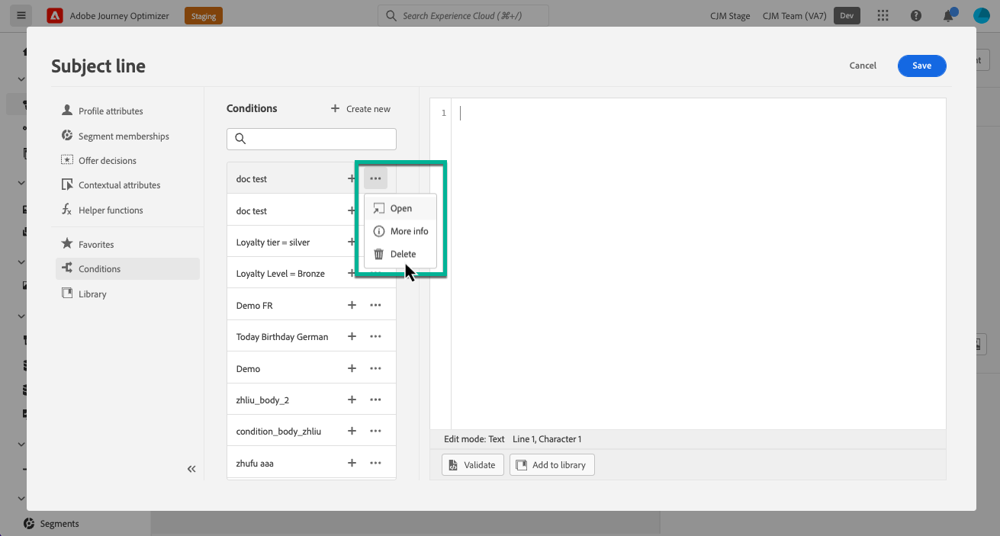

# 使用条件规则 {#conditions}

>[!BEGINSHADEBOX]

**在此页面上：**&#x200B;了解如何在个性化编辑器中根据配置文件属性、上下文事件和受众构建条件规则，并将它们保存到库以供在内容中重用。

>[!ENDSHADEBOX]

条件规则是一组规则，用于定义应在消息中显示哪些内容，具体取决于用户档案属性、受众成员资格或上下文事件等各种条件。

条件规则是使用个性化编辑器创建的，如果要在内容中重复使用，可以存储这些规则。 [了解如何将条件规则保存到库](#save)

>[!NOTE]
>
>个人需要[管理库项目](../administration/ootb-product-profiles.md)权限才能保存或删除条件规则。 保存后的条件可供组织内的所有用户使用。

## 访问条件规则生成器 {#access}

条件规则是从个性化编辑器中的&#x200B;**[!UICONTROL 条件]**&#x200B;菜单创建的，该菜单可通过以下任一方式访问：

* 在电子邮件Designer中，为电子邮件正文中的组件启用动态内容时。 [了解如何将动态内容添加到电子邮件中](dynamic-content.md#emails)

  

* 在可以使用[个性化编辑器](personalization-build-expressions.md)添加个性化的任何字段中。

  

## 创建条件规则 {#create-condition}

>[!CONTEXTUALHELP]
>id="ajo_expression_editor_conditions_create"
>title="创建条件"
>abstract="结合轮廓属性、上下文事件或受众来生成规则，以定义应在消息中显示哪些内容。"

>[!CONTEXTUALHELP]
>id="ajo_expression_editor_conditions"
>title="创建条件"
>abstract="结合轮廓属性、上下文事件或受众来生成规则，以定义应在消息中显示哪些内容。"

创建条件规则的步骤如下：

1. 从个性化编辑器或电子邮件Designer访问&#x200B;**[!UICONTROL 条件]**&#x200B;菜单，然后单击&#x200B;**[!UICONTROL 新建]**。

1. 根据需要构建条件规则。 为此，请将左侧菜单中的所需属性拖放并排列到画布中。

   将属性组合到画布中的步骤与区段构建体验类似。 有关如何使用规则生成器画布的更多信息，请参阅[此文档](https://experienceleague.adobe.com/docs/experience-platform/segmentation/ui/segment-builder.html#rule-builder-canvas)。

   

   属性分为三个选项卡：

   * **[!UICONTROL 配置文件]**：
      * **[!UICONTROL 受众]**&#x200B;列出了所有受众属性（即状态、版本等） 对于[Adobe Experience Platform分段服务](https://experienceleague.adobe.com/docs/experience-platform/segmentation/home.html?lang=zh-Hans){target="_blank"}，
      * **[!UICONTROL XDM个人配置文件]**&#x200B;列出了与Adobe Experience Platform中定义的[Experience Data Model (XDM)架构](https://experienceleague.adobe.com/docs/experience-platform/xdm/home.html?lang=zh-Hans){target="_blank"}关联的所有配置文件属性。
   * **[!UICONTROL 上下文]**：在历程中使用消息时，可通过此选项卡使用上下文历程字段。
   * **[!UICONTROL 受众]**：列出从[Adobe Experience Platform分段服务](https://experienceleague.adobe.com/docs/experience-platform/segmentation/home.html?lang=zh-Hans){target="_blank"}中创建的区段定义生成的所有受众。

1. 条件规则准备就绪后，可将其添加到消息以创建动态内容。 [了解如何添加动态内容](dynamic-content.md)

   您还可以保存规则以便进一步重复使用。 [了解如何保存条件](#save)

## 保存条件规则 {#save}

如果存在要经常重复使用的条件规则，则可以将它们保存到条件库中。 所有保存的规则都将共享，并可由组织内的个人访问和使用。

>[!NOTE]
>
>无法将利用历程上下文属性的条件规则保存到库。

1. 在条件版本屏幕中，单击&#x200B;**[!UICONTROL 保存条件]**&#x200B;按钮。

1. 为规则提供名称和描述（可选），然后单击&#x200B;**[!UICONTROL 添加]**。

   

1. 条件规则将保存到库。 您现在可以使用它在消息中创建动态内容。 [了解如何添加动态内容](dynamic-content.md)

>[!CAUTION]
>
>在命名条件内容变量时，请仅使用字母数字字符(A-Z、a-z、0-9)。 使用特殊字符（如`<`、`>`、`=`、`{`、`}`等） 在变体名称中，可能会导致模板编辑器中断或隐藏组件。

## 编辑和删除已保存的条件规则 {#edit-delete}

您可以随时使用省略号按钮删除条件规则。

无法修改保存到库的条件规则。 但是，您仍可以使用它们创建新规则。 为此，请打开条件规则，进行所需的更改，然后将其保存到库。 [了解如何将条件保存到库](#save)

## 快速参考 {#quick-reference}

本节包含结构化知识，用于支持与本主题相关的解释、检索和问答。

要全面了解相关信息，应将此信息与本页上的文档相结合。 这两个源都不是独立的；页面描述了功能，而本节提供了其他上下文来帮助消除术语、意图、适用性和约束条件的歧义。

>[!BEGINTABS]

>[!TAB 概述]

**TL；DR**

本页介绍如何在个性化编辑器中根据配置文件属性、上下文事件和受众构建条件规则，以及如何将它们保存到库以供在消息内容中重复使用。

**意图**

* 从个性化编辑器或电子邮件Designer访问条件规则生成器
* 通过组合配置文件属性、受众成员资格和上下文历程字段来构建条件规则
* 向消息添加条件规则以创建动态内容
* 将条件规则保存到条件库以供在组织内重复使用
* 编辑或删除已保存的条件规则

>[!TAB 术语表]

* **条件规则**：一组规则，用于根据用户档案属性、受众成员资格或上下文事件等条件定义应在消息中显示的内容。 *（产品特定）*
* **条件库**：组织内的共享存储库，保存了条件规则以供所有用户访问。 *（产品特定）*
* **动态内容**：其显示受条件规则控制的消息内容。 *（产品特定）*
* **上下文字段**：在旅程中使用消息时，历程生成器中可用的特定于规则的字段；使用这些字段的规则无法保存到库。
* **XDM个人配置文件**：与Adobe Experience Platform中定义的Experience Data Model (XDM)架构关联的配置文件属性可用作规则条件。

>[!TAB 术语]

* **规范名称：**&#x200B;条件规则 — 变体：条件、条件、条件内容规则
* **同义词：** &quot;conditional rule&quot; = &quot;condition&quot; （在UI中标记）
* **请勿混淆：** “配置文件”选项卡（包含“受众”属性和XDM个人资料子部分）≠“受众”选项卡（列出了从AEP分段服务中的区段定义生成的所有受众）
* **请勿混淆：** “保存条件”（将规则存储到共享库）≠“创建条件”（在编辑器中构建新规则）

>[!TAB 护栏和限制]

* 利用历程上下文属性的条件规则无法保存到条件库。
* 只有具有&#x200B;**管理库项目**&#x200B;权限的用户才能从库中保存或删除条件规则。
* 保存的状态可供组织内的所有用户共享和访问。
* 无法直接修改保存到库的条件规则；请打开该规则，进行所需的更改，然后将其保存到库。
* 变体名称只能使用字母数字字符(A - Z、a - z、0 - 9)；特殊字符（如`<`、`>`、`=`、`{`、`}`）可能会导致模板编辑器中断或隐藏组件。

>[!TAB 常见问题解答]

**问：可以使用哪些条件来构建条件规则？**

用户档案属性、受众成员资格和上下文历程字段（在历程中使用消息时）。

**问：能否保存使用历程上下文属性的条件规则？**

没有。 利用历程上下文属性的条件规则无法保存到条件库。

**问：谁可以保存或删除库中的条件规则？**

只有具有&#x200B;**管理库项目**&#x200B;权限的用户才能保存或删除条件规则。

**问：是否可以修改已保存到库的条件规则？**

无法直接修改保存到库的条件规则。 您可以打开保存的规则，进行所需的更改，然后将其保存到库。

**问：命名条件内容变体是否存在限制？**

是的。 变体名称必须只包含字母数字字符(A-Z、a-z、0-9)。 特殊字符（如`<`、`>`、`=`、`{`、`}`）可能会导致模板编辑器中断或隐藏组件。

>[!ENDTABS]

<!-- ai-section-version: 1 | source-hash: f375658d -->
