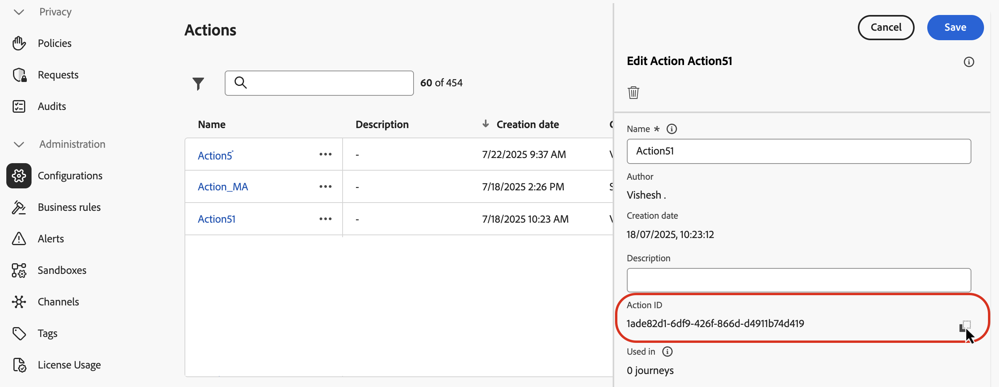
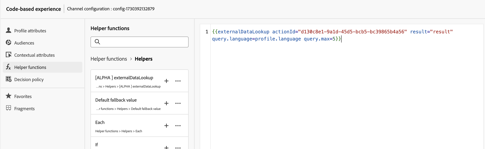
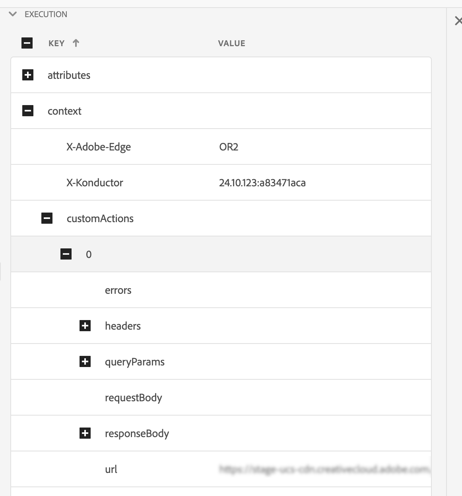

# 外部数据查找帮助程序

>[!BEGINSHADEBOX]

**在此页面上：**&#x200B;了解如何使用externalDataLookup帮助程序从外部端点动态获取数据，并对Adobe Journey Optimizer中的入站渠道内容进行个性化。

>[!ENDSHADEBOX]

[!DNL Journey Optimizer]个性化编辑器中的`externalDataLookup`帮助程序可用于从外部端点动态获取数据，以用于生成入站渠道（如基于代码的体验、Web和应用程序内消息渠道）的内容。

>[!AVAILABILITY]
>
>此功能仅面向一部分组织（限量发布）。

若要使用辅助函数，必须先在&#x200B;**[!UICONTROL 管理]** > **[!UICONTROL 配置]**&#x200B;菜单中定义操作。 在操作中，您可以配置有关外部端点的详细信息，例如URL、GET与POST方法、标头参数、查询参数、POST主体JSON架构和响应JSON架构。

定义操作后，可将其同时用于：

* 在历程中，在自定义操作活动中获取内容，
* 在历程和入站营销活动中，在externalDataLookup帮助程序中获取入站操作中的数据。

## 护栏和限制

另请参阅[!DNL Journey Optimizer]入站渠道营销活动和#GuardrailsandGuidelines中的自定义操作。

* **默认超时** — 默认情况下，[!DNL Journey Optimizer]在调用外部终结点时使用300毫秒的超时。 请联系您的Adobe代表以增加端点的此超时。
* **响应架构浏览和表达式验证** — 在个性化编辑器中，插入表达式时无法浏览终结点响应的架构。 [!DNL Journey Optimizer]不验证表达式中使用的响应中对JSON属性的引用。
* **参数支持的数据类型** — 通过externalDataLookup帮助程序替换的有效负载变量参数支持的数据类型是`String`、`Integer`、`Decimal`、`Boolean`、`listString`、`listInt`、`listInteger`、`listDecimal`。
* **自动刷新更新的操作** — 对操作配置所做的更改未反映在实时营销活动和历程中的相应externalDataLookup调用中。 为了反映更改，您需要复制或修改任何在externalDataLookup帮助程序中使用操作的实时活动或历程。
* **变量替换** — 目前，在externalDataLookup帮助程序参数中不支持使用变量。
* **动态路径** — 目前，不支持动态URL路径。
* **多通道呈现** — 支持多通道呈现。
* **身份验证** — 目前，externalDataLookup帮助程序不支持Action配置中的身份验证选项。 同时，对于基于API密钥的身份验证或其他纯文本授权密钥，您可以在操作配置中将它们指定为标头字段。

## 配置操作并使用帮助程序

要定义操作并使用辅助器进行个性化，请执行以下步骤：

1. 创建操作以配置查找的端点。 每个端点只需执行一次此操作，应由技术用户执行。 [了解如何配置自定义操作](../action/about-custom-action-configuration.md)

   记下操作ID并复制它。

   

1. 创建入站营销活动或历程操作。 对于此示例，我们将说明如何在基于代码的体验JSON操作中使用externalDataLookup帮助程序，但它可用于任何入站渠道的个性化字段。

1. 编辑操作的内容，转到个性化编辑器中的辅助函数，然后导航到&#x200B;**[!UICONTROL 辅助函数]** > **[!UICONTROL 辅助函数]**。

1. 单击`+`按钮插入externalDataLookup帮助程序。 帮助程序表达式插入到编辑器中，带有`actionId`和`result`的占位符值。

   

   按如下方式替换占位符值：

   * `actionId`：粘贴先前复制的操作ID。
   * `result`：设置您选择的名称。 您将使用此结果变量来访问获取的内容。

1. 添加任何要在端点调用中传递的变量参数值。 例如，下面是如何传递语言参数和max items参数的。

   

1. 使用结果变量访问获取的数据，并将其插入到集客操作的内容中。 例如，下面显示了如何返回从端点获取的项目的JSON数组。

   

## 工作原理

### 运行时执行

当入站操作包含externalDataLookup帮助程序时，将在AEP Edge Network接收并处理[!DNL Journey Optimizer]个性化请求时动态调用端点。

这意味着外部端点需要能够处理的并发负载和吞吐量至少与客户端为给定表面向AEP Edge Network发送的并发负载和吞吐量相同。

### 句法

`{{externalDataLookup actionId="d130c8e2-9a2d-45d5-bcb6-bc39865b4a56" result="result" optional-parameters...}}`

### 传递参数

调用外部端点时，将使用Action配置中给定的值发送在Action中定义的所有常量标头值、查询参数和请求有效负载值。

对于任何变量标头值、查询/路径参数或请求有效负载值，您可以使用参数将值动态传递到externalDataLookup帮助程序。

参数名称：

* 标头参数： `header.<parameter-name>`
* 查询参数： `query.<parameter-name>`
* 有效负载参数： `payload.<parameter-name>`
* 路径参数： `dynamic_path.<parameter-name>`

例如：

```
{{externalDataLookup actionId="..." result="result" header.myHeaderParameter="value1" query.myQueryParameter="value2" payload.myPayloadParameter="value3"}}`
```

参数值可以是固定值，也可以通过引用配置文件字段或其他上下文属性对其进行个性化，例如：

```
{{externalDataLookup actionId="..." result="result" query.myQueryParameter=profile.myProfileValue}}
```

可以使用点表示法提供有效负荷参数以引用嵌套的JSON属性，例如：

```
{{externalDataLookup actionId="..." result="result" payload.context.channel="web"}}
```

### 访问结果

要访问从外部端点查找调用获取的数据，您可以使用个性化表达式和帮助程序函数引用操作定义中响应有效载荷中定义的字段。

例如，如果操作中的响应有效负载如下所示：

```
{
    "videos": [
        {
            "id": "integer",
            "title": "string",
            "description": "string",
            "thumbnail_url": "string",
            "video_page_url": "string",
            "url": "string",
            "video_type": "string",
            "start_timestamp": "dateOnly",
            "created_on": "dateOnly",
            ...
        }
    ]
}
```

例如，您可以在基于代码的Experience HTML操作中获取并访问第一个视频的描述，如下所示：

```
{{externalDataLookup actionId="d130c8e2-9a2d-45d5-bcb6-bc39865b4a56" result="result"}}
 
First video description: <b>result.videos[0].description</b>
```

例如，您可以获取并循环访问这些项，以便在基于代码的体验JSON操作中返回项数组，如下所示：

```
{{externalDataLookup actionId="d130c8e2-9a2d-45d5-bcb6-bc39865b4a56" result="result"}}
 
[
{{#each result.videos as |item|}}
    {                                                  
        "title": "{{item.title}}",
        "url": "{{item.video_page_url}}",
        "thumbnail_url": "{{item.thumbnail_url}}",
        "start_timestamp": "{{item.start_timestamp}}"
    },
{{/each}}
]
```

## 故障排除

### 超时和错误处理

[!DNL Journey Optimizer]在调用外部端点时使用严格的超时来维护Adobe Experience Platform Edge Network的低延迟、高吞吐量的性能特征。

如果端点超时或存在任何其他类型的错误到达端点，则结果变量将为空。 在这种情况下，对结果变量中属性的任何引用也将为空。 如果您只是在内容中显示属性，则会显示为空白。 如果尝试循环遍历结果中的数组属性，则不会返回任何项。

如果您希望通过显示回退内容来更正常地处理超时或错误，则可以检查查找结果是否为空，并在该情况下显示回退内容。

例如，您可以为单个属性显示一个回退值，如下所示：

```
First video description: 
```

或者，您可以有条件地呈现整个内容块，如下所示：

```
{{externalDataLookup actionId="d130c8e2-9a2d-45d5-bcb6-bc39865b4a56" result="result"}}
 

   ... do something with result ...

    ... return fallback content ...

```

### 调试

为帮助进行调试，外部数据查找的超时和错误详细信息包含在Adobe Experience Platform Assurance的Edge Delivery视图中。 如果在入站操作中未看到externalDataLookup帮助程序的预期结果，则可启动Assurance会话，从Web或移动设备实施启动[!DNL Journey Optimizer]调用，并使用Edge Delivery视图检查超时或错误详细信息。

例如：

在执行详细信息中，在Edge Delivery保证跟踪部分下添加了新的customActions块，其中包含与以下内容类似的请求和响应详细信息。 如果在执行自定义操作时出现任何问题，则错误部分将有助于进行调试



## 常见问题 {#faq-external-data}

下面是有关外部数据查找帮助程序的常见问题解答。

需要更多信息？ 使用本页底部的反馈选项提出问题，或通过 [Adobe Journey Optimizer 社区](https://experienceleaguecommunities.adobe.com/t5/adobe-journey-optimizer/ct-p/journey-optimizer?profile.language=zh-hans){target="_blank"}进行联系。

+++ 如何将上下文属性作为参数从请求传递到外部数据查找？

使用上下文属性>数据流>事件菜单浏览您所使用的体验事件架构，并将相关属性作为参数值插入，如下所示：

```
{{externalDataLookup actionId="..." result="result" query.myQueryParameter=context.datastream.event.<schemaId>.my.xdm.attribute}}
```

+++

+++ [!DNL Journey Optimizer]是否执行任何外部终结点响应缓存？

当前不是。 此功能将在将来受支持。

+++

## 快速参考 {#quick-reference}

本节包含结构化知识，用于支持与本主题相关的解释、检索和问答。

要全面了解相关信息，应将此信息与本页上的文档相结合。 这两个源都不是独立的；页面描述了功能，而本节提供了其他上下文来帮助消除术语、意图、适用性和约束条件的歧义。

>[!BEGINTABS]

>[!TAB 概述]

**TL；DR**

此页说明如何为外部端点配置操作，并在个性化编辑器中使用`externalDataLookup`帮助程序在运行时动态获取该数据，以个性化入站渠道内容。

**意图**

* 配置定义外部端点的操作（URL、HTTP方法、参数、请求/响应架构）
* 在入站操作的个性化表达式中插入`externalDataLookup`帮助程序
* 在调用时将变量标头、查询、有效负载或路径参数传递到外部端点
* 使用个性化表达式和辅助函数，通过结果别名访问获取的数据
* 使用回退内容模式轻松处理超时和错误
* 使用Adobe Experience Platform Assurance调试外部查找问题

>[!TAB 术语表]

* **externalDataLookup**：个性化编辑器中的辅助函数，可在请求时动态从配置的外部端点获取数据，用于入站渠道内容个性化。 *（产品特定）*
* **操作**： Journey Optimizer中的配置对象（“管理”>“配置”），它定义了外部端点 — URL、HTTP方法、标头/查询参数、POST主体架构和响应架构。 使用`externalDataLookup`之前必需。 *（产品特定）*
* **结果变量**：在`externalDataLookup`调用中分配的任意别名；用于在后续个性化表达式中引用所获取响应中的所有字段。
* **入站渠道**：用户打开界面时按需交付内容的渠道 — 基于代码的体验、Web、应用程序内消息。 *（产品特定）*
* **AEP Edge Network**：在运行时接收个性化请求并触发外部数据查找调用的基础结构。

>[!TAB 术语]

* **规范名称：** externalDataLookup — 变体：外部数据查找、外部数据查找帮助程序、外部数据查找帮助程序
* **同义词：** &quot;externalDataLookup&quot; = &quot;external data lookup helper&quot;
* **请勿混淆：** `actionId` （已配置操作的ID，用于标识外部终结点）≠`result` （获取的响应数据的别名）≠参数名称（调用时传递给终结点的变量值）
* **不要混淆：**&#x200B;在入站个性化操作（在Edge Network请求时动态获取数据）≠在历程活动中使用自定义操作（获取历程流中的内容）中使用`externalDataLookup`

>[!TAB 护栏和限制]

* 该功能仅在有限可用状态中提供 — 仅适用于一组组织。
* 外部端点调用的默认超时：300毫秒（默认；请联系您的Adobe代表以提高特定端点的此超时）。
* 个性化编辑器不支持浏览响应架构；Journey Optimizer不会验证表达式中使用的响应中对JSON属性的引用。
* 有效负荷变量参数支持的数据类型： `String`、`Integer`、`Decimal`、`Boolean`、`listString`、`listInt`、`listInteger`、`listDecimal`。
* 当前不支持`externalDataLookup`帮助程序参数中的变量替换。
* 当前不支持动态URL路径。
* `externalDataLookup`当前不支持操作配置中的身份验证选项；解决方法是使用基于API密钥或纯文本授权的标头字段。
* 对操作配置的更改不会反映在使用该操作的实时营销活动或历程中；复制或修改任何实时营销活动/历程以应用更改。
* 支持多遍渲染。
* Journey Optimizer当前不缓存外部端点响应。
* 对于给定表面，外部端点必须能够处理至少与发送到AEP Edge Network的入站流量一样多的并发负载和吞吐量。

>[!TAB 常见问题解答]

**问：如果外部终结点超时或返回错误，会发生什么情况？**

结果变量将为空。 结果中的属性引用将显示为空白，而数组迭代将不返回任何项。 使用后备内容模式（如单个属性使用`?: "none found"`，整个内容块使用`……`）来正常处理这些情况。

**问：如何将上下文属性作为参数从请求传递到外部数据查找？**

使用个性化编辑器中的上下文属性>数据流>事件菜单浏览体验事件架构，并将相关属性作为参数值插入，例如： `query.myQueryParameter=context.datastream.event.<schemaId>.my.xdm.attribute`。

**问：Journey Optimizer是否缓存外部终结点响应？**

当前不是。 以后将支持缓存。

**问：如何调试externalDataLookup的问题？**

使用Adobe Experience Platform Assurance。 启动Assurance会话，从Web或移动实施启动Journey Optimizer调用，并使用Edge Delivery视图检查customActions块以了解超时或错误详细信息。

**问：能否在Action配置中使用externalDataLookup的身份验证？**

当前不支持操作配置中的身份验证选项。 对于基于API密钥或其他纯文本授权，请在操作配置中将凭据指定为标头字段。

>[!ENDTABS]

<!-- ai-section-version: 1 | source-hash: a3ce801a -->
