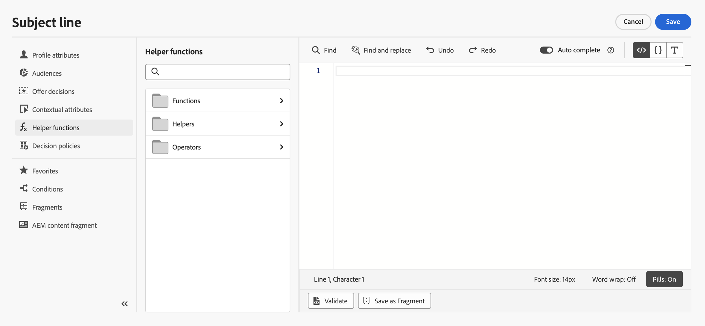

# 帮助程序函数入门{#functionsL}

使用 [!DNL Journey Optimizer] 模板语言，用于对数据执行操作，如计算、数据格式或转化、条件等，并在个性化环境中处理它们。 了解中的个性化语法准则 [本页](../personalization-syntax.md).

➡️ [了解如何使用帮助程序函数](#video) （视频）

模板语言在表达式编辑器的个性化下拉列表中提供的帮助程序函数中使用，如下所示：

在 [!DNL Journey Optimizer] 表达式编辑器中，帮助程序函数分为三类： [函数](#functions-helper), [帮助者](#helper-helper) 和 [运算符](#operators-helper).

选择类别以访问子类别和函数。

通过单击 `>` 图标。 通过单击 `+` 图标：函数会自动添加到个性化屏幕中。

单击 `...` 图标，以查看函数的描述并将其添加到收藏夹。 [了解详情](../personalize.md#fav)

## 函数{#functions-helper}

### 数组函数

<table>
    <tr>
        <td><a href="aggregation.md#average">平均</a></td><td>此函数返回数组中所有选定值的算术平均值</td>
    </tr>
    <tr>
        <td><a href="arrays-list.md#in">在</a></td><td>此函数用于确定某个项目是否是数组或列表的成员</td>
    </tr>
    <tr>
        <td><a href="aggregation.md#min">最小</a></td><td>此函数返回数组中所有选定值的最小值</td>
    </tr>
    <tr>
        <td><a href="aggregation.md#count">计数</a></td><td>此函数返回给定数组中的元素数</td>
    </tr>
    <tr>
        <td><a href="arrays-list.md#includes">包括</a></td><td>此函数确定数组或列表是否包含给定项</td>
    </tr>
    <tr>
        <td><a href="arrays-list.md#notin">不在</a></td><td>此函数确定某个项目是否不是数组或列表的成员</td>
    </tr>
    <tr>
        <td><a href="arrays-list.md#distinct">非重复</a></td><td>此函数从数组或删除了重复值的列表中获取值</td>
    </tr>
    <tr>
        <td><a href="arrays-list.md#intersects">Intersects</a></td><td>此函数确定两个数组或列表是否至少具有一个公共成员</td>
    </tr>
    <tr>
        <td><a href="arrays-list.md#subset">子集</a></td><td>此函数确定特定数组（数组A）是否是另一数组（数组B）的子集，即数组A中的所有元素是否为数组B的元素</td>
    </tr>
    <tr>
        <td><a href="arrays-list.md#head">第一项</a></td><td>此函数返回数组或列表中的第一个项目</td>
    </tr>
    <tr>
        <td><a href="arrays-list.md#last-n">数组中的最后n位</a></td><td>此函数返回数组中最后一个“N”项（当根据给定的数值表达式以升序排序时）</td>
    </tr>
    <tr>
        <td><a href="aggregation.md#sum">总和</a></td><td>此函数返回数组内所有选定值的总和</td>
    </tr>
    <tr>
        <td><a href="arrays-list.md#first-n">阵列中的第一个n</a></td><td>此函数返回数组中的第一个“N”项（当根据给定的数值表达式以升序排序时）</td>
    </tr>
    <tr>
        <td><a href="aggregation.md#max">最大值</a></td><td>此函数返回数组中所有选定值的最大值</td>
    </tr>
    <tr>
    <td><a href="arrays-list.md#superset">超集</a></td><td>此函数确定特定数组（数组A）是否是另一数组（数组B）的超集，即该数组A是否包含数组B中的所有元素</td>
    </tr>
</table>

### 日期时间函数{#date-functions}

<table>
    <tr>
        <td><a href="dates.md#age">年龄</a></td><td>此函数从给定日期检索年龄</td>
    </tr>
    <tr>
        <td><a href="dates.md#current">当前时间（以毫秒为单位）</a></td><td>此函数以新纪元毫秒为单位检索当前时间</td>
    </tr>
    <tr>
        <td><a href="dates.md#date-diff">日期差异</a></td><td>此函数以天为单位检索两个日期之间的差异</td>
    </tr>
    <tr>
        <td><a href="dates.md#day-week">每周的某一日</a></td><td>此函数检索每周时间</td>
    </tr>
    <tr>
        <td><a href="dates.md#day-year">每年的某一日</a></td><td>此函数检索每年的某天</td>
    </tr>
    <tr>
        <td><a href="dates.md#format-date">格式日期</a></td><td>此函数可设置日期时间值的格式</td>
    </tr>
    <tr>
        <td><a href="dates.md#set-days">设置天数</a></td><td>此函数设置给定日期时间在月中的某天</td>
    </tr>
    <tr>
        <td><a href="dates.md#set-hours">设置天数</a></td><td>此函数设置日期时间的小时数</td>
    </tr>
    <tr>
        <td><a href="dates.md#to-utc">到UTC</a></td><td>此函数将日期时间转换为UTC</td>
    </tr>
    <tr>
        <td><a href="dates.md#week-of-year">每年的某一周</a></td><td>此函数返回一年中的某周</td>
    </tr>
</table>
</table>

### 映射函数

<table>
    <tr>
        <td><a href="maps.md#get">获取</a></td><td>此函数用于检索给定键的映射值</td>
    </tr>
    <tr>
        <td><a href="maps.md#keys">键</a></td><td>此函数用于检索给定映射的所有键</td>
    </tr>
    <tr>
        <td><a href="maps.md#values">值</a></td><td>此函数可检索给定映射的所有值</td>
    </tr>
</table>

**对象函数**

<table>
    <tr>
        <td><a href="objects.md#isNotNull">不为空</a></td><td>此函数用于确定对象引用是否存在</td>
    </tr>
    <tr>
        <td><a href="objects.md#isNull">为null</a></td><td>此函数用于确定对象引用是否不存在</td>
    </tr>
</table>

### 字符串函数

<table>
    <tr>
        <td><a href="string.md#camelCase">驼峰</a></td><td>此函数用于大写字符串中每个单词的第一个字母</td>
    </tr>
    <tr>
        <td><a href="string.md#concat">Concat</a></td><td>此函数用于将两个字符串合并为一个</td>
    </tr>
    <tr>
        <td><a href="string.md#contains">Contains</a></td><td>此函数用于确定字符串是否包含指定的子字符串</td>
    </tr>
    <tr>
        <td><a href="string.md#doesNotContain">不包含</a></td><td>此函数用于确定字符串是否不包含指定的子字符串</td>
    </tr>
    <tr>
        <td><a href="string.md#doesNotEndWith">不以结尾</a></td><td>此函数用于确定字符串是否以指定的子字符串结尾</td>
    </tr>
    <tr>
        <td><a href="string.md#doesNotStartWith">开头不为</a></td><td>此函数用于确定字符串是否不以指定的子字符串开头</td>
    </tr>
    <tr>
        <td><a href="string.md#encode64">编码64</a></td><td>此函数用于对字符串进行编码或解码</td>
    </tr>
    <tr>
        <td><a href="string.md#endsWith">结束于</a></td><td>此函数用于确定字符串是否以指定的子字符串结尾</td>
    </tr>
        </tr>
    <tr>
        <td><a href="string.md#equals">等于</a></td><td>此函数用于确定字符串是否不以指定的子字符串开头，且区分大小写</td>
    </tr>
    <tr>
        <td><a href="string.md#equalsIgnoreCase">等于忽略大小写</a></td><td>此函数用于确定字符串是否不以指定的子字符串开头，而不区分大小写</td>
    </tr>
    <tr>
        <td><a href="string.md#extractEmailDomain">提取电子邮件域</a></td><td>此函数用于提取电子邮件地址的域</td>
    </tr>
    <tr>
        <td><a href="string.md#isEmpty">IsEmpty</a></td><td>此函数用于检查字符串或表达式是否为空。</td>
    </tr>
    <tr>
        <td><a href="string.md#leftTrim">左裁切</a></td><td>此函数从字符串的开头删除空格</td>
    </tr>
    <tr>
        <td><a href="string.md#length">Length</a></td><td>此函数用于获取字符串或表达式中的字符数</td>
    </tr>
    <tr>
        <td><a href="string.md#like">赞</a></td><td>此函数用于确定字符串是否与指定模式匹配</td>
    </tr>
    <tr>
        <td><a href="string.md#lower">小写</a></td><td>此函数将字符串转换为小写字母</td>
    </tr>
    <tr>
        <td><a href="string.md#matches">匹配</a></td><td>此函数用于确定字符串是否与特定正则表达式匹配</td>
    </tr>
    <tr>
        <td><a href="string.md#notEqualTo">不等于</a></td><td>此函数用于确定字符串是否不等于指定的字符串</td>
    </tr>
    <tr>
        <td><a href="string.md#regexGroup">正则表达式组</a></td><td>此函数用于根据提供的正则表达式提取特定信息</td>
    </tr>
    <tr>
        <td><a href="string.md#replace">替换</a></td><td>此函数将字符串中的给定子字符串替换为另一个子字符串</td>
    </tr>
    <tr>
        <td><a href="string.md#replaceAll">全部替换</a></td><td>此函数将与“target”匹配的文本的所有子字符串替换为指定的文字“replacement”字符串</td>
    </tr>
    <tr>
        <td><a href="string.md#rightTrim">右修剪</a></td><td>此函数从字符串的末尾删除空格 </td>
    </tr>
    <tr>
        <td><a href="string.md#split">拆分</a></td><td>此函数用于按给定字符拆分字符串</td>
    </tr>
    <tr>
        <td><a href="string.md#startsWith">开始于</a></td><td>此函数用于确定字符串是否以指定的子字符串开头</td>
    </tr>
    <tr>
        <td><a href="string.md#titleCase">标题大小写</a></td><td>此函数用于大写字符串中每个单词的前几个字母</td>
    </tr>
    <tr>
        <td><a href="string.md#trim">裁切</a></td><td>此函数从字符串的开头和结尾删除空格</td>
    </tr>
    <tr>
        <td><a href="string.md#upper">大写</a></td><td>此函数将字符串转换为大写字母</td>
    </tr>
</table>

## 辅助程序{#helper-helper}

帮助者详见 [本页](helpers.md).

<table>
    <tr>
        <td><a href="helpers.md#each">每个</a></td><td>此函数用于在数组上迭代</td>
    </tr>
    <tr>
        <td><a href="helpers.md#if-function">如果</a></td><td>此函数用于定义条件块 — 如果表达式求值返回true，则会呈现该块</td>
    </tr>
    <tr>
        <td><a href="helpers.md#let">让</a></td><td>此函数允许将表达式存储为变量，以便稍后在查询中使用</td>
    </tr>
   <tr>
        <td><a href="helpers.md#unless">除非</a></td><td>此函数用于定义条件块 — 如果表达式求值返回false，则会呈现该块</td>
    </tr>
    <tr>
        <td><a href="helpers.md#with">使用</a></td><td>此函数用于更改模板部分的评估令牌</td>
    </tr>
</table>

## 操作员{#operators-helper}

### 算术函数 {#arithmetic-helper}

算术函数用于对值执行基本计算。

<table>
    <tr>
        <td><a href="arithmetic-functions.md#add">添加</a></td><td>此运算符用于查找两个参数表达式的和</td>
    </tr>
    <tr>
        <td><a href="arithmetic-functions.md#divide">除数</a></td><td>此运算符用于查找两个参数表达式的商</td>
    </tr>
    <tr>
        <td><a href="arithmetic-functions.md#multiply">乘法</a></td><td>此运算符用于查找两个参数表达式的乘积</td>
    </tr>
    <tr>
        <td><a href="arithmetic-functions.md#remainder">余数</a> </td><td>此运算符用于在将两个参数表达式除以后查找余数</td>
    </tr>
    <tr>
        <td><a href="arithmetic-functions.md#substract">减法</a> </td><td>此运算符可找到两个表达式之间的差异</td>
    </tr>
</table>

### 布尔函数

布尔函数用于对不同元素执行布尔逻辑。

<table>
    <tr>
        <td><a href="operators.md#and">和</a></td><td>此运算符创建逻辑连词</td>
    </tr>
    <tr>
        <td><a href="operators.md#not">如果</a></td><td>此运算符根据指定的条件是否为true来解析表达式</td>
    </tr>
    <tr>
        <td><a href="operators.md#not">非</a></td><td>此运算符会创建逻辑求反</td>
    </tr>
    <tr>
        <td><a href="operators.md#or">或</a></td><td>此运算符会创建逻辑分离</td>
    </tr>
</table>

### 比较函数

比较函数用于比较不同表达式和值，并相应地返回true或false。

<table>
    <tr>
        <td><a href="operators.md#and">等号</a></td><td>此操作检查值是否相等</td>
    </tr>
    <tr>
        <td><a href="operators.md#greaterthan">大于</a></td><td>此运算符检查第一个值是否大于第二个值</td>
    </tr>
    <tr>
        <td><a href="operators.md#greaterthanorequal">大于或等于</a></td><td>此运算符检查第一个值是否大于或等于第二个值</td>
    </tr>
    <tr>
        <td><a href="operators.md#notequal">不等于</a></td><td>此运算符检查给定的表达式是否不等于给定值</td>
    </tr>
    <tr>
        <td><a href="operators.md#lessthanorequal">小于或等于</a> </td><td>此运算符检查第一个值是否小于或等于第二个值</td>
    </tr>
</table>

## 操作方法视频{#video}

了解如何使用个性化辅助函数转换个性化值以及辅助函数的不同用例。

>[!VIDEO](https://video.tv.adobe.com/v/334244?quality=12)
