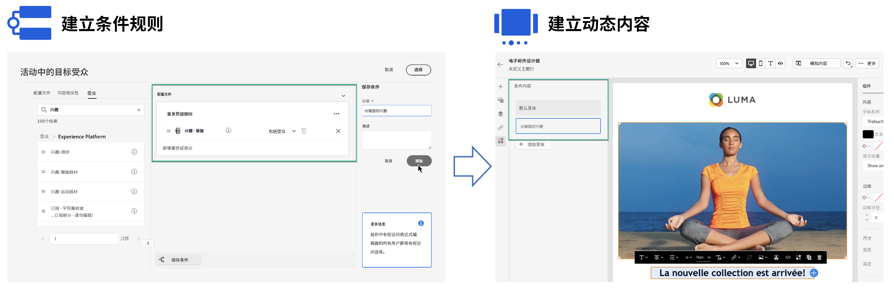

# 动态内容入门 {#start-dynamic-content}

>[!CONTEXTUALHELP]
>id="ajo_conditions_list"
>title="条件"
>abstract="条件规则允许您根据用户档案属性、上下文事件或受众区段在消息中显示多个内容变体。"

动态内容允许您根据 **条件规则** 可由用户档案属性、上下文事件或受众区段组成。 条件规则是使用表达式编辑器中的可视化规则生成器创建的，您可以在其中存储这些规则以供在历程和营销活动中进一步重复使用。

在Email Designer和表达式编辑器中，可以利用条件规则 **创建动态内容** 将适应消息中定向的用户档案。

* [了解如何使用条件规则](create-conditions.md)
* [了解如何创建动态内容](dynamic-content.md)

## 操作方法视频 {#video}

了解如何使用条件规则生成器创建动态内容。

>[!VIDEO](https://video.tv.adobe.com/v/3409815?quality=12)
