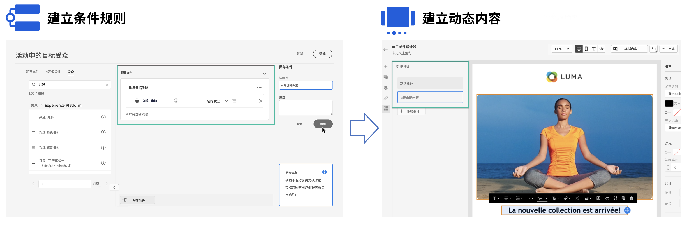

# 动态内容快速入门 {#start-dynamic-content}

>[!BEGINSHADEBOX]

**在此页面上：**&#x200B;了解动态内容如何使用根据用户档案属性、上下文事件和受众生成的条件规则来调整消息，使其适应目标用户档案。

>[!ENDSHADEBOX]

>[!CONTEXTUALHELP]
>id="ajo_conditions_list"
>title="条件"
>abstract="条件规则让您可以根据轮廓属性、上下文事件或受众，在消息中显示多个内容变体。"

动态内容允许您根据&#x200B;**条件规则**&#x200B;调整消息的内容，条件规则可由轮廓属性、上下文事件或受众组成。 条件规则是使用个性化编辑器中的可视化规则生成器创建的，您可以在其中存储这些规则以供在历程和营销活动中进一步重复使用。

可以在电子邮件Designer和个性化编辑器中利用条件规则，以&#x200B;**创建动态内容**，该内容将适应消息中定向的用户档案。

* [了解如何使用条件规则](create-conditions.md)
* [了解如何创建动态内容](dynamic-content.md)

## 操作方法视频 {#video}

了解如何使用条件规则生成器创建动态内容。

>[!VIDEO](https://video.tv.adobe.com/v/3413669?captions=chi_hans&quality=12)
