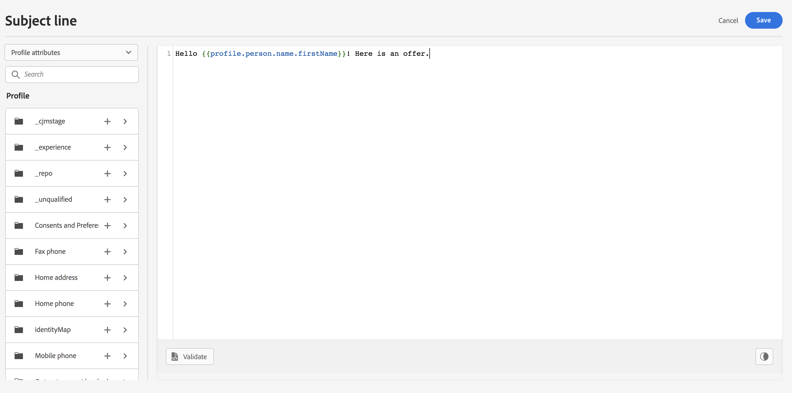
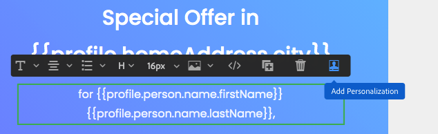

# 添加个性化 {#build-personalization-expressions}

>[!BEGINSHADEBOX]

**在此页面上：**&#x200B;了解如何使用个性化编辑器添加、自定义和验证来自配置文件属性、受众、优惠决策和上下文属性等源的个性化表达式。

>[!ENDSHADEBOX]

>[!CONTEXTUALHELP]
>id="ajo_perso_editor"
>title="关于个性化编辑器"
>abstract="个性化编辑器让您可以选择、排列、自定义和验证所有数据，为自己的内容创建定制的个性化。"

个性化编辑器是[!DNL Journey Optimizer]中个性化的核心。 它可在您需要定义个性化的每个上下文中使用，例如电子邮件、推送和选件。

在个性化编辑器界面中，您可以选择、排列、自定义和验证所有数据，为您的内容创建自定义个性化。



## 可在何处添加个性化 {#where}

您可以使用图标在每个字段中的&#x200B;**[!DNL Journey Optimizer]**&#x200B;中添加个性化。 展开以下部分，了解更多详细信息。

+++消息

在邮件中，可以在邮件的不同位置添加个性化，如&#x200B;**[!UICONTROL 主题行]**&#x200B;字段。


还可以在内容的其他部分中添加它。 例如，对于[推送通知](../push/push-gs.md)，可在&#x200B;**标题**、**正文**、**自定义声音**、**徽章**&#x200B;和&#x200B;**自定义数据**&#x200B;字段中添加个性化设置。

+++

+++电子邮件设计器

在[电子邮件Designer](../email/get-started-email-design.md)中编辑电子邮件内容时，您可以使用上下文工具栏中的图标在大多数文本元素中添加个性化设置。



+++

+++URL

Journey Optimizer还允许您个性化邮件中的&#x200B;**URL**。 个性化 URL 可将收件人引导至网站的特定页面，或引导至个性化的微型网站，具体取决于轮廓属性。 [了解详情](../email/url-personalization.md)

{width="50%"}

>[!NOTE]
>
>URL个性化可用于以下类型的链接： **外部链接**、**退订链接**&#x200B;和&#x200B;**选择退出**。

+++

+++电子邮件配置

创建电子邮件渠道配置时，您可以为子域、标题和URL跟踪参数定义个性化值。 [了解详情](../email/surface-personalization.md)

+++

+++产品建议

在&#x200B;**优惠的表示形式**&#x200B;中使用文本类型内容时，您可以添加个性化。 [了解如何创建个性化优惠](../offers/offer-library/creating-personalized-offers.md)

+++

## Personalization源 {#sources}

导航窗格允许您选择个性化的源。 可用源包括：

* **[!UICONTROL 配置文件属性]** ：列出与[Adobe Experience Platform数据模型(XDM)文档](https://experienceleague.adobe.com/docs/experience-platform/xdm/home.html?lang=zh-Hans){target="_blank"}中描述的配置文件架构关联的所有引用。
* **[!UICONTROL Target属性]** ：此文件夹特定于编排的营销活动。 它包含直接在营销活动画布中计算的属性。 [了解如何在编排的营销活动中添加个性化](../orchestrated/add-personalization.md)
* **[!UICONTROL 受众]** ：列出在Adobe Experience Platform分段服务中创建的所有受众。 请参阅[Adobe Experience Platform分段文档](https://experienceleague.adobe.com/docs/experience-platform/segmentation/home.html?lang=zh-Hans){target="_blank"}以了解详情。
* **[!UICONTROL 优惠决策]** ：列出与特定投放位置关联的所有优惠。 选择投放位置，然后在您的内容中插入选件。 有关如何管理优惠的完整文档，请参阅[此部分](../offers/get-started/starting-offer-decisioning.md)。
* **[!UICONTROL 上下文属性]** ：在历程或营销活动中使用渠道操作活动（电子邮件、推送、短信）时，与事件和属性相关的上下文属性可用于个性化。 [本节](personalization-use-case.md)中介绍了利用上下文属性的个性化示例。 此外，可以使用自定义操作响应进行个性化。 [了解如何在本机渠道中使用自定义操作响应](../action/action-response.md#response-in-channels)。

>[!NOTE]
>
>如果您使用使用合成工作流生成的扩充属性定位受众，则可以利用这些扩充属性个性化您的消息。 [了解如何使用受众扩充属性](../audience/about-audiences.md#enrichment)

## 添加个性化 {#add}

>[!CONTEXTUALHELP]
>id="ajo_perso_editor_autocomplete"
>title="自动完成"
>abstract="切换该选项可让系统在您键入时自动建议并完成代码。 此功能仅适用于 HTML 和文本格式，并支持轮廓和上下文属性。 如果通过切换禁用，编辑器将提供原生 HTML 代码自动完成。"

中央工作区是您构建个性化语法的位置。 若要使用属性来个性化您的消息，请将其定位到左侧导航窗格中，然后单击`+`按钮以将其添加到表达式中。


`+`图标旁边的省略号菜单允许您获取每个属性的更多详细信息，并将最常用的属性添加到收藏夹。 添加到收藏夹的属性可从导航窗格中的&#x200B;**[!UICONTROL 收藏夹]**&#x200B;菜单访问。

>[!NOTE]
>
>默认情况下，属性窗格仅显示填充的属性。 要显示所有属性，请选择位于搜索字段上方的按钮，然后关闭&#x200B;**[!UICONTROL 仅显示填充的属性]**&#x200B;选项。

此外，您可以定义在字符串类型配置文件属性为空时显示的默认回退文本。 为此，请单击属性旁边的省略号按钮，然后选择&#x200B;**[!UICONTROL 插入后备文本]**。 写入配置文件属性值为空时默认显示的文本，然后单击&#x200B;**[!UICONTROL 添加]**。


在以下示例中，个性化编辑器允许您选择今天生日的用户档案，然后插入对应于今天的特定选件以完成自定义。


## 表达式编辑选项 {#options}

中央工作区提供了各种工具来帮助您编写个性化表达式。


可用选项包括：

1. **[!UICONTROL 查找]** / **[!UICONTROL 查找并替换]**：搜索表达式并自动替换部分代码。
1. **[!UICONTROL 撤消]** / **[!UICONTROL 重做]**：撤消/重做上一个操作。
1. **[!UICONTROL 自动完成]**：在您键入时自动建议并完成代码。 此功能仅适用于 HTML 和文本格式，并支持轮廓和上下文属性。 如果通过切换禁用，编辑器将提供原生 HTML 代码自动完成。

   {width="70%" align="center" zoomable="yes"}

1. **[!UICONTROL HTML]** / **[!UICONTROL JSON]** / **[!UICONTROL 文本]**：标识代码格式。 这使系统能够根据所选语言调整验证和自动完成功能。
1. **[!UICONTROL 验证]**：检查表达式的语法。 有关详细信息，请参阅[此部分](../personalization/personalization-build-expressions.md)。
1. **[!UICONTROL 另存为片段]**：将表达式另存为表达式片段。 [在本节](../content-management/save-fragments.md#save-as-expression-fragment)中了解详情
1. **[!UICONTROL 字体大小]**：调整编辑器内内容的字体大小，以提高可读性。
1. **[!UICONTROL 自动换行]**：启用或禁用自动换行，从而允许在编辑器中单行显示或自动换行的长表达式。 选项包括：
   * **关**（默认） — 无自动换行。 长线延伸到编辑器视图之外，需要水平滚动。
   * **On** — 以编辑器的宽度换行。
   * **自动换行列** — 当行字符达到80个字符时换行。
   * **绑定** — 以编辑器宽度或80个字符（以较小者为准）换行。
1. **[!UICONTROL Picks]**：将属性显示为紧凑的“Picks”，通过隐藏长属性路径来提高可读性。 单击属性以显示其完整路径。

   >[!NOTE]
   >
   >此选项仅适用于配置文件属性、上下文属性和Dynamic Media。

在导航窗格中，提供其他功能以帮助您构建个性化表达式。


* **[!UICONTROL 辅助函数]** — 辅助函数允许您对数据执行操作，例如计算、数据格式或转换、条件，并在个性化上下文中处理这些操作。 [了解有关可用辅助函数的更多信息](functions/functions.md)

* **[!UICONTROL 收藏夹]** — 已添加到收藏夹的属性将显示在此列表中。 这允许您快速访问最常使用的项目。 若要向收藏夹添加属性，请单击省略号菜单，然后选择&#x200B;**[!UICONTROL 添加到收藏夹]**。

* **[!UICONTROL 条件]** — 利用在库中创建的条件规则将动态内容添加到消息中。 这允许您根据条件创建消息的多个变体。 [了解如何创建动态内容](../personalization/get-started-dynamic-content.md)

* **[!UICONTROL 片段]** — 利用已创建或已保存到当前沙盒的表达式片段。 片段是可重复使用的组件，可以在[!DNL Journey Optimizer]营销活动和历程中引用。 此功能允许预先构建多个自定义内容块，营销用户可以使用这些内容块在改进的设计过程中快速组合内容。 [了解如何使用表达式片段进行个性化](../personalization/use-expression-fragments.md)

>[!TIP]
>
>正在寻找现成的表达式？ **[Personalization脚本](personalization-recipes.md)**&#x200B;页面为最常见的用例提供了复制粘贴模式：日期格式、倒计时器、条件回退、仅限时间的显示等。

在个性化表达式准备就绪后，需要由个性化编辑器验证该表达式。 有关详细信息，请参阅[此部分](../personalization/personalization-build-expressions.md)。

## 验证机制 {#validation-mechanisms}

单击&#x200B;**添加**&#x200B;按钮关闭编辑器窗口时，将自动执行表达式验证。 您还可以使用&#x200B;**验证**&#x200B;按钮检查个性化语法。


展开以下部分可查看验证个性化设置时可能发生的常见错误。

+++常见错误

* **找不到“XYZ”路径**

尝试引用架构中未定义的字段时。

在这种情况下，**firstName1**&#x200B;未定义为配置文件架构中的特性：

```
{{profile.person.name.firstName1}}
```

* **变量“XYZ”的类型不匹配。 应为数组。 找到字符串。**

当尝试对字符串而不是数组进行迭代时。

在这种情况下，**product**&#x200B;不是数组：

```
{{each profile.person.name.firstName as |product|}}
 {{product.productName}}
{{/each}}
```

* **无效的Handlebars语法。 找到`'[XYZ}}'`**

当使用了无效的Handlebars语法时。

Handlebars表达式用&#x200B;**{{expression}}**&#x200B;括起来

```
   {{[profile.person.name.firstName}}
```

* **区段定义无效**

```
No segment definition found for 988afe9f0-d4ae-42c8-a0be-8d90e66e151
```

+++

对于选件，可能会发生特定错误。 有关更多详细信息，请展开以下部分：

+++ 与优惠相关的特定错误

与电子邮件或推送消息中的优惠集成相关的错误具有以下模式：

```
Offer.<offerType>.[PlacementID].[ActivityID].<offer-attribute>
```

验证是在验证个性化编辑器中的个性化内容期间执行的。

<table> 
 <thead> 
  <tr> 
   <th> 错误标题<br /> </th> 
   <th> 验证/解析<br /> </th> 
  </tr> 
 </thead> 
 <tbody> 
  <tr> 
   <td>未找到id placementID和类型OfferPlacement的资源 <br/>
未找到id为activityID且类型为OfferActivity的资源<br/></td> 
   <td>检查ActivityID和/或PlacementID是否可用</td> 
  </tr> 
   <tr> 
   <td>无法验证资源。</td> 
   <td>投放位置中的componentType应与offerType选件匹配</td> 
  </tr> 
   <tr> 
   <td>offerId中不存在公共URL。</td> 
   <td>图像选件（所有与决策和投放对关联的个性化和回退）应填充公共URL（deliveryURL不应为空）。</td> 
  </tr> 
  <tr> 
   <td>决策包含非配置文件属性。</td> 
   <td>选件模型用法应仅包含配置文件属性。</td> 
  </tr> 
  <tr> 
   <td>获取决策用法时出错。</td> 
   <td>当API尝试获取选件模型时，可能会发生此错误。</td> 
  </tr>
  <tr> 
   <td>选件属性offer-attribute无效。</td> 
   <td>检查选件drp中引用的选件属性是否有效。 以下是有效的属性： <br/>
图像：deliveryURL、linkURL<br/>
文本：内容<br/>
HTML：内容<br/></td> 
  </tr> 
 </tbody> 
</table>

+++

## 快速参考 {#quick-reference}

本节包含结构化知识，用于支持与本主题相关的解释、检索和问答。

要全面了解相关信息，应将此信息与本页上的文档相结合。 这两个源都不是独立的；页面描述了功能，而本节提供了其他上下文来帮助消除术语、意图、适用性和约束条件的歧义。

>[!BEGINTABS]

>[!TAB 概述]

**TL；DR**

本页介绍如何使用Journey Optimizer个性化编辑器从各种来源（包括配置文件属性、受众、优惠决策和上下文属性）选择、构建、自定义和验证个性化表达式。

**意图**

* 了解可在Journey Optimizer中添加个性化的位置（消息、电子邮件Designer、URL、电子邮件配置、选件）
* 为表达式选择适当的个性化源
* 在编辑器工作区中添加属性和构建表达式
* 使用编辑器工具：查找/替换、自动完成、验证、Pills、另存为片段
* 使用导航窗格功能：帮助程序函数、收藏夹、条件、片段
* 验证表达式并解决常见错误

>[!TAB 术语表]

* **Personalization编辑器**： Journey Optimizer中用于生成、自定义和验证个性化表达式的集中UI工具；在可以定义个性化的任何地方均可用。 *（产品特定）*
* **Personalization源**：可用于生成表达式的数据类别 — 配置文件属性、目标属性、受众、优惠决策和上下文属性。
* **上下文属性**：特定于历程或营销活动的数据（历程、属性、自定义操作响应）仅在历程或营销活动中使用渠道操作时可用于个性化。 *（产品特定）*
* **Pills**：个性化编辑器显示模式，将长属性路径呈现为简洁的可单击令牌，以提高可读性。 仅适用于配置文件属性、上下文属性和Dynamic Media。 *（产品特定）*
* **自动完成**：一种编辑器功能，可在键入时自动建议和完成代码；仅适用于HTML和文本格式，仅支持配置文件和上下文属性。 *（产品特定）*
* **表达式片段**：可在营销活动和历程中引用的可重用个性化表达式组件。 *（产品特定）*
* **回退文本**：当给定配置文件的字符串类型配置文件属性为空时显示的默认字符串；通过“插入回退文本”为每个属性配置。

>[!TAB 术语]

* **规范名称：**&#x200B;个性化编辑器
* **请勿混淆：** Personalization编辑器（用于在消息、电子邮件、推送通知和选件中构建内容表达式 — 支持Handlebars和PQL语法）≠高级表达式编辑器（在历程中用于数据源和事件信息、自定义等待活动和操作参数映射的条件 — 提供了与个性化编辑器中不同的内置函数和运算符）
* **请勿混淆：**&#x200B;配置文件属性（基于XDM架构，在所有上下文中可用）≠上下文属性（特定于历程/营销活动，仅在该上下文中可用）≠Target属性（仅限编排的营销活动）
* **请勿混淆：**&#x200B;自动完成HTML/文本（建议个性化属性完成）≠本机HTML代码自动完成（禁用切换时为编辑器默认值）

>[!TAB 护栏和限制]

* 自动完成仅适用于HTML和文本格式；它仅支持配置文件和上下文属性。
* Piples显示模式仅适用于配置文件属性、上下文属性和Dynamic Media。
* URL个性化仅适用于外部链接、退订链接和选择退出链接类型。
* 默认情况下，属性窗格仅显示填充的属性；关闭“仅显示填充的属性”以显示所有架构属性。
* 优惠模型用法必须仅包含配置文件属性；决策中的非配置文件属性会导致验证错误。

>[!TAB 常见问题解答]

**问：可在Journey Optimizer中的何处添加个性化设置？**

在包含添加个性化图标的任何字段中 — 包括电子邮件主题行、推送通知字段（标题、正文、自定义声音、徽章、自定义数据）、电子邮件Designer文本元素、URL（外部链接、退订链接、选择退出）、电子邮件配置子域/标头/URL跟踪参数以及选件文本类型表示形式。

**问：有哪些可用的个性化源？**

配置文件属性、Target属性（仅限编排的营销活动）、受众、优惠决策和上下文属性（历程/营销活动事件和自定义操作响应）。

**问：如何验证表达式？**

单击添加以关闭编辑器时，验证会自动运行。 您还可以使用“验证”按钮手动触发该事件。 常见错误包括：未找到路径（架构中不存在的字段）、类型不匹配（将字符串迭代为数组）、Handlebars语法无效以及区段定义无效。

**问：“药丸”选项有什么用？**

它将long属性路径呈现为简洁的可单击令牌，以便在编辑器中提高可读性。 仅适用于配置文件属性、上下文属性和Dynamic Media。

**问：为什么在属性窗格中只看到一些属性？**

默认情况下，该窗格仅显示填充的属性。 选择搜索字段上方的设置图标，然后关闭“仅显示填充的属性”以显示所有架构属性。

>[!ENDTABS]

<!-- ai-section-version: 1 | source-hash: 54973b31 -->
