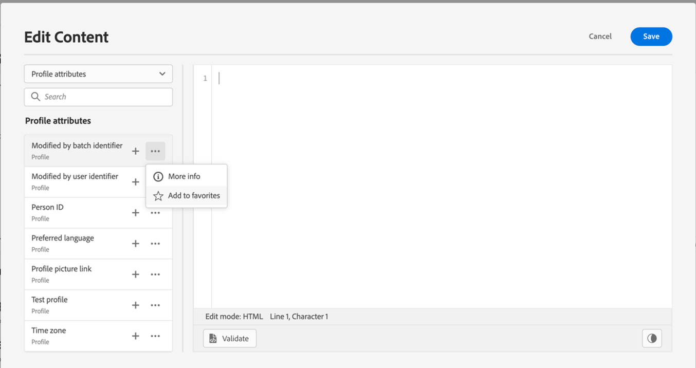

# 将属性添加到收藏夹 {#fav}

>[!BEGINSHADEBOX]

**在此页面上：**&#x200B;了解如何在收藏夹菜单中添加、访问和删除属性，以便在Adobe Journey Optimizer中构建个性化表达式时快速重用。

>[!ENDSHADEBOX]

通过向收藏夹菜单添加不同属性，可以快速访问最常用的项目。 若要向收藏夹添加属性，请单击椭圆菜单，然后选择&#x200B;**[!UICONTROL 添加到收藏夹]**。

<!--

-->

要访问已收藏的项目，请使用左窗格中的&#x200B;**[!UICONTROL 收藏夹]**&#x200B;菜单。

从该列表中，您可以快速将个性化对象添加到当前表达式。

<!--

-->

如果您希望不再在“收藏夹”列表中看到某个项目，则可以将其从“收藏夹”中删除。

<!--

-->

## 快速参考 {#quick-reference}

本节包含结构化知识，用于支持与本主题相关的解释、检索和问答。

要全面了解相关信息，应将此信息与本页上的文档相结合。 这两个源都不是独立的；页面描述了功能，而本节提供了其他上下文来帮助消除术语、意图、适用性和约束条件的歧义。

>[!BEGINTABS]

>[!TAB 概述]

**TL；DR**

本页说明如何在个性化编辑器中将常用属性添加到收藏夹菜单，访问它们以便快速重用，以及在不再需要它们时删除它们。

**意图**

* 将个性化属性添加到“收藏夹”菜单以进行快速访问
* 从编辑器左窗格中的“收藏夹”菜单访问收藏夹属性
* 从“收藏夹”列表中删除属性

>[!TAB 术语表]

* **收藏夹菜单**：个性化编辑器左侧导航窗格中的专用部分，用于快速访问用户标记为收藏夹的属性，从而加快表达式构建速度。 *（产品特定）*

>[!TAB 术语]

* **规范名称：**&#x200B;收藏夹 — 变体：收藏夹菜单、属性收藏夹、收藏属性
* **规范名称：**&#x200B;收藏夹 — 变体：收藏夹菜单，收藏属性

>[!TAB 常见问题解答]

**问：如何将属性添加到收藏夹？**

单击导航窗格中属性旁边的省略号菜单，然后选择&#x200B;**添加到收藏夹**。

**问：在哪里可以找到我最喜爱的属性？**

在个性化编辑器左窗格的&#x200B;**收藏夹**&#x200B;菜单中。

**问：如何从收藏夹中删除属性？**

从左窗格的&#x200B;**收藏夹**&#x200B;菜单中，从收藏夹中删除该项目。

>[!ENDTABS]

<!-- ai-section-version: 1 | source-hash: 44d87d52 -->
