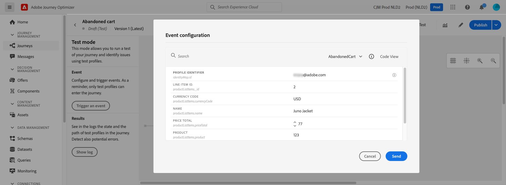

# 个性化用例：购物车放弃电子邮件 {#personalization-use-case-helper-functions}

在本例中，您将个性化电子邮件的正文。 此消息可定向购物车中已留下物品但尚未完成购买的客户。

您将使用以下类型的帮助程序函数：

* 的 `upperCase` 字符串函数，以在大写字母中插入客户的名字。 [了解详情](functions/string.md#upper)。
* 的 `each` 帮助程序，列出购物车中的项目。 [了解详情](functions/helpers.md#each)。
* 的 `if` 帮助程序，在相关产品位于购物车中时插入产品特定的注释。 [了解详情](functions/helpers.md#if-function)。

<!-- **Context**: personalization based on contextual data from the journey -->

➡️ [在此视频中了解如何使用帮助程序函数](#video)

在开始之前，请确保您知道如何配置这些元素：

* 单一事件。 [了解详情](../event/about-events.md)。
* 以事件开头的历程。 [了解详情](../building-journeys/using-the-journey-designer.md)。
* 您的历程中的电子邮件。 [了解详情](../messages/get-started-content.md)
* 电子邮件的正文。 [了解详情](../design/create-email-content.md)。

请执行以下步骤：

1. [创建初始事件和历程](#create-context).
1. [创建电子邮件](#configure-email).
1. [在大写字母中插入客户的名字](#uppercase-function).
1. [将购物车内容添加到电子邮件](#each-helper).
1. [插入产品特定的注释](#if-helper).
1. [测试并发布历程](#test-and-publish).

## 步骤1:创建初始事件和相关历程 {#create-context}

购物车内容是历程中的上下文信息。 因此，您必须先将初始事件和电子邮件添加到历程，然后才能将特定于购物车的信息添加到电子邮件。

1. 创建一个事件，其架构包含 `productListItems` 数组。
1. 将此数组中的所有字段定义为此事件的有效负荷字段。

   了解有关产品列表项数据类型的更多信息 [Adobe Experience Platform文档](https://experienceleague.adobe.com/docs/experience-platform/xdm/data-types/product-list-item.html){target=&quot;_blank&quot;}。

1. 创建以此事件开始的历程。
1. 添加 **电子邮件** 活动到历程。

   

## 步骤2:创建电子邮件{#configure-email}

1. 在 **电子邮件** 活动，单击 **[!UICONTROL Edit content]**，然后单击 **[!UICONTROL Email Designer]**.
   

1. 从Email Designer主页的左侧面板，将三个结构组件拖放到消息正文中。

1. 将HTML内容组件拖放到每个新结构组件上。

   

## 步骤3:在大写字母中插入客户的名字 {#uppercase-function}

1. 在Email Designer主页上，单击要在其中添加HTML名字的客户组件。
1. 在上下文工具栏上，单击 **[!UICONTROL Show the source code]**.

   

1. 在 **[!UICONTROL Edit HTML]** 窗口，添加 `upperCase` 字符串函数：
   1. 在左侧菜单中，选择 **[!UICONTROL Helper functions]**.
   1. 使用搜索字段查找“大写”。
   1. 在搜索结果中，添加 `upperCase` 函数。 要执行此操作，请单击旁边的加号(+) `: string`.

      表达式编辑器显示此表达式：

      ```handlebars
      
      ```

      

1. 从表达式中删除“字符串”占位符。
1. 添加名字令牌：
   1. 在左侧菜单中，选择 **[!UICONTROL Profile attributes]**.
   1. 选择 **[!UICONTROL Person]** > **[!UICONTROL Full name]**.
   1. 添加 **[!UICONTROL First name]** 表达式的令牌。

      表达式编辑器显示此表达式：

      ```handlebars
      
      ```

      

      在中了解有关人员姓名数据类型的更多信息 [Adobe Experience Platform文档](https://experienceleague.adobe.com/docs/experience-platform/xdm/data-types/person-name.html){target=&quot;_blank&quot;}。

1. 单击 **[!UICONTROL Validate]**，然后单击 **[!UICONTROL Save]**。

   
1. 保存消息。

## 步骤4:插入购物车中的项目列表 {#each-helper}

1. 重新打开消息内容。

1. 在Email Designer主页上，单击要在其中列出购物车内容的HTML组件。
1. 在上下文工具栏上，单击 **[!UICONTROL Show the source code]**.

   

1. 在 **[!UICONTROL Edit HTML]** 窗口，添加 `each` 助手：
   1. 在左侧菜单中，选择 **[!UICONTROL Helper functions]**.
   1. 使用搜索字段查找“每个”。
   1. 在搜索结果中，添加 `each` 帮手。

      表达式编辑器显示此表达式：

      ```handlebars
      {{#each someArray as |variable|}} {{/each}}
      ```

      

1. 添加 `productListItems` 数组到表达式：

   1. 从表达式中删除“someArray”占位符。
   1. 在左侧菜单中，选择 **[!UICONTROL Contextual attributes]**.

      **[!UICONTROL Contextual attributes]** 仅在历程上下文传递到消息后才可用。

   1. 选择 **[!UICONTROL Journey Optimizer]** > **[!UICONTROL Events]** > ***[!UICONTROL event_name]***，然后展开 **[!UICONTROL productListItems]** 节点。

      在本例中， *event_name* 表示事件的名称。

   1. 添加 **[!UICONTROL Product]** 表达式的令牌。

      表达式编辑器显示此表达式：

      ```handlebars
      {{#each context.journey.events.event_ID.productListItems.product as |variable|}} {{/each}}
      ```
      在本例中， *event_ID* 表示事件的ID。

      

   1. 修改表达式：
      1. 删除“.product”字符串。
      1. 将“variable”占位符替换为“product”。

      此示例显示修改后的表达式：

      ```handlebars
      {{#each context.journey.events.event_ID.productListItems as |product|}}
      ```
1. 将此代码粘贴到 `{{#each}}` 标记和结束 `{/each}}` 标记：

   ```html
   <table>
      <tbody>
         <tr>
            <td><b>#name</b></td>
            <td><b>#quantity</b></td>
            <td><b>$#priceTotal</b></td>
         </tr>
      </tbody>
   </table>
   ```

1. 为项目名称、数量和价格添加个性化令牌：

   1. 从HTML表中删除占位符“#name”。
   1. 在上一个搜索结果中，添加 **[!UICONTROL Name]** 表达式的令牌。

   重复以下步骤两次：
   * 将占位符“#quantity”替换为 **[!UICONTROL Quantity]** 令牌。
   * 将占位符“#priceTotal”替换为 **[!UICONTROL Total price]** 令牌。

   此示例显示修改后的表达式：

   ```handlebars
   {{#each context.journey.events.event_ID.productListItems as |product|}}
      <table>
         <tbody>
            <tr>
               <td><b>{{context.journey.events.event_ID.productListItems.name}}</b></td>
               <td><b>{{context.journey.events.event_ID.productListItems.quantity}}</b></td>
               <td><b>${{context.journey.events.event_ID.productListItems.priceTotal}}</b></td>
            </tr>
         </tbody>
      </table>
   {{/each}}
   ```
1. 单击 **[!UICONTROL Validate]**，然后单击 **[!UICONTROL Save]**。
   

## 步骤5:插入产品特定的注释 {#if-helper}

1. 在Email Designer主页上，单击要在其中插入注释的HTML组件。
1. 在上下文工具栏上，单击 **[!UICONTROL Show the source code]**.

   

1. 在 **[!UICONTROL Edit HTML]** 窗口，添加 `if` 助手：
   1. 在左侧菜单中，选择 **[!UICONTROL Helper functions]**.
   1. 使用搜索字段查找“if”。
   1. 在搜索结果中，添加 `if` 帮手。

      表达式编辑器显示此表达式：

      ```handlebars
       render_1
          render_2
          default_render
      
      ```
      

1. 从表达式中删除此条件：

   ```handlebars
    render_2
   ```

   此示例显示修改后的表达式：

   ```handlebars
    render_1
       default_render
   
   ```

1. 将产品名称令牌添加到条件中：
   1. 从表达式中删除“condition1”占位符。
   1. 在左侧菜单中，选择 **[!UICONTROL Contextual attributes]**.
   1. 选择 **[!UICONTROL Journey Orchestration]** > **[!UICONTROL Events]** > ***[!UICONTROL event_name]***，然后展开 **[!UICONTROL productListItems]** 节点。

      在本例中， *event_name* 表示事件的名称。

   1. 添加 **[!UICONTROL Name]** 表达式的令牌。

      表达式编辑器显示此表达式：

      ```handlebars
      
         render_1
          default_render
      
      ```
      

1. 修改表达式：
   1. 在表达式编辑器中，在 `name` 令牌。

      使用此语法，其中 *product_name* 表示产品的名称：

      ```javascript
      = "product_name"
      ```

      在此示例中，产品名称为“Juno Jacket”：

      ```handlebars
      
         render_1
          default_render
      
      ```

   1. 将“render_1”占位符替换为注释的文本。

      示例：

      ```handlebars
      
         Due to longer than usual lead times on the Juno Jacket, please expect item to ship two weeks after purchase.
          default_render
      
      ```
   1. 从表达式中删除“default_render”占位符。
1. 单击 **[!UICONTROL Validate]**，然后单击 **[!UICONTROL Save]**。

   

1. 保存消息。

## 步骤6:测试和发布历程 {#test-and-publish}

1. 打开 **[!UICONTROL Test]** 切换，然后单击 **[!UICONTROL Trigger an event]**.

   

1. 在 **[!UICONTROL Event configuration]** 窗口，输入输入值，然后单击 **[!UICONTROL Send]**.

   测试模式仅适用于测试用户档案。

   

   电子邮件会发送到测试用户档案的地址。

   在此示例中，电子邮件包含有关Juno Jacket的注释，因为此产品在购物车中：

   

1. 确认没有错误，然后发布历程。


## 相关主题 {#related-topics}

### Handlebars函数 {#handlebars}

* [辅助程序](functions/helpers.md)

* [字符串函数](functions/string.md)

### 用例 {#use-case}

* [使用用户档案信息、上下文和选件进行个性化](personalization-use-case.md)

* [使用基于决策的选件进行个性化](../offers/offers-e2e.md)

## 操作方法视频{#video}

了解如何使用帮助程序函数。

>[!VIDEO](https://video.tv.adobe.com/v/334244?quality=12)
