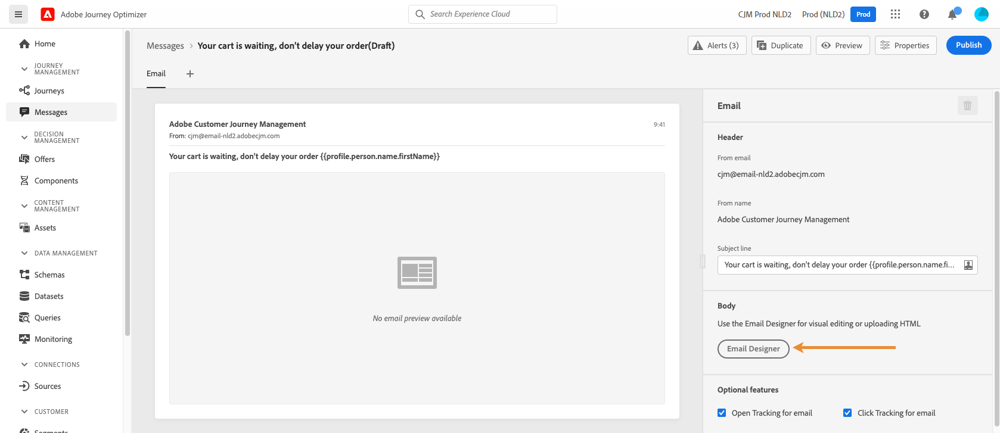

# 个性化用例：购物车放弃电子邮件 {#personalization-use-case-helper-functions}

在本例中，您将个性化电子邮件的正文。 此消息可定向购物车中已留下物品但尚未完成购买的客户。

您将使用以下类型的帮助程序函数：

* `upperCase`字符串函数，用于在大写字母中插入客户的名字。 [了解详情](functions/string.md#upper)。
* `each`帮助程序，列出购物车中的项目。 [了解详情](functions/helpers.md#each)。
* `if`帮助程序，用于在相关产品位于购物车中时插入产品特定注释。 [了解详情](functions/helpers.md#if-function)。

<!-- **Context**: personalization based on contextual data from the journey -->

在开始之前，请确保您知道如何配置这些元素：
* 电子邮件。 [了解详情](../create-message.md)
* 电子邮件的正文。 [了解详情](../create-email-content.md)。
* 单一事件。 [了解详情](../event/about-events.md)。
* 以事件开头的历程。 [了解详情](../building-journeys/using-the-journey-designer.md)。

请执行以下步骤：
1. [创建电子邮件消息](#configure-email)。
2. [在大写字母中插入客户的名字](#uppercase-function)。
3. [创建初始事件和历程](#create-context)。
4. [将购物车内容添加到电子邮件](#each-helper)。
5. [插入产品特定的注释](#if-helper)。
6. [测试并发布历程](#test-and-publish).

## 步骤1:创建电子邮件{#configure-email}

1. 创建或修改电子邮件，然后单击&#x200B;**[!UICONTROL Email Designer]**。
   

2. 从Email Designer主页的左侧面板，将三个结构组件拖放到消息正文中。

3. 将HTML内容组件拖放到每个新结构组件上。

   

## 步骤2:在大写字母中插入客户的名字 {#uppercase-function}

1. 在Email Designer主页上，单击要添加客户名字的HTML组件。
2. 在上下文工具栏上，单击&#x200B;**[!UICONTROL Show the source code]**。

   

3. 在&#x200B;**[!UICONTROL Edit HTML]**&#x200B;窗口中，添加`upperCase`字符串函数：
   1. 在列表中，选择&#x200B;**[!UICONTROL Helper functions]**。
   2. 使用搜索字段查找“大写”。
   3. 在搜索结果中，添加`upperCase`函数。 要实现此目的，请单击`: string`旁边的加号(+)。

      表达式编辑器显示此表达式：

      ```handlebars
      
      ```

      

4. 从表达式中删除“字符串”占位符。
5. 添加名字令牌：
   1. 在列表中，选择&#x200B;**[!UICONTROL Profile]**。
   2. 选择 **[!UICONTROL Profile]** > **[!UICONTROL Person]** > **[!UICONTROL Full name]**.
   3. 将&#x200B;**[!UICONTROL First name]**&#x200B;令牌添加到表达式中。

      表达式编辑器显示此表达式：

      ```handlebars
      
      ```

      

      了解有关[人员名称数据类型](https://experienceleague.adobe.com/docs/experience-platform/xdm/data-types/person-name.html)的更多信息。

6. 单击 **[!UICONTROL Validate]**，然后单击 **[!UICONTROL Save]**。

   
7. 保存消息。

## 步骤3:创建初始事件和相关历程 {#create-context}

购物车内容是历程中的上下文信息。 因此，您必须先将初始事件和电子邮件添加到历程，然后才能将特定于购物车的信息添加到电子邮件。

1. 创建其架构包含`productListItems`数组的事件。
2. 将此数组中的所有字段定义为此事件的有效负荷字段。

   了解有关[产品列表项数据类型](https://experienceleague.adobe.com/docs/experience-platform/xdm/data-types/product-list-item.html)的更多信息。

3. 创建以此事件开始的历程。
4. 将消息添加到历程。
5. 通过结束活动结束历程。

   由于您尚未发布消息，因此既不能测试也不能发布历程。

   

6. 单击 **[!UICONTROL OK]**。

   消息会通知您历程上下文已传递到消息。

   

## 步骤4:插入购物车中的项目列表 {#each-helper}

1. 重新打开消息。

   

2. 在Email Designer主页上，单击要在其中列出购物车内容的HTML组件。
3. 在上下文工具栏上，单击&#x200B;**[!UICONTROL Show the source code]**。

   

4. 在&#x200B;**[!UICONTROL Edit HTML]**&#x200B;窗口中，添加`each`帮助程序：
   1. 在列表中，选择&#x200B;**[!UICONTROL Helper functions]**。
   2. 使用搜索字段查找“每个”。
   3. 在搜索结果中，添加`each`帮助程序。

      表达式编辑器显示此表达式：

      ```handlebars
      {{#each someArray as |variable|}} {{/each}}
      ```

      

5. 将`productListItems`数组添加到表达式中：

   1. 从表达式中删除“someArray”占位符。
   2. 在列表中，选择&#x200B;**[!UICONTROL Context]**。

      **[!UICONTROL Context]**&#x200B;选项仅在将历程上下文传递到消息后才可用。

   3. 选择&#x200B;**[!UICONTROL Journey Orchestration]** > **[!UICONTROL Events]** > ***[!UICONTROL event_name]***，然后展开&#x200B;**[!UICONTROL productListItems]**&#x200B;节点。

      在此示例中， *event_name*&#x200B;表示事件的名称。

   4. 将&#x200B;**[!UICONTROL Product]**&#x200B;令牌添加到表达式中。

      表达式编辑器显示此表达式：

      ```handlebars
      {{#each context.journey.events.event_ID.productListItems.product as |variable|}} {{/each}}
      ```
      在此示例中， *event_ID*&#x200B;表示事件的ID。

      

   5. 修改表达式：
      1. 删除“.product”字符串。
      2. 将“variable”占位符替换为“product”。

      此示例显示修改后的表达式：

      ```handlebars
      {{#each context.journey.events.event_ID.productListItems as |product|}}
      ```
6. 在开始的`{{#each}}`标记和结束的`{/each}}`标记之间粘贴此代码：

   ```html
   <table>
      <tbody>
         <tr>
            <td><b>#name</b></td>
            <td><b>#quantity</b></td>
            <td><b>$#priceTotal</b></td>
         </tr>
      </tbody>
   </table>
   ```

7. 为项目名称、数量和价格添加个性化令牌：

   1. 从HTML表中删除占位符“#name”。
   2. 从上一个搜索结果中，将&#x200B;**[!UICONTROL Name]**&#x200B;令牌添加到表达式中。

   重复以下步骤两次：
   * 将占位符“#quantity”替换为&#x200B;**[!UICONTROL Quantity]**&#x200B;令牌。
   * 将占位符“#priceTotal”替换为&#x200B;**[!UICONTROL Total price]**&#x200B;令牌。

   此示例显示修改后的表达式：

   ```handlebars
   {{#each context.journey.events.event_ID.productListItems as |product|}}
      <table>
         <tbody>
            <tr>
               <td><b>{{context.journey.events.event_ID.productListItems.name}}</b></td>
               <td><b>{{context.journey.events.event_ID.productListItems.quantity}}</b></td>
               <td><b>${{context.journey.events.event_ID.productListItems.priceTotal}}</b></td>
            </tr>
         </tbody>
      </table>
   {{/each}}
   ```
8. 单击 **[!UICONTROL Validate]**，然后单击 **[!UICONTROL Save]**。
   

## 步骤5:插入产品特定的注释 {#if-helper}

1. 在Email Designer主页上，单击要在其中插入注释的HTML组件。
2. 在上下文工具栏上，单击&#x200B;**[!UICONTROL Show the source code]**。

   

3. 在&#x200B;**[!UICONTROL Edit HTML]**&#x200B;窗口中，添加`if`帮助程序：
   1. 在列表中，选择&#x200B;**[!UICONTROL Helper functions]**。
   2. 使用搜索字段查找“if”。
   3. 在搜索结果中，添加`if`帮助程序。

      表达式编辑器显示此表达式：

      ```handlebars
       render_1
          render_2
          default_render
      
      ```
      

4. 从表达式中删除此条件：

   ```handlebars
    render_2
   ```

   此示例显示修改后的表达式：

   ```handlebars
    render_1
       default_render
   
   ```

5. 将产品名称令牌添加到条件中：
   1. 从表达式中删除“condition1”占位符。
   2. 在列表中，选择&#x200B;**[!UICONTROL Context]**。
   3. 选择&#x200B;**[!UICONTROL Journey Orchestration]** > **[!UICONTROL Events]** > ***[!UICONTROL event_name]***，然后展开&#x200B;**[!UICONTROL productListItems]**&#x200B;节点。

      在此示例中， *event_name*&#x200B;表示事件的名称。

   4. 将&#x200B;**[!UICONTROL Name]**&#x200B;令牌添加到表达式中。

      表达式编辑器显示此表达式：

      ```handlebars
      
         render_1
          default_render
      
      ```
      

6. 修改表达式：
   1. 在表达式编辑器中，在`name`令牌后指定产品名称。

      使用以下语法，其中&#x200B;*product_name*&#x200B;表示产品的名称：

      ```javascript
      = "product_name"
      ```

      在此示例中，产品名称为“Juno Jacket”：

      ```handlebars
      
         render_1
          default_render
      
      ```

   2. 将“render_1”占位符替换为注释的文本。

      示例：

      ```handlebars
      
         Due to longer than usual lead times on the Juno Jacket, please expect item to ship two weeks after purchase.
          default_render
      
      ```
   3. 从表达式中删除“default_render”占位符。
7. 单击 **[!UICONTROL Validate]**，然后单击 **[!UICONTROL Save]**。

   

8. 保存并发布消息。

## 步骤6:测试和发布历程 {#test-and-publish}

1. 打开旅程。 如果历程已打开，则刷新页面。
2. 打开&#x200B;**[!UICONTROL Test]**&#x200B;切换开关，然后单击&#x200B;**[!UICONTROL Trigger an event]**。

   只有在发布消息后，才能打开测试模式。

   

3. 在&#x200B;**[!UICONTROL Event configuration]**&#x200B;窗口中，输入输入值，然后单击&#x200B;**[!UICONTROL Send]**。

   测试模式仅适用于测试用户档案。

   

   电子邮件会发送到测试用户档案的地址。

   在此示例中，电子邮件包含有关Juno Jacket的注释，因为此产品在购物车中：

   

4. 确认没有错误，然后发布历程。


## 相关主题

### Handlebars函数

[辅助程序](functions/helpers.md)

[字符串函数](functions/string.md)

### 用例

[使用用户档案信息、上下文和选件进行个性化](personalization-use-case.md)

[使用基于决策的选件进行个性化](../offers/offers-e2e.md)

## 教程视频{#helper-functions-video}

>[!VIDEO](https://video.tv.adobe.com/v/334244?quality=12)