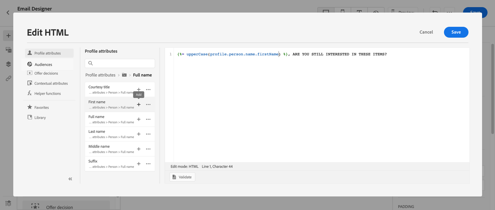

# Personalization用例：购物车放弃电子邮件 {#personalization-use-case-helper-functions}

在此示例中，您将个性化电子邮件正文。 此消息面向在购物车中遗留商品，但尚未完成购买的客户。

您将使用以下类型的辅助函数：

* `upperCase`字符串函数，用于将客户的名字插入大写字母。 [了解详情](functions/string.md#upper)。
* `each`帮助程序，用于列出购物车中的项目。 [了解详情](functions/helpers.md#each)。
* `if`帮助程序用于插入特定于产品的注释（如果相关产品在购物车中）。 [了解详情](functions/helpers.md#if-function)。
<!-- **Context**: personalization based on contextual data from the journey -->

➡️[在此视频中了解如何使用辅助函数](#video)

在开始之前，请确保您知道如何配置这些元素：

* 单一事件。 [了解详情](../event/about-events.md)。
* 以事件开始的历程。 [了解详情](../building-journeys/using-the-journey-designer.md)。
* 历程中的电子邮件。 [了解详情](../email/create-email.md)
* 电子邮件的正文。 [了解详情](../email/content-from-scratch.md)。

执行以下步骤：

1. [创建初始事件和历程](#create-context)。
1. [创建电子邮件](#configure-email)。
1. [将客户的名字插入大写字母](#uppercase-function)。
1. [将购物车内容添加到电子邮件](#each-helper)。
1. [插入产品特定的注释](#if-helper)。
1. [测试并发布历程](#test-and-publish)。

## 步骤1：创建初始事件和相关历程 {#create-context}

购物车内容是历程中的上下文信息。 因此，您必须先将初始事件和电子邮件添加到历程，然后才能将购物车特定的信息添加到电子邮件。

1. 创建其架构包含`productListItems`数组的事件。
1. 将此数组中的所有字段定义为此事件的有效负荷字段。

   在[Adobe Experience Platform文档](https://experienceleague.adobe.com/docs/experience-platform/xdm/data-types/product-list-item.html){target="_blank"}中了解有关产品列表项数据类型的更多信息。

1. 创建从此事件开始的历程。
1. 向历程添加&#x200B;**电子邮件**&#x200B;活动。

   

## 第2步：创建电子邮件{#configure-email}

1. 在&#x200B;**电子邮件**&#x200B;活动中，单击&#x200B;**[!UICONTROL 编辑内容]**，然后单击&#x200B;**[!UICONTROL 电子邮件Designer]**。

   

1. 从电子邮件Designer主页的左侧面板中，将三个结构组件拖放到消息正文上。

1. 将HTML内容组件拖放到每个新结构组件上。

   

## 步骤3：将客户的名字插入大写字母 {#uppercase-function}

1. 在电子邮件Designer主页上，单击要添加客户名字的HTML组件。
1. 在上下文工具栏上，单击&#x200B;**[!UICONTROL 显示源代码]**。

   

1. 在&#x200B;**[!UICONTROL 编辑HTML]**&#x200B;窗口中，添加`upperCase`字符串函数：
   1. 在左侧菜单中，选择&#x200B;**[!UICONTROL 辅助函数]**。
   1. 使用搜索字段查找“大写”。
   1. 从搜索结果中，添加`upperCase`函数。 为此，请单击`: string`旁边的加号(+)。

      表达式编辑器显示此表达式：

      ```handlebars
      
      ```

      

1. 从表达式中删除“string”占位符。
1. 添加名字令牌：
   1. 在左侧菜单中，选择&#x200B;**[!UICONTROL 配置文件属性]**。
   1. 选择&#x200B;**[!UICONTROL 人员]** > **[!UICONTROL 全名]**。
   1. 将&#x200B;**[!UICONTROL 名字]**&#x200B;令牌添加到表达式中。

      表达式编辑器显示此表达式：

      ```handlebars
      
      ```

      

      在[AdobeExperience Plaform文档](https://experienceleague.adobe.com/docs/experience-platform/xdm/data-types/person-name.html){target="_blank"}中了解有关人员名称数据类型的更多信息。

1. 单击&#x200B;**[!UICONTROL 验证]**，然后单击&#x200B;**[!UICONTROL 保存]**。

   

1. 保存消息。

## 第4步：插入购物车中的项目列表 {#each-helper}

1. 重新打开消息内容。

1. 在电子邮件Designer主页上，单击要列出购物车内容的HTML组件。
1. 在上下文工具栏上，单击&#x200B;**[!UICONTROL 显示源代码]**。

   

1. 在&#x200B;**[!UICONTROL 编辑HTML]**&#x200B;窗口中，添加`each`帮助程序：
   1. 在左侧菜单中，选择&#x200B;**[!UICONTROL 辅助函数]**。
   1. 使用搜索字段查找“each”。
   1. 从搜索结果中，添加`each`帮助程序。

      表达式编辑器显示此表达式：

      ```handlebars
      {{#each someArray as |variable|}} {{/each}}
      ```

      

1. 将`productListItems`数组添加到表达式：

   1. 从表达式中删除“someArray”占位符。
   1. 在左侧菜单中，选择&#x200B;**[!UICONTROL 上下文属性]**。

      **[!UICONTROL 上下文属性]**&#x200B;仅在历程上下文已传递到消息后可用。

   1. 选择&#x200B;**[!UICONTROL Journey Optimizer]** > **[!UICONTROL Events]** > ***[!UICONTROL event_name]***，然后展开&#x200B;**[!UICONTROL productListItems]**&#x200B;节点。

      在此示例中，*event_name*&#x200B;表示事件的名称。

   1. 将&#x200B;**[!UICONTROL Product]**&#x200B;令牌添加到表达式中。

      表达式编辑器显示此表达式：

      ```handlebars
      {{#each context.journey.events.event_ID.productListItems.product as |variable|}} {{/each}}
      ```

      在此示例中，*event_ID*&#x200B;表示事件的ID。

      

   1. 修改表达式：
      1. 删除“.product”字符串。
      1. 将“variable”占位符替换为“product”。

      此示例显示了修改后的表达式：

      ```handlebars
      {{#each context.journey.events.event_ID.productListItems as |product|}}
      ```

1. 将此代码粘贴到开始`{{#each}}`标记和结束`{/each}}`标记之间：

   ```html
   <table>
      <tbody>
         <tr>
            <td><b>#name</b></td>
            <td><b>#quantity</b></td>
            <td><b>$#priceTotal</b></td>
         </tr>
      </tbody>
   </table>
   ```

1. 为项目名称、数量和价格添加个性化令牌：

   1. 从HTML表中删除占位符“#name”。
   1. 从上一个搜索结果中，将&#x200B;**[!UICONTROL Name]**&#x200B;令牌添加到表达式中。

   重复这些步骤两次：

   * 将占位符“#quantity”替换为&#x200B;**[!UICONTROL 数量]**&#x200B;令牌。
   * 将占位符“#priceTotal”替换为&#x200B;**[!UICONTROL 总价]**&#x200B;令牌。

   此示例显示了修改后的表达式：

   ```handlebars
   {{#each context.journey.events.event_ID.productListItems as |product|}}
      <table>
         <tbody>
            <tr>
            <td><b>{{product.name}}</b></td>
            <td><b>{{product.quantity}}</b></td>
            <td><b>${{product.priceTotal}}</b></td>
            </tr>
         </tbody>
      </table>
   {{/each}}
   ```

1. 单击&#x200B;**[!UICONTROL 验证]**，然后单击&#x200B;**[!UICONTROL 保存]**。

   

## 步骤5：插入特定于产品的说明 {#if-helper}

1. 在电子邮件Designer主页上，单击要在其中插入注释的HTML组件。
1. 在上下文工具栏上，单击&#x200B;**[!UICONTROL 显示源代码]**。

   

1. 在&#x200B;**[!UICONTROL 编辑HTML]**&#x200B;窗口中，添加`if`帮助程序：
   1. 在左侧菜单中，选择&#x200B;**[!UICONTROL 辅助函数]**。
   1. 使用搜索字段查找“if”。
   1. 从搜索结果中，添加`if`帮助程序。

      表达式编辑器显示此表达式：

      ```handlebars
       render_1
          render_2
          default_render
      
      ```

      

1. 从表达式中删除此条件：

   ```handlebars
    render_2
   ```

   此示例显示了修改后的表达式：

   ```handlebars
    render_1
       default_render
   
   ```

1. 将产品名称令牌添加到条件：
   1. 从表达式中删除“condition1”占位符。
   1. 在左侧菜单中，选择&#x200B;**[!UICONTROL 上下文属性]**。
   1. 选择&#x200B;**[!UICONTROL Journey Orchestration]** > **[!UICONTROL 事件]** > ***[!UICONTROL 事件名称]***，然后展开&#x200B;**[!UICONTROL productListItems]**&#x200B;节点。

      在此示例中，*event_name*&#x200B;表示事件的名称。

   1. 将&#x200B;**[!UICONTROL Name]**&#x200B;令牌添加到表达式中。

      表达式编辑器显示此表达式：

      ```handlebars
      
         render_1
          default_render
      
      ```

      

1. 修改表达式：
   1. 在表达式编辑器中，在`name`令牌之后指定产品名称。

      使用以下语法，其中&#x200B;*product_name*&#x200B;表示产品的名称：

      ```javascript
      = "product_name"
      ```

      在此示例中，产品名称为“Juno Jacket”：

      ```handlebars
      
         render_1
          default_render
      
      ```

   1. 将“render_1”占位符替换为注释文本。

      示例：

      ```handlebars
      
         Due to longer than usual lead times on the Juno Jacket, please expect item to ship two weeks after purchase.
          default_render
      
      ```

   1. 从表达式中删除“default_render”占位符。
1. 单击&#x200B;**[!UICONTROL 验证]**，然后单击&#x200B;**[!UICONTROL 保存]**。

   

1. 保存消息。

## 步骤6：测试并发布旅程 {#test-and-publish}

1. 打开&#x200B;**[!UICONTROL 测试]**&#x200B;切换开关，然后单击&#x200B;**[!UICONTROL 触发事件]**。

   

1. 在&#x200B;**[!UICONTROL 事件配置]**&#x200B;窗口中，输入输入值，然后单击&#x200B;**[!UICONTROL 发送]**。

   测试模式仅适用于测试用户档案。

   

   电子邮件将发送到测试用户档案的地址。

   在此示例中，电子邮件包含有关Juno Jacket的注释，因为该产品位于购物车中：

   

1. 验证没有错误，然后发布历程。


## 相关主题 {#related-topics}

### Handlebars函数 {#handlebars}

* [辅助程序](functions/helpers.md)

* [字符串函数](functions/string.md)

### 用例 {#use-case}

* [Personalization，包含用户档案信息、上下文和选件](personalization-use-case.md)

* [Personalization提供基于决策的优惠](../offers/offers-e2e.md)

## 操作方法视频{#video}

了解如何使用辅助函数。

>[!VIDEO](https://video.tv.adobe.com/v/334244?quality=12)
