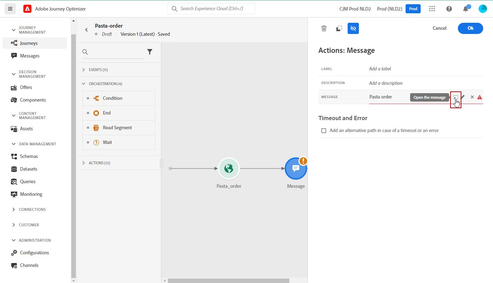
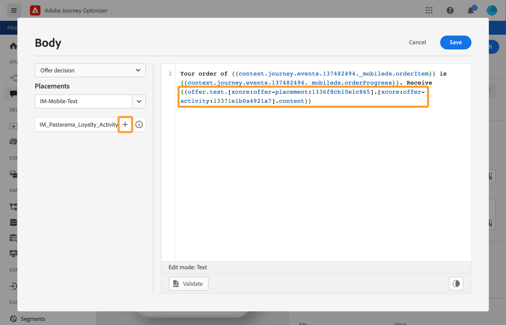
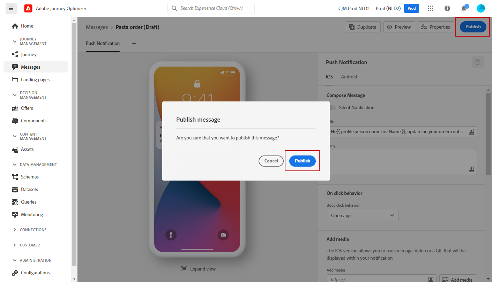
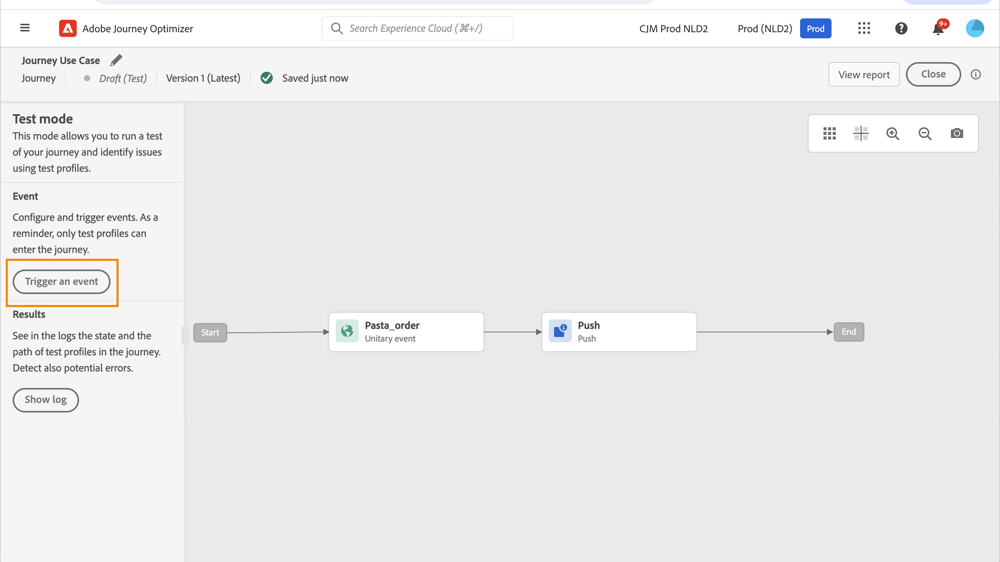

# 个性化用例：订单状态通知 {#personalization-use-case}

在此用例中，您将看到如何在单个推送通知消息中使用多种类型的个性化。 将使用三种类型的个性化：

* **用户档案**:基于用户档案字段的消息个性化
* **选件决策**:基于offer decisioning变量进行个性化
* **上下文**:基于历程中的情境数据进行个性化

此示例的目标是在每次更新客户订单时向[!DNL Journey Optimizer]推送事件。 随后，系统会向客户发送推送通知，其中包含有关订单的信息和个性化优惠。

对于此用例，需要满足以下先决条件：

* 创建和设计推送通知消息，而不发布。 请参阅此[部分](../create-message.md)。
* 配置订单事件，包括订单编号、状态和物料名称。 请参阅此[部分](../event/about-events.md)。
* 创建决策（以前称为“选件活动”），请参阅此[部分](../offers/offer-activities/create-offer-activities.md)。

## 第1步 — 在用户档案中添加个性化

1. 单击&#x200B;**[!UICONTROL Message]**&#x200B;菜单，然后选择您的消息。

   

1. 单击&#x200B;**标题**&#x200B;字段。

   

1. 键入主题并添加个性化用户档案。 使用搜索栏查找用户档案的名字字段。 在主题文本中，将光标放在要插入个性化字段的位置，然后单击&#x200B;**+**&#x200B;图标。 单击&#x200B;**保存**。

   

   >[!NOTE]
   >
   >留言稿。 尚未发布。

## 第2步 — 创建历程

1. 单击&#x200B;**[!UICONTROL Journeys]**&#x200B;菜单并创建新历程。

   

1. 添加您的登入事件、**Message**&#x200B;和&#x200B;**End**&#x200B;活动。

   

1. 在&#x200B;**Message**&#x200B;活动中，选择之前创建的消息。 单击&#x200B;**确定**。

   

   将显示一条消息，通知您条目事件数据和历程属性已传递到消息。

   

   >[!NOTE]
   >
   >此时将显示一条警告图标的消息。 这是因为消息尚未发布。

## 步骤3 — 基于上下文数据添加个性化

1. 在&#x200B;**消息**&#x200B;活动中，单击&#x200B;**打开消息**&#x200B;图标。 此时将在新选项卡中打开消息。

   

1. 单击&#x200B;**标题**&#x200B;字段。

   

1. 选择&#x200B;**Context**&#x200B;类别。 仅当历程将上下文数据传递到消息时，此项目才可用。 单击&#x200B;**Journey Orchestration**。 将显示以下上下文信息：

   * **事件**:此类别会重组置于历程中消息活动之前的事 **** 件中的所有字段。
   * **历程属性**:与给定用户档案的历程相关的技术字段，例如历程ID或遇到的特定错误。请参阅[Journey Orchestration文档](https://experienceleague.adobe.com/docs/journeys/using/building-advanced-conditions-journeys/syntax/journey-properties.html#building-advanced-conditions-journeys)。

   

1. 展开&#x200B;**Events**&#x200B;项目，并查找与事件相关的订单编号字段。 您还可以使用搜索框。 单击&#x200B;**+**&#x200B;图标以在主题文本中插入个性化字段。 单击&#x200B;**保存**。

   

1. 现在，单击&#x200B;**Body**&#x200B;字段。

   

1. 键入消息，并从&#x200B;**Context**&#x200B;类别中插入订单项目名称和订单进度。

   

1. 从下拉列表中，选择&#x200B;**选件决策**&#x200B;以插入offer decisioning变量。 选择版面，然后单击决策旁边的&#x200B;**+**&#x200B;图标（以前称为“选件活动”），将其添加到正文中。

   

1. 单击“验证”以确保没有错误，然后单击“**保存**”。

   

1. 现在，发布消息。

   

## 第4步 — 测试和发布历程

1. 再次打开历程。 如果历程已打开，请确保刷新页面。 现在，消息已发布，您可以看到历程中没有错误。 单击&#x200B;**Test**&#x200B;按钮，然后单击&#x200B;**触发事件**。

   

1. 输入测试中要传递的不同值。 测试模式仅适用于测试用户档案。 用户档案标识符需要与测试用户档案对应。 单击&#x200B;**发送**。

   

   推送通知将发送并显示在测试用户档案的手机上。

   

1. 确认没有错误并发布历程。

