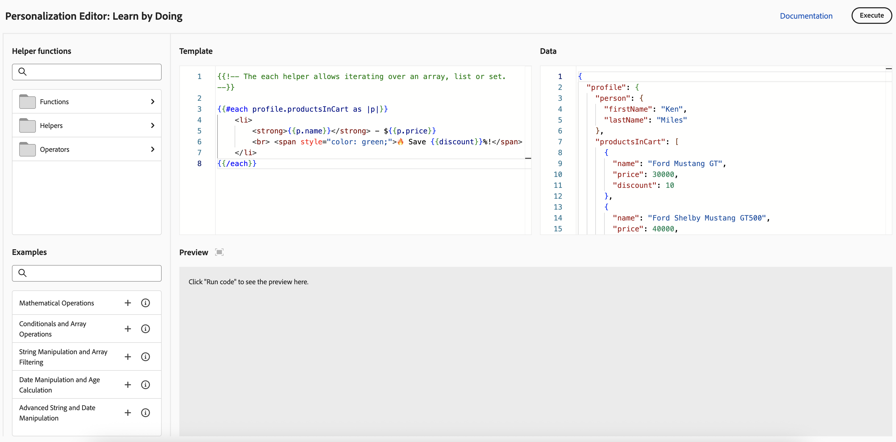

# 个性化功能快速入门{#add-personalization}

>[!CONTEXTUALHELP]
>id="ajo_homepage_card5"
>title="个性化体验"
>abstract="借助 **Adobe Journey Optimizer**，可利用您拥有的特定收件人相关数据和信息，让您的消息适合每个特定收件人。该信息可以是特定收件人的名字、兴趣、居住地、购买的物品等。"

[!DNL Adobe Journey Optimizer]个性化功能允许您利用有关每个特定收件人的数据和信息，根据他们调整邮件。 该信息可以是特定收件人的名字、兴趣、居住地、购买的物品等。

## 个性化如何工作

使用&#x200B;**个性化编辑器**，您可以选择、排列、自定义和验证所有数据来为内容创建自定义的个性化设置，并利用各种工具（如帮助程序函数或预定义表达式）来有效地定制消息。

Journey Optimizer使用基于Handlebars的内联个性化语法，允许您创建内容由双大括号&#x200B;**{{}}{{}}**&#x200B;括起来的表达式。

在处理消息时，Journey Optimizer会使用Experience Platform数据集中包含的数据替换表达式。 例如，`Hello {{profile.person.name.firstName}} {{profile.person.name.lastName}}`动态变为`Hello John Doe`。

使用此语法，您可以跨多个字段个性化消息，包括电子邮件主题行、消息正文、推送通知或URL。

## 用于个性化的数据

Personalization基于Adobe Experience Platform中定义的&#x200B;**XDM Individual Profile**&#x200B;架构管理的配置文件数据。 **XDM Individual Profile**&#x200B;架构是唯一可用于个性化[!DNL Journey Optimizer]中内容的架构。 请参阅[Adobe Experience Platform数据模型(XDM)文档](https://experienceleague.adobe.com/docs/experience-platform/xdm/home.html?lang=zh-Hans){target="_blank"}以了解详情。

您还可以利用&#x200B;**计算属性**&#x200B;来个性化您的内容。 计算属性允许您将各个行为事件汇总到Adobe Experience Platform上可用的计算配置文件属性中。 [了解如何使用计算属性](../audience/computed-attributes.md)

此外，[!DNL Journey Optimizer]允许您在个性化编辑器中利用Adobe Experience Platform中的数据来对内容进行个性化。 为此，必须首先通过 API 调用启用查找个性化所需的数据集。完成后，您可以使用他们的数据在Journey Optimizer中个性化您的内容。 此功能目前在Beta版中可用。 [了解详情](../personalization/aep-data-perso.md)

## 学习和试验个性化 {#playground}

**[!DNL Adobe Journey Optimizer]**&#x200B;包括一个交互式工具，旨在帮助您学习和试验个性化功能。

该游乐场提供了一个模拟环境，无需实时数据集即可使用示例数据编写和测试个性化代码。 您可以利用预定义的代码示例，编辑虚拟配置文件负载，并实时预览个性化代码的输出。

➡️ [访问个性化游乐场](https://experienceleague.adobe.com/zh-hans/apps/journey-optimizer/ajo-personalization){target="_blank"}

## 让我们深入探究

现在您已了解&#x200B;**[!DNL Journey Optimizer]**&#x200B;中的个性化设置，接下来该更深入地研究这些文档部分以开始使用该功能。

<table style="table-layout:fixed"><tr style="border: 0;">
<td>

<a href="personalization-build-expressions.md"><strong>添加个性化内容</strong></a>

</td>
<td>

<a href="../personalization/personalization-syntax.md"><strong>Personalization语法</strong>

</td>
<td>

<a href="../personalization/functions/functions.md"><strong>辅助函数列表</strong></a>

</td>
<td>

<a href="../personalization/personalization-use-case.md"><strong>Personalization用例</strong></a>

</td>
</tr></table>

## 操作说明视频{#video-perso}

了解如何使用历程中的情境式事件信息来对消息进行个性化。

>[!VIDEO](https://video.tv.adobe.com/v/3448150?quality=12&captions=chi_hans)

了解如何在消息中添加基于轮廓的个性化推送，以及如何将受众会员资格用作个性化块的先决条件。

>[!VIDEO](https://video.tv.adobe.com/v/3416235?quality=12&captions=chi_hans)

了解如何使用个性化编辑器游乐场，使用示例数据编写和测试个性化代码。

>[!VIDEO](https://video.tv.adobe.com/v/3457868?quality=12)
