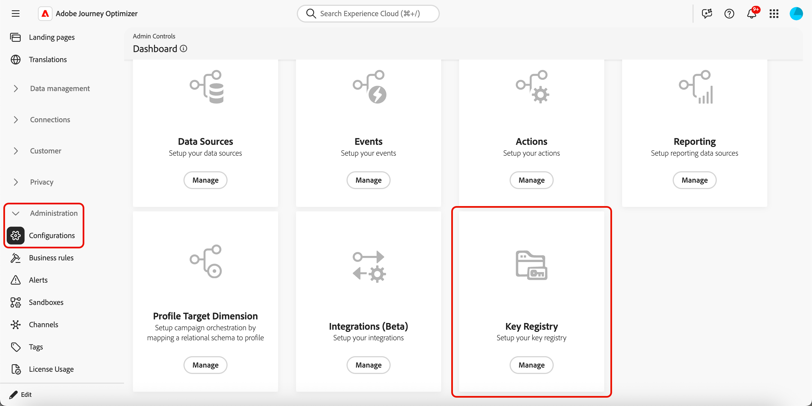
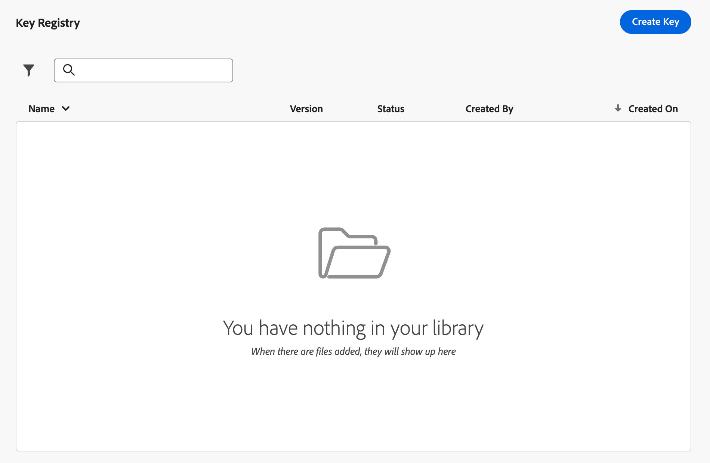

# 加密URL参数 {#url-parameter-encryption}

>[!AVAILABILITY]
>
>此功能在“有限可用”中可用。 请联系 Adobe 代表获取访问权限。
>
>此功能当前仅适用于电子邮件渠道。

## 为何使用URL参数加密？ {#why-url-parameter-encryption}

个性化跟踪链接和登陆页面URL通常包括查询字符串中的配置文件属性、标识符、令牌或其他值。 这些参数通常在电子邮件或短信中以纯文本形式显示，并且如果有人复制、共享或书签链接，这些参数将保持可读性。 当值可能包含个人身份信息(PII)或他们必须保护的其他敏感数据时，这可能会带来安全和隐私风险。

[!DNL Journey Optimizer]在个性化编辑器中提供了一个加密帮助程序，以便您可以在渲染时加密任何表达式值（例如，配置文件属性、令牌或您从多个字段构建的字符串）。 加密始终需要您组织的注册表中的密钥。

您只使用管理员在沙盒级注册表中管理的密钥加密您选择的查询参数，因此，共享或检查链接时，机密值不会以明文显示。

### 工作原理 {#how-it-works}

* **管理员**&#x200B;使用密钥注册表[创建密钥](#create-keys)和[根据您组织的安全策略管理密钥](#manage-keys)。
* **营销人员**&#x200B;在个性化编辑器中插入`Encrypt`帮助程序并传递要保护的值以及注册表中的活动键标识符。 有关语法和选项，请参阅[本节](functions/helpers.md#url-parameter-encryption-helper)。

>[!IMPORTANT]
>
>解密是贵组织的责任。 呈现消息时，[!DNL Journey Optimizer]加密值。 您的网站、应用程序或API必须使用您定义的相同加密材料和流程解密参数 — 与您的安全模型一致。

### 示例

登陆页面URL可能使用查询参数，例如`token`，其值是字符串令牌（例如，具有选件或配置文件标识符的JSON有效负载）。 如果不进行加密，则该字符串令牌将在链接中显示为纯文本。 使用加密帮助程序包装该值会将URL中的敏感有效负载替换为密文，而链接的其余部分保持不变。

## 创建键 {#create-keys}

在能够使用URL参数加密帮助程序之前，您需要创建一个密钥。 要实现此目的，请执行以下步骤。

>[!NOTE]
>
>目前没有访问和管理密钥的特定权限。 授予对&#x200B;**[!UICONTROL 管理]**&#x200B;下的&#x200B;**[!UICONTROL 配置]**&#x200B;部分的访问权限的角色也授予对密钥注册表的访问权限。 但是，计划在将来版本中提供特定权限。

<!--
>[!IMPORTANT]
>
>To access and manage keys, you you must have the **View Key Registry** and **Manage Key Registry** permissions granted. [Learn more](../administration/high-low-permissions.md)
-->

1. 转到&#x200B;**[!UICONTROL 管理]** > **[!UICONTROL 配置]**。

1. 单击&#x200B;**[!UICONTROL 管理]**&#x200B;按钮以打开&#x200B;**[!UICONTROL 密钥注册表]**。

   “管理”菜单中的{width="80%"}

1. 使用专用按钮，根据组织需要创建密钥。

   {width="80%"}中创建密钥按钮

1. 为他们分配一个您的团队可在个性化编辑器中引用的清晰标签或标识符。

   {width="80%"}中的密钥详细信息

1. 单击&#x200B;**[!UICONTROL 提交]**&#x200B;以确认更改。

创建密钥后，营销人员可以使用个性化编辑器中的[URL参数加密](functions/helpers.md#url-parameter-encryption-helper)帮助程序来加密他们放置在URL查询参数中的特定值。

## 管理密钥 {#manage-keys}

要管理密钥，请执行以下步骤。

1. 访问&#x200B;**[!UICONTROL 键注册表]**。 您可以在列表视图中查看为当前沙盒创建的所有键。

   {width="100%"}

1. 单击状态为&#x200B;**[!UICONTROL 活动]**&#x200B;的键以打开键详细信息。

   {width="80%"}

1. 单击&#x200B;**[!UICONTROL 撤销]**&#x200B;按钮可永久禁用新加密的密钥。

   密钥被撤销后，在渲染时尝试在帮助程序中使用它应会失败。 撤销的条目仍会显示在审核中；您的团队可能仍需要相应的资料来解密您自己系统上的旧负载。

1. 单击&#x200B;**[!UICONTROL 轮换]**&#x200B;按钮提供新的关键资料，同时保留历程和营销活动已引用该资料的稳定关键标识符。

   在注册表中保留以前的资料具有撤销状态和适当的原因（例如轮换时间戳），并且新行或新版本反映活动密钥。

   >[!NOTE]
   >
   >应仅选择活动密钥以在个性化编辑器中加密新值。 请勿将已撤销密钥用于新内容。
