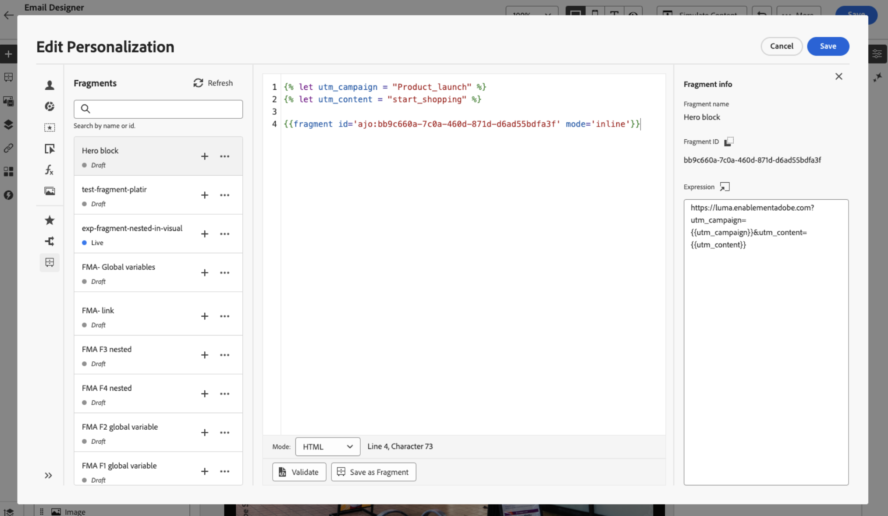

# 利用表达式片段 {#use-expression-fragments}

>[!BEGINSHADEBOX]

**在此页面上：**&#x200B;了解如何在个性化编辑器中插入和重用表达式片段，如何使用隐式变量，在循环中使用片段，自定义可编辑字段，以及中断Adobe Journey Optimizer中的继承。

>[!ENDSHADEBOX]

使用&#x200B;**个性化编辑器**&#x200B;时，您可以利用已创建或已保存到当前沙盒中的所有表达式片段。

片段是可重复使用的组件，可以在[!DNL Journey Optimizer]营销活动和历程中引用。 此功能允许预先构建多个自定义内容块，营销用户可以使用这些内容块在改进的设计过程中快速组合内容。 [了解有关片段的更多信息](../content-management/fragments.md)

➡️ [在此视频中了解如何管理、创作和使用片段](../content-management/fragments.md#video-fragments)

## 使用表达式片段 {#use-expression-fragment}

要向内容添加表达式片段，请执行以下步骤。

>[!NOTE]
>
>您最多可以在给定投放中添加30个片段。 片段最多只能嵌套1级。

1. 打开[个性化编辑器](personalization-build-expressions.md)，然后在左窗格中选择&#x200B;**[!UICONTROL 片段]**&#x200B;按钮。

   该列表显示了当前沙盒上已创建或另存为片段的所有表达式片段。 [了解如何创建片段](../content-management/create-fragments.md)
它们按创建日期排序：最近添加的表达式片段首先显示在列表中。

   

   您也可以刷新此列表。

   >[!NOTE]
   >
   >如果在编辑内容时修改或添加了某些片段，则列表将使用最新更改进行更新。

1. 单击表达式片段旁边的+图标以将相应的片段ID插入到编辑器中。

   

   >[!CAUTION]
   >
   >您可以将任何&#x200B;**草稿**&#x200B;或&#x200B;**实时**&#x200B;片段添加到您的内容中。 但是，如果历程或营销活动中正在使用&#x200B;**草稿**&#x200B;状态的片段，您将无法激活该历程或营销活动。 在历程或营销活动发布中，草稿片段将显示错误，您需要批准它们才能发布。

1. 添加片段ID后，如果您打开相应的表达式片段并从界面中[编辑它](../content-management/manage-fragments.md#edit-fragments)，则将同步更改。 它们会自动传播到包含该片段ID的所有草稿或实时历程/营销活动。

1. 单击片段旁边的&#x200B;**[!UICONTROL 更多操作]**&#x200B;按钮。 从打开的上下文菜单中，选择&#x200B;**[!UICONTROL 查看片段]**&#x200B;以获取有关该片段的更多信息。 还显示&#x200B;**[!UICONTROL 片段ID]**，可从此处复制。

   

1. 您可以在另一个窗口中打开表达式片段以编辑其内容和属性 — 使用上下文菜单中的&#x200B;**[!UICONTROL 打开片段]**&#x200B;选项或从&#x200B;**[!UICONTROL 片段信息]**&#x200B;窗格中编辑。 [了解如何编辑片段](../content-management/manage-fragments.md#edit-fragments)

   

1. 然后，您可以使用[个性化编辑器](personalization-build-expressions.md)的所有个性化和创作功能，像往常一样自定义和验证内容。

1. 在某些情况下，您只需要计算变量，因此您可能希望隐藏表达式片段的内容。 为此，请使用`render`属性并将其设置为`false`。 例如：

   ```
   Hi {{profile.person.name.firstName|fragment id='ajo:fragmentId/variantId' mode ='inline' render=false}}
   ```

>[!NOTE]
>
>如果您创建的表达式片段包含多个换行符，并在[短信](../mobile/create-mobile-message.md#sms-content)或[推送](../push/design-push.md)内容中使用它，则将保留换行符。 因此，请确保在发送您的[短信](../mobile/send-mobile-message.md)或[推送](../push/send-push.md)消息之前对其进行测试。

## 使用隐式变量 {#implicit-variables}

隐式变量增强了现有片段功能，以提高内容重用和脚本用例的效率。 片段可以使用输入变量并创建可在营销活动和历程内容中使用的输出变量。

例如，此功能可用于根据当前营销活动或历程初始化电子邮件的跟踪参数，并将这些参数用于添加到电子邮件内容的个性化链接。

可以使用以下用例：

1. **在片段中使用输入变量。**

   当在营销活动/历程操作内容中使用片段时，它能够在片段之外利用声明的变量。 示例如下：

   

   我们可以看到，以上在营销活动内容中声明了`utm_content`变量。 当使用片段&#x200B;**主页块**&#x200B;时，将显示一个链接，其中将附加`utm_content`参数值。 最终结果为： `https://luma.enablementadobe.com?utm_campaign= Product_launch&utm_content= start_shopping`。

1. **使用片段中的输出变量。**

   在片段中计算或定义的变量可在您的内容中使用。 在以下示例中，片段&#x200B;**F1**&#x200B;声明了一组变量：

   

   在电子邮件内容中，您可以进行以下个性化设置：

   

   片段F1初始化以下变量： `utm_campaign`和`utm_content`。 然后，消息内容中的链接将会附加这些参数。 最终结果为： `https://luma.enablementadobe.com?utm_campaign= Product_launch&utm_content= start_shopping`。

>[!NOTE]
>
>在运行时，系统会扩展片段中的内容，然后从上到下解释个性化代码。 请记住，可以实现更复杂的用例。 例如，您可以有一个片段F1将变量传递给位于下方的另一个片段F2。 您还可以让可视片段F1将变量传递给嵌套表达式片段F2。

## 在循环中使用表达式片段 {#fragments-in-loops}

在`{{#each}}`循环中使用表达式片段时，了解变量范围设置的工作原理非常重要。 表达式片段可以访问消息内容中定义的全局变量，但它们不能接收特定于循环的变量作为参数。

### 支持的模式：使用全局变量 {#global-variables-in-loops}

表达式片段可以引用在片段之外定义的全局变量，即使从循环中调用片段也是如此。 当需要在迭代环境中使用片段时，建议使用此方法。

**示例：在循环中使用具有全局变量的片段**

在您的消息内容中，定义一个全局变量并使用引用该变量的片段：

```handlebars


{{#each context.journey.actions.GetProducts.items as |product|}}
  <div class="product">
    <h3>{{product.name}}</h3>
    <p>Price: ${{product.price}}</p>
    {{fragment id='ajo:fragment123/variant456' mode='inline'}}
  </div>
{{/each}}
```

在表达式片段(fragment123)中，您可以引用`globalDiscount`变量：

```handlebars
<p class="discount-info">Save {{globalDiscount}}% on all items!</p>
```

此模式之所以有效，是因为全局变量在整个消息中（包括片段内）都可访问，而与循环上下文无关。

### 不支持：将循环变量作为片段参数传递 {#loop-variables-limitations}

不能将当前迭代项（如上例中的`product`）作为参数传递给表达式片段。 片段无法从周围的`{{#each}}`块直接访问循环作用域的变量。

**示例：什么不工作**

```handlebars
{{#each context.journey.actions.GetProducts.items as |product|}}
  <!-- This will NOT work as expected -->
  {{fragment id='ajo:fragment123/variant456' mode='inline' currentProduct=product}}
{{/each}}
```

片段无法接收`product`作为参数并在内部使用它，因为当前实现中不支持为特定于循环的变量传递参数。

### 建议的解决方法 {#fragments-in-loops-workarounds}

当需要对来自循环的数据使用表达式片段时，请考虑以下方法：

1. **直接在消息中包含逻辑**：不要将片段用于特定于循环的逻辑，而是直接在`{{#each}}`块中添加个性化代码。

   ```handlebars
   {{#each context.journey.actions.GetProducts.items as |product|}}
     <div class="product">
       <h3>{{product.name}}</h3>
       <p>Price: ${{product.price}}</p>
       {{#if product.price > 100}}
         <span class="premium-badge">Premium Product</span>
       {{/if}}
     </div>
   {{/each}}
   ```

2. **使用循环之外的片段**：如果片段内容不依赖于循环，请在迭代块之前或之后调用片段。

   ```handlebars
   {{fragment id='ajo:fragment123/variant456' mode='inline'}}
   
   {{#each context.journey.actions.GetProducts.items as |product|}}
     <div class="product">
       <h3>{{product.name}}</h3>
       <p>Price: ${{product.price}}</p>
     </div>
   {{/each}}
   ```

3. **设置多个全局变量**：如果需要跨迭代向片段传递不同的值，请在每次片段调用之前设置全局变量（但这限制了灵活性）。

>[!NOTE]
>
>有关对上下文数据进行迭代和使用循环的信息，请参阅有关[对上下文数据进行迭代](iterate-contextual-data.md)的综合指南，其中包括最佳实践、疑难解答提示和高级模式。

## 自定义可编辑字段 {#customize-fields}

如果表达式片段的某些部分已使用变量设置为可编辑，则可以使用特定语法覆盖其默认值。 [了解如何使您的片段可自定义](../content-management/customizable-fragments.md)

要自定义字段，请执行以下步骤：

1. 从&#x200B;**[!UICONTROL 片段]**&#x200B;菜单将片段插入到您的代码中。

1. 在语法末尾使用`<fieldId>="<value>"`代码覆盖变量的默认值。

   在以下示例中，我们将ID为“sports”的变量的值替换为“yoga”值。 只要引用“sport”变量，这就会在片段内容中显示“瑜伽”。

   

[此部分](../content-management/customizable-fragments.md#example)中提供了示例，说明如何在创建电子邮件时将可编辑字段添加到表达式片段并覆盖其值。

## 使用动态片段解析 {#dynamic-resolution}

您可以在运行时为每个收件人动态解析片段ID，而不是在设计时静态嵌入片段ID。 根据用户档案属性、数据集查找或上下文数据，这允许不同的用户档案在同一营销活动或历程中接收完全不同的内容块。

[了解如何使用动态片段](../content-management/dynamic-fragments.md)

## 中断继承 {#break-inheritance}

向个性化编辑器添加片段ID时，将同步对原始表达式片段所做的更改。

但是，您也可以将表达式片段的内容粘贴到编辑器中。 从上下文菜单中，选择&#x200B;**[!UICONTROL 粘贴片段]**&#x200B;以插入该内容。


在这种情况下，来自原始片段的继承将被中断。 片段的内容将会复制到编辑器中，并且更改不再同步。

它会变成一个不再链接到原始片段的独立元素；您可以像代码中的任何其他元素一样编辑它。

## 快速参考 {#quick-reference}

本节包含结构化知识，用于支持与本主题相关的解释、检索和问答。

要全面了解相关信息，应将此信息与本页上的文档相结合。 这两个源都不是独立的；页面描述了功能，而本节提供了其他上下文来帮助消除术语、意图、适用性和约束条件的歧义。

>[!BEGINTABS]

>[!TAB 概述]

**TL；DR**

本页介绍如何在个性化编辑器中插入、自定义和管理表达式片段，包括隐式变量、使用循环中的片段、可编辑字段、动态解析以及中断继承。

**意图**

* 从“片段”菜单插入表达式片段，并了解自动更改传播
* 使用隐式变量：输入变量（在片段外部声明，在内部使用）和输出变量（在片段内部声明，在周围的消息内容中使用）
* 在循环中使用表达式片段 — 利用全局变量访问片段；了解将循环范围内的变量作为参数传递的限制
* 使用`<fieldId>="<value>"`语法覆盖可自定义片段中的可编辑字段
* 在运行时根据配置文件属性、数据集查找或上下文数据动态解析片段ID
* 通过将片段内容直接粘贴到编辑器来中断继承

>[!TAB 术语表]

* **表达式片段**：由ID在营销活动和历程中引用的可重用的个性化表达式组件；对片段所做的更改会自动传播到引用它的所有内容。 *（产品特定）*
* **隐式变量**：扩展片段功能的变量 — 输入变量（在营销活动/历程内容中声明，在片段内使用）和输出变量（在片段内声明，在周围的消息内容中可用）。 *（产品特定）*
* **输入变量**：在片段外部（在营销活动或历程内容中）声明的变量，片段可以在内部引用和使用。
* **输出变量**：在片段中声明或计算的变量，该变量在调用片段后可用于周围的消息内容。
* **可编辑字段**：已公开片段变量，以允许插入用户使用`<fieldId>="<value>"`语法覆盖默认值，而无需编辑片段源。 *（产品特定）*
* **动态片段解析**：能够在运行时解析片段ID（基于配置文件属性、数据集查找或上下文数据），而不是在设计时嵌入静态片段ID。 *（产品特定）*
* **中断继承**：使用上下文菜单中的“粘贴片段”可将片段的内容作为不再与原始片段同步的独立元素复制到编辑器中。 *（产品特定）*

>[!TAB 术语]

* **规范名称：**&#x200B;表达式片段 — 变体：片段，表达式片段
* **同义词：**“片段ID”=表达式中用于引用片段的标识符
* **请勿混淆：**&#x200B;通过ID插入片段（已引用；更改会自动传播到所有内容），≠中断继承/粘贴片段（内容已复制到编辑器中；是独立元素，不再链接到原始内容）
* **请勿混淆：**&#x200B;输入变量（在片段外部声明，在内部使用）≠输出变量（在片段内部声明，在周围消息内容外部使用）
* **请勿混淆：**&#x200B;草稿片段（可以添加到内容中，但在获得批准之前阻止历程/营销活动发布）≠实时片段（已完全发布；对活动历程和营销活动安全）

>[!TAB 护栏和限制]

* 在给定投放中最多可以添加30个片段。
* 片段最多只能嵌套1级。
* 如果历程或营销策划包含状态为草稿的片段，则无法激活或发布该历程或营销策划；草稿片段必须在发布之前获得批准。
* 表达式片段无法接收循环范围的变量（当前`{{#each}}`迭代项）作为参数 — 这是一个已知限制。 解决方法：使用全局变量或内联逻辑。
* 如果在SMS或推送内容中使用包含多个换行符的片段，则会保留换行符；在发送之前测试内容。

>[!TAB 常见问题解答]

**问：一次投放中可以添加多少片段？**

最多30个片段。

**问：片段是否可以嵌套在其他片段内？**

是的，但最多只能嵌套1层。

**问：如果在历程或营销活动中使用草稿片段，会发生什么情况？**

您可以向内容添加草稿片段，但在片段获得批准且其状态更改为实时之前，您无法激活或发布历程或营销活动。

**问：表达式片段能否作为参数接收当前循环项（例如`{{#each}}`中的`product`）？**

没有。 表达式片段无法接收循环范围的变量作为参数。 使用在循环之外声明的全局变量（片段可以访问），或直接在循环中包含个性化逻辑，而不是使用片段。

**问：中断继承的原因是什么？何时应使用继承？**

中断继承意味着使用上下文菜单中的“粘贴片段”将片段的内容直接复制到编辑器中。 粘贴的内容成为不再与原始片段同步的独立元素 — 当您需要自定义可编辑字段允许的内容之外时，请使用此元素，因为知道对原始片段的未来更改将不会传播到此副本。

>[!ENDTABS]

<!-- ai-section-version: 1 | source-hash: 64745ff0 -->

