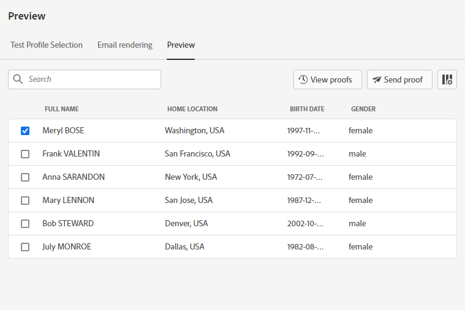
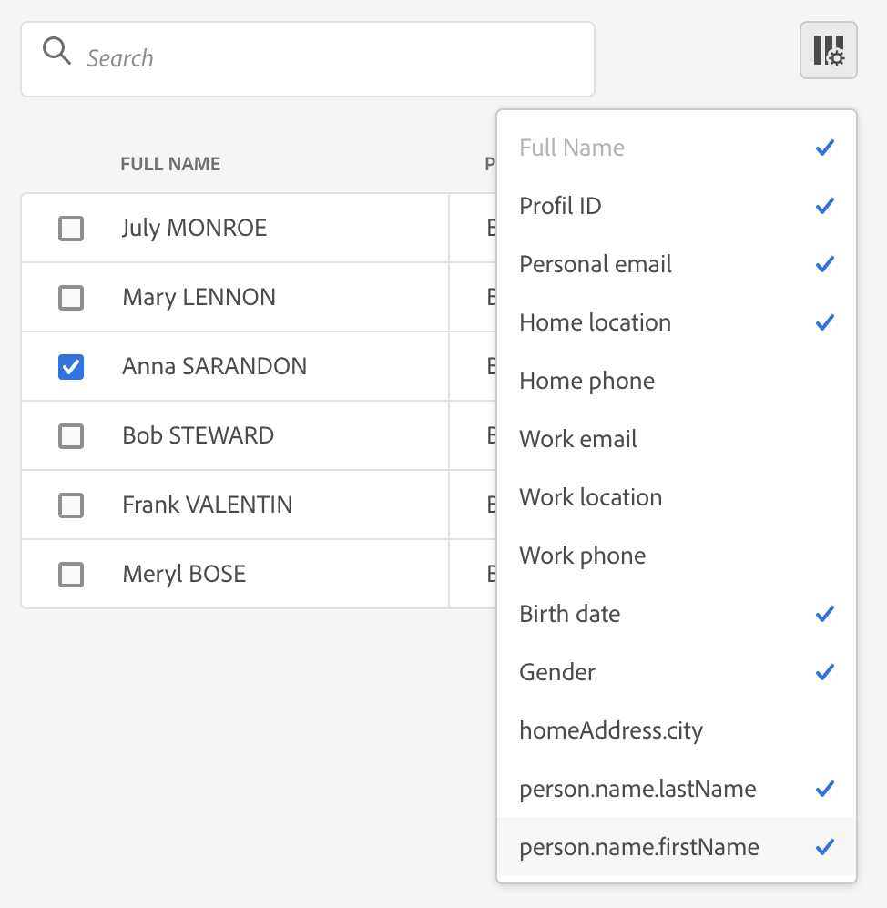
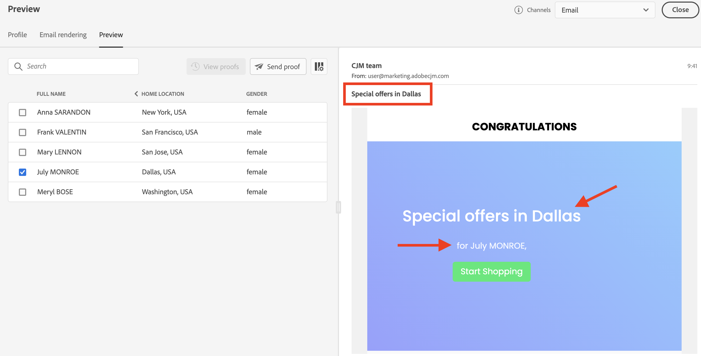
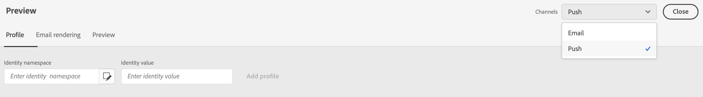

# 预览并测试消息{#preview-and-proof}

定义消息内容后，您可以使用测试用户档案对其进行预览和测试。 如果插入了[个性化内容](personalization/personalize.md)，您将能够利用测试用户档案数据检查该内容在消息中的显示方式。

要检测电子邮件内容或个性化设置中的可能错误，请发送验证以测试用户档案。 每次进行更改时都应发送验证，以验证最新内容。

>[!CAUTION]
>
>您需要有测试用户档案才能预览消息和发送验证。 [了解详情](building-journeys/testing-the-journey.md#create-test-profile)。

要测试消息内容，您需要：

* [选择测试用户档案](#select-test-profiles)
* [检查消息预览](#preview-your-messages)

然后，您将能够[将验证](#send-proofs)发送到测试用户档案。

此外，将您的&#x200B;**Litmus**&#x200B;帐户用于[!DNL Journey Optimizer]，以便立即在流行电子邮件客户端中预览您的&#x200B;**电子邮件呈现**。 然后，您可以确保您的电子邮件内容在每个收件箱中均显示良好且正常工作。 了解如何解锁[此部分](#email-rendering)中的“Litmus电子邮件预览”

## 选择测试用户档案{#select-test-profiles}

利用测试用户档案可定向不符合所规定定向标准的其他收件人。

要选择测试用户档案，请执行以下步骤：

1. 在消息界面或电子邮件设计器中，单击&#x200B;**[!UICONTROL Preview]**&#x200B;按钮以访问测试用户档案选择。

   

1. 单击&#x200B;**[!UICONTROL Identity namespace]**&#x200B;选择图标，选择用于标识测试用户档案的命名空间。

   

   在本节](https://experienceleague.adobe.com/docs/experience-platform/identity/namespaces.html?lang=en#getting-started)中，进一步了解Adobe Experience Platform标识命名空间[。

   在以下示例中，我们将使用&#x200B;**Email**&#x200B;命名空间。

1. 使用搜索字段查找命名空间，选择它并单击&#x200B;**[!UICONTROL Select]**

   

1. 输入值以标识测试用户档案，然后单击&#x200B;**[!UICONTROL Find test profile]**。

   

1. 如果您在消息中添加了个性化，请添加其他用户档案，以便根据用户档案数据测试消息的不同变体。 添加后，用户档案将列在选择字段下。

   

   根据消息个性化元素，此列表在相关列中显示每个测试用户档案的数据。

## 预览消息{#preview-your-messages}

选择[测试用户档案](#select-test-profiles)后，即可预览消息并检查内容。

1. 单击&#x200B;**[!UICONTROL Preview]**&#x200B;选项卡以测试消息。

1. 选择测试用户档案。 您可以检查列中的可用值。 使用向右/向左箭头浏览数据。

   

1. 单击列表上方的&#x200B;**[!UICONTROL Select data]**&#x200B;图标以添加或删除列。

   

   您可以在列表末尾看到特定于当前消息的个性化字段。 在此示例中，用户档案城市，名和姓。 选择这些字段，并确保在测试用户档案中填充这些值。

1. 在消息预览中，个性化元素被所选的测试用户档案数据替换。

   例如，对于此邮件，电子邮件内容和电子邮件主题都是个性化的：

   

1. 选择其他测试用户档案，以针对邮件的每个变体预览电子邮件呈现。

对于推送通知预览:

1. 从&#x200B;**[!UICONTROL Preview]**&#x200B;屏幕左上角的&#x200B;**[!UICONTROL Channels]**&#x200B;下拉渠道切换到&#x200B;**[!UICONTROL Push]**&#x200B;列表。

   

1. 应用与上述步骤相同的步骤来选择测试用户档案，然后选择设备类型以预览内容：**[!UICONTROL iOS]**&#x200B;或&#x200B;**[!UICONTROL Android]**

   

1. 在推送预览中，测试用户档案数据被用于消息内容。

   例如，对于此推送通知，标题和正文都是个性化的：

   

## 发送验证{#send-proofs}

验证是一条特定消息，允许您在将消息发送到主受众之前测试该消息。 验证收件人负责批准以下信息：呈现、内容、个性化设置、配置。

选择[测试用户档案](#select-test-profiles)后，即可发送验证。

1. 在&#x200B;**[!UICONTROL Preview]**&#x200B;屏幕中，单击&#x200B;**[!UICONTROL Send proof]**&#x200B;按钮。

   

1. 选择将接收验证的测试用户档案，然后单击&#x200B;**[!UICONTROL Send proof]**。 如果需要，可以在验证的主题行中添加前缀。

   

1. 返回至&#x200B;**[!UICONTROL Preview]**&#x200B;屏幕，单击&#x200B;**[!UICONTROL View proofs]**&#x200B;按钮检查状态。

   

您需要在对消息内容进行任何修改后发送验证。

## 电子邮件渲染{#email-rendering}

您可以将&#x200B;**Litmus**&#x200B;帐户用于[!DNL Journey Optimizer]，以便在流行的电子邮件客户端中立即预览您的&#x200B;**电子邮件呈现**。

要访问电子邮件呈现功能，您需要：

* 拥有Litmus帐户
* [选择测试用户档案](#select-test-profiles)

然后，按照以下步骤操作：

1. 在“电子邮件设计器”中，单击&#x200B;**[!UICONTROL Preview]**&#x200B;按钮并选择&#x200B;**[!UICONTROL Email rendering]**&#x200B;选项卡。

1. 单击右上角的&#x200B;**连接您的Litmus帐户**。

   

1. 输入您的凭据并登录。

   

1. 单击&#x200B;**运行test**&#x200B;按钮以生成电子邮件预览。

1. 在流行的桌面、移动设备和基于Web的客户端查看您的电子邮件内容。

   

>[!CAUTION]
>
>将&#x200B;**Litmus**&#x200B;帐户与[!DNL Journey Optimizer]连接时，您同意将测试消息发送到Litmus:发送后，这些电子邮件不再由Adobe管理。 因此，Litmus数据保留电子邮件策略适用于这些电子邮件，包括可能包含在这些测试消息中的个性化数据。

