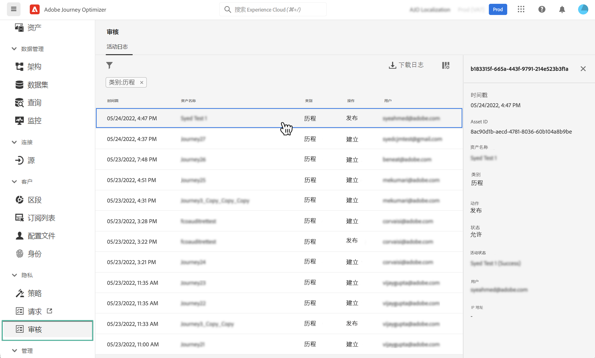

# 审核对 Journey Optimizer 资源的操作 {#track-changes}

## 关于审核日志 {#audit-logs}

>[!IMPORTANT]
>
>要查看和导出审核日志，您必须具有 **[!DNL View User Activity Log]** 权限。 [了解详情](../administration/ootb-product-profiles.md)

借助 Journey Optimizer，您可以识别用户在系统中对各种服务和功能（如历程、消息、登陆页面等）执行的操作。

这样，您就可以提高系统中所执行活动的可见性，排查问题，并帮助企业遵守法规和公司数据管理政策。

“审核日志”会记录每个操作的元数据，可在 Adobe Experience Platform 中访问该日志。 有关审核日志（包括如何在 UI 或 API 中进行查看和管理）的更多信息，请参阅 [Adobe Experience Platform 文档](https://experienceleague.adobe.com/docs/experience-platform/landing/governance-privacy-security/audit-logs/overview.html?lang=zh-Hans)。

## 审核日志记录的事件类型 {#events}

下表概述了由审核日志记录的对 Journey Optimizer 资源执行的操作。 [Adobe Experience Platform 文档](https://experienceleague.adobe.com/docs/experience-platform/landing/governance-privacy-security/audit-logs/overview.html?lang=zh-Hans#category)中提供了审核日志记录的完整操作列表。

>[!NOTE]
>
>与&#x200B;**决策管理**&#x200B;相关的审核日志仅可通过 CSV 文件查看，可使用&#x200B;**[!UICONTROL 下载日志]**&#x200B;按钮下载该文件。

| 资源 | 操作 |
|-----------|------------------|
| AJO 营销活动 | 创建/删除/更新/激活/停止 |
| AJO 渠道常规设置 | 创建/删除/更新 |
| AJO IP 池 | 创建/删除/更新 |
| AJO 登陆页面 | 创建/删除/更新/发布/取消发布 |
| AJO 登陆页面 HTML 模板 | 创建/删除/更新 |
| AJO 登陆页面预设 | 创建/删除/更新 |
| AJO 登陆页面子域 | 创建/删除/更新 |
| AJO 消息预设 | 创建/删除/更新 |
| AJO PTR 记录 | 创建/删除/更新 |
| AJO 保存的表达式模板 | 创建/删除/更新 |
| AJO短信API 凭据 | 创建/删除/更新 |
| AJO 子域 | 创建/删除/更新 |
| AJO 禁止列表 | 创建/删除/下载 CSV |
| 字段组 | 创建/删除/更新 |
| 历程 | 创建/删除/更新/停止/发布 |
| 历程自定义操作 | 创建/删除/更新 |
| 历程数据源 | 创建/删除/更新 |
| 历程事件 | 创建/删除/更新 |
| 消息频率规则 | 创建/删除/更新 |
| 排名策略 | 创建/删除/更新 |
