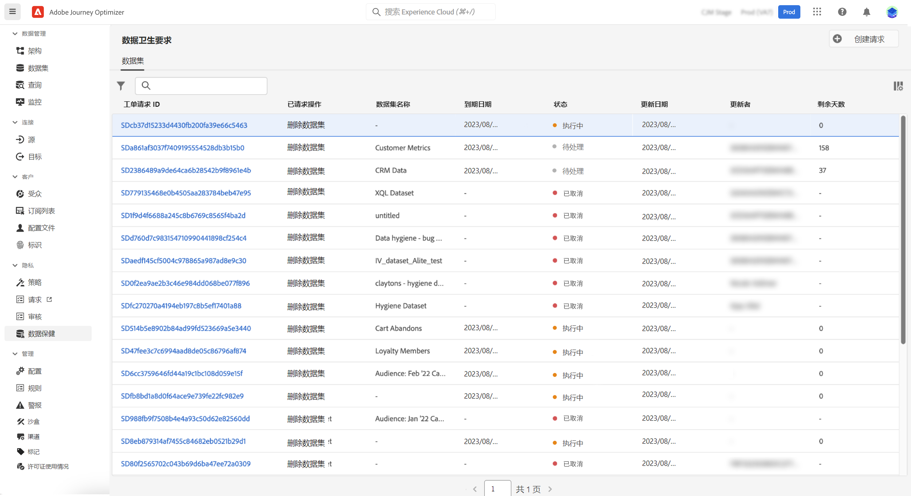

# 执行数据卫生操作 {#data-hygiene}

>[!AVAILABILITY]
>
>目前，数据卫生功能仅适用于已购买 **Healthcare Shield** 和 **Privacy and Security Shield** 附加产品的组织。

随着数据不断被摄取到 Adobe Experience Platform 中，确保根据组织策略按预期使用数据、在必要时更新数据和删除数据至关重要。

这些任务可以借助&#x200B;**[!UICONTROL 数据卫生]**&#x200B;菜单完成，您可以通过它配置和计划数据卫生操作，以确保正确维护记录。

有关 Privacy Service 以及如何执行数据卫生操作的更多信息，请参阅 Adobe Experience Platform 文档：

* [Privacy Service 概述](https://experienceleague.adobe.com/docs/experience-platform/privacy/home.html?lang=zh-Hans)
* [Adobe Experience Platform 中的数据卫生](https://experienceleague.adobe.com/docs/experience-platform/hygiene/home.html?lang=zh-Hans)
