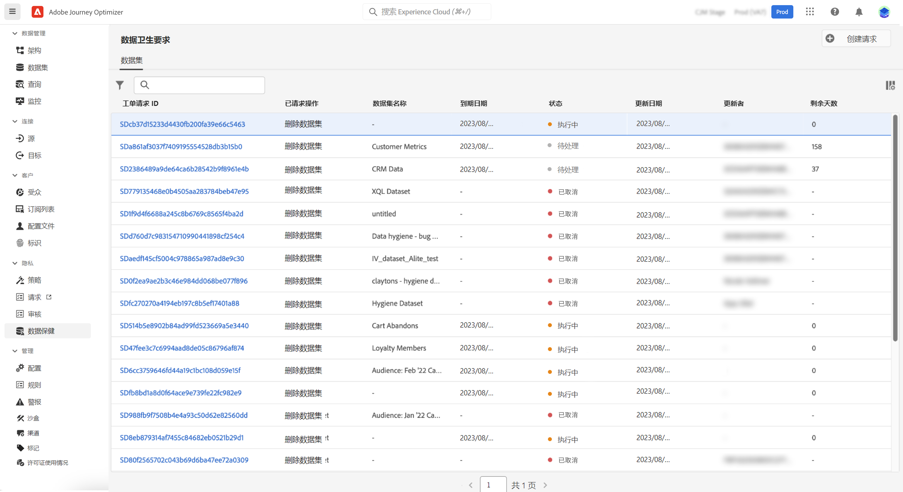

# 执行数据生命周期操作 {#data-hygiene}

>[!AVAILABILITY]
>
>目前，数据生命周期功能仅适用于已购买 **Healthcare Shield** 和 **Privacy and Security Shield** 附加产品的组织。

随着数据不断被摄取到 Adobe Experience Platform 中，确保根据组织策略按预期使用数据、在必要时更新数据和删除数据至关重要。

这些任务可以借助&#x200B;**[!UICONTROL 数据生命周期]**&#x200B;菜单完成，您可以通过它配置和计划数据生命周期操作，以确保正确维护记录。

## 推荐做法 {#data-hygiene-recommendations}

执行数据卫生操作（如删除身份或数据集）时，请注意，与已删除身份关联的历史投放事件将不再出现在标准报告或数据湖查询中。 这可能会导致收件人收件箱中报告为&#x200B;**已投放**&#x200B;的电子邮件数量与&#x200B;**已接收**&#x200B;的电子邮件数量存在差异，尤其是对于较旧的历程而言。

在执行大规模删除操作之前，请验证并导出任何所需的投放或报告数据。 如果在执行数据卫生操作之后需要协调，请与 Adobe 支持人员联系以访问存档的日志，或者使用“消息反馈事件数据集”查询最近的数据。

## 了解详情 {#data-hygiene-learn-more}

有关 Privacy Service 以及如何执行数据生命周期操作的更多信息，请参阅 Adobe Experience Platform 文档：

* [Privacy Service 概述](https://experienceleague.adobe.com/docs/experience-platform/privacy/home.html?lang=zh-Hans)
* [Adobe Experience Platform 中的数据生命周期](https://experienceleague.adobe.com/docs/experience-platform/hygiene/home.html?lang=zh-Hans)
