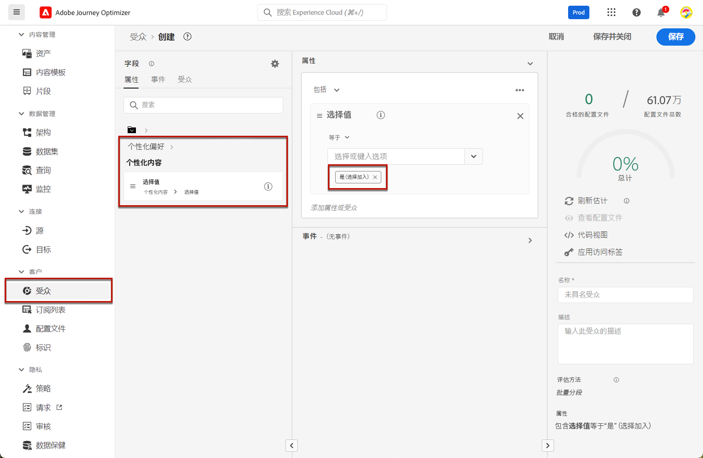
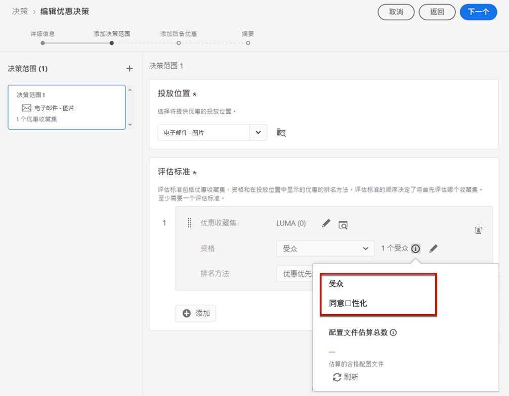
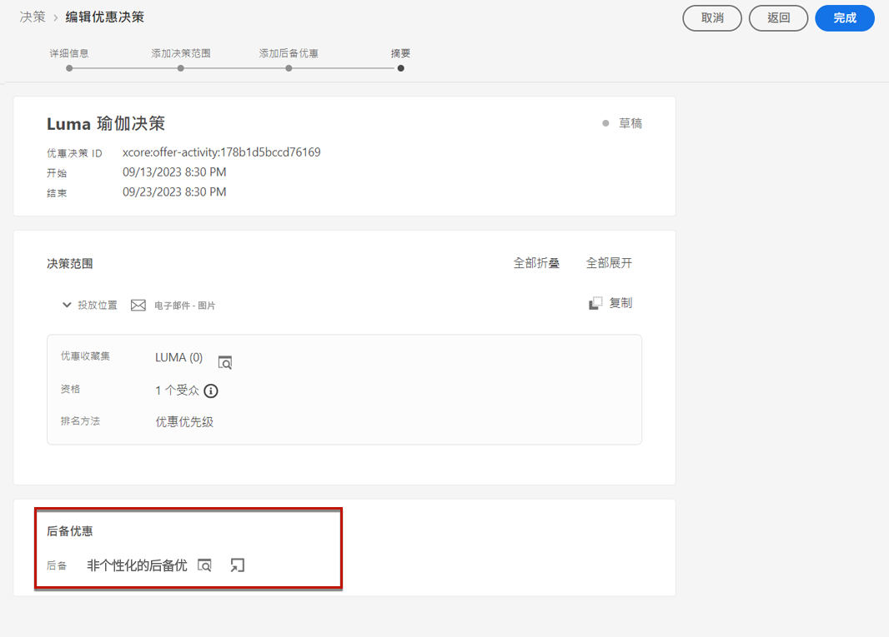
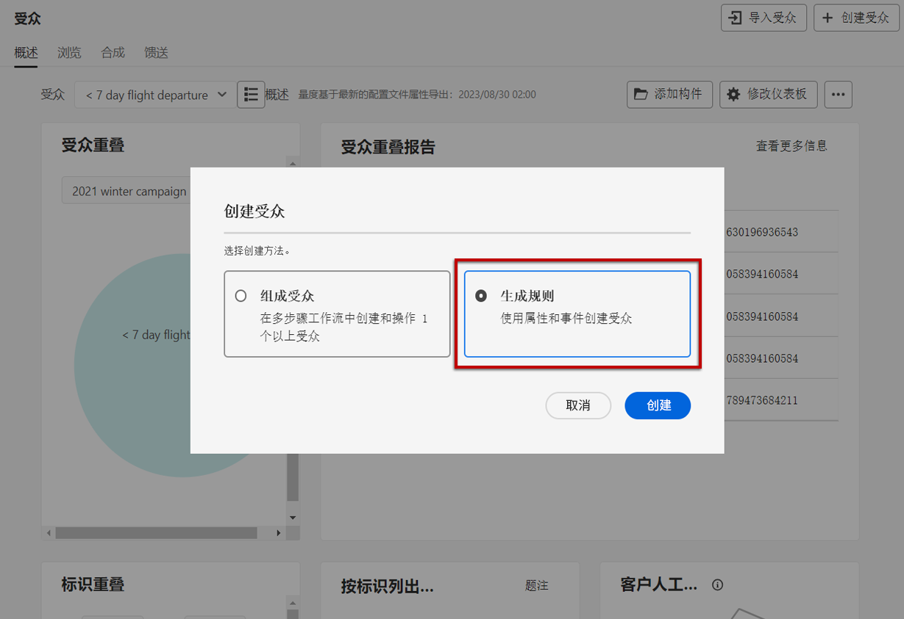
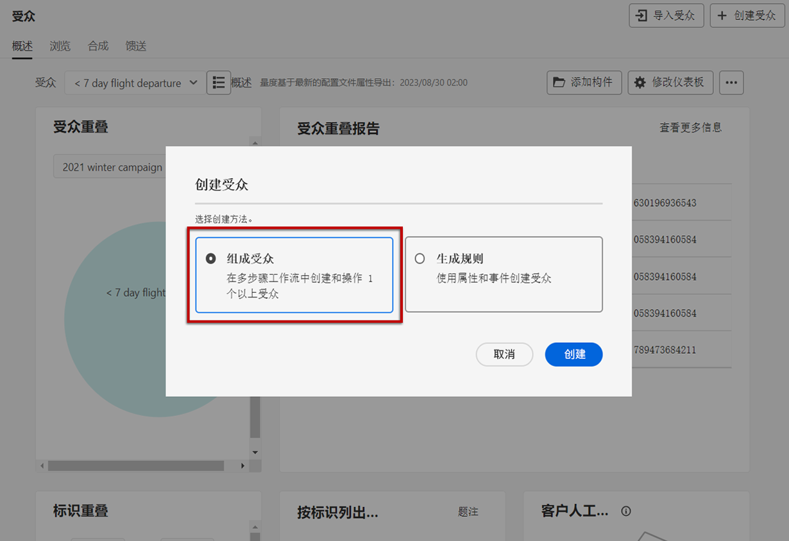
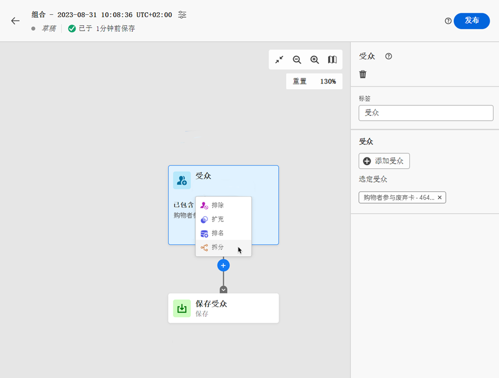
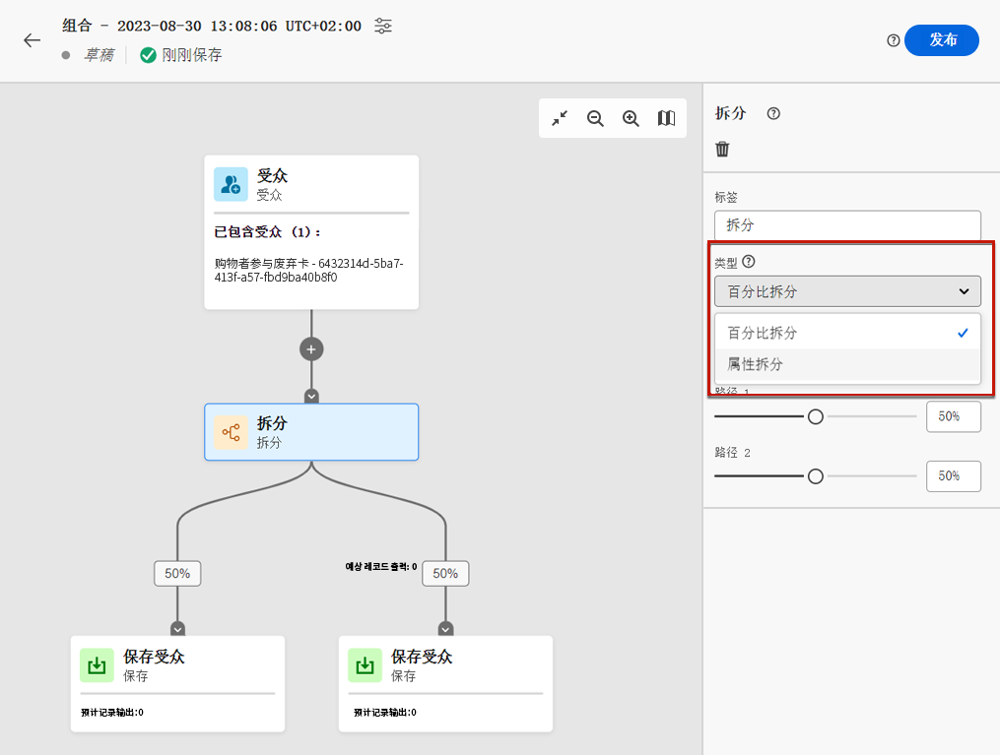
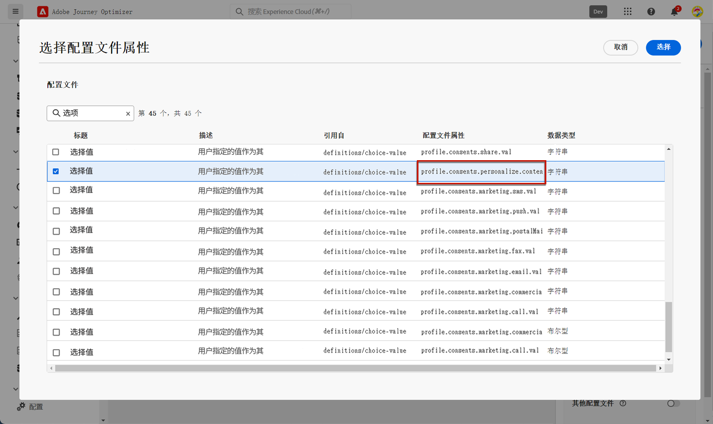
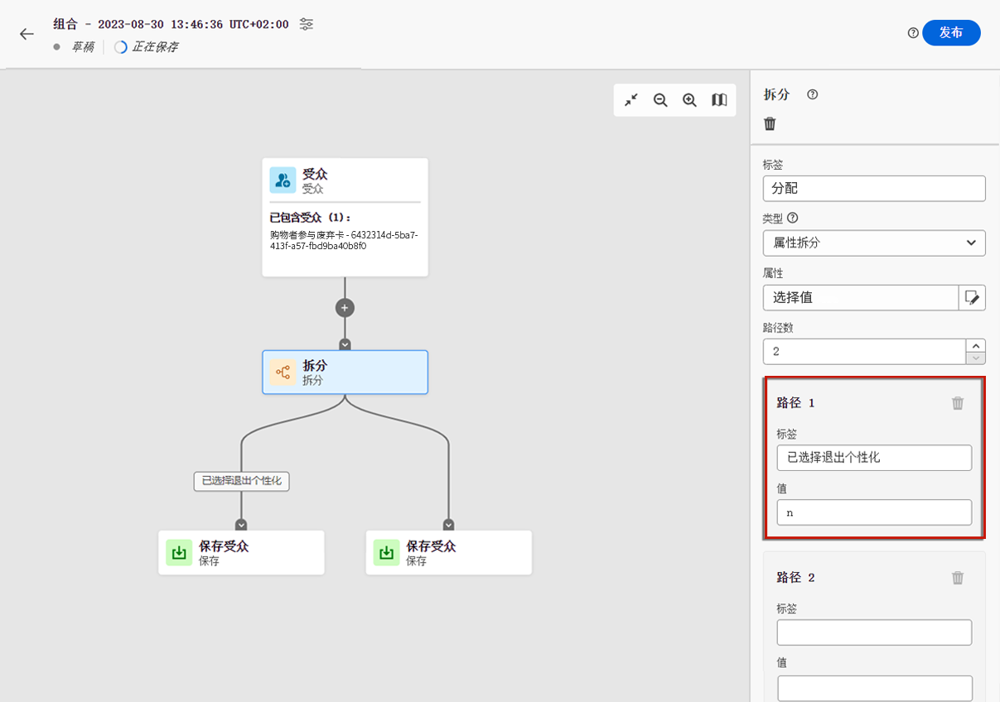

# 管理选择退出机制 {#consent}

向收件人提供取消订阅功能以用于停止从品牌接收通信并确保尊重用户的选择，这是法律要求。在 [Experience Platform 文档](https://experienceleague.adobe.com/docs/experience-platform/privacy/regulations/overview.html?lang=zh-Hans#regulations){target="_blank"}中进一步了解适用的法规。

**为什么这很重要？**

* 未能遵守这些法规会为您的品牌带来法律监管风险。
* 它有助于避免向收件人发送未经请求的通信，这种通信可能会使他们将您的消息标记为垃圾邮件并损害您的声誉。

## 管理历程和营销活动中的取消订阅 {#opt-out-ajo}

在从历程或活动发送消息时，必须始终确保客户可以取消订阅未来的通信。取消订阅后，用户档案将自动从未来营销消息的受众中删除。

虽然 **[!DNL Journey Optimizer]** 提供了在电子邮件和短信消息中管理选择退出的方法，但推送通知不需要您采取任何操作，因为收件人可以通过其设备自行取消订阅。例如，在下载或使用应用程序时，用户可以选择停止发送通知。同样，他们可以通过移动操作系统更改通知设置。

>[!NOTE]
>
>此外，您还可以利用 Journey Optimizer **禁止 REST API** 来使用禁止和允许列表控制传出消息。[了解如何使用禁止 REST API](https://experienceleague.adobe.com/docs/journey-optimizer/using/configuration/monitor-reputation/manage-suppression-list.html?lang=zh-Hans)

要了解如何在 Journey Optimizer 电子邮件和短信消息中管理选择退出，请参阅以下部分：

<table style="table-layout:fixed"><tr style="border: 0;">
<td>

<a href="../email/email-opt-out.md"><strong>电子邮件选择退出管理</strong>

</td>
<td>

<a href="../sms/sms-opt-out.md"><strong>短信选择退出管理</strong></a>

</td>
</tr></table>

>[!NOTE]
>
>在 [!DNL Journey Optimizer] 中，同意由 Experience Platform [同意模式](https://experienceleague.adobe.com/docs/experience-platform/xdm/field-groups/profile/consents.html?lang=zh-Hans){target="_blank"}. By default, the value for the consent field is empty and treated as consent to receive your communications. You can modify this default value while onboarding to one of the possible values listed [here](https://experienceleague.adobe.com/docs/experience-platform/xdm/data-types/consents.html?lang=zh-Hans#choice-values){target="_blank"}处理。

## 实施个性化同意 {#opt-out-personalization}

您的客户还可以选择不展示个性化内容。用户选择退出个性化后，您需要确保其数据不被用于个性化，并且必须使用后备版本替换任何个性化内容。

### 在决策管理中 {#opt-out-decision-management}

使用优惠时，个性化首选项不会自动实施[决策范围](../offers/offer-activities/create-offer-activities.md#add-decision-scopes)（在[决策](../offers/api-reference/offer-delivery-api/decisioning-api.md) API 请求或 [Edge 决策](../offers/api-reference/offer-delivery-api/edge-decisioning-api.md) API 请求中所使用的）。在这种情况下，您需要手动强制执行个性化同意。要实现此目的，请执行以下步骤。

>[!NOTE]
>
>[!DNL Journey Optimizer] 创建的渠道中使用的决策范围满足其所属历程或营销活动的这一要求。

1. 使用[分段服务](https://experienceleague.adobe.com/docs/experience-platform/segmentation/ui/overview.html?lang=zh-Hans){target="_blank"}创建 [Adobe Experience Platform 受众](../audience/access-audiences.md)，并使用用户档案属性，例如&#x200B;**[!UICONTROL 个性化内容=是（选择启用）]**，定位同意个性化的用户。

   

1. 创建[决策](../offers/offer-activities/create-offer-activities.md)时添加决策范围，并根据受众为包含个性化优惠的每个评估标准集合定义资格条件约束。

   

1. 创建不包括个性化内容的[后备优惠](../offers/offer-library/creating-fallback-offers.md)。

1. 将非个性化后备优惠[分配](../offers/offer-activities/create-offer-activities.md#add-fallback)到决策。

   

1. [查看并保存](../offers/offer-activities/create-offer-activities.md#review)决策。

如果用户：

* 同意进行个性化，决策范围将确定适用于该个人资料的最佳优惠。

* 不同意进行个性化，则相应的个人资料将不符合评估标准中任何优惠的条件，因此将收到非个性化的后备优惠。

>[!NOTE]
>
>针对在[数据建模](../offers/ranking/ai-models.md)中使用个人资料数据的同意功能在 [!DNL Journey Optimizer] 中尚不支持。

### 在表达式编辑器中 {#opt-out-expression-editor}

[表达式编辑器](../personalization/personalization-build-expressions.md)本身不会执行任何同意检查或进行强制执行，因为表达式编辑器不涉及消息投放操作。

但是，使用基于权限的访问控制标签可限制将哪些字段用于个性化。此[消息预览](../content-management/preview.md)和[电子邮件渲染服务](../content-management/rendering.md)将屏蔽用敏感信息标识的字段。

>[!NOTE]
>
>要了解有关对象级访问控制 (OLAC) 的更多信息，请访问[此部分](../administration/object-based-access.md)。

在 [!DNL Journey Optimizer] 营销活动中，同意政策的实施如下所示：

* 您可以在创建受众时包含同意策略定义，以确保为营销活动选择的受众已&#x200B;**筛选掉不符合同意条件的用户档案**。

* [!DNL Journey Optimizer] 将在渠道级别执行一般同意检查，以&#x200B;**确保用户档案已选择同意**&#x200B;接收特定渠道上的营销通信。

  >[!NOTE]
  >
  >此时，[!DNL Journey Optimizer] 营销活动对象本身不会执行任何额外的同意政策实施检查。

要在营销活动中手动强制执行个性化同意，请遵循以下方法之一。

### 使用区段规则生成器

您可以使用区段规则生成器创建包含选择退出用户档案的受众。

1. 使用[分段服务](https://experienceleague.adobe.com/docs/experience-platform/segmentation/ui/overview.html?lang=zh-Hans){target="_blank"}创建 [Adobe Experience Platform 受众](../audience/access-audiences.md)。

   

1. 选择用户档案属性，例如&#x200B;**[!UICONTROL 个性化内容 = 否（选择退出）]**，排除未同意个性化的用户。

   

1. 单击&#x200B;**[!UICONTROL 保存]**。

您现在可以使用此受众从营销活动中筛选出未同意个性化的用户档案。

### 在组合工作流中使用拆分活动

您还可以通过将拆分活动添加到组合工作流来向受众添加个性化同意检查。

1. 使用&#x200B;**[!UICONTROL 组合受众]**&#x200B;选项创建受众。[了解有关创建组合工作流的更多信息](../audience/create-compositions.md)

   

1. 使用右侧的专用按钮添加初始受众。

1. 单击 **+** 图标并选择&#x200B;**[!UICONTROL 拆分]**&#x200B;活动，创建拆分受众。[了解有关拆分活动的更多信息](../audience/composition-canvas.md#split)

   

1. 在右窗格中，选择&#x200B;**[!UICONTROL 属性拆分]**&#x200B;作为拆分类型。

   

1. 单击&#x200B;**[!UICONTROL 属性]**&#x200B;字段旁边的铅笔图标，调出&#x200B;**[!UICONTROL 选择用户档案属性]**&#x200B;窗口。

1. 搜索个性化同意属性 (`profile.consents.personalize.content.val`)，然后将其选中。

   

1. **[!UICONTROL 路径 1]** 是非个性化受众。选择相关标签。

1. 从此[列表](https://experienceleague.adobe.com/docs/experience-platform/xdm/data-types/consents.html?lang=zh-Hans#choice-values){target="_blank"}中选择适当的值。

   在这种情况下，我们将使用 `n` 表示用户不同意将其数据用于个性化。

   

1. 您可以为其他选项值创建单独的路径。您还可以选择删除其余路径并打开&#x200B;**[!UICONTROL 其他用户档案]**，以包括没有`n`选项值的所有其他用户档案。

1. 完成后，在每个路径中单击&#x200B;**[!UICONTROL 保存受众]**，将工作流结果保存到新受众中。对于每条路径，都会将一个受众保存到 Adobe Experience Platform 中。

1. 完成后，发布组合工作流。

您现在可以使用此受众从营销活动中筛选出未同意个性化的用户档案。

>[!NOTE]
>
>如果创建的受众未同意进行个性化，但您在营销活动中选择了此受众，则个性化工具将仍然可用。营销用户需要了解一点，即如果其处理的受众不应接收个性化内容，则不应使用个性化工具。
