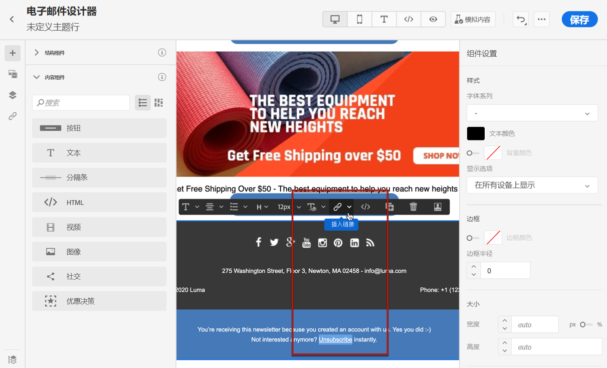
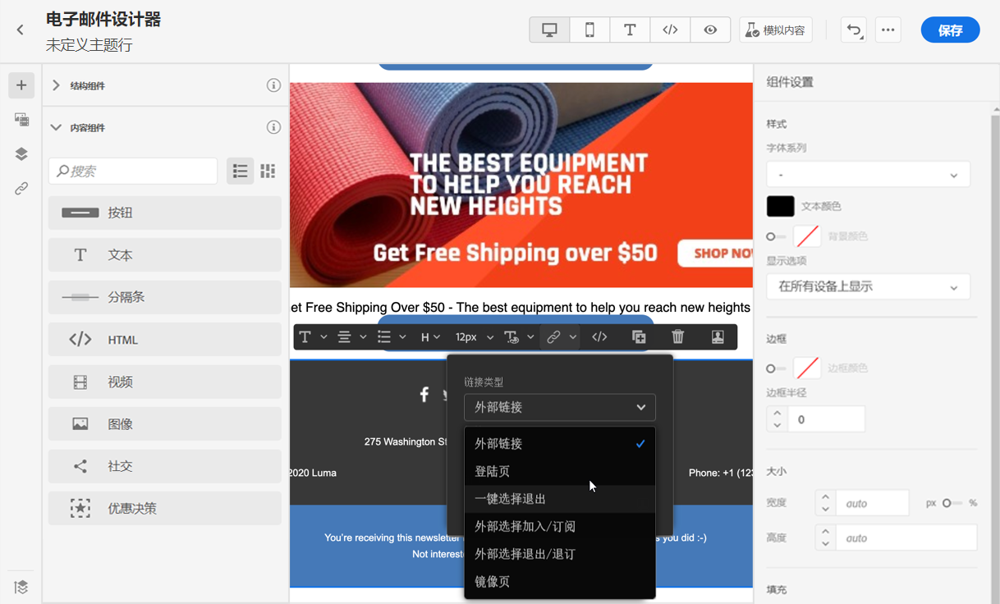
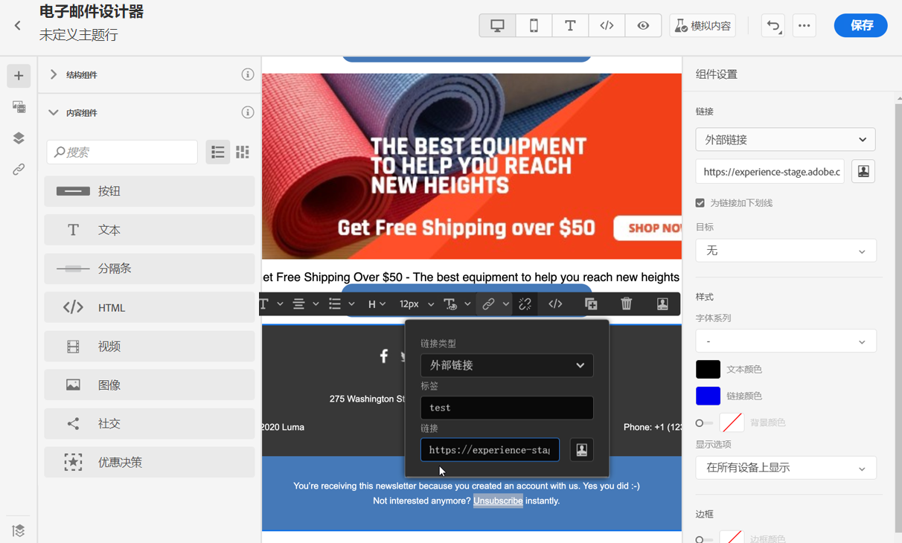
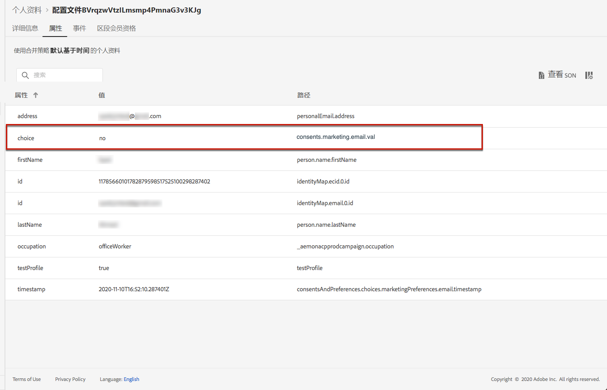
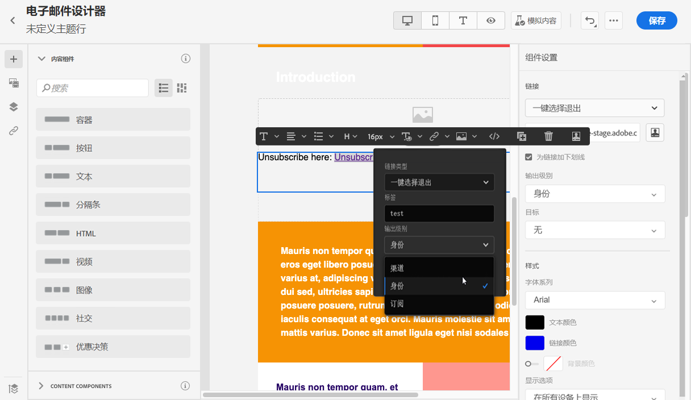
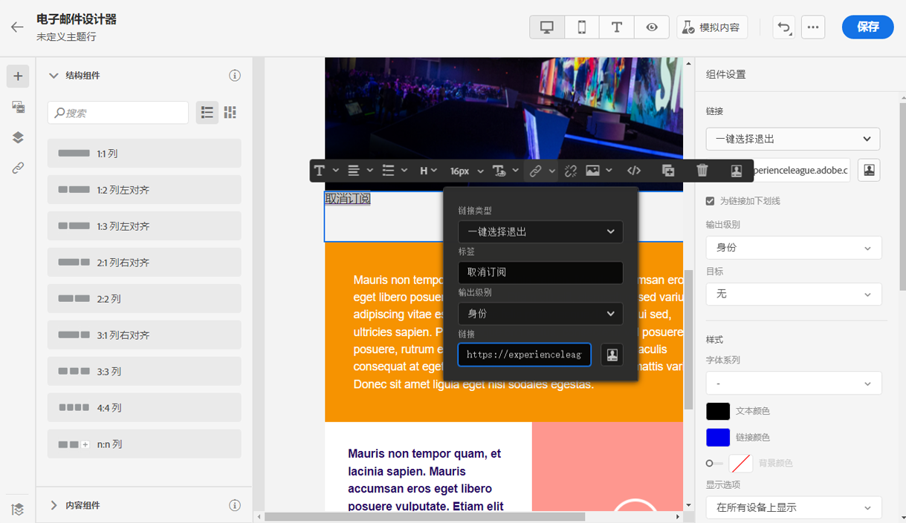
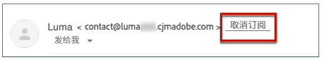

# 管理选择退出机制 {#consent}

使用 [!DNL Journey Optimizer] 跟踪收件人对通信的许可，并通过管理其偏好和订阅了解他们希望如何与您的品牌互动。

GDPR 等法规规定，您必须遵守特定要求才能使用数据主体的信息。此外，数据主体应当能够随时修改其许可。

**为什么这很重要？**

* 未能遵守这些法规会为您的品牌带来法律监管风险。
* 它有助于避免向收件人发送未经请求的通信，这种通信可能会使他们将您的消息标记为垃圾邮件并损害您的声誉。

在 [Experience Platform 文档](https://experienceleague.adobe.com/docs/experience-platform/privacy/home.html?lang=zh-Hans){target=&quot;_blank&quot;}中进一步了解管理隐私和适用的法规。

>[!NOTE]
>
>在 [!DNL Journey Optimizer] 中，同意由 Experience Platform [同意模式](https://experienceleague.adobe.com/docs/experience-platform/xdm/field-groups/profile/consents.html?lang=zh-Hans){target=&quot;_blank&quot;}处理。默认情况下，同意字段的值为空，并视为同意接收您的通信。载入时，您可将此默认值修改为[此处](https://experienceleague.adobe.com/docs/experience-platform/xdm/data-types/consents.html?lang=zh-Hans#choice-values){target=&quot;_blank&quot;}列出的可能值之一。

## 电子邮件选择退出管理 {#opt-out-management}

向收件人提供取消订阅以停止从品牌接收通信的功能是一项法律要求。在 [Experience Platform 文档](https://experienceleague.adobe.com/docs/experience-platform/privacy/regulations/overview.html?lang=zh-Hans#regulations){target=&quot;_blank&quot;}中进一步了解适用的法规。

因此，您必须在发送给收件人的每封电子邮件中都加入&#x200B;**取消订阅链接**：

* 单击此链接后，收件人将被定向到一个确认选择退出的登陆页面。
* 确认选择后，用户档案的数据将包含此更新信息。

>[!NOTE]
>
>营销类型电子邮件必须包含选择退出链接，这对于事务型邮件不是必需的。消息类别（**[!UICONTROL 营销型]**&#x200B;或&#x200B;**[!UICONTROL 事务型]**）在[渠道界面](../configuration/channel-surfaces.md#email-type)（即消息预设）级别和[创建消息](../messages/get-started-content.md#create-new-message)时定义。

### 外部选择退出 {#opt-out-external-lp}

为此，您可以在电子邮件中插入指向外部登陆页面的链接，以使用户能取消订阅以停止接收您品牌的通信。

#### 添加取消订阅链接 {#add-unsubscribe-link}

您首先需要在消息中添加取消订阅链接。为此，请执行以下步骤：

1. 构建自己的退订登陆页面。

1. 在您选择的第三方系统上托管它。

1. 在历程中[创建消息](../messages/get-started-content.md)。

1. 在内容中选择文本，然后使用上下文工具栏[插入链接](../design/message-tracking.md#insert-links)。

   

1. 从&#x200B;**[!UICONTROL 链接类型]**&#x200B;下拉列表中选择&#x200B;**[!UICONTROL 外部选择退出/退订]**。

   

1. 在&#x200B;**[!UICONTROL 链接]**&#x200B;字段中，将链接粘贴到您的第三方登陆页面。

   

1. 单击&#x200B;**[!UICONTROL 保存]**。

#### 为选择退出实施 API 调用 {#opt-out-api}

要在收件人从登陆页面提交选择时为其完成选择退出，您必须通过 [Adobe Developer](https://developer.adobe.com){target=&quot;_blank&quot;} 实施&#x200B;**订阅 API 调用**&#x200B;以更新相应用户档案的偏好设置。

此 POST 调用如下：

端点：platform.adobe.io/journey/imp/consent/preferences

查询参数：

* **params**：包含加密后的有效负载
* **sig**：签名
* **pid**：加密后的用户档案 ID

以上三个参数将包含在发送给您的收件人的第三方登陆页面 URL 中：


标头要求：

* x-api-key
* x-gw-ims-org-id
* x-sandbox-name
* 授权（技术帐户中的用户令牌）

请求正文：

```
{
   "marketing": [
       {
            "type": "email",           
            "choice": "no",          
            "scope": "channel"       
        }
    ],
 
}
```

[!DNL Journey Optimizer] 将使用这些参数通过 [Adobe Developer](https://developer.adobe.com){target=&quot;_blank&quot;} API 调用更新相应用户档案的选择。

#### 使用取消订阅链接发送消息 {#send-message-unsubscribe-link}

配置指向登陆页面的取消订阅链接并实施 API 调用后，即可发送消息。

1. 通过[历程](../building-journeys/journey.md)发送包含链接的消息。

1. 收到消息后，如果收件人单击取消订阅链接，则会显示您的登陆页面。

   

1. 如果收件人提交了表单（在此处，通过点击登陆页面中的 **Unsubscribe** 按钮），将通过 [API 调用](#opt-out-api)更新用户档案数据。

1. 然后，选择退出的收件人将被重定向至确认消息屏幕，提示收件人选择退出已成功完成。

   

   因此，除非再次订阅，否则这个用户将不会收到来自您的品牌的通信。

1. 要检查相应用户档案的选择是否已更新，请转到 Experience Platform，并通过选择身份命名空间和相应的身份值访问该用户档案。在 [Experience Platform 文档](https://experienceleague.adobe.com/docs/experience-platform/profile/ui/user-guide.html?lang=zh-Hans#getting-started){target=&quot;_blank&quot;}中了解更多信息。

   

   在&#x200B;**[!UICONTROL 属性]**&#x200B;选项卡中，您可以看到&#x200B;**[!UICONTROL 选择]**&#x200B;的值已更改为&#x200B;**[!UICONTROL 否]**。

### 一键式选择退出 {#one-click-opt-out}

鉴于许多客户希望取消订阅流程更加简单，您还可以在电子邮件内容中添加一键式选择退出链接。该链接可让您的收件人快速取消订阅您的通信，而无需重定向到需要确认其选择的登陆页面，从而简化取消订阅流程。

要在电子邮件中添加选择退出链接，请执行以下步骤。

1. [插入链接](../design/message-tracking.md#insert-links)并选择&#x200B;**[!UICONTROL 一键式选择退出]**&#x200B;作为链接类型。

   

1. 选择您要应用选择退出的层级：渠道、身份或订阅。

   

   * **[!UICONTROL 渠道]**：选择退出适用于将来发送到当前渠道的用户档案目标（即电子邮件地址）的消息。如果多个目标与一个用户档案关联，则选择退出适用于该渠道的用户档案中的所有目标（即电子邮件地址）。
   * **[!UICONTROL 标识]**：选择退出适用于在将来发送给当前消息所使用的特定目标（即电子邮件地址）的消息。
   * **[!UICONTROL 订阅]**：选择退出适用于与特定订阅列表关联的将来发送的消息。仅在当前消息与订阅列表关联时，才能选择此选项。

1. 输入用户取消订阅后将被重定向到的登陆页面的 URL。此页面仅用于确认选择退出是否成功。

   >[!NOTE]
   >
   >如果在渠道平面级别启用了 **List-Unsubscribe** 选项，则当用户单击电子邮件标头中的取消订阅链接时，也会使用此 URL。[了解详情](#unsubscribe-header)

   

   您可以个性化自己的链接。在[本节](../personalization/personalization-syntax.md)中了解更多关于个性化 URL 的信息。

1. 保存更改。

通过[历程](../building-journeys/journey.md)发送消息后，如果收件人点击了选择退出链接，会立即选择退出他们的用户档案。

### 电子邮件标头中的取消订阅链接 {#unsubscribe-header}

>[!CONTEXTUALHELP]
>id="ajo_admin_preset_unsubscribe"
>title="向电子邮件标头添加取消订阅链接"
>abstract="启用“List-Unsubscribe”以向电子邮件标头添加取消订阅链接。要设置取消订阅 URL，请在电子邮件内容中插入一个一键式选择退出链接。"
>additional-url="https://experienceleague.adobe.com/docs/journey-optimizer/using/privacy/consent/opt-out.html?lang=zh-Hans#one-click-opt-out" text="一键式选择退出"

如果在渠道平面级别启用 [List-Unsubscribe](../configuration/channel-surfaces.md#list-unsubscribe) 选项，使用 [!DNL Journey Optimizer] 发送的相应电子邮件将在电子邮件标头中包含取消订阅链接。

例如，取消订阅链接在 Gmail 中将会如下图这样显示：



>[!NOTE]
>
>要在电子邮件标头中显示取消订阅链接，收件人的电子邮件客户端必须支持此功能。

取消订阅地址是相应渠道界面中显示的默认 **[!UICONTROL Mailto（取消订阅）]**&#x200B;地址。[了解详情](../configuration/channel-surfaces.md#list-unsubscribe)。

要设置个性化的取消订阅 URL，请在电子邮件内容中插入一键式选择退出链接，然后输入您选择的 URL。[了解详情](#one-click-opt-out)

根据电子邮件客户端的不同，单击标头中的取消订阅链接可能会产生以下影响：

* 取消订阅请求被发送到默认的取消订阅地址。

* 收件人被定向到您在向消息添加选择退出链接时指定的登陆页面 URL。

   >[!NOTE]
   >
   >如果您没有在消息内容中添加一键式选择退出链接，则不会显示登陆页面。

* 相应的用户档案会立即退出订阅，并且此选择将在 Experience Platform 中更新。在 [Experience Platform 文档](https://experienceleague.adobe.com/docs/experience-platform/profile/ui/user-guide.html?lang=zh-Hans#getting-started){target=&quot;_blank&quot;}中了解更多信息。

## 推送退出管理 {#push-opt-out-management}

推送收件人可以通过其设备取消订阅。

例如，在下载或使用应用程序时，用户可以选择停止发送通知。同样，他们可以通过移动操作系统更改通知设置。

## 短信选择禁用管理 {#sms-opt-out-management}

根据行业标准和法规，所有短信营销消息都必须包含一种让接收者能够轻松取消订阅的方式。取消订阅后，用户档案将自动从未来营销消息的受众中删除。

默认情况下，Adobe Journey Optimizer 会根据 Sinch 和 Twilio 等原生集成的行业标准，处理免费和长代码消息的标准英语回复消息，如 STOP、UNSTOP 和 START。这些关键字通常会触发来自第三方提供商的自动标准回复（例如 Twilio、Sinch 等）。您可以直接与提供商或通过其文档网站确认此信息。

无需执行任何步骤，即可确保短信选择退出功能在 Adobe Journey Optimizer 中正常工作，因为关键词响应 STOP、UNSTOP 和 START 将被自动识别。

除了 Adobe Journey Optimizer 根据选择退出状态停止发送（用于与 Twilio 或 Sinch 的直接集成）之外，大多数短信网关提供商还设有一个阻止列表，确保您的短信消息不会被发送给选择退出的个人。如果您使用的是 Sinch 或 Twilio 以外的提供商，并通过 [自定义渠道](../building-journeys/using-custom-actions.md)发送短信，则需要就此与提供商确认。

>[!IMPORTANT]
>
>根据短信活动的性质、发送短信的位置以及收件人的位置，短信活动可能会受到各种法律合规性要求的约束。<br>虽然 Adobe Journey Optimizer 将处理使用上述长代码和免费电话号码的消息，但您应咨询您的法律顾问，以确保您的短信活动符合所有适用的法律合规要求。

### 短代码 {#short-codes}

默认情况下，Adobe Journey Optimizer 将不处理短代码号的选择退出、选择加入或帮助关键词。

您必须确保您的短代码符合所有选择退出处理方面的行业规则和法规。

### 字母数字发件人 ID {#alphanumeric}

字母数字发件人 ID 仅用于单向消息传递，且无法接收入站消息。因此，Adobe Journey Optimizer 的短信 STOP、START、HELP 关键字不适用于字母发件人 ID。您必须提供其他说明，例如写信给支持团队、拨打支持电话或发短信给其他电话号码或代码，以允许用户选择退出接收通过字母数字发件人 ID 发送的消息。

#### 视频 {#video-sms}

要详细了解原生入站关键词支持（START、STOP 和 UNSTOP）如何用于短信，请参阅以下视频：

>[!VIDEO](https://video.tv.adobe.com/v/344026?quality=12)
