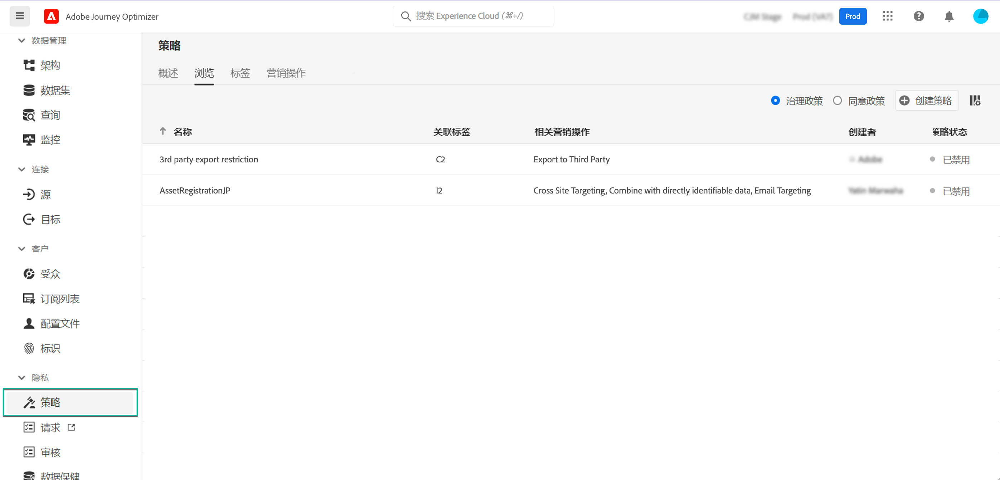

# 数据使用策略 {#Policies}

使用 Adobe Experience Platform **数据管理服务**，可通过使用标签、营销操作和策略来实施数据使用限制。

为此，可使用数据管理服务将数据使用情况标签应用于数据集和字段，并根据相关的数据使用策略对每个数据集和字段进行分类。

数据使用策略是描述您可以或限制在 Experience Platform 内对数据执行的营销操作类型的规则。可从&#x200B;**[!UICONTROL 策略]**&#x200B;菜单访问它们。

有关数据管理框架以及如何使用标签和策略的更多信息，请参阅 Adobe Experience Platform 文档：

* [数据管理服务概述](https://experienceleague.adobe.com/docs/experience-platform/data-governance/home.html?lang=zh-Hans)
* [数据使用标签概述](https://experienceleague.adobe.com/docs/experience-platform/data-governance/labels/overview.html?lang=zh-Hans)
* [数据使用策略](https://experienceleague.adobe.com/docs/experience-platform/data-governance/policies/overview.html?lang=zh-Hans)
