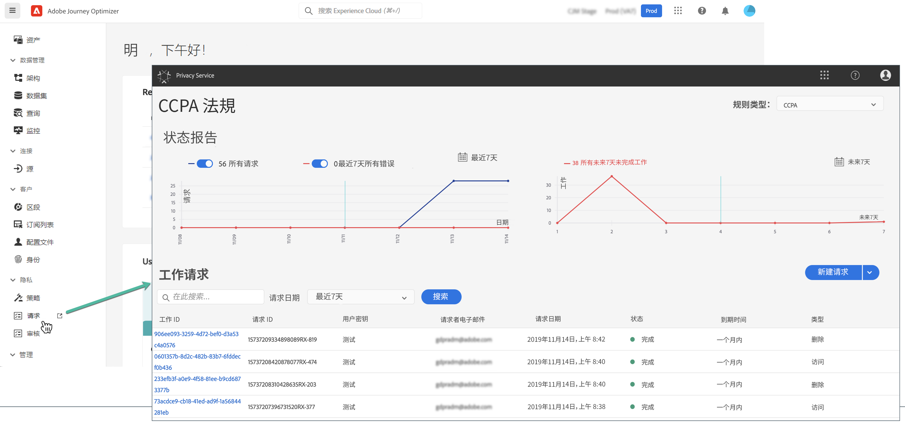

# 隐私请求 {#track-changes}

Adobe Experience Platform **Privacy Service** 提供 RESTful API 和用户界面，帮助您管理客户数据请求。借助 Privacy Service，您可以提交从 Adobe Experience Cloud 应用程序访问和删除个人客户数据的请求，从而促进自动遵守法律和组织隐私法规。

可从 **[!UICONTROL Requests]** 菜单创建和管理隐私请求。

有关 Privacy Service 以及如何创建和管理隐私请求的更多信息，请参阅 Adobe Experience Platform 文档：

* [Privacy Service 概述](https://experienceleague.adobe.com/docs/experience-platform/privacy/home.html?lang=zh-Hans)
* [在 Privacy Service UI 中管理隐私作业](https://experienceleague.adobe.com/docs/experience-platform/privacy/ui/user-guide.html?lang=zh-Hans)
