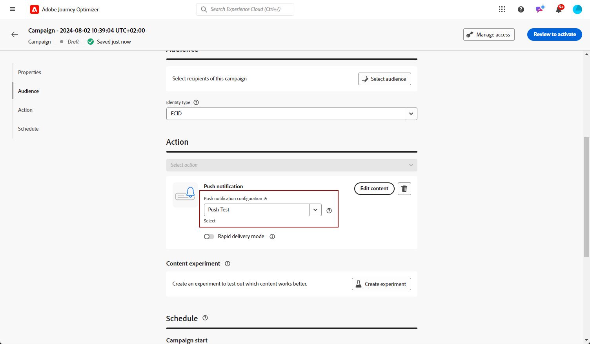

# 创建推送通知 {#create-push-notification}

>[!CONTEXTUALHELP]
>id="ajo_message_push"
>title="推送消息创建"
>abstract="添加您的推送消息，并使用个性化编辑器开始对其进行个性化设置。"

## 在历程或营销策划中创建推送通知 {#create}

要创建推送通知，请执行以下步骤：

>[!BEGINTABS]

>[!TAB 向历程添加推送]

1. 打开历程，然后从面板的“操作”部分中拖放推送活动。

   

1. 提供有关消息的基本信息（标签、描述、类别），然后选择要使用的消息界面。 此 **[!UICONTROL 表面]** 默认情况下，字段会使用用户用于该渠道的最后一个表面进行预填充。

   

   >[!NOTE]
   >
   >如果您从历程发送推送通知，则可以利用Adobe Journey Optimizer的发送时间优化功能，根据历史打开率和点击率预测发送消息的最佳时间，从而最大限度地提高参与度。 [了解如何使用发送时间优化](../building-journeys/journeys-message.md#send-time-optimization)

   有关如何配置旅程的更多信息，请参阅 [此页面](../building-journeys/journey-gs.md)

1. 在历程配置屏幕中，单击 **[!UICONTROL 编辑内容]** 按钮以配置推送内容。 [设计推送通知](design-push.md)

1. 定义消息内容后，您可以使用测试用户档案预览其内容。

1. 推送就绪后，完成配置 [历程](../building-journeys/journey-gs.md) 发送它。

   要通过推送打开和/或交互跟踪收件人的行为，请确保在中启用跟踪部分中的专用选项。 [电子邮件活动](../building-journeys/journeys-message.md).

>[!TAB 向营销活动添加推送]

1. 创建新的计划或API触发的营销活动，请选择 **[!UICONTROL 推送通知]** 作为您的操作，然后选择 **[!UICONTROL 应用程序表面]** 以使用。 [了解有关推送配置的更多信息](push-configuration.md).

   

1. 单击&#x200B;**[!UICONTROL 创建]**。

1. 从 **[!UICONTROL 属性]** 部分，编辑您的营销活动的 **[!UICONTROL 标题]** 和 **[!UICONTROL 描述]**.

   

1. 单击 **[!UICONTROL 选择受众]** 按钮，从可用的Adobe Experience Platform受众列表中定义要定位的受众。 [了解详情](../audience/about-audiences.md)。

1. 在 **[!UICONTROL 身份命名空间]** 字段中，选择要使用的命名空间，以便识别所选受众中的个人。 [了解详情](../event/about-creating.md#select-the-namespace)。

   

1. 单击 **[!UICONTROL 创建试验]** 开始配置内容实验并创建处理方式以测量其性能并为目标受众确定最佳选项。 [了解详情](../content-management/content-experiment.md)

1. 营销活动旨在按特定日期或循环频率执行。 了解如何配置 **[!UICONTROL 计划]** 中的促销活动 [本节](../campaigns/create-campaign.md#schedule).

1. 从 **[!UICONTROL 操作触发器]** 菜单，选择 **[!UICONTROL 频率]** 推送通知的：

   * 一次
   * 每日
   * 每周
   * 每月

1. 在Campaign配置屏幕中，单击 **[!UICONTROL 编辑内容]** 按钮以配置推送内容。 [设计推送通知](design-push.md)

1. 定义消息内容后，您可以使用测试用户档案预览其内容。

1. 推送就绪后，完成配置 [营销活动](../campaigns/create-campaign.md) 发送它。

   要通过推送打开和/或交互跟踪收件人的行为，请确保在中启用跟踪部分中的专用选项。 [营销活动](../campaigns/create-campaign.md).

>[!ENDTABS]

**相关主题**

* [配置推送渠道](push-gs.md)
* [在历程中添加消息](../building-journeys/journeys-message.md)

## 快速传递模式 {#rapid-delivery}

>[!CONTEXTUALHELP]
>id="ajo_campaigns_rapid_delivery"
>title="快速传递模式"
>abstract="快速传递模式让您可以在推送渠道上，在不超过 3000 万的受众规模下执行高速消息发送。"

快速传递模式是 [!DNL Journey Optimizer] 允许通过营销活动以非常快的速度发送大量推送消息的加载项。

当消息投放延迟对业务至关重要，并且您想要在手机上发送紧急推送警报（例如，向已安装您的新闻频道应用程序的用户发送突发新闻）时，可使用快速投放。

有关使用快速传递模式时性能的详细信息，请参阅 [Adobe Journey Optimizer产品描述](https://helpx.adobe.com/cn/legal/product-descriptions/adobe-journey-optimizer.html).

### 先决条件 {#prerequisites}

快速传递消息传送具有以下要求：

* 快速投放可用于 **[!UICONTROL 已计划]** 仅限于营销活动，对于API触发的营销活动不可用，
* 推送消息中不允许个性化，
* 目标受众必须包含少于3000万个配置文件，
* 您最多可以使用快速投放模式同时执行5个营销活动。

### 激活快速传递模式

1. 创建推送通知营销活动并打开 **[!UICONTROL 快速投放]** 选项。

1. 配置消息内容并选择要定向的受众。 [了解如何创建营销活动](#create)

   >[!IMPORTANT]
   >
   >确保消息内容不包含任何个性化，并且受众包含的用户档案少于3000万。

1. 与往常一样，查看和激活您的营销活动。 请注意，在测试模式下，消息不会通过快速传递模式发送。