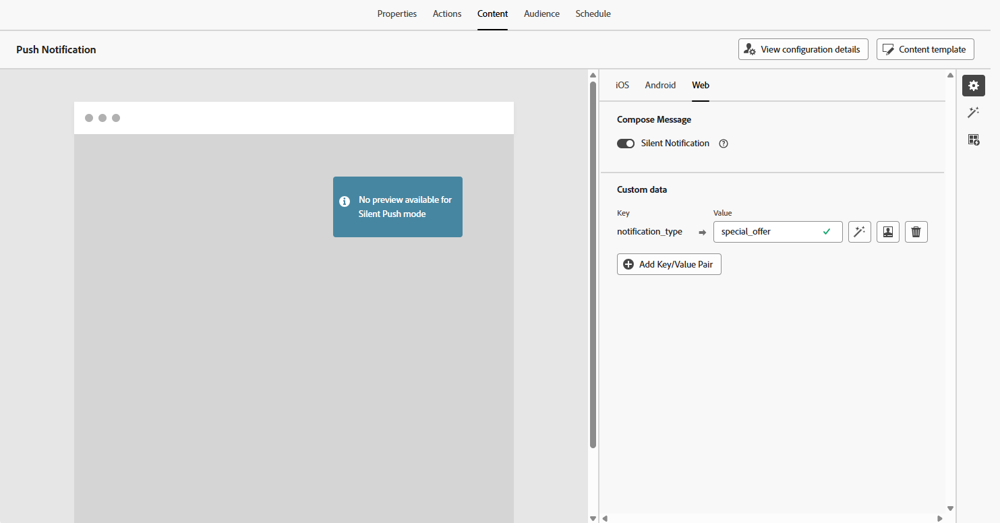

# 设计Web推送通知 {#design-push-notification}

>[!AVAILABILITY]
>
>目前，Journey Optimizer中的Web推送通知不支持&#x200B;**静默通知**&#x200B;功能，但以后将可用。

创建Web推送通知营销活动或历程后，您可以继续根据自己的要求设计其内容和结构。 请注意，在发送任何Web推送通知之前，必须首先在[渠道配置](push-configuration-web.md)中配置此渠道。

<!--
## Send a silent notification {#silent-notification}

A silent push notification (also called a background notification) is a hidden message sent to your web application without alerting the user.

To enable a silent notification, enable the **[!UICONTROL Silent Notification]** option. When this option is used, the notification is delivered directly to the application, and no alert, banner, or sound is shown to the user.

Use the **Custom Data** section to include additional information in the form of key-value pairs. 

-->

## 标题和正文 {#push-title-body}

若要撰写邮件，请单击&#x200B;**[!UICONTROL 标题]**&#x200B;和&#x200B;**[!UICONTROL 正文]**&#x200B;字段。 使用个性化编辑器定义内容，[个性化数据](../personalization/personalize.md)并添加[动态内容](../personalization/get-started-dynamic-content.md)。

单击&#x200B;**[!UICONTROL 使用AI助手编辑文本]**&#x200B;以使用Journey Optimizer AI助手轻松生成内容。

## 单击行为 {#on-click-behavior}

使用&#x200B;**[!UICONTROL 正文点击行为]**&#x200B;字段定义深层链接，以确定用户点击通知正文时发生的情况。 这样，您可以将用户直接发送到Web应用程序的特定页面或部分。

## 添加媒体 {#add-media-push}

在&#x200B;**[!UICONTROL 添加媒体]**&#x200B;字段中输入媒体URL。 您还可以在URL中包含个性化令牌，以自定义每个用户的内容。

单击以使用Journey Optimizer AI助手快速生成媒体。

## 添加按钮 {#add-buttons-push}

通过向内容添加按钮使Web推送通知具有交互性。

请注意，仅在解锁设备时按钮才可见。 如果屏幕已锁定，则仅会显示&#x200B;**[!UICONTROL 标题]**&#x200B;和&#x200B;**[!UICONTROL 消息]**。

使用&#x200B;**[!UICONTROL 添加按钮]**&#x200B;选项定义每个按钮的标签和相关操作，如下所述：

* **[!UICONTROL 深层链接]**：将用户重定向到您应用程序内的特定视图、区域或选项卡。 在关联字段中输入深层链接URL。

* **[!UICONTROL Web URL]**：将用户重定向到外部网页。 在相关字段中输入URL。

## 自定义数据 {#custom-data}

在&#x200B;**[!UICONTROL 自定义数据]**&#x200B;部分中，您可以向通知有效负载中添加自定义键值对。 Web应用程序可以使用这些值来触发特定操作或自定义用户体验。 有关如何在Adobe Experience Platform中设置推送通知的更多信息，请参阅[此部分](push-gs.md)

