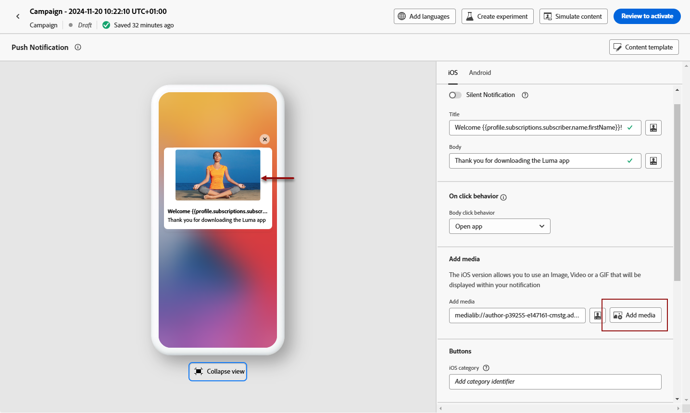

# 设计推送通知 {#design-push-notification}

创建推送通知后，即可针对iOS、Android和Web平台设计其内容。 此页面将指导您撰写消息、配置单击行为、添加媒体和按钮，并设置高级选项以创建可与受众引起共鸣的引人入胜的推送通知。

## 标题和正文 {#push-title-body}

>[!CONTEXTUALHELP]
>id="ajo-message-push-compose"
>title="个性化推送通知。"
>abstract="要撰写消息，请在&#x200B;**标题**&#x200B;和&#x200B;**正文**&#x200B;字段中输入内容。要包含个性化令牌，请打开个性化对话框。"

若要撰写邮件，请单击&#x200B;**[!UICONTROL 标题]**&#x200B;和&#x200B;**[!UICONTROL 正文]**&#x200B;字段。 使用个性化编辑器定义内容、个性化数据和添加动态内容。 在个性化编辑器中了解有关[个性化](../personalization/personalize.md)和[动态内容](../personalization/get-started-dynamic-content.md)的更多信息。

使用设备预览部分可可视化推送通知在iOS、Android和Web上的显示方式。

使用AI助手加快内容创建，并使用[AI助手生成引人注目的推送通知文本以用于文本生成](../content-management/generative-text.md)，或使用[AI助手创建完整的推送通知以用于完整内容生成](../content-management/generative-full-content.md)。

## 单击行为 {#on-click-behavior}

>[!CONTEXTUALHELP]
>id="ajo-message-push-onclick"
>title="关于单击行为"
>abstract="选择收件人单击推送通知正文时的行为。"

配置当收件人点按推送通知正文时发生的操作。 从以下选项中进行选择：

* **[!UICONTROL 打开应用程序]**：启动与通知关联的应用程序。 已在[渠道配置](../configuration/channel-surfaces.md)中指定该应用（即消息预设）。
* **[!UICONTROL 深层链接]**：将用户定向到您应用程序内的特定内容，如特定视图、页面分区或选项卡。 在提供的字段中输入深层链接URL。
* **[!UICONTROL Web URL]**：将用户定向到外部网页。 在提供的字段中输入目标URL。

## 添加媒体 {#add-media-push}

>[!CONTEXTUALHELP]
>id="ajo-message-push-media"
>title="将媒体添加到推送通知"
>abstract="可添加在通知中显示的图像、视频或 GIF。"

通过添加可视媒体增强推送通知。 可用的介质类型和实施方法因操作系统而异，具体如下面的标签中所述。

>[!BEGINTABS]

>[!TAB Android]

对于Android，您只能添加图像图标，以及扩展通知的图像。

您可以使用以下任一方法添加介质：

* **[!UICONTROL 添加媒体]**&#x200B;按钮：从[Adobe Experience Manager Assets](../integrations/assets.md)中选择资源或访问AI助手以生成用于推送通知的[参与图像](../content-management/generative-image.md)。

* **[!UICONTROL 添加媒体]**&#x200B;字段：直接输入媒体URL。 您可以在URL中包含个性化令牌。

添加后，介质会显示在通知正文的右侧。

>[!NOTE]
>
>在推送通知有效负荷中包括媒体附件时(例如自定义数据字段（如`adb_media`）中的图像)，移动设备应用程序必须实施特定的客户端处理才能在设备上呈现图像。 您的应用程序必须实施[自动显示和跟踪工作流](https://developer.adobe.com/client-sdks/edge/adobe-journey-optimizer/push-notification/android/automatic-display-and-tracking/){target="_blank"}，以处理有效负载中的图像附件。

>[!TAB iOS]

对于iOS，您可以添加要在通知中显示的图像、视频或GIF。

您可以使用以下任一方法添加介质：

* **[!UICONTROL 添加媒体]**&#x200B;按钮：从&#x200B;**[!DNL Adobe Experience Manager Assets]**&#x200B;中选择资源。 在&#x200B;**[!DNL Adobe Experience Manager Assets]**&#x200B;此页面[中了解有关使用](../integrations/assets.md)的更多信息。

* **[!UICONTROL 添加媒体]**&#x200B;字段：直接输入媒体URL。 您可以在URL中包含个性化令牌。

添加后，介质会显示在通知正文的右侧。

>[!NOTE]
>
>在推送通知有效负荷中包括媒体附件时(例如自定义数据字段（如`adb_media`）中的图像)，移动设备应用程序必须实施特定的客户端处理才能在设备上呈现图像。 您的应用程序必须实施[通知服务扩展](https://developer.apple.com/documentation/usernotifications/modifying_content_in_newly_delivered_notifications){target="_blank"}，才能从有效负载下载和处理媒体内容。 此外，必须在&#x200B;**[!UICONTROL 高级选项]**&#x200B;部分中启用[添加可变内容标志](#advanced-options-push)选项。

>[!TAB Web]

在&#x200B;**[!UICONTROL 添加媒体]**&#x200B;字段中输入媒体URL。 您还可以在URL中包含个性化令牌，以自定义每个用户的内容。

单击以使用Journey Optimizer AI助手快速生成媒体。

>[!ENDTABS]

## 添加按钮 {#add-buttons-push}

>[!CONTEXTUALHELP]
>id="ajo-message-push-buttons"
>title="添加按钮以供用户与推送通知进行交互。"
>abstract="在本部分中，为您的消息添加行动号召按钮。对于 Apple iOS，指定通知类别标识符。对于 Google Android，可为每个按钮加入自定义文本和目标。"

通过向推送内容添加按钮来创建可操作通知。 根据您的操作系统浏览下面的选项卡。

如果设备屏幕已锁定，则不会显示这些按钮：只有通知的&#x200B;**标题**&#x200B;和&#x200B;**消息**&#x200B;可见。 如果解锁了收件人的设备，收件人将看到相应的按钮。

>[!BEGINTABS]

>[!TAB Android]

对于Android，您最多可以添加三个按钮。

1. 使用&#x200B;**[!UICONTROL 添加按钮]**&#x200B;定义设置：标签和相关操作。 可能的操作与[点击行为](#on-click-behavior)的操作相同。

   

1. 使用中央预览图像下的&#x200B;**[!UICONTROL 展开视图]**&#x200B;图标预览您的个性化按钮。

>[!TAB iOS]

对于iOS，会指定通知类别标识符。 需要在iOS应用程序中预配置通知类别，以便定义要显示的按钮和要采取的操作。 有关更多详细信息，请参阅[Apple文档](https://developer.apple.com/documentation/usernotifications/declaring_your_actionable_notification_types)。

>[!TAB Web]

使用&#x200B;**[!UICONTROL 添加按钮]**&#x200B;选项定义每个按钮的标签和相关操作，如下所述：

* **[!UICONTROL 深层链接]**：将用户重定向到您应用程序内的特定视图、区域或选项卡。 在关联字段中输入深层链接URL。

* **[!UICONTROL Web URL]**：将用户重定向到外部网页。 在相关字段中输入URL。

>[!ENDTABS]

## 发送静默通知 {#silent-notification}

>[!CONTEXTUALHELP]
>id="ajo_message_push_silent_notification"
>title="关于静默通知"
>abstract="发送通知但不打扰用户，通知中心或通知栏中不显示通知。"

>[!AVAILABILITY]
>
>Journey Optimizer中的Web推送通知不支持&#x200B;**静默通知**&#x200B;功能。

静默推送通知（或后台通知）是交付给应用程序的隐藏指令。 例如，用于通知应用程序有新内容可用，或在后台启动下载。

选择&#x200B;**[!UICONTROL 静默通知]**&#x200B;选项以静默通知应用程序：在这种情况下，通知将直接传输到应用程序。 设备屏幕上不显示任何警报。

使用&#x200B;**[!UICONTROL 自定义数据]**&#x200B;部分添加键值对。

## 自定义数据 {#custom-data}

>[!CONTEXTUALHELP]
>id="ajo-message-push-custom"
>title="为推送通知配置自定义数据。"
>abstract="根据移动设备应用程序配置，将自定义变量添加到负载。"

在&#x200B;**[!UICONTROL 自定义数据]**&#x200B;部分中，您可以将自定义变量添加到有效负载中，具体取决于您的移动应用程序配置。 有关如何在Adobe Experience Platform中设置推送通知的更多信息，请参阅[此部分](push-gs.md)

## 高级选项 {#advanced-options-push}

>[!CONTEXTUALHELP]
>id="ajo-message-push-advanced"
>title="为推送通知配置高级选项。"
>abstract="通过此部分，可增强推送通知的个性化。"

您可以为推送通知配置&#x200B;**[!UICONTROL 高级选项]**。 可用参数如下所示：

| 参数 | 描述 |
|---------|---------|
| **[!UICONTROL 可折叠]** (iOS / Android) | 可折叠的消息是新消息过期后可能被替换的消息。 可折叠消息的常见用例是用于指示移动应用程序从服务器同步数据的消息。 例如，使用最新得分更新用户的体育应用程序。 只有最新的消息才具有相关性。 另一方面，对于不可折叠的消息，每个消息对客户端应用程序都很重要，需要投放。 |
| **[!UICONTROL 自定义声音]** (iOS / Android) | 当接收到通知时，由移动终端播放的声音。 该声音需要在应用程序中捆绑在一起。 |
| **[!UICONTROL 徽章]** (iOS / Android) | 标记用于直接在应用程序图标上显示新的未读信息数。 当用户打开或从应用程序中读取新内容时，标记值将消失。 在设备上收到通知时，它可以刷新或添加相关应用程序的标记值。 例如，如果您存储的是客户的未读文章数，则可利用个性化为每个客户发送唯一的未读文章标记值。 有关更多个性化，请参阅[此章节](../personalization/personalize.md)。 |
| **[!UICONTROL 通知组]** (仅限iOS) | 将通知组关联到推送通知。 从iOS 12开始，通知组允许您将消息线程和通知主题合并到线程ID中。 例如，品牌可能会在一个组ID下发送营销通知，而在一个或多个不同的ID下保留更多操作类型通知。 为说明这一点，您可以设置groupID： 123“查看新的春季毛衣系列”和groupID： 456“您的包已投放”通知组。 在此示例中，所有投放通知都捆绑在组ID：456下。 |
| **[!UICONTROL 通知渠道]**(仅限Android) | 将通知渠道关联到推送通知。 从Android 8.0（API级别26）开始，必须将所有通知分配给一个渠道才能显示。 有关详细信息，请参阅[Android开发人员文档](https://developer.android.com/guide/topics/ui/notifiers/notifications#ManageChannels)。 |
| **[!UICONTROL 添加content-availability标志]**(仅限iOS) | 在推送有效负载中发送可用内容标志，以确保应用程序在收到推送通知后立即唤醒，这意味着应用程序将能够访问有效负载数据。 即使应用程序在后台运行且不需要任何用户交互（例如点按推送通知），此操作也可以正常工作。 但是，如果应用程序未运行，则不适用。 有关更多信息，请参阅 [Apple 开发人员文档](https://developer.apple.com/library/content/documentation/NetworkingInternet/Conceptual/RemoteNotificationsPG/CreatingtheNotificationPayload.html)。 |
| **[!UICONTROL 添加可变内容标志]**(仅限iOS) | 在推送有效载荷中发送可变内容标志，并将允许推送通知内容由iOS SDK中提供的通知服务应用程序扩展进行修改。 有关更多信息，请参阅 [Apple 开发人员文档](https://developer.apple.com/library/content/documentation/NetworkingInternet/Conceptual/RemoteNotificationsPG/ModifyingNotifications.html)。 然后，您可以利用移动应用扩展进一步修改从[!DNL Journey Optimizer]发送的推送通知的内容或演示。 例如，用户可以利用此选项解密数据，更改通知的正文或标题文本，向通知添加线程标识符等。 **重要信息**：在通过有效负荷字段（如`adb_media`）包含媒体附件（图像、视频）时，必须启用此标记才能在iOS设备上呈现。 您的应用程序还必须实施Notification Service扩展，才能从有效负载下载和处理媒体内容。 |
| **[!UICONTROL 添加推送过期时间]**(仅限iOS) | 选择推送过期的&#x200B;**日期和时间**。 在iOS上，通知过期被强制为硬停止，这意味着在过期时间后到达Apple推送通知服务(APNS)的任何消息都不会被发送，从而确保客户不会收到过期或不相关的通知。 有关更多信息，请参阅 [Apple 开发人员文档](https://developer.apple.com/documentation/usernotifications/sending-notification-requests-to-apns)。 |
| **[!UICONTROL 通知可见性]**(仅限Android) | 定义推送通知的可见性。  <b>Private</b>将在所有锁屏界面上显示通知，但在安全锁屏界面上隐藏敏感或私人信息。  <b>Public</b>将在所有锁屏界面上完整显示通知。  <b>密码</b>不会在安全的锁定屏幕上显示通知的任何部分。  有关详细信息，请参阅[Android开发人员文档](https://developer.android.com/reference/android/app/Notification)。 |
| **[!UICONTROL 通知优先级]**(仅限Android) | 定义推送通知的重要性从低到大。 这会确定推送通知在投放时会如何“干扰”。 有关详细信息，请参阅[Android开发人员文档](https://developer.android.com/guide/topics/ui/notifiers/notifications#importance) |
| **[!UICONTROL 投放优先级]**(仅限Android) | 设置推送通知的高优先级或普通优先级。 有关消息优先级的更多信息，请参阅 [Google 开发人员文档](https://firebase.google.com/docs/cloud-messaging/concept-options#setting-the-priority-of-a-message)。 |
| **[!UICONTROL 生存时间]**(仅限Android) | 设置消息过期的秒数。 在Android上，到期被视为投放时段：Firebase Cloud Messaging (FCM)从收到消息开始，将到期时间转换为生存时间(TTL)值，这意味着未投放的营销活动的发送时间可能晚于预期或甚至超出预期的时间范围。 有关详细信息，请参阅[Android开发人员文档](https://firebase.google.com/docs/cloud-messaging/concept-options#ttl)。 |
