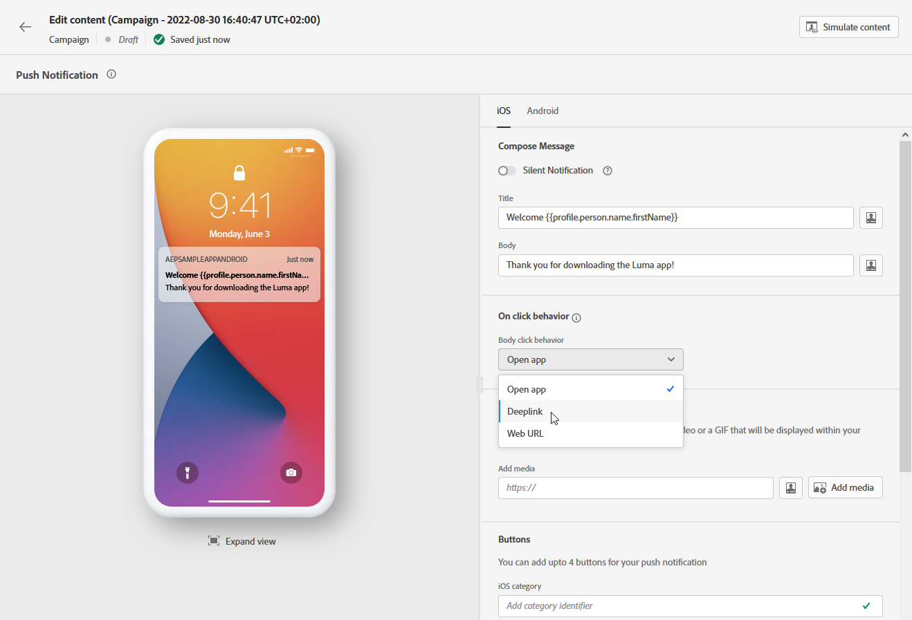

# 设计推送通知 {#design-push-notification}

## 标题和正文 {#push-title-body}

>[!CONTEXTUALHELP]
>id="ajo-message-push-compose"
>title="个性化推送通知。"
>abstract="要撰写消息，请在“标题”和“正文”字段中输入内容。要包含个性化令牌，请打开个性化对话框。"

要撰写消息，请单击 **[!UICONTROL 标题]** 和 **[!UICONTROL 正文]** 字段。 使用表达式编辑器定义内容、个性化数据和添加动态内容。 了解有关 [个性化](../personalization/personalize.md) 和 [动态内容](../personalization/get-started-dynamic-content.md) 在表达式编辑器中。

使用设备预览部分可可视化推送通知在iOS和Android设备上的显示方式。

## 单击行为 {#on-click-behavior}

>[!CONTEXTUALHELP]
>id="ajo-message-push-onclick"
>title="关于单击行为"
>abstract="选择收件人单击推送通知正文时的行为。"

您可以选择用户单击推送通知正文时的行为。

* 要打开应用程序，请选择 **[!UICONTROL 打开应用程序]** 选项。 与通知关联的应用程序在中定义 [渠道表面](../configuration/channel-surfaces.md) （即消息预设）。
* 要将用户重定向到应用程序中的特定内容，请选择 **[!UICONTROL 深层链接]** 选项。  特定内容可以是特定视图、页面的特定部分或特定选项卡。 选择该选项后，在相关字段中输入深层链接。
* 要将用户重定向到外部URL，请使用 **[!UICONTROL Web URL]** 选项。 选择该选项后，在相关字段中输入URL。

## 添加媒体 {#add-media-push}

>[!CONTEXTUALHELP]
>id="ajo-message-push-media"
>title="将媒体添加到推送通知"
>abstract="可添加在通知中显示的图像、视频或 GIF。"

在推送通知的iOS版本中，您可以添加在通知中显示的图像、视频或GIF。

在Android版本中，您只能添加图像图标和扩展通知的图像。

有两个选项可用。 您可以：

* 使用 **[!UICONTROL 添加媒体]** 选择资源的按钮 **[!DNL Adobe Experience Manager Assets]**.

  了解如何使用 **[!DNL Adobe Experience Manager Assets]** 在 [此页面](../content-management/assets.md).

* 或者，在 **[!UICONTROL 添加媒体]** 字段。 在这种情况下，您可以在URL中添加个性化设置。

添加后，介质会显示在通知正文的右侧。

## 添加按钮 {#add-buttons-push}

>[!CONTEXTUALHELP]
>id="ajo-message-push-buttons"
>title="添加按钮以供用户与推送通知进行交互。"
>abstract="通过此部分，可将行动号召按钮添加到消息。对于 iOS，指定通知类别标识符。对于 Android，可为每个按钮加入自定义文本和目标。"

通过向推送内容添加按钮来创建可操作通知。

如果设备屏幕已锁定，则不会显示以下按钮：仅 **标题** 和 **消息** 通知的可见部分。 如果解锁了收件人的设备，收件人将看到相应的按钮。

在Android版本中，您最多可以添加三个按钮。

在iOS版本中，指定通知类别标识符。 需要在iOS应用程序中预配置通知类别，以便定义要显示的按钮和要采取的操作。 请参阅 [Apple文档](https://developer.apple.com/documentation/usernotifications/declaring_your_actionable_notification_types) 以了解更多详细信息。

1. 使用 **[!UICONTROL “添加”按钮]** 定义设置：标签和相关操作。 可能的操作与相同 [单击行为](#on-click-behavior).

1. 使用 **[!UICONTROL 展开视图]** 图标，以预览个性化按钮。

   

## 发送静默通知 {#silent-notification}

>[!CONTEXTUALHELP]
>id="ajo_message_push_silent_notification"
>title="关于静默通知"
>abstract="发送通知但不打扰用户，通知中心或通知栏中不显示通知。"

静默推送通知（或后台通知）是交付给应用程序的隐藏指令。 例如，用于通知应用程序有新内容可用，或在后台启动下载。

选择 **[!UICONTROL 静默通知]** 用于静默通知应用程序的选项：在这种情况下，通知将直接传输到应用程序。 设备屏幕上不显示任何警报。

使用 **[!UICONTROL 自定义数据]** 部分，以添加键值对。

## 自定义数据 {#custom-data}

>[!CONTEXTUALHELP]
>id="ajo-message-push-custom"
>title="为推送通知配置自定义数据。"
>abstract="根据移动应用程序配置，将自定义变量添加到负载。"

在 **[!UICONTROL 自定义数据]** 部分，您可以根据移动应用程序配置向有效负载添加自定义变量。 有关如何在Adobe Experience Platform和AdobeLaunch中设置推送通知的更多信息，请参阅 [本节](push-gs.md)

## 高级选项 {#advanced-options-push}

>[!CONTEXTUALHELP]
>id="ajo-message-push-advanced"
>title="为推送通知配置高级选项。"
>abstract="通过此部分，可增强推送通知的个性化。"

您可以配置 **[!UICONTROL 高级选项]** 用于推送通知。 可用参数如下所示：

| 参数 | 描述 |
|---------|---------|
| **[!UICONTROL 可折叠]** (iOS / Android) | 可折叠的消息是新消息过期后可能被替换的消息。 可折叠消息的常见用例是用于指示移动应用程序从服务器同步数据的消息。 例如，使用最新得分更新用户的体育应用程序。 只有最新的消息才具有相关性。 另一方面，消息是不可折叠的，消息对于客户端应用来说非常重要，需要传递。 |
| **[!UICONTROL 自定义声音]** (iOS / Android) | 当接收到通知时，由移动终端播放的声音。 该声音需要在应用程序中捆绑在一起。 |
| **[!UICONTROL 徽章]** (iOS / Android) | 标记用于直接在应用程序图标上显示新的未读信息数。 当用户打开或从应用程序中读取新内容时，标记值将消失。 在设备上收到通知时，它可以刷新或添加相关应用程序的标记值。 例如，如果您存储的是客户的未读文章数，则可以利用个性化为每个客户发送唯一的未读文章标记值。 有关更多个性化信息，请参阅 [本节](../personalization/personalize.md). |
| **[!UICONTROL 通知组]**  (仅限iOS) | 将通知组关联到推送通知。 从iOS 12开始，通知组允许您将消息线程和通知主题整合到线程ID中。 例如，品牌可能会在一个组ID下发送营销通知，而在一个或多个不同的ID下保留更多操作类型通知。 为了说明这一点，您可以设置groupID： 123“查看新的春季毛衣系列”和groupID： 456“您的包裹已投放”通知组。 在此示例中，所有投放通知都捆绑在组ID：456下。 |
| **[!UICONTROL 通知渠道]** （仅限Android） | 将通知渠道关联到推送通知。 从Android 8.0（API级别26）开始，必须将所有通知分配给渠道才能显示。 有关详细信息，请参见 [Android开发人员文档](https://developer.android.com/guide/topics/ui/notifiers/notifications#ManageChannels). |
| **[!UICONTROL 添加内容可用性标记]** (仅限iOS) | 在推送有效负载中发送可用内容标志，以确保应用程序在收到推送通知后立即唤醒，这意味着应用程序将能够访问有效负载数据。  即使应用程序在后台运行且不需要任何用户交互（例如点击推送通知），此功能也可以正常工作。 但是，如果应用程序未运行，则不适用。 有关更多信息，请参阅 [Apple 开发人员文档](https://developer.apple.com/library/content/documentation/NetworkingInternet/Conceptual/RemoteNotificationsPG/CreatingtheNotificationPayload.html)。 |
| **[!UICONTROL 添加可变内容标志]** (仅限iOS) | 在推送有效载荷中发送可变内容标志，并将允许推送通知内容由iOS SDK中提供的通知服务应用程序扩展进行修改。 有关更多信息，请参阅 [Apple 开发人员文档](https://developer.apple.com/library/content/documentation/NetworkingInternet/Conceptual/RemoteNotificationsPG/ModifyingNotifications.html)。 然后，您可以利用移动应用程序扩展进一步修改发送自的推送通知的内容或演示 [!DNL Journey Optimizer]. 例如，用户可以利用此选项解密数据，更改通知的正文或标题文本，向通知添加线程标识符等。 |
| **[!UICONTROL 通知可见性]** （仅限Android） | 定义推送通知的可见性。  <b>私有</b> 将在所有锁屏界面上显示通知，但在安全锁屏界面上隐藏敏感或私人信息。  <b>公共</b> 将在所有锁屏界面上完整显示通知。  <b>密码</b> 将不会在安全锁屏界面上显示通知的任何部分。  有关详情，请参阅 [Android开发人员文档](https://developer.android.com/reference/android/app/Notification). |
| **[!UICONTROL 通知优先级]** （仅限Android） | 定义推送通知的重要性从低到大。 这会确定推送通知在投放时会如何“干扰”。 有关详细信息，请参见 [Android开发人员文档](https://developer.android.com/guide/topics/ui/notifiers/notifications#importance) |
| **[!UICONTROL 投放优先级]** （仅限Android） | 设置推送通知的高优先级或普通优先级。 有关消息优先级的更多信息，请参阅 [Google 开发人员文档](https://firebase.google.com/docs/cloud-messaging/concept-options#setting-the-priority-of-a-message)。 |
