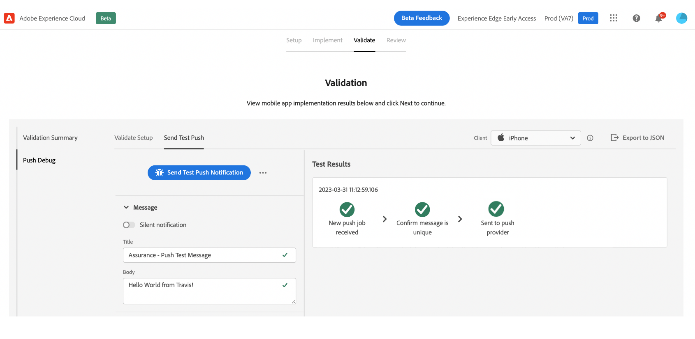

# 移动设备入门快速入门工作流程 {#mobile-wf}

新 **移动载入快速启动工作流** 是一项新的产品功能，可快速配置Mobile SDK、开始收集和验证移动事件数据，以及通过发送推送通知 [!DNL Journey Optimizer].

此功能可通过 **[!DNL Adobe Experience Platform Data Collection]** 作为公共测试版发送给所有客户的主页。

## 快速入门{#gs-mobile-wf}

此新工作流通过减少总点击量并加快Journey Optimizer的移动配置来自动执行数据收集设置。 此快速入门工作流将引导您完成四个简单的步骤， [设置](##setup-mobile-wf), [实施](#implement-mobile-wf), [验证](#valid-mobile-wf)和 [审查](#review-mobile-wf) 您的移动配置。

要访问新的移动载入快速入门工作流，请浏览 **[!DNL Data Collection]** 从解决方案切换器。 然后，选择 **[!DNL Start Collecting Mobile Data]** 主页上的卡片。

以下是一些其他功能：

* 简单的四步工作流和用户界面。
* 提供了一个基本设置，可在几分钟内开始通过Mobile SDK收集移动事件数据。
* 能够利用“保证”测试和验证基本的移动推送事件。
* 自动创建和配置所有必需的数据收集和Journey Optimizer资产。
* 在产品指南和工具提示中。
* 根据需要为更高级的实施提供免费过渡。

## 设置 {#setup-mobile-wf}

此工作流的第一步会自动创建和配置所有必需的数据收集和Journey Optimizer资产，例如移动属性、移动扩展、Journey Optimizer扩展、规则、数据元素等。

接受测试版条款与条件后，输入移动设备应用程序的名称，然后单击 **[!DNL Next]**.

提供有关iOS和Android平台的信息，包括您的应用程序ID以及身份验证密钥或密钥文件。

## 实施{#implement-mobile-wf}

下一步提供了将代码安装到移动设备应用程序的分步指南。

## 验证{#valid-mobile-wf}

查看并检查实施以验证它。 您可以发送测试推送通知。

## 请查看 {#review-mobile-wf}

自动设置已完成。 您现在可以访问标记移动资产，配置规则或数据元素，并开始使用Adobe Journey Optimizer发送推送通知。

**相关主题**

* [推送通知入门](get-started-push.md)
* [推送通知数据流和组件](push-gs.md)
* [配置推送渠道](push-configuration.md)
* [推送通知报告](../reports/journey-global-report.md#push-global)
* [创建推送通知](create-push.md)
