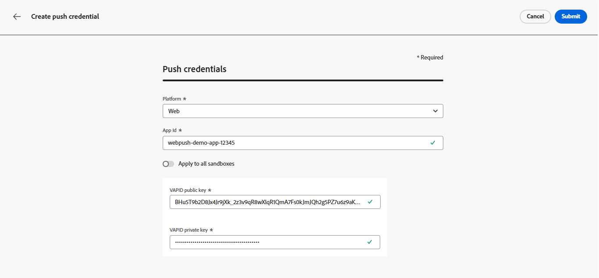

# 配置 Web 推送通知渠道 {#push-notification-configuration}

[!DNL Journey Optimizer] 允许您创建历程并向目标受众发送消息。在开始通过[!DNL Journey Optimizer]发送Web推送通知之前，您需要确保Adobe Experience Platform中的配置和集成已就绪。 要了解 [!DNL Adobe Journey Optimizer] 中的推送通知数据流，请参阅[此页面](push-gs.md)。

>[!AVAILABILITY]
>
>新的&#x200B;**移动入门快速入门工作流**&#x200B;现已可用。 使用此新产品功能可快速配置移动SDK以开始收集和验证移动事件数据，并发送移动推送通知。 此功能可作为公共测试版通过数据收集主页访问。 [了解详情](mobile-onboarding-wf.md)
>

## 开始前 {#start-push}

### 设置权限 {#setup-permissions}

在创建移动应用程序之前，您首先需要确保拥有或分配适用于Adobe Experience Platform中的标记的正确用户权限。 请参阅[标记文档](https://experienceleague.adobe.com/docs/experience-platform/tags/admin/user-permissions.html){target="_blank"}以了解详情。

>[!CAUTION]
>
>推送配置必须由专家用户执行。 根据您的实施模型和此实施中涉及的角色，您可能需要将整套权限分配给单个产品配置文件，或在应用程序开发人员和&#x200B;**Adobe Journey Optimizer**&#x200B;管理员之间共享权限。 在&#x200B;**本文档**&#x200B;中了解有关[标记](https://experienceleague.adobe.com/docs/experience-platform/tags/admin/user-permissions.html){target="_blank"}权限的详细信息。

<!--ou need to your have access to perform following roles :

* Manage Datastreams
* Manage Client-side Properties
* Manage App Configurations
-->

要分配&#x200B;**属性**&#x200B;和&#x200B;**公司**&#x200B;权限，请执行以下步骤：

1. 访问&#x200B;**[!DNL Admin Console]**。

1. 从&#x200B;**[!UICONTROL 产品]**&#x200B;选项卡中，选择&#x200B;**[!UICONTROL Adobe Experience Platform数据收集]**&#x200B;卡。

   

1. 选择现有的&#x200B;**[!UICONTROL 产品配置文件]**&#x200B;或使用&#x200B;**[!UICONTROL 新建配置文件]**&#x200B;按钮创建一个新配置文件。 在&#x200B;**[!UICONTROL 管理控制台文档]**&#x200B;中了解如何创建新的[新配置文件](https://experienceleague.adobe.com/docs/experience-platform/access-control/ui/create-profile.html#ui){target="_blank"}。

1. 从&#x200B;**[!UICONTROL 权限]**&#x200B;选项卡中，选择&#x200B;**[!UICONTROL 属性权限]**。

   

1. 单击&#x200B;**[!UICONTROL 全部添加]**。 这会将以下权限添加到您的产品配置文件：
   * **[!UICONTROL 批准]**
   * **[!UICONTROL 开发]**
   * **[!UICONTROL 管理环境]**
   * **[!UICONTROL 管理扩展]**
   * **[!UICONTROL 发布]**

   在Adobe Experience Platform Mobile SDK中安装和发布Adobe Journey Optimizer扩展以及发布应用程序属性时，需要这些权限。

1. 然后，在左侧菜单中选择&#x200B;**[!UICONTROL 公司权限]**。

   

1. 添加以下权限：

   * **[!UICONTROL 管理应用程序配置]**
   * **[!UICONTROL 管理属性]**

   移动设备应用程序开发人员需要这些权限才能在&#x200B;**Adobe Experience Platform数据收集**&#x200B;中设置推送凭据并在&#x200B;**Adobe Journey Optimizer**&#x200B;中定义推送通知渠道配置（即消息预设）。

   

1. 单击&#x200B;**[!UICONTROL 保存]**。

要将此&#x200B;**[!UICONTROL 产品配置文件]**&#x200B;分配给用户，请执行以下步骤：

1. 访问&#x200B;**[!DNL Admin Console]**。

1. 从&#x200B;**[!UICONTROL 产品]**&#x200B;选项卡中，选择&#x200B;**[!UICONTROL Adobe Experience Platform数据收集]**&#x200B;卡。

1. 选择您之前配置的&#x200B;**[!UICONTROL 产品配置文件]**。

1. 在&#x200B;**[!UICONTROL 用户]**&#x200B;选项卡中，单击&#x200B;**[!UICONTROL 添加用户]**。

   

1. 键入用户名或电子邮件地址，然后选择用户。 然后，单击&#x200B;**[!UICONTROL 保存]**。

   >[!NOTE]
   >
   >如果以前未在Admin Console中创建过该用户，请参阅[添加用户文档](https://helpx.adobe.com/enterprise/admin-guide.html/enterprise/using/manage-users-individually.ug.html#add-users)。

   

### 检查您的数据集 {#push-datasets}

以下架构和数据集在推送通知渠道中可用：

| 架构 数据集 | 字段组 | 操作 |
| -------------------------------------------------------------------------------------- | --------------------------------------------------------------------------------------------------------------------------------------------------------------------------------------- | -------------------------------------------------------- |
| CJM推送配置文件架构 CJM推送配置文件数据集 | 推送通知详细信息 Adobe CJM ExperienceEvent — 消息配置文件详细信息 Adobe CJM ExperienceEvent — 消息执行详细信息 应用程序详细信息 环境详细信息 | 注册推送令牌 |
| CJM推送跟踪体验事件架构 CJM推送跟踪体验事件数据集 | 推送通知跟踪 | 跟踪交互并为报表UI提供数据 |

>[!NOTE]
>
>将推送跟踪事件摄取到CJM推送跟踪体验事件数据集后，即使部分数据摄取成功，也可能会发生一些故障。 如果映射中的某些字段在传入事件中不存在，则会发生这种情况：系统记录警告，但不阻止摄取数据的有效部分。 这些警告在批次状态中显示为“失败”，但反映部分摄取成功。
>
>要查看每个架构字段和属性的完整列表，请参阅 [Journey Optimizer 架构字典](https://experienceleague.adobe.com/tools/ajo-schemas/schema-dictionary.html?lang=zh-Hans){target="_blank"}。

### 配置pushNotification属性 {#push-property}

若要启用&#x200B;**Web推送通知**，您必须首先确保在Web SDK中正确配置[pushNotifications属性](https://experienceleague.adobe.com/en/docs/experience-platform/collection/js/commands/configure/pushnotifications)。 此属性控制Web应用程序处理推送通知的方式。

此外，您需要生成VAPID密钥，这是在Journey Optimizer中配置[您的应用程序推送凭据](#push-credentials-launch)所必需的。

## 步骤1：在Journey Optimizer中添加应用程序推送凭据 {#push-credentials-launch}

在授予正确的用户权限后，您现在需要在Journey Optimizer中添加移动应用程序推送凭据。

需要移动设备应用程序推送凭据注册，才能授权Adobe代表您发送推送通知。 请参阅下面详述的步骤：

1. 访问&#x200B;**[!UICONTROL 渠道]** > **[!UICONTROL 推送设置]** > **[!UICONTROL 推送凭据]**&#x200B;菜单。

1. 单击&#x200B;**[!UICONTROL 创建推送凭据]**。

1. 从&#x200B;**[!UICONTROL 平台]**&#x200B;下拉列表中，选择&#x200B;**[!UICONTROL Web]**。

   

1. 提供&#x200B;**[!UICONTROL 应用程序ID]**。

1. 输入您的&#x200B;**[!UICONTROL VAPID公钥]**&#x200B;和&#x200B;**[!UICONTROL 私钥]**。

1. 单击&#x200B;**[!UICONTROL 提交]**&#x200B;以创建您的应用程序配置。

## 步骤2：为推送创建渠道配置{#message-preset}

创建推送凭据后，您需要创建配置以便能够从&#x200B;**[!DNL Journey Optimizer]**&#x200B;发送推送通知。

1. 访问&#x200B;**[!UICONTROL 渠道]** > **[!UICONTROL 常规设置]** > **[!UICONTROL 渠道配置]**&#x200B;菜单，然后单击&#x200B;**[!UICONTROL 创建渠道配置]**。

   

1. 输入配置的名称和说明（可选）。

   >[!NOTE]
   >
   > 名称必须以字母(A-Z)开头。 它只能包含字母数字字符。 您还可以使用下划线 `_`、点 `.` 和连字符 `-` 符号。

1. 要为配置分配自定义或核心数据使用标签，您可以选择&#x200B;**[!UICONTROL 管理访问权限]**。 [了解有关对象级访问控制(OLAC)的更多信息](../administration/object-based-access.md)。

1. 选择&#x200B;**推送**&#x200B;渠道。

   

1. 选择&#x200B;**[!UICONTROL 营销操作]**&#x200B;以使用此配置将同意策略关联到消息。 所有与营销活动相关的同意政策均可利用，以尊重客户的偏好。 [了解详情](../action/consent.md#surface-marketing-actions)

1. 选择您的&#x200B;**[!UICONTROL 平台]**：Android、iOS和/或Web。

1. 选择与上述配置的&#x200B;**[!UICONTROL 推送凭据]**&#x200B;相同的[应用程序ID](#push-credentials-launch)。

1. 保存更改。

现在，您可以在创建推送通知时选择配置。

## 步骤3：配置sendPushSubscription属性 {#sendPushSubscription-property}

设置推送凭据和渠道配置后，您需要在Web应用程序中实施[sendPushSubscription命令](https://experienceleague.adobe.com/en/docs/experience-platform/collection/js/commands/sendpushsubscription)。 此命令在Adobe Experience Platform中注册用户推送订阅，使系统能够跟踪哪些用户已选择接收推送通知并保持其订阅状态。 此注册对于Journey Optimizer向用户发送定向推送通知至关重要。

## 步骤4：使用事件测试您的移动应用程序 {#mobile-app-test}

在Adobe Experience Platform和[!DNL Adobe Experience Platform Data Collection]中完成Web推送配置后，您可以在将Web推送通知发送到用户档案之前测试您的实施。 测试可确保正确注册订阅，并将通知正确传送到用户的浏览器。

有关使用事件创建测试历程以验证Web推送设置的详细说明，请参阅[移动应用程序推送通知配置文档](push-configuration.md)，该文档提供了一个适用于移动和Web推送渠道的全面测试工作流。
