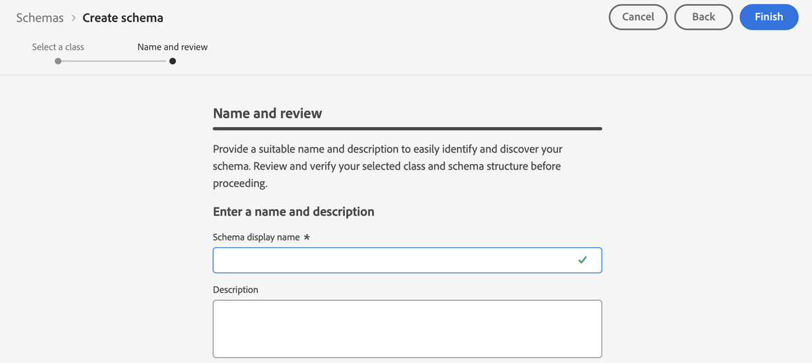
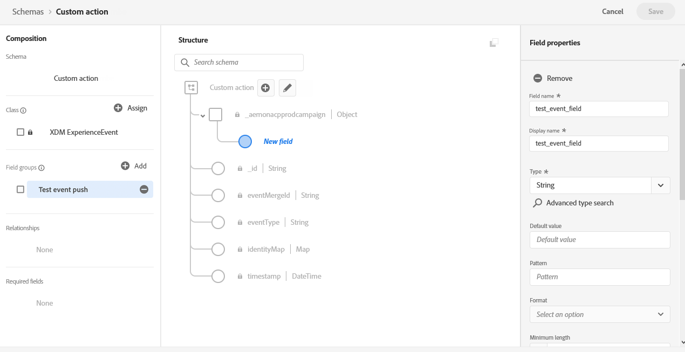
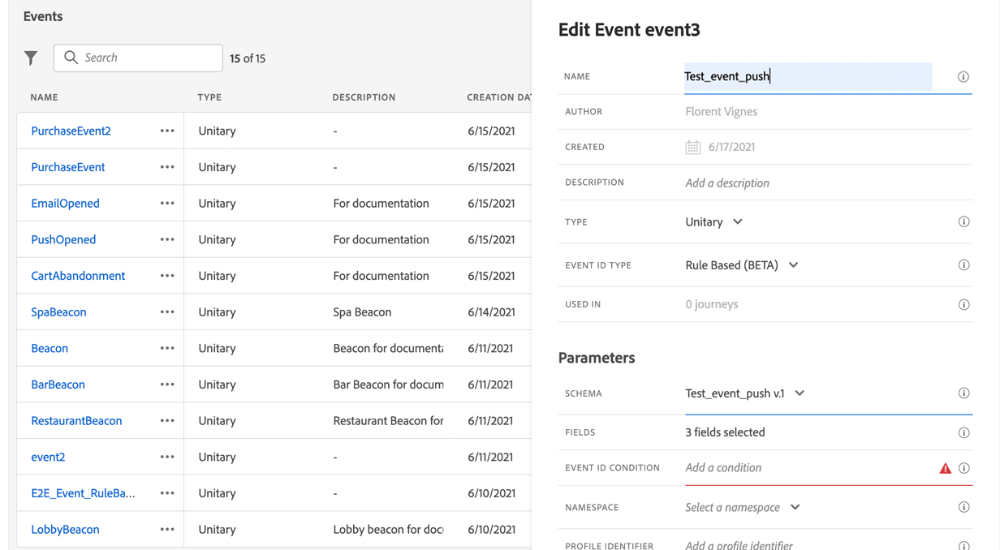
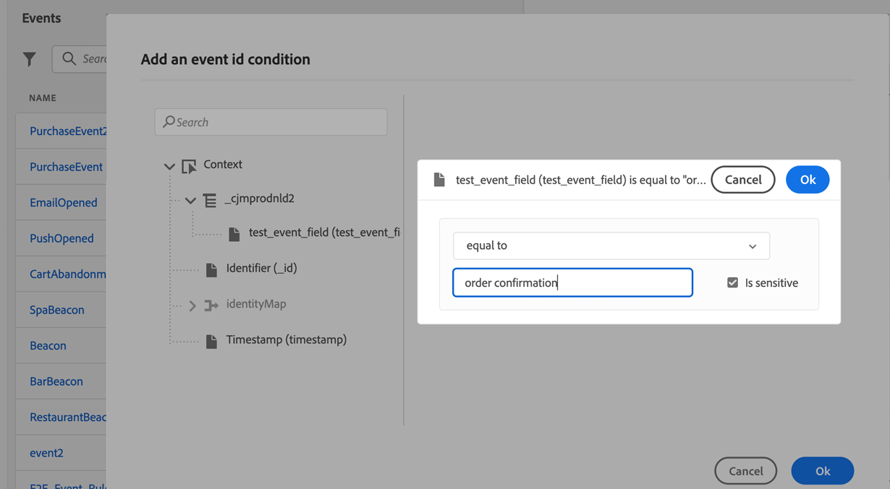

# 配置推送通知渠道 {#push-notification-configuration}

[!DNL Journey Optimizer] 允许您创建历程并向目标受众发送消息。在开始通过[!DNL Journey Optimizer]发送推送通知之前，您需要确保移动应用程序和Adobe Experience Platform中的标记已具有配置和集成。 要了解 [!DNL Adobe Journey Optimizer] 中的推送通知数据流，请参阅[此页面](push-gs.md)。

>[!AVAILABILITY]
>
>新的&#x200B;**移动入门快速入门工作流**&#x200B;现已可用。 使用此新产品功能快速配置Mobile SDK以开始收集和验证移动事件数据，并发送移动推送通知。 此功能可作为公共测试版通过数据收集主页访问。 [了解详情](mobile-onboarding-wf.md)
>


## 开始前 {#before-starting}

<!--
### Check provisioning

Your Adobe Experience Platform account must be provisioned to contain following schemas and datasets for push notification data flow to function correctly:

| Schema <br>Dataset                                                                       | Group of fields                                                                                                                                                                         | Operation                                                |
| -------------------------------------------------------------------------------------- | --------------------------------------------------------------------------------------------------------------------------------------------------------------------------------------- | -------------------------------------------------------- |
| CJM Push Profile Schema <br>CJM Push Profile Dataset                                     | Push Notification Details<br>Adobe CJM ExperienceEvent - Message Profile Details<br>Adobe CJM ExperienceEvent - Message Execution Details<br>Application Details<br>Environment Details | Register Push Token                                      |
| CJM Push Tracking Experience Event Schema<br>CJM Push Tracking Experience Event Dataset | Push Notification Tracking                                                                                                                                                              | Track interactions and provide data for the reporting UI |
-->

### 设置权限 {#setup-permissions}

在创建移动应用程序之前，您首先需要确保拥有或分配适用于Adobe Experience Platform中的标记的正确用户权限。 请参阅[标记文档](https://experienceleague.adobe.com/docs/experience-platform/tags/admin/user-permissions.html){target="_blank"}以了解详情。

>[!CAUTION]
>
>推送配置必须由专家用户执行。 根据您的实施模型和此实施中涉及的角色，您可能需要将整套权限分配给单个产品配置文件，或在应用程序开发人员和&#x200B;**Adobe Journey Optimizer**&#x200B;管理员之间共享权限。 在[本文档](https://experienceleague.adobe.com/docs/experience-platform/tags/admin/user-permissions.html){target="_blank"}中了解有关&#x200B;**标记**&#x200B;权限的详细信息。

<!--ou need to your have access to perform following roles :

* Manage Datastreams
* Manage Client-side Properties
* Manage App Configurations
-->

要分配&#x200B;**属性**&#x200B;和&#x200B;**公司**&#x200B;权限，请执行以下步骤：

1. 访问&#x200B;**[!DNL Admin Console]**。

1. 从&#x200B;**[!UICONTROL 产品]**&#x200B;选项卡中，选择&#x200B;**[!UICONTROL Adobe Experience Platform数据收集]**&#x200B;卡。

   

1. 选择现有的&#x200B;**[!UICONTROL 产品配置文件]**&#x200B;或使用&#x200B;**[!UICONTROL 新建配置文件]**&#x200B;按钮创建一个新配置文件。 在[管理控制台文档](https://experienceleague.adobe.com/docs/experience-platform/access-control/ui/create-profile.html#ui){target="_blank"}中了解如何创建新的&#x200B;**[!UICONTROL 新配置文件]**。

1. 从&#x200B;**[!UICONTROL 权限]**&#x200B;选项卡中，选择&#x200B;**[!UICONTROL 属性权限]**。

   

1. 单击&#x200B;**[!UICONTROL 全部添加]**。 这会将以下权限添加到您的产品配置文件：
   * **[!UICONTROL 批准]**
   * **[!UICONTROL 开发]**
   * **[!UICONTROL 管理环境]**
   * **[!UICONTROL 管理扩展]**
   * **[!UICONTROL Publish]**

   在Adobe Experience Platform Mobile SDK中安装和发布Adobe Journey Optimizer扩展以及发布应用程序属性时，需要这些权限。

1. 然后，在左侧菜单中选择&#x200B;**[!UICONTROL 公司权限]**。

   

1. 添加以下权限：

   * **[!UICONTROL 管理应用程序配置]**
   * **[!UICONTROL 管理属性]**

   移动设备应用程序开发人员需要这些权限才能在&#x200B;**Adobe Experience Platform数据收集**&#x200B;中设置推送凭据并在&#x200B;**Adobe Journey Optimizer**&#x200B;中定义推送通知渠道界面（即消息预设）。

   

1. 单击&#x200B;**[!UICONTROL 保存]**。

要将此&#x200B;**[!UICONTROL 产品配置文件]**&#x200B;分配给用户，请执行以下步骤：

1. 访问&#x200B;**[!DNL Admin Console]**。

1. 从&#x200B;**[!UICONTROL 产品]**&#x200B;选项卡中，选择&#x200B;**[!UICONTROL Adobe Experience Platform数据收集]**&#x200B;卡。

1. 选择您之前配置的&#x200B;**[!UICONTROL 产品配置文件]**。

1. 在&#x200B;**[!UICONTROL 用户]**&#x200B;选项卡中，单击&#x200B;**[!UICONTROL 添加用户]**。

   

1. 键入用户名或电子邮件地址，然后选择用户。 然后，单击&#x200B;**[!UICONTROL 保存]**。

   >[!NOTE]
   >
   >如果以前未在Admin Console中创建过该用户，请参阅[添加用户文档](https://helpx.adobe.com/enterprise/admin-guide.html/enterprise/using/manage-users-individually.ug.html#add-users)。

   

### 配置您的应用程序 {#configure-app}

技术设置涉及应用程序开发人员和业务管理员之间的密切合作。 在使用[!DNL Journey Optimizer]开始发送推送通知之前，您需要在[!DNL Adobe Experience Platform Data Collection]中定义设置，并将移动应用程序与Adobe Experience Platform Mobile SDK集成。

请按照以下链接中详述的实施步骤操作：

* 对于&#x200B;**Apple iOS**：请参阅[Apple文档](https://developer.apple.com/documentation/usernotifications/registering_your_app_with_apns){target="_blank"}以了解如何使用APN注册您的应用程序
* 对于&#x200B;**Google Android**：请参阅[Google文档](https://firebase.google.com/docs/cloud-messaging/android/client){target="_blank"}以了解如何在Android上设置Firebase Cloud Messaging客户端应用程序

### 将您的移动应用程序与Adobe Experience Platform SDK集成 {#integrate-mobile-app}

Adobe Experience Platform Mobile SDK通过与Android和iOS兼容的SDK，为您的移动设备提供客户端集成API。 按照[Adobe Experience Platform Mobile SDK文档](https://developer.adobe.com/client-sdks/documentation/getting-started/){target="_blank"}中的说明在您的应用程序中设置Adobe Experience Platform Mobile SDK。

到这为止，您还应该在[!DNL Adobe Experience Platform Data Collection]中创建并配置移动属性。 通常，您将为要管理的每个移动应用程序创建一个移动资产。 请参阅[Adobe Experience Platform Mobile SDK文档](https://developer.adobe.com/client-sdks/documentation/getting-started/create-a-mobile-property/){target="_blank"}以了解如何创建和配置移动属性。


## 步骤1：在Adobe Experience Platform数据收集中添加应用程序推送凭据 {#push-credentials-launch}

在授予正确的用户权限后，您现在需要在[!DNL Adobe Experience Platform Data Collection]中添加移动应用程序推送凭据。

需要移动设备应用程序推送凭据注册，才能授权Adobe代表您发送推送通知。 请参阅下面详述的步骤：

1. 从[!DNL Adobe Experience Platform Data Collection]中，选择左侧面板中的&#x200B;**[!UICONTROL 应用程序表面]**&#x200B;选项卡。

1. 单击&#x200B;**[!UICONTROL 创建应用程序表面]**&#x200B;以创建新配置。

   

1. 输入配置的&#x200B;**[!UICONTROL 名称]**。

1. 从&#x200B;**[!UICONTROL 移动设备应用程序配置]**&#x200B;中，选择操作系统：

   * 用于iOS的&#x200B;****

     

      1. 在&#x200B;**[!UICONTROL 应用程序ID (iOS捆绑包ID)]**&#x200B;字段中输入移动应用程序&#x200B;**捆绑包ID**。 可以在&#x200B;**XCode**&#x200B;中主目标的&#x200B;**常规**&#x200B;选项卡中找到应用程序捆绑包ID。

      1. 已打开&#x200B;**[!UICONTROL 推送凭据]**&#x200B;按钮以添加凭据。

      1. 拖放您的.p8 Apple推送通知身份验证密钥文件。 此密钥可从&#x200B;**证书**、**标识符**&#x200B;和&#x200B;**配置文件**&#x200B;页面获取。

      1. 提供&#x200B;**密钥ID**。 这是在创建p8身份验证密钥期间分配的10字符串。 可在&#x200B;**证书**、**标识符**&#x200B;和&#x200B;**配置文件**&#x200B;页面中的&#x200B;**密钥**&#x200B;选项卡下找到它。

      1. 提供&#x200B;**团队ID**。 这是一个字符串值，可以在“成员资格”选项卡下找到。

   * 用于Android的&#x200B;****

     

      1. 提供&#x200B;**[!UICONTROL 应用程序ID (Android包名称)]**：包名称通常是您`build.gradle`文件中的应用程序ID。

      1. 已打开&#x200B;**[!UICONTROL 推送凭据]**&#x200B;按钮以添加凭据。

      1. 拖放FCM推送凭据。 有关如何获取推送凭据的详细信息，请参阅[Google文档](https://firebase.google.com/docs/admin/setup#initialize-sdk){target="_blank"}。


1. 单击&#x200B;**[!UICONTROL 保存]**&#x200B;以创建您的应用程序配置。

<!--
## Step 2: Set up a mobile property in Adobe Experience Platform Launch {#launch-property}

Setting up a mobile property allows the mobile app developer or marketer to configure the mobile SDKs attributes such as Session Timeouts, the [!DNL Adobe Experience Platform] sandbox to be targeted and the **[!UICONTROL Adobe Experience Platform Datasets]** to be used for mobile SDK to send data to.

For further details and procedures on how to set up a **[!UICONTROL Platform Launch property]**, refer to the steps detailed in [Adobe Experience Platform Mobile SDK documentation](https://aep-sdks.gitbook.io/docs/getting-started/create-a-mobile-property#create-a-mobile-property).


To get the SDKs needed for push notification to work you will need the following SDK extensions, for both Android and iOS:

* **[!UICONTROL Mobile Core]** (installed automatically)
* **[!UICONTROL Profile]** (installed automatically)
* **[!UICONTROL Adobe Experience Platform Edge]**
* **[!UICONTROL Adobe Experience Platform Assurance]**, optional but recommended to debug the mobile implementation.

Learn more about [!DNL Adobe Experience Platform Launch] extensions in [Adobe Experience Platform Launch documentation](https://experienceleague.adobe.com/docs/launch-learn/implementing-in-mobile-android-apps-with-launch/configure-launch/launch-add-extensions.html).
-->

## 步骤2：在移动资产中配置Adobe Journey Optimizer扩展 {#configure-journey-optimizer-extension}

适用于Adobe Experience Platform Mobile SDK的&#x200B;**Adobe Journey Optimizer扩展**&#x200B;可为您的移动应用程序提供推送通知，并帮助您收集用户推送令牌和管理与Adobe Experience Platform服务的交互测量。

请参阅[Journey Optimizer Mobile SDK文档](https://developer.adobe.com/client-sdks/documentation/adobe-journey-optimizer/){target="_blank"}以了解如何设置Adobe Experience Platform扩展。


<!-- 
**[!UICONTROL Edge configuration]** is used by **[!UICONTROL Edge]** extension to send custom data from mobile device to [!DNL Adobe Experience Platform]. 
To configure [!DNL Adobe Experience Platform], you must provide the **[!UICONTROL Sandbox]** name and **[!UICONTROL Event Dataset]**.

1. From [!DNL Adobe Experience Platform Launch], select the **[!UICONTROL Edge Configurations]** tab and click **[!UICONTROL Edge Configurations]**.
    
1. Select **[!UICONTROL New Edge Configuration]** to add a new **[!UICONTROL Edge Configuration]**.
1. Enter a **[!UICONTROL Name]** and click **[!UICONTROL Save]**

1. Click the **[!UICONTROL Adobe Experience Platform]** toggle to enable it.

1. Fill in the **[!UICONTROL Sandbox]**, **[!UICONTROL Event dataset]** and **[!UICONTROL Profile Dataset]** fields. Then, click **[!UICONTROL Save]**.
    
    


1. From [!DNL Adobe Experience Platform Launch], ensure that **[!UICONTROL Client Side]** is selected in the drop-down menu.

1. select the **[!UICONTROL Properties]** tab and click **[!UICONTROL New Property]**.

    

1. Enter a **[!UICONTROL Name]** for your new property.

1. Select **[!UICONTROL Mobile]** as **[!UICONTROL Platform]**.

    

1. Click **[!UICONTROL Save]** to create your new property.

To configure **[!UICONTROL Adobe Experience Platform Edge Extension]** to send custom data from mobile devices to [!DNL Adobe Experience Platform].

1. Select your previously created property and select the **[!UICONTROL Extensions]** tab to view the extensions for this property.

    

1. Click **[!UICONTROL Configure]** under the **[!UICONTROL Adobe Experience Platform Edge]** Network' extension.

1. From the **[!UICONTROL Edge Configuration]** drop-down list, select the **[!UICONTROL Edge Configuration]** created in the previous steps. For more information on **[!UICONTROL Edge Configuration]**, refer to this [section](#edge-configuration).

1. Click **[!UICONTROL Save]**.

To configure **[!UICONTROL Adobe Experience Platform Messaging]** extension to send push profile and push interactions to the correct datasets, follow the same steps as above. Use **[!UICONTROL Sandbox]**, **[!UICONTROL Event dataset]** and **[!UICONTROL Profile Dataset]** created in the [Adobe Experience Platform setup](#edge-configuration).
-->

<!--
## Step 4: Publish the Property {#publish-property}

You now need to publish the property to integrate your configuration and to use it in the mobile app. 

To publish your property, refer to the steps detailed in [Adobe Experience Platform Mobile SDK documentation](https://aep-sdks.gitbook.io/docs/getting-started/create-a-mobile-property#publish-the-configuration)

## Step 5: Configure the ProfileDataSource {#configure-profiledatasource}

To configure the `ProfileDataSource`, use the `ProfileDCInletURL` from [!DNL Adobe Experience Platform] setup and add the following in the mobile app:

```
    MobileCore.updateConfiguration(
    mutableMapOf("messaging.dccs" to <ProfileDCSInletURL>)
```

-->

## 步骤3：使用事件测试您的移动应用程序 {#mobile-app-test}

在Adobe Experience Platform和[!DNL Adobe Experience Platform Data Collection]中配置移动应用程序后，您现在可以在将推送通知发送到用户档案之前对其进行测试。 在此使用案例中，我们创建历程以定位移动应用程序，并设置触发推送通知的事件。

<!--
You can use a test mobile app for this use case. For more on this, refer to this [page](https://wiki.corp.adobe.com/pages/viewpage.action?spaceKey=CJM&title=Details+of+setting+the+mobile+test+app) (internal use only).
-->

为了让此历程正常工作，您需要创建XDM架构。 有关详细信息，请参阅[XDM文档](https://experienceleague.adobe.com/docs/experience-platform/xdm/schema/composition.html#schemas-and-data-ingestion){target="_blank"}。

1. 在“数据管理”菜单部分中，单击&#x200B;**[!UICONTROL 架构]**。
   
1. 单击&#x200B;**[!UICONTROL 创建架构]**，在右上角选择&#x200B;**[!UICONTROL 体验事件]**，然后单击&#x200B;**下一步**。
   
1. 输入架构的名称和描述，然后单击&#x200B;**完成**。
   
1. 在&#x200B;**字段组**&#x200B;部分的左侧，单击&#x200B;**添加**&#x200B;并选择&#x200B;**[!UICONTROL 创建新字段组]**。

1. 输入&#x200B;**[!UICONTROL 显示名称]**&#x200B;和&#x200B;**[!UICONTROL 描述]**。 完成后，单击&#x200B;**[!UICONTROL 添加字段组]**。 有关如何创建字段组的详细信息，请参阅[XDM系统文档](https://experienceleague.adobe.com/docs/experience-platform/xdm/tutorials/create-schema-ui.html?lang=zh-Hans){target="_blank"}。


   

1. 在左侧，选择架构。 在右窗格中，为&#x200B;**[!UICONTROL 配置文件]**&#x200B;启用此架构。

   


1. 在左侧，选择字段组，然后单击+图标以创建新字段。 在&#x200B;**[!UICONTROL 字段组属性]**&#x200B;的右侧，键入&#x200B;**[!UICONTROL 字段名称]**、**[!UICONTROL 显示名称]**&#x200B;并选择&#x200B;**[!UICONTROL 字符串]**&#x200B;作为&#x200B;**[!UICONTROL 类型]**。

   

1. 选中&#x200B;**[!UICONTROL 必需]**&#x200B;并单击&#x200B;**[!UICONTROL 应用]**。

1. 单击 **[!UICONTROL Save]**。您的架构现已创建并可在事件中使用。

然后，您需要设置一个事件。

1. 从主页左侧菜单的“管理”下，选择&#x200B;**[!UICONTROL 配置]**。 单击&#x200B;**[!UICONTROL 事件]**&#x200B;部分中的&#x200B;**[!UICONTROL 管理]**&#x200B;以创建新事件。

1. 单击&#x200B;**[!UICONTROL 创建事件]**，事件配置窗格将在屏幕右侧打开。

   

1. 输入事件的名称。 您还可以添加描述。

1. 在&#x200B;**[!UICONTROL 事件ID类型]**&#x200B;字段中，选择&#x200B;**[!UICONTROL 基于规则]**。

1. 在&#x200B;**[!UICONTROL 参数]**&#x200B;中，选择您之前创建的架构。

   

1. 在字段列表中，检查是否选中了在架构字段组中创建的字段。

   

1. 在&#x200B;**[!UICONTROL 事件ID条件]**&#x200B;字段中单击&#x200B;**[!UICONTROL 编辑]**。 拖放您之前添加的字段以定义条件，系统将使用它来识别触发历程的事件。

   

1. 键入在测试应用程序中触发推送通知所需的语法，在此示例中为&#x200B;**订单确认**。

   

1. 选择&#x200B;**[!UICONTROL ECID]**&#x200B;作为您的&#x200B;**[!UICONTROL 命名空间]**。

1. 单击&#x200B;**[!UICONTROL 确定]**，然后单击&#x200B;**[!UICONTROL 保存]**。

您的事件现已创建并可在历程中使用。

1. 在左侧菜单中，单击&#x200B;**[!UICONTROL 历程]**。

1. 单击&#x200B;**[!UICONTROL 创建历程]**&#x200B;以创建新旅程。

1. 编辑右侧显示的配置窗格中的历程属性。在此[部分](../building-journeys/journey-properties.md)中了解详情。

1. 首先，从&#x200B;**[!UICONTROL 事件]**&#x200B;下拉列表中拖放前面步骤中创建的事件。

   

1. 从&#x200B;**[!UICONTROL 操作]**&#x200B;下拉列表中，将&#x200B;**[!UICONTROL 推送]**&#x200B;活动拖放到您的历程。

1. 配置推送通知。 有关如何创建推送通知的更多信息，请参阅此[页面](create-push.md)。

1. 单击&#x200B;**[!UICONTROL 测试]**&#x200B;切换以开始测试推送通知，然后单击&#x200B;**[!UICONTROL 触发事件]**。

   

1. 在&#x200B;**[!UICONTROL 键]**&#x200B;字段中输入您的ECID，然后在第二个字段中键入&#x200B;**订单确认**。

   

1. 单击&#x200B;**[!UICONTROL 发送]**。

您的事件将会触发，并且您将会收到发送到移动应用程序的推送通知。

## 步骤4：为推送创建渠道平面{#message-preset}

在[!DNL Adobe Experience Platform Data Collection]中设置您的移动应用后，您需要创建一个表面以便能够从&#x200B;**[!DNL Journey Optimizer]**&#x200B;发送推送通知。

在[本节](../configuration/channel-surfaces.md)中了解如何创建和配置渠道表面。

您现在可以使用Journey Optimizer发送推送通知了。

* 了解如何在[此页面](create-push.md)中创建推送消息。
* 在[本节](../building-journeys/journeys-message.md)中了解如何向历程添加消息。
