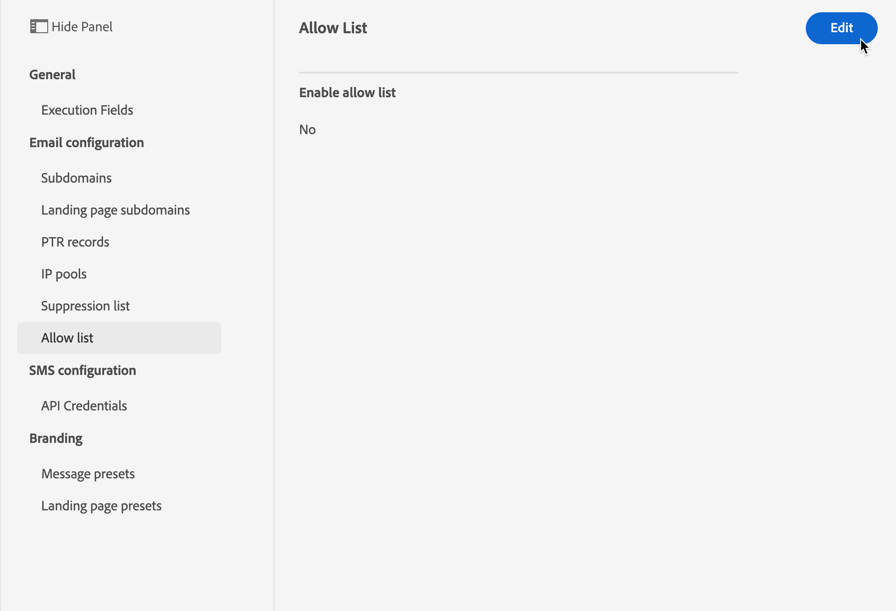

# 允许列表 {#allow-list}

可以在 [沙盒](../administration/sandboxes.md) 级别，以便拥有安全的环境进行测试。

例如，在可能发生错误的非生产实例上，允许列表可确保您没有向客户发送不需要的消息的风险。

>[!NOTE]
>
>此功能现在可用于生产沙箱和非生产沙箱。

利用允许列表，可指定单独的电子邮件地址或域，这些地址或域将是唯一有权接收您从特定沙盒发送的电子邮件的收件人或域。 这样可以防止您在测试环境中意外地向实际的客户地址发送电子邮件。

>[!CAUTION]
>
>此功能仅适用于电子邮件渠道。

## 启用允许列表 {#enable-allow-list}

<!--To enable the allowed list on a non-production sandbox, you need to update the general settings using the corresponding API end point in the Message Presets Service. Using this API, you can also disable the feature at any time.

You can update the allowed list before or after enabling the feature.-->

要启用允许列表，请执行以下步骤。

1. 访问 **[!UICONTROL Channels]** > **[!UICONTROL Email configuration]** > **[!UICONTROL Allow list]** 菜单。

   

1. 单击 **[!UICONTROL Edit]**。

   

1. 选择 **[!UICONTROL Enable allow list]**。

   

1. 单击 **[!UICONTROL Save]**。允许列表已启用。

   

允许列表逻辑在启用该功能时应用 **和** 如果允许列表为 **not** 空。 在 [此部分](#logic).

>[!NOTE]
>
>启用后，在执行允许列表时，以及通过测试消息时，都会使用“测试”功能 [校样](../design/preview.md#send-proofs) 和使用 [测试模式](../building-journeys/testing-the-journey.md).

## 将实体添加到允许列表 {#add-entities}

要向特定沙盒的允许列表添加新的电子邮件地址或域，必须使用 `ALLOWED` 值 `listType` 属性。 例如：


您可以执行 **添加**, **删除** 和 **获取** 操作。

>[!NOTE]
>
>允许列表最多可包含1,000个条目。

进一步了解如何在 [Adobe Experience Platform API](https://experienceleague.adobe.com/docs/experience-platform/landing/platform-apis/api-guide.html){target=&quot;_blank&quot;}引用文档。

## 允许列表逻辑 {#logic}

允许列表为 **空**，则不会应用允许列表逻辑。 这意味着，您可以向任何用户档案发送电子邮件，前提是这些用户档案不在 [抑制列表](suppression-list.md).

允许列表为 **不为空**，则会应用允许列表逻辑：

* 如果实体为 **不在允许列表上**，且不在抑制列表中，相应的收件人将不会收到电子邮件，原因是 **[!UICONTROL Not allowed]**.

* 如果实体为 **允许列表**，而不是在抑制列表中，则可以将电子邮件发送给相应的收件人。 但是，如果实体 [抑制列表](suppression-list.md)，相应的收件人将不会收到电子邮件，原因是 **[!UICONTROL Suppressed]**.

>[!NOTE]
>
>具有 **[!UICONTROL Not allowed]** 在消息发送过程中，状态将被排除。 因此，当 **历程报表** 会将这些用户档案显示为已在历程([读取区段](../building-journeys/read-segment.md) 和 [消息](../building-journeys/journeys-message.md) ) **电子邮件报表** 将不会在 **[!UICONTROL Sent]** 量度，因为在发送电子邮件之前，这些量度会被过滤掉。
>
>了解 [实时报表](../reports/live-report.md) 和 [全局报告](../reports/global-report.md).

## 排除项报告 {#reporting}

在非生产沙盒上启用此功能后，您可以检索从发送中排除的电子邮件地址或域，因为这些地址或域不在允许列表上。 为此，您可以使用 [Adobe Experience Platform查询服务](https://experienceleague.adobe.com/docs/experience-platform/query/api/getting-started.html){target=&quot;_blank&quot;}进行下面的API调用。

要获取 **电子邮件数量** 收件人不在允许列表上而未发送的收件人，请使用以下查询：

```sql
SELECT count(distinct _id) from cjm_message_feedback_event_dataset WHERE
_experience.customerJourneyManagement.messageExecution.messageExecutionID = '<MESSAGE_EXECUTION_ID>' AND
_experience.customerJourneyManagement.messageDeliveryfeedback.feedbackStatus = 'exclude' AND
_experience.customerJourneyManagement.messageDeliveryfeedback.messageExclusion.reason = 'EmailNotAllowed'
```

要获取 **电子邮件地址列表** 收件人不在允许列表上而未发送的收件人，请使用以下查询：

```sql
SELECT distinct(_experience.customerJourneyManagement.emailChannelContext.address) from cjm_message_feedback_event_dataset WHERE
_experience.customerJourneyManagement.messageExecution.messageExecutionID IS NOT NULL AND
_experience.customerJourneyManagement.messageDeliveryfeedback.feedbackStatus = 'exclude' AND
_experience.customerJourneyManagement.messageDeliveryfeedback.messageExclusion.reason = 'EmailNotAllowed'
```
