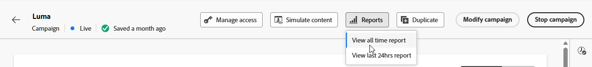

# 实时活动营销活动报告 {#campaign-global-report-cja-activity}

>[!BEGINSHADEBOX]

您可以通过单击营销活动中的&#x200B;**[!UICONTROL 报告]**&#x200B;按钮，然后选择&#x200B;**[!UICONTROL 查看所有时间报告]**&#x200B;来访问实时活动营销活动报告。 [了解详情](report-gs-cja.md)

>[!ENDSHADEBOX]

## 发送统计数据 {#sending-statistics-mobile}

**[!UICONTROL 发送统计数据]**&#x200B;表提供与实时活动营销活动相关的关键量度的详细概述。 它会显示重要信息，例如目标受众规模以及成功投放的推送通知数量，以帮助您评估实时推送通知的整体覆盖范围和性能。

+++ 了解有关发送统计信息量度的更多信息

* **[!UICONTROL 目标]**：在应用排除、禁止或同意移除之前，符合受众条件的配置文件数。

* **[!UICONTROL 发送]**：尝试发送到目标用户档案的推送通知总数。

* **[!UICONTROL 已投放]**：成功传送到设备的推送通知数，与尝试发送的通知总数相关。

* **[!UICONTROL 发送错误]**：由于错误（例如，令牌无效或连接问题）而无法发送的推送通知总数。

* **[!UICONTROL 发送排除项]**： Adobe Journey Optimizer不发送的用户档案数（例如，由于选择退出状态或资格规则）。

+++

## 实时活动生命周期 {#lifecycle}

**[!UICONTROL 实时活动生命周期]**&#x200B;表提供了实时活动随时间变化的全面视图。 它提供对关键事件（如活动何时开始、更新或结束）的可见性，帮助您更好地了解用户参与和实时活动营销活动的整个生命周期。

+++ 了解有关实时活动生命周期量度的更多信息

* **[!UICONTROL 远程启动]**：远程启动的实时活动数，通常由服务器或后端系统触发。

* **[!UICONTROL 本地启动]**：在用户设备上本地启动的实时活动数，通常由用户交互或客户端触发器引起。

**[!UICONTROL 更新]**：发送到设备的实时活动更新总数。 更新可以包括状态更改、新内容或进度通知。

**[!UICONTROL 结束]**：已结束的实时活动数，这些活动在完成时自动结束，或通过定义的触发器或超时手动结束。

**[!UICONTROL 总数计数]**：所有实时活动生命周期事件的总数，包括开始、更新和结束，提供了实时活动量的完整衡量标准。

+++

## 错误原因 {#error-reasons}

**[!UICONTROL 错误原因]**&#x200B;表允许您识别实时活动发送过程中发生的特定错误，从而便于全面分析遇到的任何问题。

## 排除的原因 {#excluded-reasons}

**[!UICONTROL 排除的原因]**&#x200B;表直观地描述了导致从目标受众中排除用户配置文件，阻止他们接收您的实时活动的各种因素。
