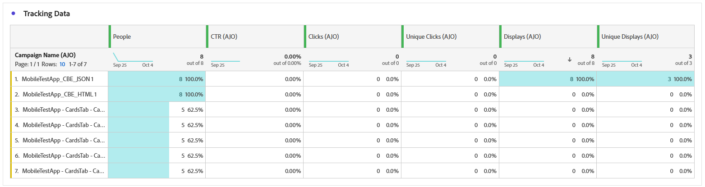

# 基于代码的营销活动报告 {#campaign-global-report-cja-code}

## 显示并点击 {#impressions-code}

**[!UICONTROL 显示和点击]**&#x200B;图形显示配置文件与您的基于代码的体验的互动情况的详细分析，提供有关配置文件与您的内容如何互动的宝贵见解。

+++ 了解有关“展示次数”和“点击次数”量度的更多信息

* **[!UICONTROL 唯一点击次数]**：点击您体验中内容的用户档案数。

* **[!UICONTROL 点击次数]**：内容在体验中的点击次数。

* **[!UICONTROL 显示]**：体验被打开的次数。

* **[!UICONTROL 独特显示]**：体验打开的次数，一个配置文件的多个交互未考虑在内。

+++

## 跟踪数据 {#track-data-code}

**[!UICONTROL 跟踪数据]**&#x200B;表提供与您的基于代码的体验绑定的配置文件活动的详细快照，提供有关参与和体验效果的基本见解。

+++ 了解有关跟踪数据量度的更多信息

* **[!UICONTROL 人员]**：符合体验目标配置文件资格的用户配置文件数。

* **[!UICONTROL 点进率(CTR)]**：与您的体验交互的用户百分比。

* **[!UICONTROL 点击次数]**：内容在体验中的点击次数。

* **[!UICONTROL 唯一点击次数]**：点击您体验中内容的用户档案数。

* **[!UICONTROL 显示]**：您的体验被打开的次数。

* **[!UICONTROL 独特显示]**：您的体验被打开的次数，一个配置文件的多个交互未考虑在内。

+++

## 跟踪关联标签 {#track-link-code}

**[!UICONTROL 跟踪的链接标签]**&#x200B;表提供了基于代码的体验中链接标签的全面概述，突出显示生成最高访客流量的那些标签。 此功能使您能够识别最受欢迎的链接并确定其优先级。

+++ 了解有关跟踪链接标签量度的更多信息

* **[!UICONTROL 唯一点击次数]**：点击了您的基于代码的体验中的内容的用户档案数。

* **[!UICONTROL 点击次数]**：在基于代码的体验中点击内容的次数。

* **[!UICONTROL 显示]**：体验被打开的次数。

* **[!UICONTROL 独特显示]**：体验打开的次数，一个配置文件的多个交互未考虑在内。

+++
