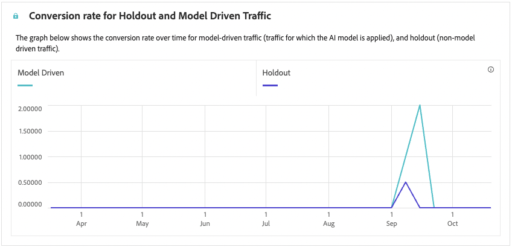

# 基于代码的营销活动报告 {#campaign-global-report-cja-code}

>[!BEGINSHADEBOX]

您可以通过单击营销活动中的&#x200B;**[!UICONTROL 报告]**&#x200B;按钮，然后选择&#x200B;**[!UICONTROL 查看所有时间报告]**&#x200B;来访问基于代码的营销活动报告。 [了解详情](report-gs-cja.md)

>[!ENDSHADEBOX]

## 显示并点击 {#impressions-code}

**[!UICONTROL 显示和点击]**&#x200B;图形显示配置文件与您的基于代码的体验的互动情况的详细分析，提供有关配置文件与您的内容如何互动的宝贵见解。

+++ 进一步了解“展示次数”和“点击次数”量度

* **[!UICONTROL 唯一点击次数]**：点击您体验中内容的用户档案数。

* **[!UICONTROL 点击次数]**：内容在体验中的点击次数。

* **[!UICONTROL 显示]**：体验被打开的次数。

* **[!UICONTROL 独特显示]**：体验打开的次数，一个配置文件的多个交互未考虑在内。

+++

## 跟踪数据 {#track-data-code}

**[!UICONTROL 跟踪数据]**&#x200B;表提供与您的基于代码的体验绑定的配置文件活动的详细快照，提供有关参与和体验效果的基本见解。

+++ 了解有关跟踪数据量度的更多信息

* **[!UICONTROL 人员]**：符合体验目标配置文件资格的用户配置文件数。

* **[!UICONTROL 点进率(CTR)]**：与您的体验交互的用户百分比。

* **[!UICONTROL 点击次数]**：内容在体验中的点击次数。

* **[!UICONTROL 唯一点击次数]**：点击您体验中内容的用户档案数。

* **[!UICONTROL 显示]**：您的体验被打开的次数。

* **[!UICONTROL 独特显示]**：您的体验被打开的次数，一个配置文件的多个交互未考虑在内。

+++

## 跟踪关联标签 {#track-link-code}

**[!UICONTROL 跟踪的链接标签]**&#x200B;表提供了基于代码的体验中链接标签的全面概述，突出显示生成最高访客流量的那些标签。 此功能使您能够识别最受欢迎的链接并确定其优先级。

+++ 了解有关跟踪的链接标签量度的更多信息

* **[!UICONTROL 唯一点击次数]**：点击了您的基于代码的体验中的内容的用户档案数。

* **[!UICONTROL 点击次数]**：在基于代码的体验中点击内容的次数。

* **[!UICONTROL 显示]**：体验被打开的次数。

* **[!UICONTROL 独特显示]**：体验打开的次数，一个配置文件的多个交互未考虑在内。

+++

## 决策报告 {#decisioning-reporting}

### 决策KPI {#decisioning-kpis}

**决策KPI**&#x200B;提供关于访客与您的体验的参与度的关键洞察，包括以下量度：

* **[!UICONTROL 项目总数]**：在指定时间段内属于个性化体验或决策流程的个人项目总数。

* **[!UICONTROL 总显示次数]**：

* **[!UICONTROL 总点击次数]**：用户在指定时间段内点击项、链接、产品或其他交互元素的总次数。

* **[!UICONTROL 回退率]**：未限定选择策略的实例百分比，导致显示通用选项或不太具体的选项。

### 参与漏斗 {#engagement-funnel}

**[!UICONTROL 参与漏斗]**&#x200B;表通过评估漏斗的每个阶段驱动用户交互的有效性来监控个性化体验的性能。

* **[!UICONTROL 显示]**：向不同接触点的用户显示或展示个性化体验的总次数。

* **[!UICONTROL 点击次数]**：用户点击向其显示的个性化体验的总次数。

### 按点进率显示的热门决策项目 {#top-decision}

按CTR **列出的**&#x200B;个热门决策项，该表根据各个项目的点进率突出显示它们的性能。 此量度有助于评估哪些项目在吸引用户和推动交互方面最有效。

* **[!UICONTROL 点进率(CTR)]**：点击链接、广告或推荐的用户相对于其显示次数的百分比。

### 按选择策略划分的参与漏斗 {#engagement-funnel-selection}

**[!UICONTROL 按选择策略划分的参与漏斗]**&#x200B;表可帮助您监视和分析不同的选择策略如何有效地吸引具有个性化体验的用户。

* **[!UICONTROL 显示]**：向不同接触点的用户显示或展示个性化体验的总次数。

* **[!UICONTROL 点击次数]**：用户点击向其显示的个性化体验的总次数。

### 决策项目绩效 {#decision-items-performance}

**[!UICONTROL 决策项目性能]**&#x200B;表评估每个项目在吸引用户并推动所需操作（如购买、点击或其他响应）方面的性能。

* **[!UICONTROL 显示]**：向不同接触点的用户显示或展示个性化体验的总次数。

* **[!UICONTROL 点击次数]**：用户点击向其显示的个性化体验的总次数。

### 排名策略 {#ranking-strategy}

>[!NOTE]
>
>**[!UICONTROL 排名策略]**&#x200B;表仅在将AI模型合并到营销活动中时可用。 [了解详情](../experience-decisioning/ranking.md)

**[!UICONTROL 排名策略]**&#x200B;表提供了对比较两种流量类型的个性化体验中AI驱动排名模型性能的分析：

* **模型驱动**：用户接收由AI模型排名的内容，该排名针对相关性和参与度进行了优化。

* **维持**：用户在模型探索阶段收到随机提供的内容。

显示的关键量度包括：

* **[!UICONTROL 显示]**：向不同接触点的用户显示或展示个性化体验的总次数。

* **[!UICONTROL 点击次数]**：用户点击向其显示的个性化体验的总次数。

* **[!UICONTROL 转化率]**：导致用户操作（例如点击）的显示百分比，指示模型成功吸引用户。

### 维持和模型驱动流量的转化率 {#conversion-rate}

>[!NOTE]
>
>仅当将AI模型合并到营销活动中时，维持&#x200B;**[!UICONTROL 转化率和模型驱动流量]**&#x200B;图才可用。 [了解详情](../experience-decisioning/ranking.md)

保持和模型驱动流量的&#x200B;**[!UICONTROL 转化率]**&#x200B;图表显示两种类型流量随时间变化的转化率：

* **模型驱动**：用户接收由AI模型排名的内容，该排名针对相关性和参与度进行了优化。

* **维持**：用户在模型探索阶段收到随机提供的内容。
<!--
>[!CAUTION]
>
>When using an AI model incorporated into a [ranking formula](../experience-decisioning/exd-ranking-formulas.md#create-ranking-formula), data are not reflected in the Conversion rate report.-->
