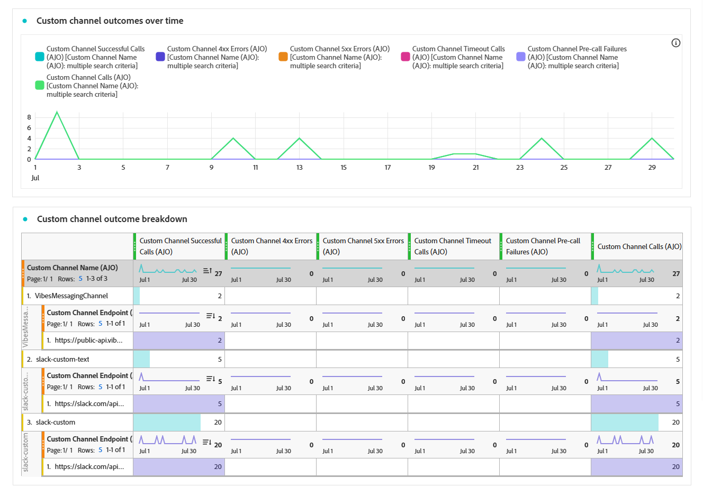

# 自定义渠道营销活动报告 {#campaign-global-report-cja-custom-channel}

>[!BEGINSHADEBOX]

**在此页面上：**&#x200B;了解如何在Adobe Journey Optimizer中阅读自定义渠道营销活动报告，以查看自定义渠道调用的KPI、结果、延迟和结果细分。

>[!ENDSHADEBOX]

>[!BEGINSHADEBOX]

您可以访问自定义渠道营销活动报告，方法是单击营销活动中的&#x200B;**[!UICONTROL 报告]**&#x200B;按钮，然后选择&#x200B;**[!UICONTROL 查看所有时间报告]**。 [了解详情](report-gs-cja.md)

>[!ENDSHADEBOX]

## KPI {#kpis-custom}

**[!UICONTROL KPI]**&#x200B;部分提供自定义渠道调用的运行状况和可靠性的综合视图。

+++ 了解有关KPI量度的更多信息

* **[!UICONTROL 成功的调用]**：返回有效响应且无错误的HTTP调用总数。

* **[!UICONTROL 4xx错误]**：由于客户端错误、突出显示配置问题或终结点故障而失败的调用数。

* **[!UICONTROL 5xx错误]**：由于服务器端错误、突出显示配置问题或终结点故障而失败的调用数。

* **[!UICONTROL 超时调用]**：因超过最大响应时间而失败的调用数。 这有助于显示外部端点的滞后或性能问题。

* **[!UICONTROL 预调用失败]**：在对外部端点进行HTTP调用之前失败的自定义渠道发送次数。 这些故障发生在[!DNL Journey Optimizer]自己的基础结构层，而不是外部系统中，包括身份验证故障、请求生成错误和HTTP解析错误。

* **[!UICONTROL 平均延迟]**：所有HTTP调用的平均端到端响应时间（以毫秒为单位），包括成功的调用、错误和超时。

+++

## 自定义渠道结果 {#outcomes-custom}

**[!UICONTROL 结果]**&#x200B;图形显示所选时段的HTTP调用KPI趋势，其粒度取决于所选的时间范围（7天报表为每天，1天时间范围为每小时，1小时时间范围为每分钟），而&#x200B;**[!UICONTROL 结果细分]**&#x200B;表提供这些HTTP调用量度的层次细分，从顶层的每个端点的总体量度，到使用该端点的每个自定义渠道的量度，再到底层依赖它们的营销活动和历程。

+++ 了解有关结果划分量度的更多信息

* **[!UICONTROL 自定义渠道成功]**：返回有效响应且无错误的HTTP调用总数。

* **[!UICONTROL 4xx错误]**：由于客户端错误、突出显示配置问题或终结点故障而失败的调用数。

* **[!UICONTROL 5xx错误]**：由于服务器端错误、突出显示配置问题或终结点故障而失败的调用数。

* **[!UICONTROL 超时调用]**：因超过最大响应时间而失败的调用数。 这有助于显示外部端点的滞后或性能问题。

* **[!UICONTROL 预调用失败]**：在对外部端点进行HTTP调用之前失败的自定义渠道发送次数。 这些故障发生在[!DNL Journey Optimizer]自己的基础结构层，而不是外部系统中，包括身份验证故障、请求生成错误和HTTP解析错误。

* **[!UICONTROL 呼叫]**： HTTP呼叫总数，包括成功的呼叫、错误和逾时。

+++

## 延迟 {#latency-custom}

**[!UICONTROL 延迟]**&#x200B;图形和表可视化了延迟量度的趋势。 利用这些视图，您可以跟踪性能模式、识别峰值延迟时段并监视优化或系统更改随时间变化的影响。

+++ 了解有关延迟量度的更多信息

* **[!UICONTROL 平均延迟]**：所有HTTP调用的平均端到端响应时间（以毫秒为单位），包括成功的调用、错误和超时。

* **[!UICONTROL 平均成功延迟]**：返回有效响应且无错误的HTTP调用的平均端到端响应时间（以毫秒为单位）。

+++
