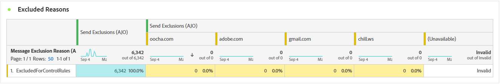

# 电子邮件营销活动报告 {#campaign-global-report-cja-email}

>[!INFO]
>
>由于Apple为其本机邮件应用程序引入了新的隐私保护功能（包括邮件隐私保护），发件人将无法再使用跟踪像素来收集有关已启用Apple邮件隐私保护的用户档案的数据。 因此，Adobe Journey Optimizer使用跟踪像素跟踪电子邮件打开次数的功能可能会受到影响。
> [了解有关Apple iOS隐私更改对电子邮件营销的影响的更多信息](https://experienceleaguecommunities.adobe.com/t5/adobe-campaign-classic-blogs/the-impact-of-apple-ios-privacy-changes-on-email-marketing-and/ba-p/699780)。
> 
> 我们建议将重点放在点击量和转化量度上，而不是放在打开率上，以获取更准确的见解。

>[!BEGINSHADEBOX]

您可以访问电子邮件促销活动报告，方法是单击促销活动中的&#x200B;**[!UICONTROL 报告]**&#x200B;按钮，然后选择&#x200B;**[!UICONTROL 查看所有时间报告]**。 [了解详情](report-gs-cja.md)

>[!ENDSHADEBOX]

## 电子邮件KPI

**[!UICONTROL 电子邮件]**&#x200B;关键绩效指标(KPI)可提供包含独特汇总量度的重点仪表板，这些量度可反映电子邮件营销活动的绩效和参与度级别。

+++ 了解有关电子邮件KPI量度的更多信息

* **[!UICONTROL 独特点进率]**：点击电子邮件中至少一个链接的唯一用户档案的百分比，与独特投放的电子邮件数量相关。

* **[!UICONTROL 点进打开率(CTOR)]**：与消息交互的用户档案的百分比。

* **[!UICONTROL 独特打开率]**：至少打开过电子邮件一次的独特用户档案的百分比，与独特投放的电子邮件数量相关。

* **[!UICONTROL 独特退回率]**：电子邮件至少退回一次的独特用户档案的百分比（基于独特发送总数）。

* **[!UICONTROL 已投放]**：成功发送的电子邮件数与已发送的邮件总数相关。

* **[!UICONTROL 唯一已投放]**：成功收到至少一条消息的独特配置文件数。

* **[!UICONTROL 预计打开次数]**：估计总电子邮件打开次数，这些总打开次数既包括用户档案直接打开的次数，也包括邮件服务器触发的自动打开次数。 此量度通过将手动打开电子邮件的收件人计算的打开率应用于仅由邮件服务器打开电子邮件的收件人，来调整由邮件服务器为隐私或安全扫描触发的打开。

* **[!UICONTROL 独特预计打开次数]**：预计打开电子邮件的独特电子邮件收件人的数量。 此量度旨在通过将根据手动打开电子邮件的独特用户档案计算的独特打开率应用于仅由邮件服务器打开电子邮件的用户，提供由邮件服务器为隐私或安全扫描触发的个人参与度更准确的计数。

* **[!UICONTROL 点击次数]**：邮件中任意链接被点击的总次数，包括同一用户档案的多次点击。

* **[!UICONTROL 唯一点击次数]**：点击您邮件中内容的唯一用户档案数。

+++

## 独特点击漏斗

**[!UICONTROL 点击漏斗]**&#x200B;图形详细分析用户档案如何参与您的电子邮件内容，提供从投放到点击的交互各个阶段的宝贵见解，从而帮助您了解消息促进用户参与的效果。

+++ 了解有关点击漏斗量度的更多信息

* **[!UICONTROL 目标唯一]**：发送过程中目标唯一用户档案的数量。

* **[!UICONTROL 独特发送次数]**：至少尝试发送一封电子邮件的独特配置文件数。

* **[!UICONTROL 唯一已投放]**：成功收到至少一条消息的独特配置文件数。

* **[!UICONTROL 独特预计打开次数]**：预计打开电子邮件的独特电子邮件收件人的数量。 此量度旨在通过将根据手动打开电子邮件的独特用户档案计算的独特打开率应用于仅由邮件服务器打开电子邮件的用户，提供由邮件服务器为隐私或安全扫描触发的个人参与度更准确的计数。

* **[!UICONTROL 唯一点击次数]**：点击您邮件中内容的唯一用户档案数。

+++

## 独特投放状态

**[!UICONTROL 投放状态]**&#x200B;图形全面反映了营销活动中与已发送电子邮件相关的数据，提供了对关键量度（如投放和退回）的分析。 这样即可对电子邮件发送过程进行详细分析，从而提供关于营销活动效率和绩效的宝贵信息。

+++ 了解有关投放状态量度的更多信息

* **[!UICONTROL 独特发送错误]**：在出站过程中遇到至少一个发送错误的独特配置文件数。

* **[!UICONTROL 唯一已投放]**：成功收到至少一条消息的独特配置文件数。

* **[!UICONTROL 独特发送排除项]**：由于预定义的规则或受众条件而排除接收消息的独特配置文件数。

* **[!UICONTROL 唯一退回]**：发送过程中至少有一条消息退回的唯一用户档案数。

+++

## 已交付与点击趋势 {#delivered-click}

**[!UICONTROL 已投放与点击趋势]**&#x200B;图显示您的个人资料与电子邮件交互情况的详细分析，提供了关于个人资料与内容交互情况的宝贵见解。 该图表使用两个轴来显示投放的电子邮件和点击次数，从而更容易识别与发送电子邮件数量相比的参与度异常模式或变化。

+++ 了解有关已交付与点击趋势量度的更多信息

* **[!UICONTROL 已投放]**：成功发送的电子邮件数与已发送的电子邮件总数相关。

* **[!UICONTROL 点击次数]**：内容在电子邮件中的点击次数。

+++

## 独特发送统计数据 {#unique-sending-statistics-email}

**[!UICONTROL 唯一发送统计数据]**&#x200B;表提供了营销活动中独特电子邮件绩效指标的详细概述。 它侧重于个人用户档案，例如唯一定位、投放、退回或排除的用户档案，从而更深入地了解您的电子邮件如何触及和吸引受众。

+++ 了解关于独特发送统计量度的更多信息

* **[!UICONTROL 目标唯一]**：发送过程中目标唯一用户档案的数量。

* **[!UICONTROL 独特发送次数]**：至少尝试发送一封电子邮件的独特配置文件数。

* **[!UICONTROL 独特送达次数]**：成功收到至少一封电子邮件的独特配置文件数。

* **[!UICONTROL 独特退回次数]**：至少有一封电子邮件导致退回的独特配置文件数。

* **[!UICONTROL 独特退回率]**：电子邮件至少退回一次的独特用户档案的百分比（基于独特发送总数）。

* **[!UICONTROL 唯一发送错误]**：在出站过程中遇到至少一个发送错误的唯一配置文件数。

* **[!UICONTROL 唯一发送排除项]**：由于资格规则、受众分段或个人资料状态而排除接收邮件的唯一个人资料数。

+++

## 独特跟踪统计数据 {#unique-tracking-statistics-email}

**[!UICONTROL 唯一跟踪统计数据]**&#x200B;表提供了营销活动中电子邮件用户档案级参与情况的集中视图。 它重点提供了独特的量度，提供了关于个人资料如何在参与的关键阶段与您的电子邮件内容进行交互的宝贵见解。

+++ 了解有关跟踪统计量度的更多信息

* **[!UICONTROL 独特点进率(CTR)]**：点击了电子邮件中至少一个链接的唯一用户档案的百分比，与独特已发送电子邮件的数量相关。

* **[!UICONTROL 独特点进打开率(CTOR)]**：独特用户档案在打开电子邮件后点击链接的百分比（基于独特打开次数）。

* **[!UICONTROL 独特打开率]**：至少打开过电子邮件一次的独特用户档案的百分比，与独特投放的电子邮件数量相关。

* **[!UICONTROL 独特点击次数]**：点击电子邮件中至少一段内容的独特配置文件数。

* **[!UICONTROL 独特预计电子邮件打开次数]**：预计打开电子邮件的独特电子邮件收件人的数量。 此量度旨在通过将根据手动打开电子邮件的独特用户档案计算的独特打开率应用于仅由邮件服务器打开电子邮件的用户，提供由邮件服务器为隐私或安全扫描触发的个人参与度更准确的计数。

* **[!UICONTROL 独特电子邮件取消订阅次数]**：单击电子邮件中或相关登陆页面上的取消订阅链接的唯一配置文件数。

+++

## 发送统计信息 {#sending-statistics-email}

**[!UICONTROL 发送统计数据]**&#x200B;表提供有关营销活动中电子邮件基本数据的全面摘要。 它详细说明了关键量度，例如与您的电子邮件的交互和成功投放的电子邮件数量，为您的电子邮件和营销策划的有效性和影响范围提供了有价值的见解。

+++ 了解有关发送统计信息量度的更多信息

* **[!UICONTROL 目标]**：发送过程中处理的电子邮件总数。

* **[!UICONTROL 发送]**：您的电子邮件的发送总数。

* **[!UICONTROL 已投放]**：成功发送的电子邮件总数，与已发送的邮件总数相关。

* **[!UICONTROL 跳出次数]**：在发送进程和自动返回处理期间累计的错误总数与已发送消息的总数之比。

* **[!UICONTROL 跳出率]**：导致跳出的电子邮件占已发送电子邮件总数的百分比。

* **[!UICONTROL 发送错误]**：发送过程中发生的阻止将错误发送到用户档案的错误总数。

* **[!UICONTROL 发送排除项]**： Adobe Journey Optimizer排除的用户档案总数。

+++

## 跟踪统计数据 {#tracking-statistics-email}

**[!UICONTROL 电子邮件 — 跟踪统计数据]**&#x200B;表提供与您的营销活动中包含的电子邮件相关的配置文件活动的详细帐户。 其中包括打开次数、点击次数和其他相关参与指示器的指标，可全面了解用户档案与电子邮件内容的交互方式。

+++ 了解有关跟踪统计量度的更多信息

* **[!UICONTROL 点进率(CTR)]**：与电子邮件交互的用户百分比。

* **[!UICONTROL 点进打开率(CTOR)]**：电子邮件的打开次数。

* **[!UICONTROL 预计电子邮件打开次数]**：预计总电子邮件打开次数，包括用户档案直接打开和邮件服务器触发的自动打开次数。 此量度通过将手动打开电子邮件的收件人计算的打开率应用于仅由邮件服务器打开电子邮件的收件人，来调整由邮件服务器为隐私或安全扫描触发的打开。

* **[!UICONTROL 点击次数]**：内容在电子邮件中的点击次数。

* **[!UICONTROL 垃圾邮件投诉次数]**：将邮件声明为垃圾邮件或垃圾邮件的次数。

* **[!UICONTROL 取消订阅]**：取消订阅链接或关联登陆页面上的点击次数。

+++

## 电子邮件域 {#email-domains}

**[!UICONTROL 电子邮件域]**&#x200B;表提供了按域分类的电子邮件的深入细分，提供了对电子邮件营销活动绩效指标的广泛见解。 通过这种全面的分析，您可以了解不同域在响应电子邮件内容时的行为。

+++ 了解有关电子邮件域量度的更多信息

* **[!UICONTROL 独特送达次数]**：成功收到至少一封电子邮件的独特配置文件数。

* **[!UICONTROL 预计电子邮件打开次数]**：预计总电子邮件打开次数，包括用户档案直接打开和邮件服务器触发的自动打开次数。 此量度通过将手动打开电子邮件的收件人计算的打开率应用于仅由邮件服务器打开电子邮件的收件人，来调整由邮件服务器为隐私或安全扫描触发的打开。

* **[!UICONTROL 独特点击次数]**：点击电子邮件中至少一段内容的独特配置文件数。

* **[!UICONTROL 独特退回次数]**：至少有一封电子邮件导致退回的独特配置文件数。

* **[!UICONTROL 唯一发送错误]**：在出站过程中遇到至少一个发送错误的唯一配置文件数。

* **[!UICONTROL 唯一发送排除项]**：由于资格规则、受众分段或个人资料状态而排除接收邮件的唯一个人资料数。

+++

## 跟踪关联标签 {#track-link-label}

**[!UICONTROL 跟踪的链接标签]**&#x200B;表提供了电子邮件中链接标签的全面概述，突出显示生成最高访客流量的那些标签。 此功能使您能够识别最受欢迎的链接并确定其优先级。

+++ 了解有关跟踪的链接标签量度的更多信息

* **[!UICONTROL 唯一点击次数]**：点击电子邮件中内容的用户档案数。

* **[!UICONTROL 点击次数]**：内容在电子邮件中的点击次数。

+++

## 跟踪关联 URL {#track-link-url}

**[!UICONTROL 跟踪的链接URL]**&#x200B;表提供了您的电子邮件中吸引最高访客流量的URL的全面概述。 这使您能够识别最受欢迎的链接并排定其优先级，从而加深您对电子邮件中特定内容的用户档案参与情况的了解。

+++ 了解有关跟踪的链接URL量度的更多信息

* **[!UICONTROL 唯一点击次数]**：点击电子邮件中内容的用户档案数。

* **[!UICONTROL 点击次数]**：内容在电子邮件中的点击次数。

+++

## 电子邮件主题 {#email-subjects}

**[!UICONTROL 电子邮件主题]**&#x200B;表全面概述了吸引最多访客流量的电子邮件主题。 此资源提供了有关受众参与动态的有价值见解。

+++ 了解有关电子邮件主题量度的更多信息

* **[!UICONTROL 独特打开率]**：至少打开过电子邮件一次的独特用户档案的百分比，与独特投放的电子邮件数量相关。

* **[!UICONTROL 独特预计电子邮件打开次数]**：预计打开电子邮件的独特电子邮件收件人的数量。 此量度旨在通过将根据手动打开电子邮件的独特用户档案计算的独特打开率应用于仅由邮件服务器打开电子邮件的用户，提供由邮件服务器为隐私或安全扫描触发的个人参与度更准确的计数。

* **[!UICONTROL 打开率]**：电子邮件打开次数占已发送电子邮件总数的百分比，包括同一用户档案多次打开的情况。

* **[!UICONTROL 预计电子邮件打开次数]**：预计总电子邮件打开次数，包括用户档案直接打开和邮件服务器触发的自动打开次数。 此量度通过将手动打开电子邮件的收件人计算的打开率应用于仅由邮件服务器打开电子邮件的收件人，来调整由邮件服务器为隐私或安全扫描触发的打开。

+++

## 排除的原因 {#excluded-reasons}

**[!UICONTROL 排除的原因]**&#x200B;表提供了导致从目标受众中排除用户个人资料导致未收到该消息的各种因素的综合视图。

有关排除原因的完整列表，请参阅[此页面](exclusion-list.md)。

## 退回原因 {#bounce-reasons-email}

**[!UICONTROL 退回原因]**&#x200B;表编译与退回邮件相关的可用数据，提供关于电子邮件退回具体原因的详细见解。

有关退回的详细信息，请参阅[禁止显示列表](../reports/suppression-list.md)页面。

## 错误原因 {#error-reasons-email}

**[!UICONTROL 错误原因]**&#x200B;表提供了在发送过程中发生的特定错误的可见性，提供了有关错误性质和发生情况的宝贵信息。
