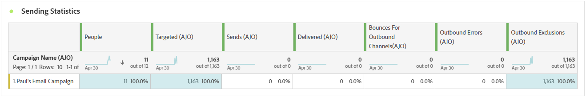
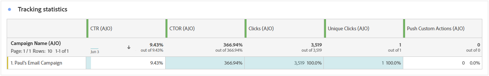
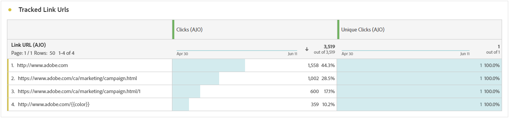
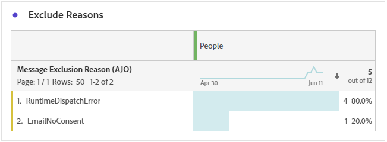

# 推送通知营销活动报告 {#campaign-global-report-cja-push}

>[!BEGINSHADEBOX]

**在此页面上：**&#x200B;了解如何在Adobe Journey Optimizer中阅读推送通知促销活动报告，以查看推送通知的发送和跟踪统计数据、跟踪的链接、退回、错误和排除原因。

>[!ENDSHADEBOX]

>[!BEGINSHADEBOX]

您可以访问推送通知促销活动报告，方法是单击促销活动中的&#x200B;**[!UICONTROL 报告]**&#x200B;按钮，然后选择&#x200B;**[!UICONTROL 查看所有时间报告]**。 [了解详情](report-gs-cja.md)

>[!ENDSHADEBOX]

## 发送统计数据 {#sending-statistics-push}

**[!UICONTROL 发送统计数据]**&#x200B;表提供了有关推送通知促销活动的基本数据的全面摘要。 它详细说明了关键量度，例如目标受众规模以及成功投放的推送通知数量，为您的推送通知的有效性和影响范围提供了有价值的见解。

+++ 了解有关发送统计信息量度的更多信息

* **[!UICONTROL 目标]**：在应用排除、禁止或同意移除之前，符合受众条件的配置文件数。 在启用了重新进入的历程中，用户档案可能会被定位多次。

* **[!UICONTROL 发送]**：推送通知的发送总数。

* **[!UICONTROL 已传递]**：成功发送的推送通知数与已发送的推送通知总数相关。

* **[!UICONTROL 唯一已投放]**：成功收到至少一个推送通知的用户档案数。

* **[!UICONTROL 出站错误]**：发生阻止将其发送到配置文件的错误总数。

* **[!UICONTROL 出站排除]**： Adobe Journey Optimizer已排除的用户档案数。

+++

## 跟踪统计数据 {#tracking-statistics-push}

**[!UICONTROL 跟踪统计数据]**&#x200B;表提供了与推送通知关联的配置文件活动的详细快照，提供了有关参与和推送通知有效性的基本见解。

+++ 了解有关跟踪统计量度的更多信息

* **[!UICONTROL 点进率(CTR)]**：与推送通知交互的用户百分比。

* **[!UICONTROL 点击次数]**：在推送通知中点击内容的次数。

* **[!UICONTROL 唯一点击次数]**：点击推送通知中内容的用户档案数。

* **[!UICONTROL 推送自定义操作]**：用户档案响应推送通知而采取的自定义操作数。

+++

## 跟踪的标签 {#track-link-label-push}

**[!UICONTROL 跟踪的链接标签]**&#x200B;表提供了推送通知中链接标签的全面概述，突出显示生成最高访客流量的链接标签。 此功能使您能够识别最受欢迎的链接并确定其优先级。

+++ 了解有关跟踪的链接标签量度的更多信息

* **[!UICONTROL 唯一点击次数]**：点击推送通知中内容的用户档案数。

* **[!UICONTROL 点击次数]**：在推送通知中点击内容的次数。

+++

## 跟踪关联 URL {#track-link-url-push}

**[!UICONTROL 跟踪的链接URL]**&#x200B;表提供了推送通知中吸引最高访客流量的URL的全面概述。 这使您能够识别最受欢迎的链接并确定其优先级，从而更好地了解推送通知中特定内容的用户档案参与情况。

+++ 了解有关跟踪的链接URL量度的更多信息

* **[!UICONTROL 唯一点击次数]**：点击推送通知中内容的用户档案数。

* **[!UICONTROL 点击次数]**：在推送通知中点击内容的次数。

+++

## 退回原因 {#bounce-reasons-push}

**[!UICONTROL 退回原因]**&#x200B;表提供了与退回推送通知相关的数据的全面概述，从而针对推送通知退回实例背后的具体原因提供了宝贵的见解。

## 错误原因 {#error-reasons-push}

**[!UICONTROL 错误原因]**&#x200B;表允许您识别推送通知发送过程中发生的特定错误，从而便于全面分析遇到的任何问题。

+++ 了解有关错误原因的更多信息

根据推送通知提供程序（[!DNL Apple Push Notification service (APNs)]或[!DNL Firebase Cloud Messaging (FCM)]）返回的响应，将每个推送通知发送分类为以下原因之一：

* **SENT**：提供程序已接受通知。
* **阻止列表**：设备令牌不再有效（例如，应用程序已卸载或令牌已过期）。 令牌将添加到中，并跳过将来发送到该令牌的过程。
* **MALFORM_NOTIFICATION**：通知有效负载被提供程序拒绝为无效（例如，有效负载太大、为空或缺少必填字段）。
* **INVALID_PUSH_CREDENTIAL**：用于发送通知的推送凭据（证书、密钥或主题配置）无效或与目标设备/应用程序不匹配。
* **PUSH_PROVIDER_ERROR**：提供程序返回暂时性或意外错误（例如，速率限制或内部错误）。 将自动重试这些发送。

**个APN**

| HTTP状态 | APNs原因 | 错误原因 |
| --- | --- | --- |
| 400 / 410 | `Unregistered`, `ExpiredToken`, `BadDeviceToken` | 阻止列表 |
| 400 / 413 | `PayloadTooLarge`, `PayloadEmpty`, `InvalidPushType`, `BadTopic`, `MissingTopic` | 格式错误的通知 |
| 400 / 403 | `DeviceTokenNotForTopic`, `BadCertificate`, `TopicDisallowed`, `BadCertificateEnvironment` | INVALID_PUSH_CREDENTIAL |
| 429 / 500 / 503 | `TooManyRequests`, `TooManyProviderTokenUpdates`, `InternalServerError`, `ServiceUnavailable` | PUSH_PROVIDER_ERROR |
| 任何其他 | 任何其他/无 | PUSH_PROVIDER_ERROR |

**FCM**

| HTTP状态 | FCM错误代码 | 错误原因 |
| --- | --- | --- |
| 404 | `UNREGISTERED` (`NOT_FOUND`) | 阻止列表 |
| 400 | `INVALID_ARGUMENT` | 格式错误的通知 |
| 403 | `SENDER_ID_MISMATCH` (`PERMISSION_DENIED`) | INVALID_PUSH_CREDENTIAL |
| 429 | `QUOTA_EXCEEDED` (`RESOURCE_EXHAUSTED`) | PUSH_PROVIDER_ERROR |
| 500 | `INTERNAL` | PUSH_PROVIDER_ERROR |
| 503 | `UNAVAILABLE` | PUSH_PROVIDER_ERROR |
| 任何其他 | `UNSPECIFIED_ERROR`/任何其他/无 | PUSH_PROVIDER_ERROR |

+++

## 排除原因 {#exclude-reasons-push}

**[!UICONTROL 排除原因]**&#x200B;表直观地描述了导致从目标受众中排除用户个人资料的各种因素，阻止他们接收您的推送通知。

有关排除原因的完整列表，请参阅[此页面](exclusion-list.md)。
