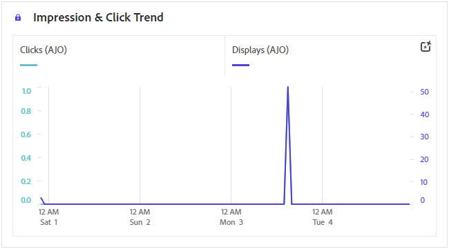
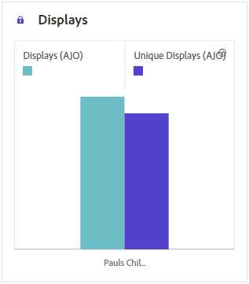
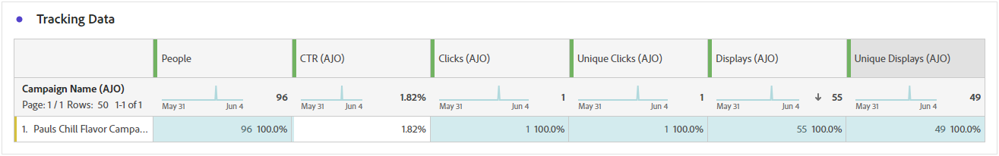

# Web 营销活动报告 {#campaign-global-report-cja-web}

>[!BEGINSHADEBOX]

**在此页面上：**&#x200B;了解如何在Adobe Journey Optimizer中阅读Web促销活动报告，以分析您网页的展示和点击趋势、跟踪数据和跟踪链接。

>[!ENDSHADEBOX]

>[!BEGINSHADEBOX]

您可以访问您的Web营销活动报告，方法是单击营销活动中的&#x200B;**[!UICONTROL 报告]**&#x200B;按钮，然后选择&#x200B;**[!UICONTROL 查看所有时间报告]**。 [了解详情](report-gs-cja.md)

>[!ENDSHADEBOX]

## 展示和点击趋势 {#impressions-web}

**[!UICONTROL 展示和点击趋势]**&#x200B;图显示个人资料与网页交互情况的详细分析，提供有关个人资料与内容交互情况的宝贵见解。

+++ 了解有关“展示次数”和“点击次数”趋势量度的更多信息

* **[!UICONTROL 点击次数]**：内容在网页中的点击次数。

* **[!UICONTROL 显示]**：消息的打开次数。

+++

## 点击次数 {#clicks-web}

**[!UICONTROL 点击量]**&#x200B;图形显示网页点击量度，同时显示内容点击总数和点击内容的独特配置文件数。

+++ 了解有关点击量度的更多信息

* **[!UICONTROL 唯一点击次数]**：点击您网页中内容的配置文件数。

* **[!UICONTROL 点击次数]**：内容在网页中的点击次数。

+++

## 显示数 {#displays-web}

**[!UICONTROL 显示]**&#x200B;图形可帮助您了解消息的整体影响范围以及与消息交互的唯一用户档案的数量。

+++ 了解有关显示量度的更多信息

* **[!UICONTROL 显示]**：消息的打开次数。

* **[!UICONTROL 独特显示]**：消息的打开次数，一个用户档案的多个交互未考虑在内。

+++

## 跟踪数据 {#track-data-web}

**[!UICONTROL 跟踪数据]**&#x200B;表提供了与您的网页关联的配置文件活动的详细快照，提供了有关参与和网页效果的基本见解。

+++ 了解有关跟踪数据量度的更多信息

* **[!UICONTROL 人员]**：符合网页目标配置文件资格的用户配置文件数。

* **[!UICONTROL 点进率(CTR)]**：与网页交互的用户百分比。

* **[!UICONTROL 点击次数]**：内容在网页中的点击次数。

* **[!UICONTROL 唯一点击次数]**：点击您网页中内容的配置文件数。

* **[!UICONTROL 显示]**：网页被打开的次数。

* **[!UICONTROL 独特显示]**：网页被打开的次数，一个配置文件的多个交互未考虑在内。

+++

## 跟踪关联标签 {#track-link-web}

**[!UICONTROL 跟踪的链接标签]**&#x200B;表提供了网页中链接标签的全面概述，突出显示生成最高访客流量的链接标签。 此功能使您能够识别最受欢迎的链接并确定其优先级。

+++ 了解有关跟踪的链接标签量度的更多信息

* **[!UICONTROL 唯一点击次数]**：点击您网页中内容的配置文件数。

* **[!UICONTROL 点击次数]**：内容在网页中的点击次数。

* **[!UICONTROL 显示]**：消息的打开次数。

* **[!UICONTROL 独特显示]**：消息的打开次数，一个用户档案的多个交互未考虑在内。

+++

## 跟踪关联 URL {#track-url-web}

**[!UICONTROL 跟踪的链接URL]**&#x200B;表提供了网页中吸引最高访客流量的URL的全面概述。 这使您能够识别最受欢迎的链接并排定其优先顺序，从而更好地了解您对网页中特定内容的个人资料参与情况。

+++ 了解有关跟踪的链接URL量度的更多信息

* **[!UICONTROL 唯一点击次数]**：点击您网页中内容的配置文件数。

* **[!UICONTROL 点击次数]**：内容在网页中的点击次数。

* **[!UICONTROL 显示]**：消息的打开次数。

* **[!UICONTROL 独特显示]**：消息的打开次数，一个用户档案的多个交互未考虑在内。

+++
