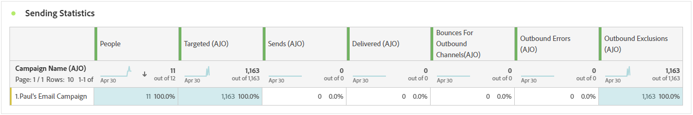
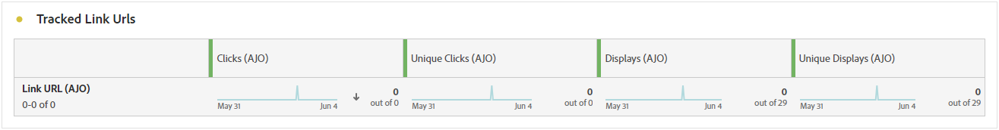

# 营销活动报告 {#campaign-global-report-cja}

此 **营销活动报告** 充当一个全面的功能板，提供与活动关联的关键量度的详细分析。 其中包括点击计数、投放消息、用户档案编号和已执行操作等数据。 该报告提供了营销活动效率和参与级别的完整概述，从而确保全面了解营销活动的整体效果。

您可以使用直接从Campaign访问营销活动报表 **[!UICONTROL 报表]** 按钮。

此 **营销活动报告** 根据所选的渠道，将显示以下选项卡：

* [Campaign](#campaign-global)
* [试验](#experimentation)
* [电子邮件](#email-global)
* [短信](#sms)
* [推送通知](#push-notification)
* [直邮](#direct-mail)
* [Web](#web)

要了解有关Customer Journey AnalyticsWorkspace以及如何过滤和分析数据的更多信息，请参阅 [此页面](https://experienceleague.adobe.com/en/docs/analytics-platform/using/cja-workspace/home).

## Campaign {#campaign-global}

### 营销活动KPI {#campaign-kpis}

此 **[!UICONTROL 营销活动]** 关键绩效指标(KPI)可用作一个功能全面的功能板，提供与活动关联的基本量度分析。 其中包括点击次数和已投放消息数等详细信息，可全面了解促销活动的效率和参与级别。

KPI将因您的营销活动中使用的渠道而异。

+++ 了解有关营销活动KPI量度的更多信息

* **[!UICONTROL 点进率]**：与消息交互的用户的百分比。

* **[!UICONTROL 点击次数]**：内容在消息中的点击次数。

* **[!UICONTROL 已投放]**：成功发送的电子邮件数，与已发送消息的总数相关。

* **[!UICONTROL 显示]**：消息的打开次数。

+++

### Campaign 概述 {#delivery-global}

此 **[!UICONTROL Campaign概述]** 此表是一个全面的功能板，提供了与营销活动相关的关键量度的详细细目。 这包括基本信息（如用户档案数量和已交付的操作），从而可全面了解营销活动的绩效和参与情况。

请注意，根据您的营销活动中使用的渠道，量度会有所不同。

+++ 了解有关Campaign概述量度的更多信息

* **[!UICONTROL 人员]**：符合消息目标用户档案资格的用户档案数。

* **[!UICONTROL 点进率]**：与消息交互的用户的百分比。

* **[!UICONTROL 点击次数]**：内容在消息中的点击次数。

* **[!UICONTROL 独特点击]**：单击消息中内容的用户档案数。

* **[!UICONTROL 已投放]**：成功发送的电子邮件数，与已发送消息的总数相关。

* **[!UICONTROL 出站渠道的跳出次数]**：在发送流程和自动返回处理期间累计的错误总数与已发送消息总数相关。

* **[!UICONTROL 出站错误]**：发送过程中发生的阻止将消息发送到用户档案的错误总数。

* **[!UICONTROL 出站排除项]**：Adobe Journey Optimizer已排除的用户档案数。

* **[!UICONTROL 显示]**：消息的打开次数。

* **[!UICONTROL 独特显示]**：消息的打开次数，不考虑一个用户档案的多个交互。

+++

### Campaign 漏斗结果 {#campaign-funnel}

此 **[!UICONTROL 营销活动漏斗结果]** 图形可详细分析用户档案与消息的互动情况，提供各种用户档案与内容互动情况的宝贵见解。

+++ 了解有关Campaign漏斗结果量度的更多信息

* **[!UICONTROL 已投放]**：成功发送的电子邮件数，与已发送消息的总数相关。

* **[!UICONTROL 点击次数]**：内容在消息中的点击次数。
+++

### 跟踪的链接标签 {#campaign-track}

此 **[!UICONTROL 跟踪的链接标签]** 表提供了有关访客与消息中所包含URL参与度的基本信息，提供了有关哪些链接吸引最多交互的宝贵信息。

+++ 了解有关跟踪的链接标签量度的更多信息

* **[!UICONTROL 独特点击]**：单击消息中内容的用户档案数。

* **[!UICONTROL 点击次数]**：内容在消息中的点击次数。

+++

## 试验 {#experimentation}

此 **[!UICONTROL 试验]** 选项卡提供了有关每个变体性能的关键分析，并标识了最成功的变体。

请注意，定义最佳业绩者可能需要一些时间。 如果试验不成功，则会将其设置为 **无结论**.

### 试验KPI {#experimentation-kpis}

此 **[!UICONTROL 试验]** 关键绩效指标(KPI)可用作一个全面的功能板，提供与您的实验相关的基本量度分析。

+++ 了解有关试验KPI量度的更多信息

* **[!UICONTROL 提升]**：衡量给定治疗的转化率相对于基线的改进百分比。

* **[!UICONTROL 置信度]**：表明给定治疗与基线治疗相同的证据。 [了解详情](../content-management/experiment-calculations.md#understand-confidence)

+++

### 按集客点击量显示的变量 {#variant-inbound}

此 **[!UICONTROL 按集客点击量显示的变量]** 构件详细说明了每个变体的性能。
有关这些结果以及如何解释这些结果的深入研究，请参阅 [此页面](../content-management/get-started-experiment.md#interpret-results).

+++ 了解关于按集客点击量量度划分的变体的更多信息

* **[!UICONTROL 人员]**：符合消息目标用户档案资格的用户档案数。

* **[!UICONTROL 入站点击次数]**：跨出站渠道的点击总数。

* **[!UICONTROL 转化率]**：之前创建实验时选择的成功量度的总值除以配置文件数。

* **[!UICONTROL 提升]**：衡量给定治疗的转化率相对于基线的改进百分比。

* **[!UICONTROL 置信度]**：表明给定治疗与基线治疗相同的证据。 [了解详情](../content-management/experiment-calculations.md#understand-confidence)

<!--
* **[!UICONTROL Confidence Upper bound]**:

* **[!UICONTROL Confidence Lower bound]**:
-->
+++

### 入站点击的转化率 {#conversion-rate}

此 **[!UICONTROL 置信区间]** 图表衡量改进的不确定性。 它详细说明了基线和最佳业绩处理之间的业绩差异百分比。 [了解详情](../content-management/experiment-calculations.md#confidence-intervals)。

## 电子邮件 {#email-global}

### 已交付与点击趋势 {#delivered-click}

此 **[!UICONTROL 已交付与点击趋势]** 图形呈现用户档案与电子邮件互动的详细分析，提供关于用户档案与内容互动方式的宝贵见解。

+++ 了解更多有关已交付与点击趋势量度的信息

* **[!UICONTROL 已投放]**：成功发送的电子邮件数，与已发送电子邮件总数相关。

* **[!UICONTROL 点击次数]**：在电子邮件中点击内容的次数。

+++

### 投放状态 {#delivery-status}

此 **[!UICONTROL 投放状态]** graph可全面查看与您的营销活动中已发送电子邮件相关的数据，并提供对关键量度（如投放和跳出次数）的分析。 这样即可对电子邮件发送过程进行详细分析，从而提供关于营销活动效率和绩效的宝贵信息。

+++ 了解有关投放状态量度的更多信息

* **[!UICONTROL 已投放]**：成功发送的电子邮件数，与已发送电子邮件总数相关。

* **[!UICONTROL 出站渠道的跳出次数]**：与已发送消息总数相关的发送过程和自动返回处理期间累计的错误总数。

* **[!UICONTROL 出站错误]**：发送过程中发生的阻止将消息发送到用户档案的错误总数。

* **[!UICONTROL 出站排除项]**：Adobe Journey Optimizer已排除的用户档案数。

+++

### 发送统计信息 {#sending-statistics-email}

此 **[!UICONTROL 发送统计数据]** 该表提供了有关营销活动中电子邮件基本数据的全面摘要。 它详细说明了关键量度，例如与您的电子邮件的交互和成功投放的电子邮件数量，为您的电子邮件和营销策划的有效性和影响范围提供了有价值的见解。

+++ 了解有关发送统计量度的更多信息

* **[!UICONTROL 人员]**：符合消息目标用户档案资格的用户档案数。

* **[!UICONTROL 已定位]**：发送过程中处理的电子邮件总数。

* **[!UICONTROL 发送]**：电子邮件的发送总数。

* **[!UICONTROL 已投放]**：成功发送的电子邮件数，与已发送消息的总数相关。

* **[!UICONTROL 出站渠道的跳出次数]**：在发送流程和自动返回处理期间累计的错误总数与已发送消息总数相关。

* **[!UICONTROL 出站错误]**：发送过程中发生的阻止将消息发送到用户档案的错误总数。

* **[!UICONTROL 出站排除项]**：Adobe Journey Optimizer已排除的用户档案数。

+++

### 跟踪统计数据 {#tracking-statistics-email}

此 **[!UICONTROL 电子邮件 — 跟踪统计数据]** 表格提供了与您的营销策划中包含的电子邮件相关的用户档案活动的详细描述。 其中包括打开次数、点击次数和其他相关参与指示器的指标，可全面了解用户档案与电子邮件内容的交互方式。

+++ 了解有关跟踪统计量度的更多信息

* **[!UICONTROL 点进率(CTR)]**：与电子邮件交互的用户百分比。

* **[!UICONTROL 点进打开率(CTOR)]**：电子邮件的打开次数。

* **[!UICONTROL 点击次数]**：在电子邮件中点击内容的次数。

* **[!UICONTROL 独特点击]**：单击电子邮件中内容的用户档案数。

* **[!UICONTROL 电子邮件打开次数]**：您的电子邮件在营销活动中打开的次数。

* **[!UICONTROL 独特电子邮件打开次数]**：已打开电子邮件的百分比。

* **[!UICONTROL 垃圾邮件投诉数]**：将消息声明为垃圾邮件或垃圾邮件的次数。

* **[!UICONTROL 取消订阅]**：取消订阅链接的点击次数。

+++

### 电子邮件域 {#email-domains}

此 **[!UICONTROL 电子邮件域]** 表提供了按域分类的电子邮件深入细分，提供了对电子邮件营销活动绩效指标的广泛见解。 通过这种全面的分析，您可以了解不同域在响应电子邮件内容时的行为。

+++ 了解有关电子邮件域指标的更多信息

* **[!UICONTROL 发送]**：电子邮件的发送总数。

* **[!UICONTROL 已投放]**：成功发送的电子邮件数，与已发送电子邮件总数相关。

* **[!UICONTROL 电子邮件打开次数]**：您的电子邮件在营销活动中打开的次数。

* **[!UICONTROL 点击次数]**：在电子邮件中点击内容的次数。

* **[!UICONTROL 出站渠道的跳出次数]**：在发送流程和自动返回处理期间累计的错误总数与已发送电子邮件总数相关。

* **[!UICONTROL 出站错误]**：发送过程中发生的阻止将消息发送到用户档案的错误总数。
+++

### 跟踪关联标签 {#track-link-label}

此 **[!UICONTROL 跟踪的链接标签]** 表提供了电子邮件中链接标签的全面概述，突出显示生成最高访客流量的标签。 此功能使您能够识别最受欢迎的链接并确定其优先级。

+++ 了解有关跟踪链接标签量度的更多信息

* **[!UICONTROL 独特点击]**：单击电子邮件中内容的用户档案数。

* **[!UICONTROL 点击次数]**：在电子邮件中点击内容的次数。

+++

### 跟踪关联 URL {#track-link-url}

此 **[!UICONTROL 跟踪的链接URL]** 表提供了电子邮件中吸引最高访客流量的URL的全面概述。 这使您能够识别最受欢迎的链接并排定其优先级，从而加深您对电子邮件中特定内容的用户档案参与情况的了解。

+++ 了解有关跟踪的链接URL量度的更多信息

* **[!UICONTROL 独特点击]**：单击电子邮件中内容的用户档案数。

* **[!UICONTROL 点击次数]**：在电子邮件中点击内容的次数。

* **[!UICONTROL 显示]**：电子邮件的打开次数。

* **[!UICONTROL 独特显示]**：电子邮件的打开次数，不考虑一个用户档案的多次交互。

+++

### 电子邮件主题 {#email-subjects}

此 **[!UICONTROL 电子邮件主题]** 该表全面概述了吸引最多访客流量的电子邮件主题。 此资源提供了有关受众参与动态的有价值见解。

+++ 了解有关电子邮件主题量度的更多信息

* **[!UICONTROL 人员]**：符合电子邮件目标用户档案资格的用户配置文件数。

+++

### 排除的原因 {#excluded-reasons}

此 **[!UICONTROL 排除的原因]** 下表全面显示了导致从目标受众中排除用户个人资料导致未收到消息的不同因素。

请参阅 [此页面](exclusion-list.md) 以获取排除原因的完整列表。

### 退回原因 {#bounce-reasons-email}

此 **[!UICONTROL 退回原因]** 该表编译与退回邮件相关的可用数据，提供对电子邮件退回具体原因的详细分析。

有关退回的详细信息，请参阅 [禁止显示列表](../reports/suppression-list.md) 页面。

### 错误原因 {#error-reasons-email}

此 **[!UICONTROL 错误原因]** 表格提供了发送过程中发生的特定错误的可见性，提供了有关错误性质和发生情况的宝贵信息。

## 短信 {#sms}

### 已交付与点击趋势 {#delivered-click-sms}

此 **[!UICONTROL 已交付与点击趋势]** 图形呈现用户档案与电子邮件互动的详细分析，提供关于用户档案与内容互动方式的宝贵见解。

+++ 了解更多有关已交付与点击趋势量度的信息

* **[!UICONTROL 已投放]**：成功发送的短信消息数，与短信消息总数相关。

* **[!UICONTROL 点击次数]**：在短信消息中点击内容的次数。

+++

### 投放状态 {#delivery-status-sms}

此 **[!UICONTROL 投放状态]** 表提供与短信营销活动相关的用户档案活动的详细描述。 这包括有关投放的量度、点击量和其他相关参与指标，从而全面了解用户档案与短信内容的交互方式。

+++ 了解有关投放状态量度的更多信息

* **[!UICONTROL 已投放]**：成功发送的短信消息数，与短信消息总数相关。

* **[!UICONTROL 出站渠道的跳出次数]**：在发送流程和自动返回处理期间累计的错误总数与已发送短信消息的总数相关。

* **[!UICONTROL 出站错误]**：阻止将其发送到用户档案的错误总数。

* **[!UICONTROL 出站排除项]**：Adobe Journey Optimizer已排除的用户档案数。

+++

### 跟踪关联标签 {#track-link-label-sms}

此 **[!UICONTROL 跟踪的链接标签]** 表提供了短信消息中链接标签的全面概述，突出显示生成最高访客流量的标签。 此功能使您能够识别最受欢迎的链接并确定其优先级。

+++ 了解有关跟踪链接标签量度的更多信息

* **[!UICONTROL 独特点击]**：单击短信消息中内容的用户档案数。

* **[!UICONTROL 点击次数]**：在短信消息中点击内容的次数。

+++

### 跟踪关联 URL {#track-link-url-sms}

此 **[!UICONTROL 跟踪的链接URL]** 该表提供了短信消息中吸引最高访客流量的URL的全面概述。 这使您能够识别最受欢迎的链接并排定其优先顺序，从而更加了解短信消息中特定内容的用户档案参与情况。

+++ 了解有关跟踪的链接URL量度的更多信息

* **[!UICONTROL 独特点击]**：单击短信消息中内容的用户档案数。

* **[!UICONTROL 点击次数]**：在短信消息中点击内容的次数。

* **[!UICONTROL 显示]**：消息的打开次数。

* **[!UICONTROL 独特显示]**：消息的打开次数，不考虑一个用户档案的多个交互。

+++

### SMS 入站消息 {#sms-inbound}

此 **[!UICONTROL SMS入站消息]** 该表全面概述了哪些短信消息吸引的访客流量最高。 此资源提供了有关受众参与动态的有价值见解。

+++ 了解有关短信入站消息量度的更多信息

* **[!UICONTROL 人员]**：符合短信消息目标用户档案资格的用户档案数。

+++

### SMS消息类型 {#sms-message-type}

此 **[!UICONTROL SMS消息类型]** 该表全面概述了哪些短信消息类型吸引了最多访客。 此资源提供了有关受众参与动态的有价值见解。

+++ 了解有关短信消息类型量度的更多信息

* **[!UICONTROL 人员]**：符合短信消息目标用户档案资格的用户档案数。

+++

### SMS 提供者 {#sms-providers}

此 **[!UICONTROL 短信提供商]** 该表全面概述了哪些短信提供商吸引的访客流量最高。 此资源提供了有关受众参与动态的有价值见解。

+++ 了解有关短信提供商量度的更多信息

* **[!UICONTROL 人员]**：符合短信消息目标用户档案资格的用户档案数。

+++

### 退回原因 {#bounce-reasons-sms}

此 **[!UICONTROL 退回原因]** 该表提供了与弹回短信消息相关的数据的全面概述，从而针对短信消息退回实例背后的具体原因提供了宝贵的见解。

### 错误原因 {#error-reasons-sms}

此 **[!UICONTROL 错误原因]** 该表允许您识别在短信消息发送过程中发生的特定错误，便于对遇到的任何问题进行彻底分析。

### 排除原因 {#excluded-reasons-sms}

此 **[!UICONTROL 排除原因]** 该表直观地描述了导致从目标受众中排除用户配置文件，阻止他们接收短信消息的各种因素。

请参阅 [此页面](exclusion-list.md) 以获取排除原因的完整列表。

## 推送通知 {#push-notification}

### 发送统计信息 {#sending-statistics-push}

此 **[!UICONTROL 发送统计数据]** 该表全面汇总了有关推送通知促销活动的关键数据。 它详细说明了关键量度，例如目标受众规模以及成功投放的推送通知数量，为您的推送通知的有效性和影响范围提供了有价值的见解。

+++ 了解有关发送统计量度的更多信息

* **[!UICONTROL 人员]**：符合推送通知目标用户档案资格的用户档案数。

* **[!UICONTROL 已定位]**：分析期间处理的推送通知总数。

* **[!UICONTROL 发送]**：推送通知的发送总数。

* **[!UICONTROL 已投放]**：成功发送的推送通知数，与已发送推送通知的总数相关。

* **[!UICONTROL 出站渠道的跳出次数]**：在发送流程和自动返回处理期间累计的错误总数与推送通知总数相关。

* **[!UICONTROL 出站错误]**：阻止将其发送到用户档案的错误总数。

* **[!UICONTROL 出站排除项]**：Adobe Journey Optimizer已排除的用户档案数。

+++

### 跟踪统计数据 {#tracking-statistics-push}

此 **[!UICONTROL 跟踪统计数据]** 表格提供了与推送通知绑定的用户档案活动的详细快照，提供了有关参与和推送通知有效性的基本见解。

+++ 了解有关跟踪统计量度的更多信息

* **[!UICONTROL 点进率(CTR)]**：与推送通知交互的用户百分比。

* **[!UICONTROL 点进打开率(CTOR)]**：推送通知的打开次数。

* **[!UICONTROL 点击次数]**：在推送通知中点击内容的次数。

* **[!UICONTROL 独特点击]**：单击了推送通知中内容的用户档案数。

<!--
* **[!UICONTROL Push custom actions]**: 
-->
+++

### 跟踪关联标签 {#track-link-label-push}

此 **[!UICONTROL 跟踪的链接标签]** 表提供了推送通知中链接标签的全面概述，突出显示生成最高访客流量的标签。 此功能使您能够识别最受欢迎的链接并确定其优先级。

+++ 了解有关跟踪链接标签量度的更多信息

* **[!UICONTROL 独特点击]**：单击了推送通知中内容的用户档案数。

* **[!UICONTROL 点击次数]**：在推送通知中点击内容的次数。

+++

### 跟踪关联 URL {#track-link-url-push}

此 **[!UICONTROL 跟踪的链接URL]** 表提供了推送通知中吸引最高访客流量的URL的全面概述。 这使您能够识别最受欢迎的链接并确定其优先级，从而更好地了解推送通知中特定内容的用户档案参与情况。

+++ 了解有关跟踪的链接URL量度的更多信息

* **[!UICONTROL 独特点击]**：单击了推送通知中内容的用户档案数。

* **[!UICONTROL 点击次数]**：在推送通知中点击内容的次数。

+++

### 退回原因 {#bounce-reasons-push}

此 **[!UICONTROL 退回原因]** 该表提供了与推送通知退回相关的数据的全面概述，从而针对推送通知退回实例背后的具体原因提供了宝贵的见解。

### 错误原因 {#error-reasons-push}

此 **[!UICONTROL 错误原因]** 表允许您识别在发送推送通知过程中发生的特定错误，从而便于对遇到的任何问题进行彻底分析。

### 排除的原因 {#exclude-reasons-push}

此 **[!UICONTROL 排除原因]** 该表直观地描述了导致从目标受众中排除用户配置文件，从而阻止他们接收推送通知的各种因素。

请参阅 [此页面](exclusion-list.md) 以获取排除原因的完整列表。

## 应用程序内 {#in-app}

### 展示和点击趋势 {#impression-click-trend}

此 **[!UICONTROL 展示和点击趋势]** 图形可详细分析用户档案与应用程序内消息的互动情况，从而提供关于用户档案与内容互动情况的宝贵见解。

+++ 了解有关“展示次数”和“点击次数”趋势量度的更多信息

* **[!UICONTROL 点击次数]**：应用程序内消息中内容的点击次数。

* **[!UICONTROL 显示]**：消息的打开次数。

+++

### 点击次数 {#clicks-inapp}

此 **[!UICONTROL 点击次数]** 该图显示了应用程序内点击量度，说明了内容点击总数和点击内容的独特配置文件数。

+++ 了解有关点击量度的更多信息

* **[!UICONTROL 独特点击]**：单击应用程序内消息中内容的用户档案数

* **[!UICONTROL 点击次数]**：应用程序内消息中内容的点击次数。

+++

### 显示 {#display-inapp}

此 **[!UICONTROL 显示]** 图表有助于您了解消息的整体影响范围以及参与该消息的独特用户档案的数量。

+++ 了解有关显示量度的更多信息

* **[!UICONTROL 显示]**：消息的打开次数。

* **[!UICONTROL 独特显示]**：消息的打开次数，不考虑一个用户档案的多个交互。

+++

### 跟踪数据 {#tracking-data-inapp}

此 **[!UICONTROL 跟踪数据]** 表提供了与应用程序内消息绑定的用户档案活动的详细快照，提供了有关参与和应用程序内消息有效性的基本见解。

+++ 了解有关跟踪数据量度的更多信息

* **[!UICONTROL 人员]**：符合应用程序内消息的目标配置文件资格的用户配置文件数。

* **[!UICONTROL 点进率(CTR)]**：与应用程序内消息交互的用户百分比。

* **[!UICONTROL 点进打开率(CTOR)]**：应用程序内消息的打开次数。

* **[!UICONTROL 点击次数]**：应用程序内消息中内容的点击次数。

* **[!UICONTROL 独特点击]**：单击应用程序内消息中内容的用户档案数。

* **[!UICONTROL 显示]**：消息的打开次数。

* **[!UICONTROL 独特显示]**：消息的打开次数，不考虑一个用户档案的多个交互。

* **[!UICONTROL 发送]**：应用程序内消息的发送总数。

<!--
* **[!UICONTROL Inbound triggered]**: 

* **[!UICONTROL Inbound dismisses]**: 
-->
+++

### 跟踪关联标签 {#track-link-label-inapp}

此 **[!UICONTROL 跟踪的链接标签]** 表提供了应用程序内消息中链接标签的全面概述，突出显示生成最高访客流量的标签。 此功能使您能够识别最受欢迎的链接并确定其优先级。

+++ 了解有关跟踪链接标签量度的更多信息

* **[!UICONTROL 独特点击]**：单击应用程序内消息中内容的用户档案数。

* **[!UICONTROL 点击次数]**：应用程序内消息中内容的点击次数。

* **[!UICONTROL 显示]**：消息的打开次数。

* **[!UICONTROL 独特显示]**：消息的打开次数，不考虑一个用户档案的多个交互。

+++

### 跟踪关联 URL {#track-link-url-inapp}

此 **[!UICONTROL 跟踪的链接URL]** 该表全面概述了应用程序内消息中吸引最高访客流量的URL。 这使您能够识别最受欢迎的链接并排定其优先级，从而更好地了解应用程序内消息中与特定内容的用户档案参与情况。

+++ 了解有关跟踪的链接URL量度的更多信息

* **[!UICONTROL 独特点击]**：单击应用程序内消息中内容的用户档案数。

* **[!UICONTROL 点击次数]**：应用程序内消息中内容的点击次数。

+++

## 直邮 {#direct-mail}

### 发送统计信息 {#sending-statistics-directmail}

此 **[!UICONTROL 发送统计数据]** 该表全面汇总了有关直邮营销活动的重要数据。 它详细说明了关键量度，例如目标受众规模以及成功投放的直邮数量，为您的直邮消息的有效性和影响范围提供了宝贵的见解。

+++ 了解有关发送统计量度的更多信息

* **[!UICONTROL 人员]**：符合消息目标用户档案资格的用户档案数。

* **[!UICONTROL 已定位]**：发送过程中处理的直邮消息总数。

* **[!UICONTROL 发送]**：直邮消息的发送总数。

* **[!UICONTROL 已投放]**：成功发送的直邮消息数，与已发送消息总数相关。

* **[!UICONTROL 出站错误]**：发送过程中发生的阻止将消息发送到用户档案的错误总数。

* **[!UICONTROL 出站排除项]**：Adobe Journey Optimizer已排除的用户档案数。

+++

### 投放状态 {#delivery-status-directmail}

此 **[!UICONTROL 投放状态]** graph全面查看与您的营销活动中发送的直邮消息相关的数据，并提供对关键量度（如投放和错误）的分析。 这样即可对直邮消息发送过程进行详细分析，从而提供关于营销活动效率和绩效的重要信息。

+++ 了解有关投放状态量度的更多信息

* **[!UICONTROL 已投放]**：成功发送的直邮消息数，与已发送的直邮消息总数相关。

* **[!UICONTROL 出站错误]**：发送过程中发生的阻止将直邮消息发送到用户档案的错误总数。

* **[!UICONTROL 排除的项]**：Adobe Journey Optimizer已排除的用户档案数。

+++

### 错误原因 {#error-reasons-directmail}

此 **[!UICONTROL 错误原因]** 该表允许您识别在直邮消息发送过程中发生的特定错误，便于对遇到的任何问题进行彻底分析。

### 排除的原因 {#exclude-reasons-directmail}

此 **[!UICONTROL 排除原因]** 该表直观地描述了导致从目标受众中排除用户配置文件，阻止他们接收直邮消息的各种因素。

请参阅 [此页面](exclusion-list.md) 以获取排除原因的完整列表。

## Web {#web}

### 展示和点击趋势 {#impressions-web}

此 **[!UICONTROL 展示和点击趋势]** 图形提供个人资料与网页互动情况的详细分析，提供关于个人资料与内容互动情况的宝贵见解。

+++ 了解有关“展示次数”和“点击次数”趋势量度的更多信息

* **[!UICONTROL 点击次数]**：内容在网页中的点击次数。

* **[!UICONTROL 显示]**：消息的打开次数。

+++

### 点击次数 {#clicks-web}

此 **[!UICONTROL 点击次数]** 该图显示了网页点击量度，说明了内容点击总数和点击内容的独特配置文件数。

+++ 了解有关点击量度的更多信息

* **[!UICONTROL 独特点击]**：单击了网页中内容的配置文件数。

* **[!UICONTROL 点击次数]**：内容在网页中的点击次数。

+++

### 显示数 {#displays-web}

此 **[!UICONTROL 显示]** 图表有助于您了解消息的整体影响范围以及参与该消息的独特用户档案的数量。

+++ 了解有关显示量度的更多信息

* **[!UICONTROL 显示]**：消息的打开次数。

* **[!UICONTROL 独特显示]**：消息的打开次数，不考虑一个用户档案的多个交互。

+++

### 跟踪数据 {#track-data-web}

此 **[!UICONTROL 跟踪数据]** 表格提供了与网页绑定的个人资料活动的详细快照，提供了有关参与和网页效率的基本见解。

+++ 了解有关跟踪数据量度的更多信息

* **[!UICONTROL 人员]**：符合网页目标配置文件资格的用户配置文件数。

* **[!UICONTROL 点进率(CTR)]**：与网页交互的用户百分比。

* **[!UICONTROL 点击次数]**：内容在网页中的点击次数。

* **[!UICONTROL 独特点击]**：单击了网页中内容的配置文件数。

* **[!UICONTROL 显示]**：打开网页的次数。

* **[!UICONTROL 独特显示]**：打开网页的次数，不考虑一个配置文件的多次交互。

+++

### 跟踪关联标签 {#track-link-web}

此 **[!UICONTROL 跟踪的链接标签]** 表提供了您网页中链接标签的全面概述，突出显示生成最高访客流量的标签。 此功能使您能够识别最受欢迎的链接并确定其优先级。

+++ 了解有关跟踪链接标签量度的更多信息

* **[!UICONTROL 独特点击]**：单击了网页中内容的配置文件数。

* **[!UICONTROL 点击次数]**：内容在网页中的点击次数。

* **[!UICONTROL 显示]**：消息的打开次数。

* **[!UICONTROL 独特显示]**：消息的打开次数，不考虑一个用户档案的多个交互。

+++

### 跟踪关联 URL {#track-url-web}

此 **[!UICONTROL 跟踪的链接URL]** 该表全面概述了您网页中吸引最高访客流量的URL。 这使您能够识别最受欢迎的链接并排定其优先顺序，从而更好地了解您对网页中特定内容的个人资料参与情况。

+++ 了解有关跟踪的链接URL量度的更多信息

* **[!UICONTROL 独特点击]**：单击了网页中内容的配置文件数。

* **[!UICONTROL 点击次数]**：内容在网页中的点击次数。

* **[!UICONTROL 显示]**：消息的打开次数。

* **[!UICONTROL 独特显示]**：消息的打开次数，不考虑一个用户档案的多个交互。

+++
