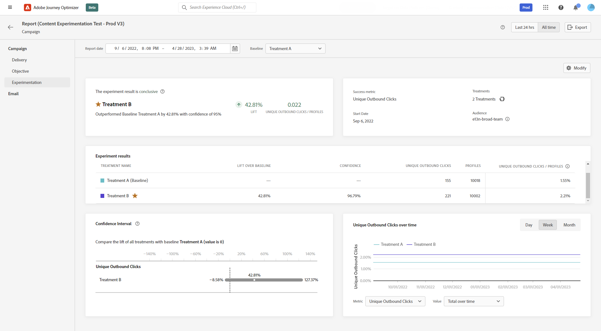
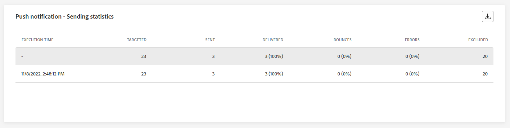
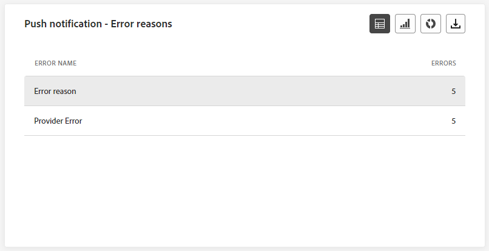
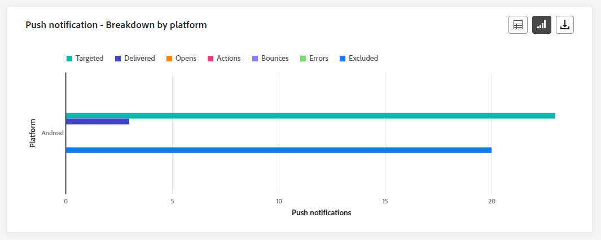
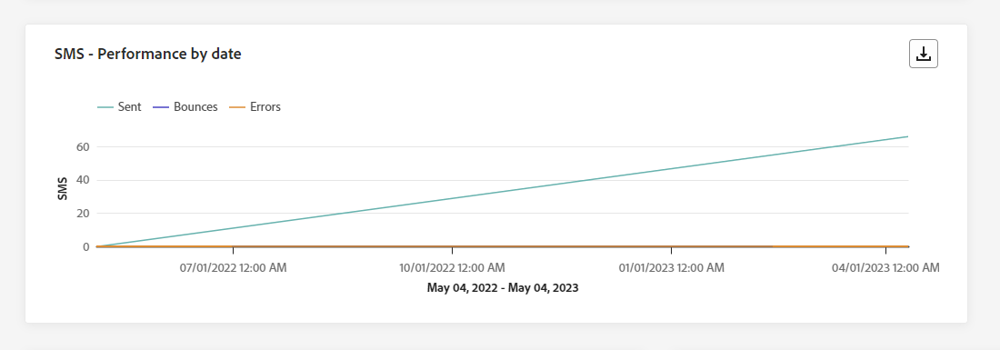
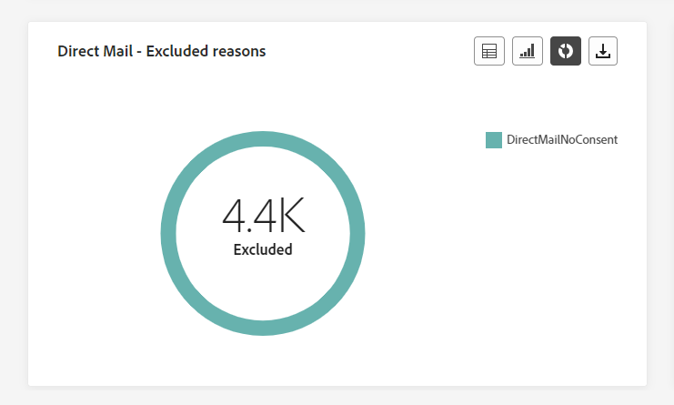

# 营销活动全局报告 {#campaign-global-report}

>[!CONTEXTUALHELP]
>id="ajo_campaign_global_report"
>title="营销活动全局报告"
>abstract="营销活动全局报告可以衡量您的营销活动在选定时段内产生的影响。报告分为不同的构件，详细说明您营销活动中的成功和错误。可通过调整构件大小或删除构件而修改每个报告仪表板。"

>[!AVAILABILITY]
>
>当前的报告体验将从10月版起停用。 在此日期之后，新的报告体验将成为标准。 我们建议您熟悉新特性和功能，以确保顺利过渡。 [开始使用Journey Optimizer的新报告界面。](report-gs-cja.md)

全局报告可从&#x200B;**所有时间**&#x200B;选项卡访问，显示至少两小时前发生的事件，并涵盖选定时间段内的事件。 相比之下，实时报表侧重于过去24小时内发生的事件，距事件发生的最小时间间隔为2分钟。

使用&#x200B;**[!UICONTROL 查看报告]**&#x200B;按钮，可以直接从营销活动访问营销活动全局报告。

将显示营销活动&#x200B;**[!UICONTROL 全局报告]**&#x200B;页面，其中包含以下选项卡：

* [Campaign](#campaign-global)
* [电子邮件](#email-global)
* [应用程序内](#inapp-global)
* [推送](#push-global)
* [短信](#sms-global)
* [Web](#web-tab)
* [直邮](#direct-mail-global)

营销活动&#x200B;**[!UICONTROL 全局报告]**&#x200B;被分为多个小部件，其中详细说明了营销活动的成功和错误。 如果需要，可以调整每个小部件的大小并将其删除。 有关此内容的更多信息，请参阅此[部分](../reports/global-report.md#modify-dashboard)。

有关Adobe Journey Optimizer中可用的每个量度的详细列表，请参阅[此页面](global-report.md#list-of-components-global.md)

## “营销活动”选项卡 {#campaign-global}

### 投放 {#delivery-global}

>[!CONTEXTUALHELP]
>id="ajo_campaign_delivery_global"
>title="营销活动的统计数据"
>abstract="“营销活动的统计数据”构件详述与您的营销活动相关的主要信息，如“进入的配置文件”和“已交付操作”。"

**[!UICONTROL 营销活动的统计数据]** KPI用作综合仪表板，提供与您的营销活动相关的关键量度的详细细目。 这包括基本信息（如用户档案数量和已交付的操作），从而可全面了解营销活动的绩效和参与情况。

+++ 了解有关Campaign统计量度的更多信息

* **[!UICONTROL 受众]**：目标用户档案的数量。

* **[!UICONTROL 已交付操作]**：已交付操作的唯一总次数。

* **[!UICONTROL 操作在%]**&#x200B;中失败：操作失败的唯一次数与已交付操作的唯一次数总数的百分比。

+++

<!--
### Objectives report {#objectives-global}

The **[!UICONTROL Objectives]** tab allows you to better fine-tune your deliveries' reports by targeting one specific metric.

The **[!UICONTROL Objectives]** listed are linked to **[!UICONTROL Datasets]** that define a connection to a system in order to retrieve additional information. A list of built-in **[!UICONTROL Objectives]** is available but you can add your own by adding new **[!UICONTROL Dataset]**. For the detailed procedure, refer to this [section](../content-management/reporting-configuration.md).

After selecting the Objectives you want to target on, the two **[!UICONTROL Performance overview]** and **[!UICONTROL Campaign objective]** widgets will provide a detailed summary of your delivery performance. 

With the **[!UICONTROL Campaign objective]** widget, you can also choose to compare your main objective with another metric.
-->

### 试验报告 {#experimentation-global}

>[!CONTEXTUALHELP]
>id="ajo_campaigns_content_experiment_click"
>title="成功量度"
>abstract="您之前在创建试验时选择的成功量度的总值，除以配置文件数。"

**[!UICONTROL 试验]**&#x200B;选项卡提供了有关每个变体性能的关键见解，并标识了最成功的变体。

请注意，定义最佳业绩者可能需要一些时间，它将由此图标表示。

+++了解有关试验报告中可用的不同量度和小组件的更多信息。

**[!UICONTROL 实验结果]**&#x200B;构件详细说明了每个变体的性能。 您可以更改基线，方法是从&#x200B;**[!UICONTROL 基线]**&#x200B;下拉列表中选择一种处理。 最佳处理方式将以星形图标表示。

有关这些结果的深入了解及其解释方法，请参阅[此页面](../content-management/get-started-experiment.md#interpret-results)。

下表显示了以下量度：

* **[!UICONTROL 超过基线的提升]**：测量给定处理的转化率超过基线的改进百分比。

* **[!UICONTROL 置信度]**：表明给定处理与基线处理相同的证据。 [了解详情](../content-management/experiment-calculations.md#understand-confidence)

* **[!UICONTROL 独特出站点击次数]**：跨出站渠道的点击总数。

* **[!UICONTROL 配置文件]**：针对此处理的配置文件数。

* **[!UICONTROL 独特出站点击次数/配置文件]**：在创建实验时先前选择的成功量度的总值除以配置文件数。

**[!UICONTROL 置信区间]**&#x200B;图可测量关于改进的不确定性。 它详细说明了基线和最佳业绩处理之间的业绩差异百分比。 [了解详情](../content-management/experiment-calculations.md#confidence-intervals)。

最后一个小组件提供与您之前为处理选择的&#x200B;**[!UICONTROL 成功量度]**&#x200B;相关的数据。 您可以选择从&#x200B;**[!UICONTROL 量度]**&#x200B;下拉菜单中选择其他目标量度来跟踪替代数据。

>[!CAUTION]
>
>处理试验的筛选量度时，请注意，从试验的比较页面上的下拉列表中更改量度选择将不保留筛选值。 例如，从“点击量”切换到“唯一点击量”会导致应用的过滤器丢失，导致比较不准确或无效。

+++

## 电子邮件选项卡 {#email-global}

### 电子邮件 - 发送统计数据 {#sending-statistics-email}

>[!CONTEXTUALHELP]
>id="ajo_campaign_global_email_sending_statistics"
>title="电子邮件 - 发送统计数据"
>abstract="“电子邮件 - 发送统计数据”表汇总有关电子邮件的基本数据，如定向邮件或已送达邮件。"

**[!UICONTROL 电子邮件发送统计数据]**&#x200B;表提供了有关电子邮件促销活动的基本数据的全面摘要。 它详细说明了关键量度，例如目标受众规模以及成功投放的电子邮件数量，为您的电子邮件的效力和影响提供了有价值的见解。

+++ 了解有关电子邮件发送统计量度的更多信息

* **[!UICONTROL 目标]**：发送过程中处理的电子邮件总数。

* **[!UICONTROL 已发送]**：您的电子邮件的发送总数。

* **[!UICONTROL 已投放]**：成功发送的电子邮件数与已发送的邮件总数相关。

* **[!UICONTROL 投放率]**：成功发送的电子邮件百分比。

* **[!UICONTROL 跳出次数]**：在发送进程和自动返回处理期间累计的错误总数与已发送消息的总数之比。

* **[!UICONTROL 跳出率]**：与已发送电子邮件相比跳出的电子邮件百分比。

* **[!UICONTROL 错误]**：发送过程中发生的阻止将错误发送到用户档案的错误总数。

* **[!UICONTROL 错误率]**：发送过程中发生的与已发送的电子邮件相比无法发送该邮件的错误百分比。

* **[!UICONTROL 重试]**：重试队列中的电子邮件数。

* **[!UICONTROL 已排除]**： Adobe Journey Optimizer已排除的用户档案数。

+++

### 电子邮件 - 跟踪统计数据 {#tracking-statistics-email}

>[!CONTEXTUALHELP]
>id="ajo_campaign_global_email_tracking_statistics"
>title="电子邮件 - 跟踪统计数据"
>abstract="“电子邮件 - 跟踪统计数据”表提供有关电子邮件的配置文件活动的数据。"

**[!UICONTROL 电子邮件 — 跟踪统计数据]**&#x200B;表提供与您的电子邮件促销活动相关的配置文件活动的详细帐户。 其中包括打开次数、点击次数和其他相关参与指示器的指标，可全面了解用户档案与电子邮件内容的交互方式。

+++ 了解有关电子邮件 — 跟踪统计量度的更多信息

* **[!UICONTROL 打开次数]**：电子邮件的打开次数。

* **[!UICONTROL 独特打开次数]**：已打开电子邮件的百分比。

* **[!UICONTROL 打开率]**：与已传递电子邮件数相比已打开电子邮件的总数。

* **[!UICONTROL 点击次数]**：内容在电子邮件中的点击次数。

* **[!UICONTROL 唯一点击次数]**：点击电子邮件中内容的用户档案数。

* **[!UICONTROL 唯一点击率]**：与您的电子邮件交互的用户百分比。

* **[!UICONTROL 取消订阅]**：取消订阅链接的点击次数。

* **[!UICONTROL 垃圾邮件投诉次数]**：将邮件声明为垃圾邮件或垃圾邮件的次数。

+++

### 电子邮件 - 发送效果 {#sending-performance-email}

>[!CONTEXTUALHELP]
>id="ajo_campaign_global_email_sending_performance"
>title="电子邮件 - 发送效果"
>abstract="“电子邮件 - 发送效果”图表呈现有关已发送的电子邮件的全面数据，其中提供对是否送达和退回次数等关键量度的见解，从而可详细地分析电子邮件送达过程。"

**[!UICONTROL 电子邮件 — 发送性能]**&#x200B;图形提供了与已发送电子邮件相关的数据的综合视图，提供了对关键量度（如投放和退回）的分析。 这使您能够详细分析电子邮件发送过程，提供关于电子邮件促销活动的效率和性能的宝贵信息。

+++ 了解有关电子邮件 — 发送性能指标的更多信息

* **[!UICONTROL 已投放]**：成功发送的电子邮件数与已发送的电子邮件总数相关。

* **[!UICONTROL 跳出次数]**：发送过程中累计的错误总数以及自动返回处理与已发送电子邮件总数之间的关系。

* **[!UICONTROL 重试]**：重试队列中的电子邮件数。

* **[!UICONTROL 错误]**：发送过程中发生的阻止将错误发送到用户档案的错误总数。

+++

### 电子邮件 - 退回原因和类别 {#bounces-email}

>[!CONTEXTUALHELP]
>id="ajo_campaign_global_email_bounce_categories"
>title="电子邮件 - 退回类别"
>abstract="“电子邮件 - 退回类别”图表提供有关临时错误和永久性错误的数据。"

>[!CONTEXTUALHELP]
>id="ajo_campaign_global_email_bounce_reasons"
>title="电子邮件 - 退回原因"
>abstract="“电子邮件 - 退回原因”图表包含与退回的邮件相关的可用数据。"

**[!UICONTROL 电子邮件 — 退回原因]**&#x200B;和&#x200B;**[!UICONTROL 电子邮件 — 退回类别]**&#x200B;小组件编译与退回邮件相关的可用数据，提供对电子邮件退回背后的具体原因和类别的详细分析。

有关退回的详细信息，请参阅[禁止显示列表](../reports/suppression-list.md)页面。

+++ 了解有关电子邮件 — 退回类别量度的更多信息

* **[!UICONTROL 硬退回]**：永久错误的总数，如电子邮件地址错误。 这涉及显式声明地址无效的错误消息，例如“未知用户”。

* **[!UICONTROL 软退回]**：临时错误的总数，如收件箱已满。

* **[!UICONTROL Ignored]**：临时总数，例如“不在办公室”或技术错误，例如，如果发件人类型为“邮递员”。

+++

### 电子邮件 - 错误原因 {#errors-email}

>[!CONTEXTUALHELP]
>id="ajo_campaign_global_email_error_reasons"
>title="电子邮件 - 错误原因"
>abstract="通过“电子邮件 - 错误原因”图表，可了解在发送过程中发生的具体错误。"

**[!UICONTROL 错误原因]**&#x200B;图形和表提供了在发送过程中发生的特定错误的可见性，提供了有关错误性质和发生情况的宝贵信息。

您可以选择从表、条形图或圆环图切换。

### 电子邮件 - 排除的原因 {#excluded-email}

>[!CONTEXTUALHELP]
>id="ajo_campaign_global_email_excluded_reasons"
>title="电子邮件 - 排除的原因"
>abstract="“排除的原因”图表说明导致从目标受众中排除用户配置文件，从而收不到消息的各种因素。"

**[!UICONTROL 排除的原因]**&#x200B;图形和表全面介绍了导致从目标受众中排除用户个人资料导致未收到消息的各种因素。

有关排除原因的完整列表，请参阅[此页面](exclusion-list.md)。

### 按域列出的已发送和已送达邮件 {#sent-domains}

>[!CONTEXTUALHELP]
>id="ajo_campaign_global_email_sent_domains"
>title="按域列出的已发送和已送达邮件"
>abstract="按域列出的已发送和已送达邮件表格和图形提供了按域分类的电子邮件细分，可提供对电子邮件通信整体性能的深入见解。"

**[!UICONTROL 由域发送和传送的]**&#x200B;表格和图形在域级别提供了电子邮件的详细细目，提供了关于电子邮件性能的全面见解。

+++ 了解有关“按域发送和交付”指标的更多信息

* **[!UICONTROL 已发送]**：您的电子邮件的发送总数。

* **[!UICONTROL 已投放]**：成功发送的电子邮件数与已发送的电子邮件总数相关。

+++

### 按域列出的退回和错误 {#bounces-domains}

>[!CONTEXTUALHELP]
>id="ajo_campaign_global_email_bounces_domains"
>title="按域列出的退回和错误"
>abstract="按域列出的退回和错误图形和表格提供了域级别的精细细分，可深入了解电子邮件发送过程中遇到的特定错误。"

按域&#x200B;]**列出的**[!UICONTROL &#x200B;退回和错误图表和表格提供了发送过程中遇到的特定错误的域级细分，提供了所发生问题的详细分析。

+++ 详细了解按域列出的退回和错误量度

* **[!UICONTROL 跳出次数]**：发送过程中累计的错误总数以及自动返回处理与已发送电子邮件总数之间的关系。

* **[!UICONTROL 错误]**：发送过程中发生的阻止将电子邮件发送到用户档案的错误总数。

+++

### 按域列出的打开和点击数 {#opens-domains}

>[!CONTEXTUALHELP]
>id="ajo_campaign_global_email_open_domains"
>title="按域列出的打开和点击数"
>abstract="按域列出的打开和点击数图形和表格提供了域级别的详细细分，全面展示了受众如何与您的电子邮件互动。"

**[!UICONTROL 按域打开和点击]**&#x200B;图形和表格显示了您的个人资料与电子邮件互动的域级细分，提供了有关不同域如何与您的内容交互的宝贵见解。

+++ 了解有关“按域列出的打开和点击次数”量度的更多信息

* **[!UICONTROL 打开次数]**：电子邮件的打开次数。

* **[!UICONTROL 点击次数]**：在电子邮件中点击内容的次数。

+++

### 按域列出的退回原因 {#bounce-reasons-domains}

>[!CONTEXTUALHELP]
>id="ajo_campaign_global_email_bounces_reasons_domains"
>title="按域列出的退回原因"
>abstract="按域列出的退回原因图形和表格包含域级别的细分，提供了对临时和永久错误的综合见解。此详细分析为您提供有关退回邮件背后具体原因的宝贵信息。"

按域&#x200B;]**列出的**[!UICONTROL &#x200B;退回原因图表和表提供了有关临时和永久错误的域级数据细分，提供了有关退回消息背后原因的详细见解。

+++ 详细了解按域量度划分的退回原因

* **[!UICONTROL 打开次数]**：电子邮件的打开次数。

* **[!UICONTROL 点击次数]**：在电子邮件中点击内容的次数。

+++

### 电子邮件 - 热门 URL {#top-url-email}

>[!CONTEXTUALHELP]
>id="ajo_campaign_global_email_top_url"
>title="电子邮件 - 热门 URL"
>abstract="“电子邮件 - 热门 URL”图表全面概述电子邮件中获得访客流量最高的 URL，从而可找出最热门的链接。"

**[!UICONTROL 电子邮件 — 顶级URL]**&#x200B;图形和表提供了电子邮件中吸引最高访客流量的URL的全面概述。 这使您能够识别最受欢迎的链接并排定其优先级，从而加深您对电子邮件中特定内容的用户档案参与情况的了解。

### 电子邮件 - 最佳收件人域 {#top-recipient-email}

>[!CONTEXTUALHELP]
>id="ajo_campaign_global_email_best_recipient"
>title="电子邮件 - 最佳收件人域"
>abstract="“电子邮件 - 最佳收件人域”图表详细地细分收件人最常用于打开电子邮件的域，并提供针对收件人行为的宝贵见解。"

>[!CAUTION]
>
> **[!UICONTROL Email - Best recipient domain]**&#x200B;小部件的准确率为99.95%。

**[!UICONTROL 电子邮件 — 最佳收件人域]**&#x200B;图形和表提供了用户档案最常用于打开电子邮件的域的详细细目。 这提供了有关用户档案行为的宝贵见解，可帮助您了解首选平台。

+++ 了解关于电子邮件 — 最佳收件人域指标的更多信息

* **[!UICONTROL 已投放]**：成功发送的电子邮件数与已发送的电子邮件总数相关。

* **[!UICONTROL 投放率]**：成功发送的电子邮件百分比。

* **[!UICONTROL 跳出+错误率]**：与已发送电子邮件相比跳出的电子邮件百分比。

+++

###  电子邮件 - 优化  {#optimized-email}

>[!NOTE]
>
>仅当为您的电子邮件激活发送时间优化选项时，**[!UICONTROL 优化与未优化]**&#x200B;和&#x200B;**[!UICONTROL 发送时间优化]**&#x200B;构件才可用。 有关发送时间优化的更多信息，请参阅[此页面](../building-journeys/journeys-message.md#send-time-optimization)。

**[!UICONTROL 已优化与未优化]**&#x200B;和&#x200B;**[!UICONTROL 发送时间优化]**&#x200B;构件详细说明了与您的消息相关的主要信息，无论它们是否已优化。

+++ 了解有关发送时间优化量度的更多信息

* **[!UICONTROL 已发送]**：发送总数。

* **[!UICONTROL 打开]**：消息的打开次数。

* **[!UICONTROL 点击次数]**：在电子邮件中点击内容的次数。

* **[!UICONTROL 已投放]**：成功发送的邮件数与已发送的邮件总数相关。

* **[!UICONTROL 跳出次数]**：在发送进程和自动返回处理期间累计的错误总数与已发送消息的总数之比。

+++

### 电子邮件 - 优惠 {#email-offers}

**[!UICONTROL 优惠统计数据]**、**[!UICONTROL 一段时间内的优惠统计数据]**&#x200B;和&#x200B;**[!UICONTROL 优惠详细统计数据]**&#x200B;小组件可衡量优惠的成功情况以及对目标受众的影响。

+++ 了解有关电子邮件 — 优惠指标的更多信息

* **[!UICONTROL 已发送优惠]**：优惠的发送总数。

* **[!UICONTROL 优惠展示]**：优惠在电子邮件中的打开次数。

* **[!UICONTROL 优惠点击次数]**：优惠在电子邮件中的点击次数。

* **[!UICONTROL 投放位置名称]**：用于显示优惠的投放位置名称。 有关版面的详细信息，请参阅此[页面](../offers/offer-library/creating-placements.md)。

* **[!UICONTROL 选件名称]**：在投放中添加的选件名称。 有关版面的详细信息，请参阅此[页面](../offers/offer-library/creating-personalized-offers.md)。

* **[!UICONTROL 已发送优惠]**：优惠的发送总数。

* **[!UICONTROL 优惠展示率]**：已打开优惠与已发送优惠的百分比之比。

+++

## 应用程序内选项卡 {#inapp-global}

在促销活动&#x200B;**[!UICONTROL 全局报告]**&#x200B;中，**[!UICONTROL 应用程序内]**&#x200B;选项卡详细列出了与促销活动中发送的应用程序内消息相关的主要信息。

### 应用程序内性能 {#in-app-performance}

>[!CONTEXTUALHELP]
>id="ajo_campaign_global_inapp_performance"
>title="应用程序内性能"
>abstract="“应用程序内性能”KPI 提供针对访客与应用程序内消息互动的基本见解。"

**[!UICONTROL 应用程序内性能]** KPI可提供关于访客与应用程序内消息参与度的基本信息，从而提供评估应用程序内促销活动效果和影响的基本指标。

+++ 了解有关应用程序内性能指标的更多信息

* **[!UICONTROL 独特展示次数]**：向其传递应用程序内消息的独特用户数。

* **[!UICONTROL 展示次数]**：传递给所有用户的应用程序内消息总数。

* **[!UICONTROL 交互]**：与应用程序内消息的参与总数。 这包括用户执行的任何操作，例如单击、解除或任何其他交互。

+++

### 各类型的交互 {#interactions-type}

>[!CONTEXTUALHELP]
>id="ajo_campaign_global_inapp_interactions"
>title="各类型的交互"
>abstract="“各类型的交互”图表通过跟踪任何点击、取消或交互而详述用户如何与应用程序内消息交互。"

按类型&#x200B;]**进行的**[!UICONTROL &#x200B;交互的图形和表详细介绍了用户档案如何与应用程序内消息、跟踪操作（如点击、解除）或任何其他形式的参与进行交互。

### 应用程序内摘要 {#in-app-summary}

>[!CONTEXTUALHELP]
>id="ajo_campaign_global_inapp_summary"
>title="应用程序内摘要"
>abstract="“应用程序内摘要”图表显示指定时段内应用程序内展示和交互的进展。"

**[!UICONTROL 应用程序内摘要]**&#x200B;图形说明了指定时间段内应用程序内展示和交互的进度，提供了应用程序内消息性能的全面概述。

+++ 了解有关应用程序内摘要量度的更多信息

* **[!UICONTROL 独特展示次数]**：向其传递应用程序内消息的独特用户数。

* **[!UICONTROL 展示次数]**：传递给所有用户的应用程序内消息总数。

* **[!UICONTROL 交互]**：与应用程序内消息的参与总数。 这包括用户执行的任何操作，例如单击、解除或任何其他交互。

+++

## 推送通知选项卡 {#push-global}

在营销活动&#x200B;**[!UICONTROL 全局报告]**&#x200B;中，**[!UICONTROL 推送通知]**&#x200B;选项卡详细介绍了与营销活动中发送的推送通知相关的主要信息。

### 推送通知 - 发送统计数据 {#push-sending-statistics}

>[!CONTEXTUALHELP]
>id="ajo_campaign_global_push_sending_statistics"
>title="推送通知 - 发送统计数据"
>abstract="“推送通知发送统计数据”表汇总有关推送通知的基本数据，如定向消息或已送达消息。"

**[!UICONTROL 推送通知 — 发送统计数据]**&#x200B;表提供与推送通知相关的基本数据的简要摘要，包括关键量度，例如定向消息数和成功投放消息数。

+++ 了解有关推送通知 — 发送统计量度的更多信息

* **[!UICONTROL 执行时间]**：每次执行定期推送通知的开始时间。 要仅定位一个或多个定期推送通知，请从&#x200B;**[!UICONTROL 执行时间]**&#x200B;下拉列表中选择它。

* **[!UICONTROL 目标]**：分析期间处理的推送通知总数。

* **[!UICONTROL 已发送]**：推送通知的发送总数。

* **[!UICONTROL 已传递]**：成功发送的推送通知数与已发送的推送通知总数相关。

* **[!UICONTROL 投放率]**：已成功发送的推送通知的百分比。

* **[!UICONTROL 跳出次数]**：发送过程中累计的错误总数以及自动返回处理与推送通知总数之间的关系。

* **[!UICONTROL 退回率]**：退回的推送通知与已发送的推送通知相比的百分比。

* **[!UICONTROL 个错误]**：发生并阻止将其发送到配置文件的错误总数。

* **[!UICONTROL 错误率]**：与发送的推送通知相比，阻止发送该通知期间发生的错误百分比。

* **[!UICONTROL 已排除]**： Adobe Journey Optimizer已排除的用户档案数。

+++

### 推送通知 – 跟踪统计数据 {#push-tracking-statistics}

>[!CONTEXTUALHELP]
>id="ajo_campaign_global_push_tracking_statistics"
>title="推送通知 – 跟踪统计数据"
>abstract="“推送跟踪统计数据”提供有关推送通知的配置文件活动的数据。"

**[!UICONTROL 推送通知 — 跟踪统计数据]**&#x200B;构件提供与推送通知关联的用户档案活动的详细快照，提供有关参与和推送通知有效性的基本见解。

+++ 了解有关推送通知 — 跟踪统计量度的更多信息

* **[!UICONTROL 执行时间]**：每次执行定期推送通知的开始时间。 要仅定位一个或多个定期推送通知，请从&#x200B;**[!UICONTROL 执行时间]**&#x200B;下拉列表中选择它。

* **[!UICONTROL 打开次数]**：推送通知的打开次数。

* **[!UICONTROL 操作]**：对已送达推送通知执行的操作总数，例如按钮点击或解除。

+++

### 推送通知 - 发送摘要 {#push-summary}

>[!CONTEXTUALHELP]
>id="ajo_campaign_global_push_sending_summary"
>title="推送通知 - 发送摘要"
>abstract="“推送通知发送摘要”图表显示对于已发送的推送通知可用的数据。"

**[!UICONTROL 推送通知 — 发送摘要]**&#x200B;图形提供了动态表示形式，显示了对推送通知活动的分析。 此图形呈现提供了已发送推送通知的全面细分。

+++ 了解有关推送通知 — 发送摘要量度的更多信息

* **[!UICONTROL 打开次数]**：推送通知的打开次数。

* **[!UICONTROL 操作]**：对已送达推送通知执行的操作总数，例如按钮点击或解除。

* **[!UICONTROL 跳出次数]**：累计的错误总数和相对于已发送推送通知总数的自动返回处理次数。

* **[!UICONTROL 已传递]**：成功发送的推送通知数与已发送的推送通知总数相关。

* **[!UICONTROL 个错误]**：发生并阻止将其发送到配置文件的错误总数。

+++

### 推送通知 — 优化 {#push-optimized}

>[!NOTE]
>
>仅当为您的推送通知激活发送时间优化选项时，**[!UICONTROL 优化与未优化]**&#x200B;和&#x200B;**[!UICONTROL 发送时间优化]**&#x200B;构件才可用。 有关发送时间优化的更多信息，请参阅[此页面](../building-journeys/journeys-message.md#send-time-optimization)。

**[!UICONTROL 已优化与未优化]**&#x200B;和&#x200B;**[!UICONTROL 发送时间优化]**&#x200B;构件详细说明了与您的消息相关的主要信息，无论它们是否已优化。

+++ 了解有关推送通知 — 发送时间优化量度的更多信息

* **[!UICONTROL 已传递]**：成功发送的推送通知数与已发送的推送通知总数相关。

* **[!UICONTROL 打开次数]**：推送通知的打开次数。

* **[!UICONTROL 操作]**：对已送达推送通知执行的操作总数，例如按钮点击或解除。

* **[!UICONTROL 跳出次数]**：发送过程中累计的错误总数以及自动返回处理与已发送推送通知总数之间的关系。

+++

### 推送通知 - 错误原因 {#error-reasons-push}

>[!CONTEXTUALHELP]
>id="ajo_campaign_global_push_error_reasons"
>title="推送通知 - 错误原因"
>abstract="通过“错误原因”图表，可了解在发送过程中发生的具体错误。"

**[!UICONTROL 错误原因]**&#x200B;表和图形使您能够识别推送通知发送过程中发生的特定错误，从而详细了解过程中遇到的任何问题。

### 推送通知 - 排除的原因 {#excluded-push}

>[!CONTEXTUALHELP]
>id="ajo_campaign_global_push_excluded_reasons"
>title="推送通知 - 排除的原因"
>abstract="“排除的原因”图表说明导致从目标受众中排除用户配置文件，从而收不到消息的各种因素。"

**[!UICONTROL 排除的原因]**&#x200B;图形和表显示了阻止从目标用户档案排除的用户配置文件接收推送通知的不同原因。

有关排除原因的完整列表，请参阅[此页面](exclusion-list.md)。

### 推送通知 - 按平台细分 {#breakdown-platform-push}

>[!CONTEXTUALHELP]
>id="ajo_campaign_global_push_breakdown_platform"
>title="推送通知 - 按平台细分"
>abstract="“推送通知 - 按平台细分”图形和表格提供了基于配置文件操作系统的推送通知成功情况的细分。"

**[!UICONTROL 推送通知 — 按平台]**&#x200B;划分图表和表提供了推送通知成功情况的详细分析，提供了基于用户档案操作系统的见解。 此划分可让您更好地了解推送通知在不同平台上的执行情况。

+++ 了解有关推送通知 — 按平台量度划分的更多信息

* **[!UICONTROL 目标]**：分析期间处理的推送通知总数。

* **[!UICONTROL 已传递]**：成功发送的推送通知数与已发送的推送通知总数相关。

* **[!UICONTROL 打开次数]**：推送通知的打开次数。

* **[!UICONTROL 操作]**：对已送达推送通知执行的操作总数，例如按钮点击或解除。

* **[!UICONTROL 跳出次数]**：累计的错误总数和相对于已发送推送通知总数的自动返回处理次数。

* **[!UICONTROL 个错误]**：发生并阻止将其发送到配置文件的错误总数。

* **[!UICONTROL 已排除]**： Adobe Journey Optimizer已排除的用户档案数。

+++

## 短信选项卡 {#sms-global}

在营销活动&#x200B;**[!UICONTROL 全局报告]**&#x200B;中，**[!UICONTROL 短信]**&#x200B;选项卡详细列出了与营销活动中发送的短信消息相关的主要信息。

### 短信 - 发送统计数据 {#sms-sending-statistics}

>[!CONTEXTUALHELP]
>id="ajo_campaign_global_sms_sending_statistics"
>title="短信 - 发送统计数据"
>abstract="“短信 - 发送统计数据”表格汇总了有关短信的基本数据，如定向消息或已送达消息。"

**[!UICONTROL SMS — 发送统计数据]**&#x200B;表提供与您的SMS消息相关的基本数据的简要摘要，包括关键量度，例如定向消息数和成功投放消息数。

+++ 了解有关短信 — 发送统计量度的更多信息

* **[!UICONTROL 执行时间]**：定期短信消息每次执行的开始时间。 要仅定向一个或多个定期短信，请从&#x200B;**[!UICONTROL 执行时间]**&#x200B;下拉列表中选择它。

* **[!UICONTROL 目标]**：符合目标配置文件资格的用户配置文件数。

* **[!UICONTROL 已排除]**：未收到消息的用户配置文件数（从定向配置文件中排除）。

* **[!UICONTROL 已发送]**：短信消息的发送总数。

* **[!UICONTROL 跳出次数]**：发送过程中累计的错误总数以及自动返回处理与已发送短信消息总数之间的关系。

* **[!UICONTROL 个错误]**：发生并阻止将其发送到配置文件的错误总数。

+++

### 短信 - 跟踪统计数据 {#sms-tracking-statistics}

>[!CONTEXTUALHELP]
>id="ajo_campaign_sms_tracking_statistics"
>title="短信 - 跟踪统计数据"
>abstract="“短信 - 跟踪统计数据”构件全面概述了有关访问者与 URL 交互的基本信息。"

**[!UICONTROL SMS — 跟踪统计数据]**&#x200B;小组件提供与访客与URL的参与相关的关键信息的详细概述，提供对SMS消息有效性的洞察。

+++ 了解有关短信 — 跟踪统计量度的更多信息

* **[!UICONTROL 执行时间]**：定期短信每次执行的开始时间。 要仅定位一个或多个定期短信，请从&#x200B;**[!UICONTROL 执行时间]**&#x200B;下拉列表中选择它。

* **[!UICONTROL 点击次数]**：在短信消息中点击内容的次数。

+++

### 短信 - 各日期的效果 {#sms-perfomance-date}

>[!CONTEXTUALHELP]
>id="ajo_campaign_global_sms_performance"
>title="短信 - 各日期的效果"
>abstract="“短信 - 各日期的效果”构件以图形表示形式提供有关消息的关键信息。"

**[!UICONTROL 按日期划分的短信性能]**&#x200B;构件详细概述了与消息相关的关键信息（通过图形显示），并提供了特定时间段内性能趋势的见解。

+++ 了解有关短信的更多信息 — 按日期列出的绩效指标

* **[!UICONTROL 已发送]**：短信消息的发送总数。

* **[!UICONTROL 跳出次数]**：发送过程中累计的错误总数以及自动返回处理与已发送短信消息总数之间的关系。

* **[!UICONTROL 个错误]**：发生并阻止将其发送到配置文件的错误总数。

+++

### 短信 - 错误原因 {#sms-error}

>[!CONTEXTUALHELP]
>id="ajo_campaign_global_sms_error_reasons"
>title="短信 - 错误原因"
>abstract="通过“短信 - 错误原因”图表，可了解在发送过程中发生的具体错误。"

**[!UICONTROL 错误原因]**&#x200B;图形和表允许您识别在发送短信消息过程中发生的特定错误，从而便于彻底分析遇到的任何问题。

### 短信 - 排除的原因 {#sms-excluded-reasons}

>[!CONTEXTUALHELP]
>id="ajo_campaign_global_sms_excluded_reasons"
>title="短信 - 排除的原因"
>abstract="“排除的原因”图表说明导致从目标受众中排除用户配置文件，从而收不到消息的各种因素。"

**[!UICONTROL 排除原因]**&#x200B;图形和表直观地描述了导致从目标受众中排除用户个人资料的各种因素，阻止他们接收您的短信消息。

有关排除原因的完整列表，请参阅[此页面](exclusion-list.md)。

### 短信 - 退回原因 {#sms-bounces-reasons}

>[!CONTEXTUALHELP]
>id="ajo_campaign_global_sms_bounces_reasons"
>title="短信 - 退回原因"
>abstract="“退回原因”图表包含与退回邮件相关的可用数据。"

**[!UICONTROL 退回原因]**&#x200B;图形和表提供与退回的短信消息相关的数据的全面概述，从而针对SMS消息退回实例背后的具体原因提供有价值的见解。

### 短信 - 按链接显示的点击次数 {#sms-clicks-links}

>[!CONTEXTUALHELP]
>id="ajo_campaign_global_sms_clicks_links"
>title="短信 - 按链接显示的点击次数"
>abstract="“短信 - 按链接显示的点击次数”构件提供有关访客与消息中的 URL 互动的基本见解。"

**[!UICONTROL 短信 — 链接点击次数]**&#x200B;小组件提供了有关访客与消息中所包含URL参与度的基本信息，提供了有关哪些链接吸引最多交互的宝贵信息。

## Web 选项卡 {#web-tab}

在促销活动&#x200B;**[!UICONTROL 全局报告]**&#x200B;中，**[!UICONTROL Web]**&#x200B;选项卡详细列出了与您的网页相关的主要信息。

### Web 性能 {#web-performance}

>[!CONTEXTUALHELP]
>id="ajo_campaign_global_web_performance"
>title="Web 性能"
>abstract="“Web 性能”KPI 提供有关访客与 Web 体验的互动的全面信息。"

**[!UICONTROL Web绩效]** KPI可提供访客与网页参与度的综合分析，其中包括展示次数和交互次数等关键量度。

+++ 了解有关Web性能指标的更多信息

* **[!UICONTROL 独特展示次数]**：向其提供Web体验的独特用户数。

* **[!UICONTROL 展示次数]**：交付给所有用户的Web体验总数。

* **[!UICONTROL 互动率]**：与网页互动的百分比。 这包括用户执行的任何操作，例如点击或任何其他交互。

+++

### Web 摘要 {#web-summary}

>[!CONTEXTUALHELP]
>id="ajo_campaign_global_web_summary"
>title="Web 摘要"
>abstract="“Web 摘要”图表说明指定时段内 Web 体验的进展情况，包括展示次数、独特展示次数和交互次数。"

**[!UICONTROL Web摘要]**&#x200B;图形显示了相关时间段内Web体验（展示次数、独特展示次数和交互次数）的演变。

+++ 了解有关Web摘要量度的更多信息

* **[!UICONTROL 独特展示次数]**：向其提供Web体验的独特用户数。

* **[!UICONTROL 展示次数]**：交付给所有用户的Web体验总数。

* **[!UICONTROL 互动]**：与网页的互动总数。 这包括用户执行的任何操作，例如点击或任何其他交互。

+++

### 按元素列出的交互 {#web-interactions}

>[!CONTEXTUALHELP]
>id="ajo_campaign_global_web_interactions"
>title="按元素列出的交互"
>abstract="“按元素列出的交互”表提供有关访客与网页上不同元素进行互动的关键信息。"

**[!UICONTROL 按元素列出的交互]**&#x200B;表提供了有关访客与网页上各种元素的参与情况的全面信息，提供了有关用户交互和偏好设置的宝贵见解。

+++ 详细了解按元素量度的交互

* **[!UICONTROL 互动]**：与网页的互动总数。 这包括用户执行的任何操作，例如点击或任何其他交互。

* **[!UICONTROL 互动率]**：与网页互动的百分比。 这包括用户执行的任何操作，例如点击或任何其他交互。

+++

## 直邮选项卡 {#direct-mail-global}

在促销活动&#x200B;**[!UICONTROL 全局报告]**&#x200B;中，**[!UICONTROL 直邮]**&#x200B;选项卡详细介绍了与直邮消息相关的主要信息。

### 直邮 - 发送统计数据 {#direct-mail-sending-statistics}

>[!CONTEXTUALHELP]
>id="ajo_campaign_global_direct_sending_statistics"
>title="直邮 - 发送统计数据"
>abstract="“直邮发送统计数据”表汇总有关直邮的基本数据，如定向邮件或已送达邮件。"

**[!UICONTROL 直邮 — 发送统计数据]**&#x200B;表提供与直邮邮件相关的基本数据的简要摘要，其中包括关键量度，如定向邮件数和成功投放邮件数。

+++ 了解有关直邮 — 发送统计量度的更多信息

* **[!UICONTROL 执行时间]**：每次执行定期直邮的开始时间。 要仅定向一个或多个定期直邮，请从&#x200B;**[!UICONTROL 执行时间]**&#x200B;下拉列表中选择它。

* **[!UICONTROL 目标]**：符合直邮消息目标用户档案资格的用户档案数。

* **[!UICONTROL 已发送]**：您的直邮邮件的发送总数。

* **[!UICONTROL 错误]**：发送过程中发生的阻止将错误发送到用户档案的错误总数。

* **[!UICONTROL 已排除]**：未收到直邮邮件的目标用户档案中排除的用户档案数。

+++

### 直邮 - 错误原因 {#direct-mail-error}

>[!CONTEXTUALHELP]
>id="ajo_campaign_global_direct_error_reasons"
>title="直邮 - 错误原因"
>abstract="通过“直邮 - 错误原因”图表，可了解在发送过程中发生的具体错误。"

**[!UICONTROL 直邮 — 错误原因]**&#x200B;图表和表提供了识别直邮消息发送过程中发生的特定错误的方法，从而允许对遇到的任何问题进行详细分析。

### 直邮 - 排除的原因 {#direct-mail-excluded}

>[!CONTEXTUALHELP]
>id="ajo_campaign_global_direct_excluded_reasons"
>title="直邮 - 排除的原因"
>abstract="“直邮排除的原因”图表说明导致从目标受众中排除用户配置文件，从而收不到消息的各种因素。"

**[!UICONTROL 直邮 — 排除的原因]**&#x200B;图形和表直观地说明了导致从目标受众中排除用户配置文件，从而阻止他们接收您的直邮消息的各种因素。

有关排除原因的完整列表，请参阅[此页面](exclusion-list.md)。

## 其他资源

* [营销活动入门](../campaigns/get-started-with-campaigns.md)
* [创建营销活动](../campaigns/create-campaign.md)
* [创建API触发的营销活动](../campaigns/api-triggered-campaigns.md)
* [修改或停止营销活动](../campaigns/modify-stop-campaign.md)
* [营销活动实时报告](campaign-live-report.md)
