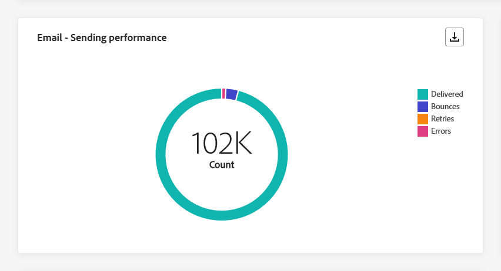

# 营销活动全局报告 {#campaign-global-report}

>[!CONTEXTUALHELP]
>id="ajo_campaign_global_report"
>title="营销活动全局报告"
>abstract="营销活动全局报告可以衡量您的营销活动在选定时段内产生的影响。报告分为不同的构件，详细说明您营销活动中的成功和错误。可通过调整构件大小或删除构件而修改每个报告仪表板。"

全局报告，可从访问 **所有时间** 选项卡，显示至少两小时前发生的事件，并涵盖选定时间段内的事件。 相比之下，实时报表侧重于过去24小时内发生的事件，距事件发生的最小时间间隔为2分钟。

您可以使用直接从Campaign访问Campaign全局报告 **[!UICONTROL 查看报告]** 按钮。

营销活动 **[!UICONTROL 全局报告]** 页面将显示以下选项卡：

* [Campaign](#campaign-global)
* [电子邮件](#email-global)
* [应用程序内](#inapp-global)
* [推送](#push-global)
* [短信](#sms-global)
* [Web](#web-tab)
* [直邮](#direct-mail-global)

营销活动 **[!UICONTROL 全局报告]** 将分为多个构件，每个构件详细描述营销活动的成功和错误。 如果需要，可以调整每个小部件的大小并将其删除。 有关详细信息，请参阅此 [部分](../reports/global-report.md#modify-dashboard).

有关Adobe Journey Optimizer中可用的每个量度的详细列表，请参阅 [此页面](global-report.md#list-of-components-global.md)

## “营销活动”选项卡 {#campaign-global}

### 投放 {#delivery-global}

>[!CONTEXTUALHELP]
>id="ajo_campaign_delivery_global"
>title="营销活动的统计数据"
>abstract="“营销活动的统计数据”构件详述与您的营销活动相关的主要信息，如“进入的配置文件”和“已交付操作”。"

此 **[!UICONTROL 营销活动的统计数据]** KPI用作综合功能板，可提供与活动相关关键量度的详细细目。 这包括基本信息（如用户档案数量和已交付的操作），从而可全面了解营销活动的绩效和参与情况。

+++ 了解有关Campaign统计量度的更多信息

* **[!UICONTROL 受众]**：目标用户档案的数量。

* **[!UICONTROL 已交付操作]**：交付操作的唯一总次数。

* **[!UICONTROL 操作失败百分比]**：某个操作失败的独特次数与某个操作已交付的独特次数总数的百分比。

+++

<!--
### Objectives report {#objectives-global}

The **[!UICONTROL Objectives]** tab allows you to better fine-tune your deliveries' reports by targeting one specific metric.

The **[!UICONTROL Objectives]** listed are linked to **[!UICONTROL Datasets]** that define a connection to a system in order to retrieve additional information. A list of built-in **[!UICONTROL Objectives]** is available but you can add your own by adding new **[!UICONTROL Dataset]**. For the detailed procedure, refer to this [section](../campaigns/reporting-configuration.md).

After selecting the Objectives you want to target on, the two **[!UICONTROL Performance overview]** and **[!UICONTROL Campaign objective]** widgets will provide a detailed summary of your delivery performance. 

With the **[!UICONTROL Campaign objective]** widget, you can also choose to compare your main objective with another metric.
-->

### 试验报告 {#experimentation-global}

>[!CONTEXTUALHELP]
>id="ajo_campaigns_content_experiment_click"
>title="成功量度"
>abstract="您之前在创建试验时选择的成功量度的总值，除以配置文件数。"

此 **[!UICONTROL 试验]** 选项卡提供了有关每个变体性能的关键分析，并标识了最成功的变体。

请注意，定义最佳业绩者可能需要一些时间，该图标将代表最佳业绩者 .

+++了解有关试验报告中可用的不同量度和小组件的更多信息。

此 **[!UICONTROL 试验结果]** 构件详细说明了每个变体的性能。 您可以从中选择处理方法之一，以更改基线 **[!UICONTROL 基线]** 下拉菜单。 最佳处理方式将以星形图标表示。

有关这些结果以及如何解释这些结果的深入研究，请参阅 [此页面](../campaigns/get-started-experiment.md#interpret-results).

下表显示了以下量度：

* **[!UICONTROL 提升度超过基线]**：衡量给定治疗的转化率相对于基线的改进百分比。

* **[!UICONTROL 置信度]**：表明给定治疗与基线治疗相同的证据。 [了解详情](../campaigns/experiment-calculations.md#understand-confidence)

* **[!UICONTROL 独特出站点击次数]**：跨出站渠道的点击总数。

* **[!UICONTROL 配置文件]**：针对此处理的用户档案数。

* **[!UICONTROL 独特出站点击次数/配置文件]**：之前创建实验时选择的成功量度的总值除以配置文件数。

此 **[!UICONTROL 置信区间]** 图表衡量改进的不确定性。 它详细说明了基线和最佳业绩处理之间的业绩差异百分比。 [了解详情](../campaigns/experiment-calculations.md#confidence-intervals)。

最后一个小组件提供与 **[!UICONTROL 成功量度]** 您之前已为“Threads（处理）”选择了。 您可以选择从中选择其他目标量度 **[!UICONTROL 量度]** 用于跟踪替代数据的下拉菜单。

>[!CAUTION]
>
>处理试验的筛选量度时，请注意，从试验的比较页面上的下拉列表中更改量度选择将不保留筛选值。 例如，从“点击量”切换到“唯一点击量”会导致应用的过滤器丢失，导致比较不准确或无效。

+++

## 电子邮件选项卡 {#email-global}

### 电子邮件 - 发送统计数据 {#sending-statistics-email}

>[!CONTEXTUALHELP]
>id="ajo_campaign_global_email_sending_statistics"
>title="电子邮件 - 发送统计数据"
>abstract="“电子邮件 - 发送统计数据”表汇总有关电子邮件的基本数据，如定向邮件或已送达邮件。"

此 **[!UICONTROL 电子邮件发送统计数据]** 该表全面汇总了有关电子邮件促销活动的重要数据。 它详细说明了关键量度，例如目标受众规模以及成功投放的电子邮件数量，为您的电子邮件的效力和影响提供了有价值的见解。

+++ 了解有关电子邮件发送统计量度的更多信息

* **[!UICONTROL 已定位]**：发送过程中处理的电子邮件总数。

* **[!UICONTROL 已发送]**：电子邮件的发送总数。

* **[!UICONTROL 已投放]**：成功发送的电子邮件数，与已发送消息的总数相关。

* **[!UICONTROL 投放率]**：成功发送的电子邮件百分比。

* **[!UICONTROL 跳出次数]**：在发送流程和自动返回处理期间累计的错误总数与已发送消息总数相关。

* **[!UICONTROL 跳出率]**：退回的电子邮件与发送的电子邮件相比的百分比。

* **[!UICONTROL 错误]**：发送过程中发生的阻止将消息发送到用户档案的错误总数。

* **[!UICONTROL 错误率]**：与已发送电子邮件相比，发送过程中发生阻止发送该邮件的错误百分比。

* **[!UICONTROL 重试]**：重试队列中的电子邮件数。

* **[!UICONTROL 已排除]**：Adobe Journey Optimizer已排除的用户档案数。

+++

### 电子邮件 - 跟踪统计数据 {#tracking-statistics-email}

>[!CONTEXTUALHELP]
>id="ajo_campaign_global_email_tracking_statistics"
>title="电子邮件 - 跟踪统计数据"
>abstract="“电子邮件 - 跟踪统计数据”表提供有关电子邮件的配置文件活动的数据。"

此 **[!UICONTROL 电子邮件 — 跟踪统计数据]** 表格提供了与电子邮件营销活动相关的用户档案活动的详细描述。 其中包括打开次数、点击次数和其他相关参与指示器的指标，可全面了解用户档案与电子邮件内容的交互方式。

+++ 了解有关电子邮件 — 跟踪统计量度的更多信息

* **[!UICONTROL 打开次数]**：电子邮件的打开次数。

* **[!UICONTROL 独特打开次数]**：已打开电子邮件的百分比。

* **[!UICONTROL 打开率]**：打开的电子邮件总数，与已投放的电子邮件数相比。

* **[!UICONTROL 点击次数]**：在电子邮件中点击内容的次数。

* **[!UICONTROL 独特点击]**：单击电子邮件中内容的用户档案数。

* **[!UICONTROL 独特点击率]**：与您的电子邮件交互的用户百分比。

* **[!UICONTROL 取消订阅]**：取消订阅链接的点击次数。

* **[!UICONTROL 垃圾邮件投诉数]**：将消息声明为垃圾邮件或垃圾邮件的次数。

+++

### 电子邮件 - 发送效果 {#sending-performance-email}

>[!CONTEXTUALHELP]
>id="ajo_campaign_global_email_sending_performance"
>title="电子邮件 - 发送效果"
>abstract="“电子邮件 - 发送效果”图表呈现有关已发送的电子邮件的全面数据，其中提供对是否送达和退回次数等关键量度的见解，从而可详细地分析电子邮件送达过程。"

此 **[!UICONTROL 电子邮件 — 发送性能]** graph提供与已发送电子邮件相关的数据的全面视图，并深入分析关键量度，如投放和跳出。 这使您能够详细分析电子邮件发送过程，提供关于电子邮件促销活动的效率和性能的宝贵信息。

+++ 了解有关电子邮件 — 发送性能指标的更多信息

* **[!UICONTROL 已投放]**：成功发送的电子邮件数，与已发送电子邮件总数相关。

* **[!UICONTROL 跳出次数]**：与已发送电子邮件总数相关的发送过程和自动返回处理期间累计的错误总数。

* **[!UICONTROL 重试]**：重试队列中的电子邮件数。

* **[!UICONTROL 错误]**：发送过程中发生的阻止将消息发送到用户档案的错误总数。

+++

### 电子邮件 - 退回原因和类别 {#bounces-email}

>[!CONTEXTUALHELP]
>id="ajo_campaign_global_email_bounce_categories"
>title="电子邮件 - 退回类别"
>abstract="“电子邮件 - 退回类别”图表提供有关临时错误和永久性错误的数据。"

>[!CONTEXTUALHELP]
>id="ajo_campaign_global_email_bounce_reasons"
>title="电子邮件 - 退回原因"
>abstract="“电子邮件 - 退回原因”图表包含与退回的邮件相关的可用数据。"

此 **[!UICONTROL 电子邮件 — 退回原因]** 和 **[!UICONTROL 电子邮件 — 退回类别]** 小组件编译与退回邮件相关的可用数据，提供对电子邮件退回具体原因和类别的详细分析。

有关退回的详细信息，请参阅 [禁止显示列表](../reports/suppression-list.md) 页面。

+++ 了解有关电子邮件 — 退回类别量度的更多信息

* **[!UICONTROL 硬退回]**：永久错误的总数，如错误的电子邮件地址。 这涉及显式声明地址无效的错误消息，例如“未知用户”。

* **[!UICONTROL 软退回]**：临时错误的总数，如收件箱已满。

* **[!UICONTROL 已忽略]**：临时总数，例如外出或技术错误，例如，如果发件人类型是邮递员。

+++

### 电子邮件 - 错误原因 {#errors-email}

>[!CONTEXTUALHELP]
>id="ajo_campaign_global_email_error_reasons"
>title="电子邮件 - 错误原因"
>abstract="通过“电子邮件 - 错误原因”图表，可了解在发送过程中发生的具体错误。"

此 **[!UICONTROL 错误原因]** 图表和表格提供了发送过程中发生的特定错误的可见性，提供了有关错误性质和发生情况的宝贵信息。

您可以选择从表、条形图或圆环图切换。

### 电子邮件 - 排除的原因 {#excluded-email}

>[!CONTEXTUALHELP]
>id="ajo_campaign_global_email_excluded_reasons"
>title="电子邮件 - 排除的原因"
>abstract="“排除的原因”图表说明导致从目标受众中排除用户配置文件，从而收不到消息的各种因素。"

此 **[!UICONTROL 排除的原因]** 图表和表格全面介绍了导致从目标受众中排除用户配置文件，从而导致未收到消息的不同因素。

请参阅 [此页面](exclusion-list.md) 以获取排除原因的完整列表。

### 按域列出的已发送和已送达邮件 {#sent-domains}

>[!CONTEXTUALHELP]
>id="ajo_campaign_global_email_sent_domains"
>title="按域列出的已发送和已送达邮件"
>abstract="“按域发送和投放”表格和图形提供了按域分类的电子邮件细分，其中提供了对电子邮件通信整体性能的深入洞察。"

此 **[!UICONTROL 按域发送和投放]** 表格和图形在域级别提供了电子邮件的详细细分，提供了对电子邮件性能的全面洞察。

+++ 了解有关“按域发送和交付”指标的更多信息

* **[!UICONTROL 已发送]**：电子邮件的发送总数。

* **[!UICONTROL 已投放]**：成功发送的电子邮件数，与已发送电子邮件总数相关。

+++

### 按域列出的退回和错误 {#bounces-domains}

>[!CONTEXTUALHELP]
>id="ajo_campaign_global_email_bounces_domains"
>title="按域列出的退回和错误"
>abstract="“按域列出的退回和错误”图表和表提供了域级别的细粒度划分，从而深入了解在电子邮件发送过程中遇到的特定错误。"

此 **[!UICONTROL 按域列出的退回和错误]** 图表和表格提供了发送过程中遇到的特定错误的域级细分，提供了对所发生问题的详细分析。

+++ 详细了解按域列出的退回和错误量度

* **[!UICONTROL 跳出次数]**：与已发送电子邮件总数相关的发送过程和自动返回处理期间累计的错误总数。

* **[!UICONTROL 错误]**：发送过程中发生的阻止将电子邮件发送到用户档案的错误总数。

+++

### 按域列出的打开和点击数 {#opens-domains}

>[!CONTEXTUALHELP]
>id="ajo_campaign_global_email_open_domains"
>title="按域列出的打开和点击数"
>abstract="按域划分的打开和点击量图形和表格提供了域级别的详细细分，可全面了解受众如何与您的电子邮件互动。"

此 **[!UICONTROL 按域打开和点击]** 图表显示了用户档案与您的电子邮件互动的域级细分，提供了有关不同域与您的内容如何互动的宝贵见解。

+++ 了解有关“按域列出的打开和点击次数”量度的更多信息

* **[!UICONTROL 打开次数]**：电子邮件的打开次数。

* **[!UICONTROL 点击次数]**：在电子邮件中点击内容的次数。

+++

### 按域列出的退回原因 {#bounce-reasons-domains}

>[!CONTEXTUALHELP]
>id="ajo_campaign_global_email_bounces_reasons_domains"
>title="按域列出的退回原因"
>abstract="“按域列出的退回原因”图表和表格提供了域级别的细分，从而提供对临时和永久错误的全面洞察。 此详细分析为您提供了有关退回消息背后具体原因的宝贵信息。"

此 **[!UICONTROL 按域列出的退回原因]** 图表提供了有关临时和永久错误的域级数据细分，提供了有关退回消息原因的详细见解。

+++ 详细了解按域量度划分的退回原因

* **[!UICONTROL 打开次数]**：电子邮件的打开次数。

* **[!UICONTROL 点击次数]**：在电子邮件中点击内容的次数。

+++

### 电子邮件 - 热门 URL {#top-url-email}

>[!CONTEXTUALHELP]
>id="ajo_campaign_global_email_top_url"
>title="电子邮件 - 热门 URL"
>abstract="“电子邮件 - 热门 URL”图表全面概述电子邮件中获得访客流量最高的 URL，从而可找出最热门的链接。"

此 **[!UICONTROL 电子邮件 — 顶部URL]** 图表和表格提供了电子邮件中吸引最高访客流量的URL的全面概述。 这使您能够识别最受欢迎的链接并排定其优先级，从而加深您对电子邮件中特定内容的用户档案参与情况的了解。

### 电子邮件 - 最佳收件人域 {#top-recipient-email}

>[!CONTEXTUALHELP]
>id="ajo_campaign_global_email_best_recipient"
>title="电子邮件 - 最佳收件人域"
>abstract="“电子邮件 - 最佳收件人域”图表详细地细分收件人最常用于打开电子邮件的域，并提供针对收件人行为的宝贵见解。"

>[!CAUTION]
>
> 此 **[!UICONTROL 电子邮件 — 最佳收件人域]** 构件的准确率为99.95%。

此 **[!UICONTROL 电子邮件 — 最佳收件人域]** 图表和表格提供了用户档案最常用于打开电子邮件的域的详细划分。 这提供了有关用户档案行为的宝贵见解，可帮助您了解首选平台。

+++ 了解关于电子邮件 — 最佳收件人域指标的更多信息

* **[!UICONTROL 已投放]**：成功发送的电子邮件数，与已发送电子邮件总数相关。

* **[!UICONTROL 投放率]**：成功发送的电子邮件百分比。

* **[!UICONTROL 退回数+错误率]**：退回的电子邮件与发送的电子邮件相比的百分比。

+++

### 电子邮件 — 优化 {#optimized-email}

>[!NOTE]
>
>此 **[!UICONTROL 已优化和未优化]** 和 **[!UICONTROL 发送时间优化]** 仅当为电子邮件激活发送时间优化选项时，小组件才可用。 有关发送时间优化的详细信息，请参阅 [此页面](../building-journeys/journeys-message.md#send-time-optimization).

此 **[!UICONTROL 已优化和未优化]** 和 **[!UICONTROL 发送时间优化]** 小组件详细说明了与您的报文相关的主要信息，无论它们是否已优化。

+++ 了解有关发送时间优化量度的更多信息

* **[!UICONTROL 已发送]**：发送总数。

* **[!UICONTROL 打开次数]**：消息的打开次数。

* **[!UICONTROL 点击次数]**：在电子邮件中点击内容的次数。

* **[!UICONTROL 已投放]**：成功发送的消息数，与已发送消息的总数相关。

* **[!UICONTROL 跳出次数]**：在发送流程和自动返回处理期间累计的错误总数与已发送消息总数相关。

+++

### 电子邮件 — 优惠 {#email-offers}

此 **[!UICONTROL 优惠统计数据]**， **[!UICONTROL 一段时间内的优惠统计数据]** 和 **[!UICONTROL 优惠的详细统计数据]** 构件用于衡量优惠的成功情况以及对定向受众的影响。

+++ 了解有关电子邮件 — 优惠指标的更多信息

* **[!UICONTROL 已发送优惠]**：选件的发送总数。

* **[!UICONTROL 优惠展示]**：选件在电子邮件中打开的次数。

* **[!UICONTROL 优惠点击次数]**：选件在电子邮件中被点按的次数。

* **[!UICONTROL 投放位置名称]**：用于显示优惠的投放位置的名称。 有关版面的详细信息，请参阅此 [页面](../offers/offer-library/creating-placements.md).

* **[!UICONTROL 选件名称]**：在投放中添加的选件名称。 有关版面的详细信息，请参阅此 [页面](../offers/offer-library/creating-personalized-offers.md).

* **[!UICONTROL 已发送优惠]**：选件的发送总数。

* **[!UICONTROL 优惠展示率]**：已打开选件的数量与已发送选件数量的百分比。

+++

## 应用程序内选项卡 {#inapp-global}

来自您的营销活动 **[!UICONTROL 全局报告]**， **[!UICONTROL 应用程序内]** 选项卡详细列出了与您的促销活动中发送的应用程序内消息相关的主要信息。

### 应用程序内性能 {#in-app-performance}

>[!CONTEXTUALHELP]
>id="ajo_campaign_global_inapp_performance"
>title="应用程序内性能"
>abstract="“应用程序内性能”KPI 提供针对访客与应用程序内消息互动的基本见解。"

此 **[!UICONTROL 应用程序内性能]** KPI可提供关于访客与应用程序内消息互动程度的基本信息，从而提供评估应用程序内营销活动效果和影响的基本指标。

+++ 了解有关应用程序内性能指标的更多信息

* **[!UICONTROL 独特展示次数]**：将应用程序内消息传递到的独特用户数。

* **[!UICONTROL 展示次数]**：交付给所有用户的应用程序内消息总数。

* **[!UICONTROL 交互]**：应用程序内消息的参与总数。 这包括用户执行的任何操作，例如单击、解除或任何其他交互。

+++

### 各类型的交互 {#interactions-type}

>[!CONTEXTUALHELP]
>id="ajo_campaign_global_inapp_interactions"
>title="各类型的交互"
>abstract="“各类型的交互”图表通过跟踪任何点击、取消或交互而详述用户如何与应用程序内消息交互。"

此 **[!UICONTROL 按类型列出的交互]** 图表和表格详细说明了用户档案如何与应用程序内消息、跟踪操作（如点击、解聘或任何其他形式的参与）进行交互。

### 应用程序内摘要 {#in-app-summary}

>[!CONTEXTUALHELP]
>id="ajo_campaign_global_inapp_summary"
>title="应用程序内摘要"
>abstract="“应用程序内摘要”图表显示指定时段内应用程序内展示和交互的进展。"

此 **[!UICONTROL 应用程序内摘要]** 图形可展示指定时间段内应用程序内展示和交互的进展情况，全面概述应用程序内消息的性能。

+++ 了解有关应用程序内摘要量度的更多信息

* **[!UICONTROL 独特展示次数]**：将应用程序内消息传递到的独特用户数。

* **[!UICONTROL 展示次数]**：交付给所有用户的应用程序内消息总数。

* **[!UICONTROL 交互]**：应用程序内消息的参与总数。 这包括用户执行的任何操作，例如单击、解除或任何其他交互。

+++

## 推送通知选项卡 {#push-global}

来自您的营销活动 **[!UICONTROL 全局报告]**， **[!UICONTROL 推送通知]** 选项卡详细列出了与您的营销活动中发送的推送通知相关的主要信息。

### 推送通知 - 发送统计数据 {#push-sending-statistics}

>[!CONTEXTUALHELP]
>id="ajo_campaign_global_push_sending_statistics"
>title="推送通知 - 发送统计数据"
>abstract="“推送通知发送统计数据”表汇总有关推送通知的基本数据，如定向消息或已送达消息。"

此 **[!UICONTROL 推送通知 — 发送统计数据]** 表提供与推送通知相关的基本数据的简要摘要，包括关键量度，例如定向消息数量和成功投放消息数量。

+++ 了解有关推送通知 — 发送统计量度的更多信息

* **[!UICONTROL 执行时间]**：每次执行定期推送通知的开始时间。 要仅定位一个或多个定期推送通知，请从以下位置选择通知： **[!UICONTROL 执行时间]** 下拉菜单。

* **[!UICONTROL 已定位]**：分析期间处理的推送通知总数。

* **[!UICONTROL 已发送]**：推送通知的发送总数。

* **[!UICONTROL 已投放]**：成功发送的推送通知数，与已发送推送通知的总数相关。

* **[!UICONTROL 投放率]**：已成功发送的推送通知的百分比。

* **[!UICONTROL 跳出次数]**：在发送流程和自动返回处理期间累计的错误总数与推送通知总数相关。

* **[!UICONTROL 跳出率]**：退回的推送通知与已发送的推送通知相比的百分比。

* **[!UICONTROL 错误]**：阻止将其发送到用户档案的错误总数。

* **[!UICONTROL 错误率]**：与发送的推送通知相比，在阻止发送该通知期间发生的错误百分比。

* **[!UICONTROL 已排除]**：Adobe Journey Optimizer已排除的用户档案数。

+++

### 推送通知 – 跟踪统计数据 {#push-tracking-statistics}

>[!CONTEXTUALHELP]
>id="ajo_campaign_global_push_tracking_statistics"
>title="推送通知 – 跟踪统计数据"
>abstract="“推送跟踪统计数据”提供有关推送通知的配置文件活动的数据。"

此 **[!UICONTROL 推送通知 — 跟踪统计数据]** 构件提供与推送通知绑定的用户档案活动的详细快照，提供关于参与和推送通知有效性的基本见解。

+++ 了解有关推送通知 — 跟踪统计量度的更多信息

* **[!UICONTROL 执行时间]**：每次执行定期推送通知的开始时间。 要仅定位一个或多个定期推送通知，请从以下位置选择通知： **[!UICONTROL 执行时间]** 下拉菜单。

* **[!UICONTROL 打开次数]**：推送通知的打开次数。

* **[!UICONTROL 操作]**：对已投放推送通知执行的总操作数，例如按钮点击或解除。

+++

### 推送通知 - 发送摘要 {#push-summary}

>[!CONTEXTUALHELP]
>id="ajo_campaign_global_push_sending_summary"
>title="推送通知 - 发送摘要"
>abstract="“推送通知发送摘要”图表显示对于已发送的推送通知可用的数据。"

此 **[!UICONTROL 推送通知 — 发送摘要]** 图形提供动态表示形式，显示推送通知活动的分析。 此图形呈现提供了已发送推送通知的全面细分。

+++ 了解有关推送通知 — 发送摘要量度的更多信息

* **[!UICONTROL 打开次数]**：推送通知的打开次数。

* **[!UICONTROL 操作]**：对已投放推送通知执行的总操作数，例如按钮点击或解除。

* **[!UICONTROL 跳出次数]**：相对于已发送推送通知的总数，已累计和自动返回处理的错误总数。

* **[!UICONTROL 已投放]**：成功发送的推送通知数，与已发送推送通知的总数相关。

* **[!UICONTROL 错误]**：阻止将其发送到用户档案的错误总数。

+++

### 推送通知 — 优化 {#push-optimized}

>[!NOTE]
>
>此 **[!UICONTROL 已优化和未优化]** 和 **[!UICONTROL 发送时间优化]** 仅当为推送通知激活发送时间优化选项时，构件才可用。 有关发送时间优化的详细信息，请参阅 [此页面](../building-journeys/journeys-message.md#send-time-optimization).

此 **[!UICONTROL 已优化和未优化]** 和 **[!UICONTROL 发送时间优化]** 小组件详细说明了与您的报文相关的主要信息，无论它们是否已优化。

+++ 了解有关推送通知 — 发送时间优化量度的更多信息

* **[!UICONTROL 已投放]**：成功发送的推送通知数，与已发送推送通知的总数相关。

* **[!UICONTROL 打开次数]**：推送通知的打开次数。

* **[!UICONTROL 操作]**：对已投放推送通知执行的总操作数，例如按钮点击或解除。

* **[!UICONTROL 跳出次数]**：在发送流程和自动返回处理期间累计的错误总数与已发送推送通知的总数相关。

+++

### 推送通知 - 错误原因 {#error-reasons-push}

>[!CONTEXTUALHELP]
>id="ajo_campaign_global_push_error_reasons"
>title="推送通知 - 错误原因"
>abstract="通过“错误原因”图表，可了解在发送过程中发生的具体错误。"

此 **[!UICONTROL 错误原因]** 表格和图形使您能够识别在推送通知发送过程中发生的特定错误，从而为您提供在此过程中遇到的任何问题的详细见解。

### 推送通知 - 排除的原因 {#excluded-push}

>[!CONTEXTUALHELP]
>id="ajo_campaign_global_push_excluded_reasons"
>title="推送通知 - 排除的原因"
>abstract="“排除的原因”图表说明导致从目标受众中排除用户配置文件，从而收不到消息的各种因素。"

此 **[!UICONTROL 排除的原因]** 图形和表格显示了阻止从定向用户档案中排除的用户用户档案接收推送通知的不同原因。

请参阅 [此页面](exclusion-list.md) 以获取排除原因的完整列表。

### 推送通知 - 按平台细分 {#breakdown-platform-push}

>[!CONTEXTUALHELP]
>id="ajo_campaign_global_push_breakdown_platform"
>title="推送通知 - 按平台细分"
>abstract="推送通知 — 按平台划分图形和表格根据用户档案的操作系统提供了推送通知成功情况的划分信息。"

此 **[!UICONTROL 推送通知 — 按平台细分]** 图表提供推送通知成功情况的详细分析，并根据用户档案的操作系统提供见解。 此划分可让您更好地了解推送通知在不同平台上的执行情况。

+++ 了解有关推送通知 — 按平台量度划分的更多信息

* **[!UICONTROL 已定位]**：分析期间处理的推送通知总数。

* **[!UICONTROL 已投放]**：成功发送的推送通知数，与已发送推送通知的总数相关。

* **[!UICONTROL 打开次数]**：推送通知的打开次数。

* **[!UICONTROL 操作]**：对已投放推送通知执行的总操作数，例如按钮点击或解除。

* **[!UICONTROL 跳出次数]**：相对于已发送推送通知的总数，已累计和自动返回处理的错误总数。

* **[!UICONTROL 错误]**：阻止将其发送到用户档案的错误总数。

* **[!UICONTROL 已排除]**：Adobe Journey Optimizer已排除的用户档案数。

+++

## 短信选项卡 {#sms-global}

来自您的营销活动 **[!UICONTROL 全局报告]**， **[!UICONTROL 短信]** 选项卡详细列出了与您的营销活动中发送的短信消息相关的主要信息。

### 短信 - 发送统计数据 {#sms-sending-statistics}

>[!CONTEXTUALHELP]
>id="ajo_campaign_global_sms_sending_statistics"
>title="短信 - 发送统计数据"
>abstract="“短信 — 发送统计数据”表汇总了有关SMS消息的基本数据，例如定向或投放的消息。"

此 **[!UICONTROL 短信 — 发送统计数据]** 表提供与短信消息相关的基本数据的简要摘要，其中包括关键量度，例如定向消息数量和成功投放消息计数。

+++ 了解有关短信 — 发送统计量度的更多信息

* **[!UICONTROL 执行时间]**：每次执行定期短信消息的开始时间。 要仅定向一条或多条定期短信消息，请从中选择它 **[!UICONTROL 执行时间]** 下拉菜单。

* **[!UICONTROL 已定位]**：符合目标配置文件资格的用户配置文件数。

* **[!UICONTROL 已排除]**：从定向用户档案中排除且未收到消息的用户用户档案数。

* **[!UICONTROL 已发送]**：短信消息的发送总数。

* **[!UICONTROL 跳出次数]**：在发送流程和自动返回处理期间累计的错误总数与已发送短信消息的总数相关。

* **[!UICONTROL 错误]**：阻止将其发送到用户档案的错误总数。

+++

### 短信 — 跟踪统计数据 {#sms-tracking-statistics}

>[!CONTEXTUALHELP]
>id="ajo_campaign_sms_tracking_statistics"
>title="短信 — 跟踪统计数据"
>abstract="短信 — 跟踪统计小组件提供了与访客与您的URL交互相关的基本信息的全面概述。"

此 **[!UICONTROL 短信 — 跟踪统计数据]** 构件详细概述了与访客与您的URL参与度相关的关键信息，提供了有关短信消息有效性洞察。

+++ 了解有关短信 — 跟踪统计量度的更多信息

* **[!UICONTROL 执行时间]**：定期短信每次执行的开始时间。 要仅定向一个或多个定期短信，请从中选择它 **[!UICONTROL 执行时间]** 下拉菜单。

* **[!UICONTROL 点击次数]**：在短信消息中点击内容的次数。

+++

### 短信 - 各日期的效果 {#sms-perfomance-date}

>[!CONTEXTUALHELP]
>id="ajo_campaign_global_sms_performance"
>title="短信 - 各日期的效果"
>abstract="- SMS按日期列出的性能构件通过图形呈现方式提供有关消息的关键信息。"

此 **[!UICONTROL 按日期划分的短信性能]** 构件通过图表详细概述与报文相关的关键信息，提供特定时间段内性能趋势的见解。

+++ 了解有关短信的更多信息 — 按日期列出的绩效指标

* **[!UICONTROL 已发送]**：短信消息的发送总数。

* **[!UICONTROL 跳出次数]**：在发送流程和自动返回处理期间累计的错误总数与已发送短信消息的总数相关。

* **[!UICONTROL 错误]**：阻止将其发送到用户档案的错误总数。

+++

### 短信 - 错误原因 {#sms-error}

>[!CONTEXTUALHELP]
>id="ajo_campaign_global_sms_error_reasons"
>title="短信 - 错误原因"
>abstract="通过“短信 - 错误原因”图表，可了解在发送过程中发生的具体错误。"

此 **[!UICONTROL 错误原因]** 利用图表和表格，可识别在短信消息发送过程中发生的特定错误，从而便于彻底分析遇到的任何问题。

### 短信 - 排除的原因 {#sms-excluded-reasons}

>[!CONTEXTUALHELP]
>id="ajo_campaign_global_sms_excluded_reasons"
>title="短信 - 排除的原因"
>abstract="“排除的原因”图表说明导致从目标受众中排除用户配置文件，从而收不到消息的各种因素。"

此 **[!UICONTROL 排除原因]** 图表和表格直观地描述了导致从目标受众中排除用户配置文件，阻止他们接收短信消息的各种因素。

请参阅 [此页面](exclusion-list.md) 以获取排除原因的完整列表。

### 短信 - 退回原因 {#sms-bounces-reasons}

>[!CONTEXTUALHELP]
>id="ajo_campaign_global_sms_bounces_reasons"
>title="短信 - 退回原因"
>abstract="“退回原因”图表包含与退回邮件相关的可用数据。"

此 **[!UICONTROL 退回原因]** 图形和表格提供了与短信退回消息相关的数据的全面概述，从而针对SMS消息退回实例背后的具体原因提供了宝贵的见解。

### 短信 - 按链接显示的点击次数 {#sms-clicks-links}

>[!CONTEXTUALHELP]
>id="ajo_campaign_global_sms_clicks_links"
>title="短信 - 按链接显示的点击次数"
>abstract="短信 — 按链接显示的点击量小组件提供了关于访客与消息中URL参与度的基本见解。"

此 **[!UICONTROL 短信 — 按链接显示的点击次数]** 构件可提供关于访客与消息中所包含URL参与度的基本见解，从而提供关于哪些链接吸引最多交互的宝贵信息。

## Web 选项卡 {#web-tab}

来自您的营销活动 **[!UICONTROL 全局报告]**， **[!UICONTROL Web]** 选项卡详细列出了与您的网页相关的主要信息。

### Web 性能 {#web-performance}

>[!CONTEXTUALHELP]
>id="ajo_campaign_global_web_performance"
>title="Web 性能"
>abstract="“Web 性能”KPI 提供有关访客与 Web 体验的互动的全面信息。"

此 **[!UICONTROL Web性能]** KPI可全面分析访客与网页的互动情况，包括关键量度，如展示和互动。

+++ 了解有关Web性能指标的更多信息

* **[!UICONTROL 独特展示次数]**：将Web体验交付给的独特用户数。

* **[!UICONTROL 展示次数]**：交付给所有用户的Web体验总数。

* **[!UICONTROL 互动率]**：与网页互动的百分比。 这包括用户执行的任何操作，例如点击或任何其他交互。

+++

### Web 摘要 {#web-summary}

>[!CONTEXTUALHELP]
>id="ajo_campaign_global_web_summary"
>title="Web 摘要"
>abstract="“Web 摘要”图表说明指定时段内 Web 体验的进展情况，包括展示次数、独特展示次数和交互次数。"

此 **[!UICONTROL Web摘要]** 图形可显示相关时间段内Web体验（展示次数、独特展示次数和交互）的演变。

+++ 了解有关Web摘要量度的更多信息

* **[!UICONTROL 独特展示次数]**：将Web体验交付给的独特用户数。

* **[!UICONTROL 展示次数]**：交付给所有用户的Web体验总数。

* **[!UICONTROL 互动]**：与网页的互动总数。 这包括用户执行的任何操作，例如点击或任何其他交互。

+++

### 按元素列出的交互 {#web-interactions}

>[!CONTEXTUALHELP]
>id="ajo_campaign_global_web_interactions"
>title="按元素列出的交互"
>abstract="“按元素列出的交互”表提供有关访客与网页上不同元素进行互动的关键信息。"

此 **[!UICONTROL 按元素显示的交互]** 表格提供了有关访客与网页上各种元素的参与情况的全面信息，提供了有关用户交互和偏好设置的宝贵见解。

+++ 详细了解按元素量度的交互

* **[!UICONTROL 互动]**：与网页的互动总数。 这包括用户执行的任何操作，例如点击或任何其他交互。

* **[!UICONTROL 互动率]**：与网页互动的百分比。 这包括用户执行的任何操作，例如点击或任何其他交互。

+++

## 直邮选项卡 {#direct-mail-global}

来自您的营销活动 **[!UICONTROL 全局报告]**， **[!UICONTROL 直邮]** 选项卡详细说明与直邮消息相关的主要信息。

### 直邮 - 发送统计数据 {#direct-mail-sending-statistics}

>[!CONTEXTUALHELP]
>id="ajo_campaign_global_direct_sending_statistics"
>title="直邮 - 发送统计数据"
>abstract="“直邮发送统计数据”表汇总有关直邮的基本数据，如定向邮件或已送达邮件。"

此 **[!UICONTROL 直邮 — 发送统计数据]** 该表提供了与直邮消息相关的基本数据的简要摘要，其中包括关键量度，例如定向消息数量和成功投放消息的数量。

+++ 了解有关直邮 — 发送统计量度的更多信息

* **[!UICONTROL 执行时间]**：每次执行定期直邮的开始时间。 要仅定向一封或多封定期直邮，请从 **[!UICONTROL 执行时间]** 下拉菜单。

* **[!UICONTROL 已定位]**：符合直邮消息目标用户档案资格的用户档案数。

* **[!UICONTROL 已发送]**：直邮消息的发送总数。

* **[!UICONTROL 错误]**：发送过程中发生的阻止将消息发送到用户档案的错误总数。

* **[!UICONTROL 已排除]**：从定向用户档案中排除且未收到直邮消息的用户用户档案数。

+++

### 直邮 - 错误原因 {#direct-mail-error}

>[!CONTEXTUALHELP]
>id="ajo_campaign_global_direct_error_reasons"
>title="直邮 - 错误原因"
>abstract="通过“直邮 - 错误原因”图表，可了解在发送过程中发生的具体错误。"

此 **[!UICONTROL 直邮 — 错误原因]** 图表和表格提供了识别直邮消息发送过程中发生的特定错误的方法，允许对遇到的任何问题进行详细分析。

### 直邮 - 排除的原因 {#direct-mail-excluded}

>[!CONTEXTUALHELP]
>id="ajo_campaign_global_direct_excluded_reasons"
>title="直邮 - 排除的原因"
>abstract="“直邮排除的原因”图表说明导致从目标受众中排除用户配置文件，从而收不到消息的各种因素。"

此 **[!UICONTROL 直邮 — 排除的原因]** 图表和表格直观地说明了导致从目标受众中排除用户配置文件，从而阻止他们接收直邮消息的各种因素。

请参阅 [此页面](exclusion-list.md) 以获取排除原因的完整列表。

## 其他资源

* [营销活动入门](../campaigns/get-started-with-campaigns.md)
* [创建营销活动](../campaigns/create-campaign.md)
* [创建API触发的营销活动](../campaigns/api-triggered-campaigns.md)
* [修改或停止营销活动](../campaigns/modify-stop-campaign.md)
* [营销活动实时报告](campaign-live-report.md)
