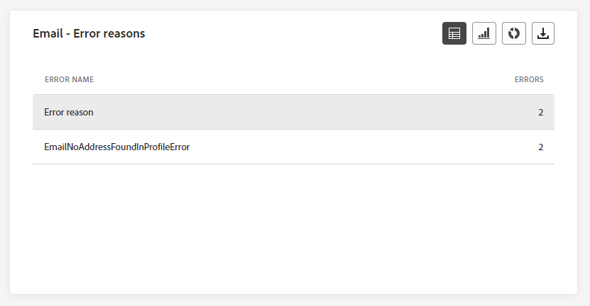
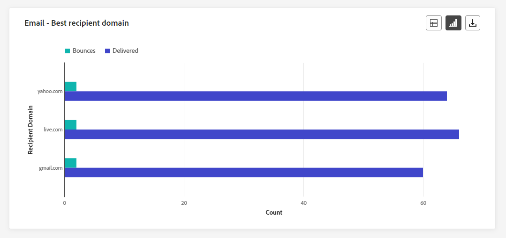
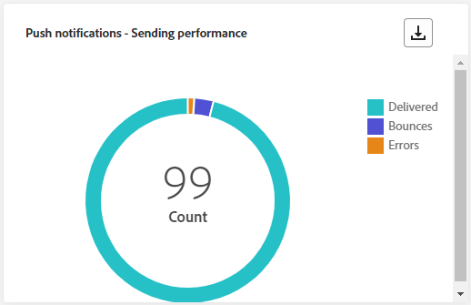
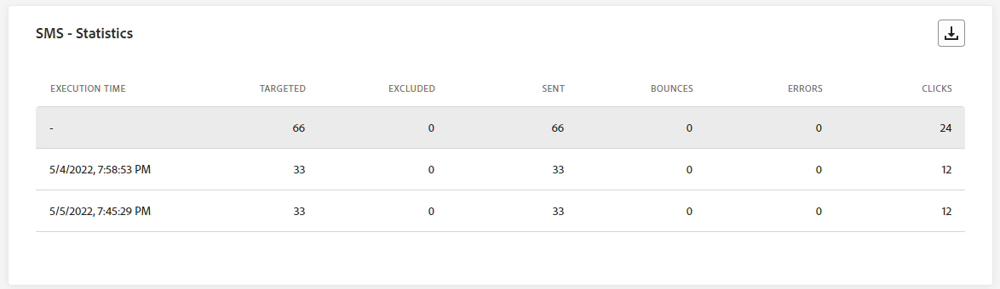

# 营销活动实时报告 {#campaign-live-report}

>[!CONTEXTUALHELP]
>id="ajo_campaign_live_report"
>title="营销活动实时报告"
>abstract="使用营销活动实时报告，您可以实时衡量和可视化营销活动的影响和绩效（仅限过去 24 小时）。报告分为不同的构件，详细说明您营销活动中的成功和错误。可通过调整构件大小或删除构件而修改每个报告仪表板。"

实时报告可从“最近24小时”选项卡访问，它显示过去24小时内发生的事件，最小时间间隔为距事件发生两分钟。 相比之下，全局报告重点关注至少两小时前发生的事件，并涵盖选定时间段内的事件。

营销活动实时报告可以通过以下方式直接从您的营销活动访问 **[!UICONTROL 实时视图]** 按钮。

营销活动 **[!UICONTROL 实时报告]** 页面将显示以下选项卡：

* [Campaign](#campaign-live)
* [电子邮件](#email-live)
* [应用程序内](#inapp-live)
* [推送](#push-live)
* [短信](#sms-live)
* [Web](#web-tab)
* [直邮](#direct-mail-tab)

营销活动 **[!UICONTROL 实时报告]** 将分为多个构件，每个构件详细描述营销活动的成功和错误。 如果需要，可以调整每个小部件的大小并将其删除。 有关详细信息，请参阅此 [部分](../reports/live-report.md#modify-dashboard).

有关Adobe Journey Optimizer中可用的每个量度的详细列表，请参阅 [此页面](live-report.md#list-of-components-live).

## “营销活动”选项卡 {#campaign-live}

### 投放 {#delivery-live}

此 **[!UICONTROL 营销活动的统计数据]** KPI用作全面的功能板，提供与活动相关的过去24小时内关键量度的详细细目。 这包括基本信息（如用户档案数量和已交付的操作），从而可全面了解营销活动的绩效和参与情况。

+++ 了解有关Campaign统计量度的更多信息

* **[!UICONTROL 受众]**：目标用户档案的数量。

* **[!UICONTROL 已交付操作]**：交付操作的唯一总次数。

* **[!UICONTROL 错误]**：发送过程中发生的阻止将消息发送到用户档案的错误总数。

+++

<!--
### Experimentation tab (#experimentation-live)

From your Campaign **[!UICONTROL Live report]**, the **[!UICONTROL Experimentation]** tab details the main information relative to how each variant is performing and if there is was winner during the test.
-->

## 电子邮件选项卡 {#email-live}

来自您的营销活动 **[!UICONTROL 实时报告]**， **[!UICONTROL 电子邮件]** 选项卡详细列出了与您的营销活动中发送的电子邮件相关的主要信息。

### 电子邮件 - 发送性能 {#email-sending-performance}

>[!CONTEXTUALHELP]
>id="ajo_campaign_live_email_sending_statistics"
>title="电子邮件 - 发送统计数据"
>abstract="“电子邮件 - 发送统计数据”图表汇总有关电子邮件的基本数据，如过去 24 小时内定向邮件或已送达邮件。"

此 **[!UICONTROL 电子邮件 — 发送性能]** 提供过去24小时内发送的电子邮件相关数据的全面概述。 它提供对投放和退回等基本量度的洞察，从而允许详细检查电子邮件发送过程。

+++ 了解有关电子邮件发送性能指标的更多信息

* **[!UICONTROL 已投放]**：成功发送的电子邮件数。

* **[!UICONTROL 跳出次数]**：发送流程和自动返回处理期间累计的错误总数。

* **[!UICONTROL 重试]**：重试队列中的电子邮件数。

* **[!UICONTROL 错误]**：发送过程中发生的阻止将消息发送到用户档案的错误总数。
+++

### 电子邮件 - 统计数据

>[!CONTEXTUALHELP]
>id="ajo_campaign_live_email_statistics"
>title="电子邮件 - 统计数据"
>abstract="“电子邮件 - 统计数据”表提供有关过去 24 小时内电子邮件的配置文件活动的数据。"

此 **[!UICONTROL 按电子邮件发送指标]** 表提供了过去24小时数据的全面摘要。 它概述了基本指标，包括目标受众规模以及成功投放的电子邮件数量。 这提供了关于电子邮件营销活动效果和影响的宝贵见解。

+++ 了解有关电子邮件 — 统计量度的更多信息

* **[!UICONTROL 执行时间]**：定期电子邮件的每次执行的开始时间。 要仅定向一个或多个定期电子邮件，请从中选择它 **[!UICONTROL 执行时间]** 下拉菜单。

* **[!UICONTROL 已定位]**：发送过程中处理的消息总数。

* **[!UICONTROL 已排除]**：从定向用户档案中排除且未收到消息的用户用户档案数。

* **[!UICONTROL 已发送]**：发送总数。

* **[!UICONTROL 已投放]**：成功发送的消息数。

* **[!UICONTROL 跳出次数]**：发送流程和自动返回处理期间累计的错误总数。

* **[!UICONTROL 错误]**：发送过程中发生的阻止将消息发送到用户档案的错误总数。

* **[!UICONTROL 打开次数]**：消息的打开次数。

* **[!UICONTROL 点击次数]**：内容被单击的次数。

* **[!UICONTROL 取消订阅]**：取消订阅链接的点击次数。

* **[!UICONTROL 垃圾邮件投诉数]**：将消息声明为垃圾邮件或垃圾邮件的次数。

* **[!UICONTROL 重试]**：重试队列中的电子邮件数。
+++

### 电子邮件 — 退回类别和原因 {#bounce-categories}

>[!CONTEXTUALHELP]
>id="ajo_campaign_live_email_bounce_categories"
>title="电子邮件 - 退回类别"
>abstract="“电子邮件 - 退回类别”图表提供有关过去 24 小时内临时错误和永久性错误的数据。"

>[!CONTEXTUALHELP]
>id="ajo_campaign_live_email_bounce_reasons"
>title="电子邮件 - 退回原因"
>abstract="“电子邮件 - 退回原因”图表包含与过去 24 小时内退回邮件相关的可用数据。"

此 **[!UICONTROL 退回原因]** 和 **[!UICONTROL 退回类别]** 小组件编译过去24小时内与退回邮件相关的可用数据，提供对电子邮件退回具体原因和类别的详细见解。

有关退回的详细信息，请参阅 [禁止显示列表](../reports/suppression-list.md) 页面。

+++ 了解有关电子邮件 — 退回类别和原因量度的更多信息

* **[!UICONTROL 硬退回]**：永久错误的总数，如错误的电子邮件地址。 这涉及显式声明地址无效的错误消息，例如“未知用户”。

* **[!UICONTROL 软退回]**：临时错误的总数，如收件箱已满。

* **[!UICONTROL 已忽略]**：临时总数，例如外出或技术错误，例如，如果发件人类型是邮递员。

+++

### 电子邮件 - 按日期列出的效果 {#email-performance-date}

>[!CONTEXTUALHELP]
>id="ajo_campaign_live_email_performance_bydate"
>title="电子邮件 - 按日期列出的效果"
>abstract="电子邮件 — 按日期列出的性能图表显示了过去24小时内已发送电子邮件的全面数据，提供了对关键量度（如投放和跳出）的分析，从而允许对电子邮件发送过程进行详细分析。"

此 **[!UICONTROL 电子邮件 — 按日期列出的性能]** 构件通过图表详细概述了与报文相关的关键信息，深入分析了过去24小时的性能趋势。

+++ 详细了解电子邮件 — 按日期和原因列出的性能量度

* **[!UICONTROL 已发送]**：发送总数。

* **[!UICONTROL 已投放]**：成功发送的消息数。

* **[!UICONTROL 跳出次数]**：发送流程和自动返回处理期间累计的错误总数。

* **[!UICONTROL 错误]**：发送过程中发生的阻止将消息发送到用户档案的错误总数。

* **[!UICONTROL 打开次数]**：消息的打开次数。

* **[!UICONTROL 点击次数]**：内容被单击的次数。

* **[!UICONTROL 取消订阅]**：取消订阅链接的点击次数。

* **[!UICONTROL 垃圾邮件投诉数]**：将消息声明为垃圾邮件或垃圾邮件的次数。

+++

### 错误原因 {#email-error-reasons}

>[!CONTEXTUALHELP]
>id="ajo_campaign_live_email_error_reasons"
>title="电子邮件 - 错误原因"
>abstract="通过“电子邮件 - 错误原因”图表，可了解过去 24 小时内在发送过程中发生的具体错误。"

此 **[!UICONTROL 错误原因]** 利用图形和表格可以深入分析过去24小时内发送过程中发生的特定错误。 此信息对于了解错误的性质和频率非常有用。

### 排除的原因 {#email-exclude-reasons}

>[!CONTEXTUALHELP]
>id="ajo_campaign_live_email_excluded_reasons"
>title="电子邮件 - 排除原因"
>abstract="“排除原因”图表说明过去 24 小时内导致从目标受众中排除用户配置文件，从而收不到消息的各种因素。"

此 **[!UICONTROL 排除的原因]** 图表和表格从各个角度全面介绍了导致过去24小时内从目标受众中排除用户配置文件的各种因素。

请参阅 [此页面](exclusion-list.md) 以获取排除原因的完整列表。

### 电子邮件 - 最佳收件人域 {#email-best-recipient}

>[!CONTEXTUALHELP]
>id="ajo_campaign_live_email_best_recipient"
>title="电子邮件 - 最佳收件人域"
>abstract="“电子邮件 - 最佳收件人域”图表详细地细分过去 24 小时内收件人最常用于打开电子邮件的域，并提供针对收件人行为的宝贵见解。"

此 **[!UICONTROL 电子邮件 — 最佳收件人域]** 图表和表格提供了过去24小时内用户档案打开电子邮件最常用域的彻底细分。 这提供了有关用户档案行为的宝贵见解，可帮助您了解首选平台。

### 电子邮件 — 优惠 {#email-offers}

>[!NOTE]
>
>仅在电子邮件中插入决策时，优惠小组件和量度才可用。 有关决策管理的更多信息，请参阅此 [页面](../offers/get-started/starting-offer-decisioning.md).

此 **[!UICONTROL 优惠统计数据]** 和 **[!UICONTROL 一段时间内的优惠统计数据]** 构件用于衡量优惠的成功情况以及对定向受众的影响。 它会使用KPI详细描述与消息相关的主要信息。

+++ 了解有关电子邮件 — 优惠指标的更多信息

* **[!UICONTROL 已发送优惠]**：选件的发送总数。

* **[!UICONTROL 优惠展示]**：选件在电子邮件中打开的次数。

* **[!UICONTROL 优惠点击次数]**：选件在电子邮件中被点按的次数。

+++

## 应用程序内选项卡 {#inapp-live}

来自您的营销活动 **[!UICONTROL 实时报告]**， **[!UICONTROL 应用程序内]** 选项卡详细列出了与您的促销活动中发送的应用程序内消息相关的主要信息。

### 应用程序内性能 {#inapp-performance}

>[!CONTEXTUALHELP]
>id="ajo_campaign_live_inapp_performance"
>title="应用程序内性能"
>abstract="“应用程序内性能”KPI 提供有关过去 24 小时内访客与应用程序内消息的互动的基本见解。"

此 **[!UICONTROL 应用程序内性能]** KPI可提供过去24小时内用户档案与应用程序内消息互动情况的基本见解，从而提供评估应用程序内营销活动效果和影响的基本指标。

+++ 了解有关应用程序内性能指标的更多信息

* **[!UICONTROL 展示次数]**：发送给所有用户的应用程序内消息总数。

* **[!UICONTROL 交互]**：应用程序内消息的参与总数。 这包括用户执行的任何操作，例如单击、解除或任何其他交互。

+++

### 应用程序内摘要 {#inapp-summary}

>[!CONTEXTUALHELP]
>id="ajo_campaign_live_inapp_summary"
>title="应用程序内摘要"
>abstract="“应用程序内摘要”图表显示过去 24 小时内应用程序内展示和交互的进展。"

此 **[!UICONTROL 应用程序内摘要]** 图形可展示过去24小时内应用程序内展示和交互的进展情况，全面概述应用程序内消息的性能。

+++ 了解有关应用程序内摘要量度的更多信息

* **[!UICONTROL 展示次数]**：交付给所有用户的应用程序内消息总数。

* **[!UICONTROL 交互]**：应用程序内消息的参与总数。 这包括用户执行的任何操作，例如单击、解除或任何其他交互。

+++

### 按类型列出的交互 {#inapp-interactions}

>[!CONTEXTUALHELP]
>id="ajo_campaign_live_inapp_interactions"
>title="按类型列出的交互"
>abstract="“按类型列出的交互”图表通过跟踪过去 24 小时内的任何点击、取消或交互而详述用户如何通过与应用程序内消息交互。"

此 **[!UICONTROL 按类型列出的交互]** 图表和表格详细说明了配置文件在过去24小时内如何与您的应用程序内消息、跟踪操作（如点击、解聘或任何其他形式的参与）进行交互。

## 推送通知选项卡 {#push-live}

来自您的营销活动 **[!UICONTROL 实时报告]**， **[!UICONTROL 推送通知]** 选项卡详细说明与您的营销活动中发送的推送通知相关的主要信息。

### 推送通知 - 发送性能 {#push-sending-performance}

>[!CONTEXTUALHELP]
>id="ajo_campaign_live_push_sending_performance"
>title="推送通知 - 发送性能"
>abstract="“推送通知发送性能”图表总结了有关推送通知的基本数据，例如过去 24 小时内的错误或已送达消息。"

此 **[!UICONTROL 推送通知发送性能]** 图表全面概述了过去24小时内发送的与推送通知相关的数据。 它提供对基本量度（如投放和跳出）的见解，从而允许详细检查推送通知发送流程。

+++ 了解有关推送通知 — 发送性能指标的更多信息

* **[!UICONTROL 已投放]**：成功发送的消息数。

* **[!UICONTROL 跳出次数]**：发送流程和自动返回处理期间累计的错误总数。

* **[!UICONTROL 错误]**：发送过程中发生的阻止将消息发送到用户档案的错误总数。

+++

### 推送通知 - 统计数据 {#push-statistics}

>[!CONTEXTUALHELP]
>id="ajo_campaign_live_push_statistics"
>title="推送通知 - 统计数据"
>abstract="“推送统计数据”表提供有关过去 24 小时内推送通知的收件人活动的数据。"

此 **[!UICONTROL 推送通知 — 统计数据]** 该表简要概述了过去24小时内与推送通知相关的基本数据，包括关键量度，例如定向消息数量和成功投放消息数量。

+++ 了解有关推送通知 — 统计量度的更多信息

* **[!UICONTROL 执行时间]**：每次执行定期推送通知的开始时间。 要仅定位一个或多个定期推送通知，请从以下位置选择通知： **[!UICONTROL 执行时间]** 下拉菜单。

* **[!UICONTROL 已定位]**：发送过程中处理的消息总数。

* **[!UICONTROL 已排除]**：从定向用户档案中排除且未收到消息的用户用户档案数。

* **[!UICONTROL 已发送]**：发送总数。

* **[!UICONTROL 已投放]**：成功发送的消息数。

* **[!UICONTROL 跳出次数]**：发送流程和自动返回处理期间累计的错误总数。

* **[!UICONTROL 错误]**：发送过程中发生的阻止将消息发送到用户档案的错误总数。

* **[!UICONTROL 打开次数]**：消息的打开次数。

+++

### 推送通知 - 发送摘要 {#push-sending-summary}

>[!CONTEXTUALHELP]
>id="ajo_campaign_live_push_sending_summary"
>title="推送通知 - 发送摘要"
>abstract="“推送通知发送摘要”图表显示过去 24 小时内发送的推送通知的可用数据。"

此 **[!UICONTROL 推送通知 — 统计数据]** 图形提供动态呈现，显示过去24小时内推送通知活动的分析。 此图形呈现提供了已发送推送通知的全面细分。

+++ 了解有关推送通知 — 发送摘要量度的更多信息

* **[!UICONTROL 打开次数]**：推送通知的打开次数。

* **[!UICONTROL 操作]**：对已投放推送通知执行的总操作数，例如按钮点击或解除。

* **[!UICONTROL 跳出次数]**：与已发送消息总数相关的累积和自动返回处理的错误总数。

* **[!UICONTROL 已投放]**：成功发送的消息数，与已发送消息的总数相关。

* **[!UICONTROL 错误]**：阻止将其发送到用户档案的错误总数。

+++

### 推送通知 - 排除原因 {#push-excluded}

>[!CONTEXTUALHELP]
>id="ajo_campaign_live_push_excluded_reasons"
>title="推送通知 - 排除原因"
>abstract="“排除原因”图表说明过去 24 小时内导致从目标受众中排除用户配置文件，从而收不到消息的各种因素。"

此 **[!UICONTROL 排除的原因]** 图形和表格显示了阻止从定向用户档案中排除的用户用户档案在最近24小时内接收推送通知的不同原因。

请参阅 [此页面](exclusion-list.md) 以获取排除原因的完整列表。

### 推送通知 - 错误原因 {#push-error}

>[!CONTEXTUALHELP]
>id="ajo_campaign_live_push_error_reasons"
>title="推送通知 - 错误原因"
>abstract="通过“错误原因”图表，可了解过去 24 小时内在发送过程中发生的具体错误。"

此 **[!UICONTROL 错误原因]** 通过表格和图形，您可以识别在推送通知发送过程中过去24小时内发生的特定错误，并针对发送过程中遇到的任何问题提供详细分析。

### 推送通知 - 按平台细分 {#push-breakdown-platform}

>[!CONTEXTUALHELP]
>id="ajo_campaign_live_push_breakdown_platform"
>title="推送通知 - 按平台细分"
>abstract="“按平台细分”图表根据收件人的操作系统提供细分过去 24 小时内推送通知的成功情况。"

此 **[!UICONTROL 推送通知 — 按平台细分]** 图表和表格详细分析过去24小时内推送通知的成功情况，根据用户档案的操作系统提供见解。 此划分可让您更好地了解推送通知在不同平台上的执行情况。

+++ 了解有关推送通知 — 按平台量度划分的更多信息

* **[!UICONTROL 已定位]**：分析期间处理的消息总数。

* **[!UICONTROL 已投放]**：成功发送的消息数，与已发送消息的总数相关。

* **[!UICONTROL 打开次数]**：推送通知的打开次数。

* **[!UICONTROL 操作]**：对已投放推送通知执行的总操作数，例如按钮点击或解除。

* **[!UICONTROL 跳出次数]**：与已发送消息总数相关的累积和自动返回处理的错误总数。

* **[!UICONTROL 错误]**：阻止将其发送到用户档案的错误总数。

* **[!UICONTROL 已排除]**：Adobe Journey Optimizer已排除的用户档案数。

+++

## 短信选项卡 {#sms-live}

来自您的营销活动 **[!UICONTROL 实时报告]**， **[!UICONTROL 短信]** 选项卡详细说明与您的营销活动中发送的短信消息相关的主要信息。

### 短信 - 统计数据 {#sms-statistics}

>[!CONTEXTUALHELP]
>id="ajo_campaign_live_sms_statistics"
>title="短信 - 统计数据"
>abstract="“短信发送统计数据”表汇总有关短信的基本数据，如过去 24 小时内定向消息或已送达消息。"

此 **[!UICONTROL 短信 — 统计数据]** 表提供了过去24小时内与短信消息相关的基本数据的简要摘要，其中包括关键量度，例如定向消息数量和成功投放消息计数。

+++ 了解有关短信 — 统计量度的更多信息

* **[!UICONTROL 执行时间]**：每次执行定期短信消息的开始时间。 要仅定向一条或多条定期短信消息，请从中选择它 **[!UICONTROL 执行时间]** 下拉菜单。

* **[!UICONTROL 已定位]**：符合目标配置文件资格的用户配置文件数。

* **[!UICONTROL 已排除]**：从定向用户档案中排除且未收到消息的用户用户档案数。

* **[!UICONTROL 已发送]**：发送总数。

* **[!UICONTROL 跳出次数]**：发送流程和自动返回处理期间累计的错误总数。

* **[!UICONTROL 错误]**：发送过程中发生的阻止将消息发送到用户档案的错误总数。

* **[!UICONTROL 点击次数]**：URL访问总数。

+++

### 短信 - 按日期显示效果 {#sms-perfomance-date}

>[!CONTEXTUALHELP]
>id="ajo_campaign_live_sms_performance"
>title="短信 - 按日期显示效果"
>abstract="“短信 - 按日期显示效果”构件以图形表示形式提供有关过去 24 小时内消息的关键信息。"

此 **[!UICONTROL 按日期划分的短信性能]** 构件通过图表详细概述了与报文相关的关键信息，深入分析了过去24小时的性能趋势。

+++ 了解有关短信的更多信息 — 按日期列出的绩效指标

* **[!UICONTROL 已发送]**：发送总数。

* **[!UICONTROL 跳出次数]**：发送流程和自动返回处理期间累计的错误总数。

* **[!UICONTROL 错误]**：发送过程中发生的阻止将消息发送到用户档案的错误总数。

+++

### 短信 — 错误原因 {#sms-error-reasons}

>[!CONTEXTUALHELP]
>id="ajo_campaign_live_sms_error_reasons"
>title="短信 - 错误原因"
>abstract="通过“短信 - 错误原因”图表，可了解过去 24 小时内在发送过程中发生的具体错误。"

此 **[!UICONTROL 排除的原因]** 利用图表和表格，可识别在发送短信消息过程中过去24小时内发生的特定错误，便于对遇到的任何问题进行彻底分析。

### 短信 — 排除的原因 {#sms-excluded-reasons}

>[!CONTEXTUALHELP]
>id="ajo_campaign_live_sms_excluded_reasons"
>title="短信 - 排除原因"
>abstract="“排除原因”图表说明过去 24 小时内导致从目标受众中排除用户配置文件，从而收不到消息的各种因素。"

此 **[!UICONTROL 排除的原因]** 图表和表格直观地描述了导致从目标受众中排除用户个人资料的各种因素，阻止他们在过去24小时内接收您的短信消息。

请参阅 [此页面](exclusion-list.md) 以获取排除原因的完整列表。

### 短信 - 退回原因 {#sms-bounces-reasons}

>[!CONTEXTUALHELP]
>id="ajo_campaign_live_sms_bounces_reasons"
>title="短信 - 退回原因"
>abstract="“退回原因”图表包含与过去 24 小时内与退回消息相关的可用数据。"

此 **[!UICONTROL 退回原因]** 图形和表格提供了与弹回SMS消息相关的全面数据概述，针对过去24小时内SMS消息退回实例背后的具体原因提供了宝贵的洞察。

## Web 选项卡 {#web-tab}

来自您的营销活动 **[!UICONTROL 实时报告]**， **[!UICONTROL Web]** 选项卡详细列出了与您的网页相关的主要信息。

### Web 性能 {#web-performance}

>[!CONTEXTUALHELP]
>id="ajo_campaign_live_web_performance"
>title="Web 性能"
>abstract="“Web 性能”KPI 提供有关过去 24 小时内访客与 Web 体验的互动的全面信息。"

此 **[!UICONTROL Web性能]** KPI可全面了解访客在过去24小时内与您的网页的互动情况，包括关键量度，如展示次数和互动。

+++ 了解有关Web性能指标的更多信息

* **[!UICONTROL 展示次数]**：交付给所有用户的Web体验总数。

* **[!UICONTROL 交互]**：与网页的互动总数。 这包括用户执行的任何操作，例如点击或任何其他交互。

+++

### Web 摘要 {#web-summary}

>[!CONTEXTUALHELP]
>id="ajo_campaign_live_web_summary"
>title="Web 摘要"
>abstract="“Web 摘要”图表展示过去 24 小时内 Web 体验的进展情况，包括展示次数、独特展示次数和交互次数。"

此 **[!UICONTROL Web摘要]** 图形可显示在过去24小时内Web体验（展示次数、独特展示次数和交互）的演变。

+++ 了解有关Web摘要量度的更多信息

* **[!UICONTROL 展示次数]**：交付给所有用户的Web体验总数。

* **[!UICONTROL 交互]**：与网页的互动总数。 这包括用户执行的任何操作，例如点击或任何其他交互。

+++

### 按元素列出的交互 {#web-interactions}

>[!CONTEXTUALHELP]
>id="ajo_campaign_live_web_interactions"
>title="按元素列出的交互"
>abstract="“按元素列出的交互”表提供有关过去 24 小时内访客与网页上不同元素进行互动的关键信息。"

此 **[!UICONTROL 按元素显示的交互]** 表格显示访客过去24小时内与网页上各种元素的参与情况的全面信息，提供了有关用户交互和偏好设置的宝贵见解。

## 直邮选项卡 {#direct-mail-tab}

来自您的营销活动 **[!UICONTROL 实时报告]**， **[!UICONTROL 直邮]** 选项卡详细列出了与直邮相关的主要信息。

### 直邮 - 发送统计数据 {#direct-mail-sending}

>[!CONTEXTUALHELP]
>id="ajo_campaign_live_direct_sending_statistics"
>title="直邮 - 发送统计数据"
>abstract="“直邮发送统计数据”表汇总过去 24 小时内有关直邮的基本数据，如定向邮件或已送达邮件。"

此 **[!UICONTROL 直邮 — 发送统计数据]** 该表简要概述了与直邮消息相关的基本数据，包括关键量度，如定向消息数量和过去24小时内成功投放的消息数量。

+++ 了解有关直邮 — 发送统计量度的更多信息

* **[!UICONTROL 已定位]**：符合目标配置文件资格的用户配置文件数。

* **[!UICONTROL 已发送]**：发送总数。

* **[!UICONTROL 错误]**：发送过程中发生的阻止将消息发送到用户档案的错误总数。

* **[!UICONTROL 已排除]**：从定向用户档案中排除、未收到直邮的用户用户档案数。

+++

### 直邮 - 错误原因 {#direct-mail-error-reasons}

>[!CONTEXTUALHELP]
>id="ajo_campaign_live_direct_error_reasons"
>title="直邮 - 错误原因"
>abstract="通过“直邮 - 错误原因”图表，可了解过去 24 小时内发生的具体错误。"

此 **[!UICONTROL 直邮 — 错误原因]** 图表和表格提供了识别直邮消息发送过程中发生的特定错误的方法，允许详细分析过去24小时内遇到的任何问题。

### 直邮 - 排除原因 {#direct-mail-excluded-reasons}

>[!CONTEXTUALHELP]
>id="ajo_campaign_live_direct_excluded_reasons"
>title="直邮 - 排除原因"
>abstract="“直邮排除原因”图表说明导致过去 24 小时内从目标受众中排除用户配置文件，从而收不到消息的各种因素。"

此 **[!UICONTROL 直邮 — 排除的原因]** 图表和表格直观地说明了导致从目标受众中排除用户配置文件，从而阻止这些用户在过去24小时内接收直邮消息的各种因素。

请参阅 [此页面](exclusion-list.md) 以获取排除原因的完整列表。

## 其他资源

* [营销活动入门](../campaigns/get-started-with-campaigns.md)
* [创建营销活动](../campaigns/create-campaign.md)
* [创建API触发的营销活动](../campaigns/api-triggered-campaigns.md)
* [修改或停止营销活动](../campaigns/modify-stop-campaign.md)
* [营销活动全局报告](campaign-global-report.md)
