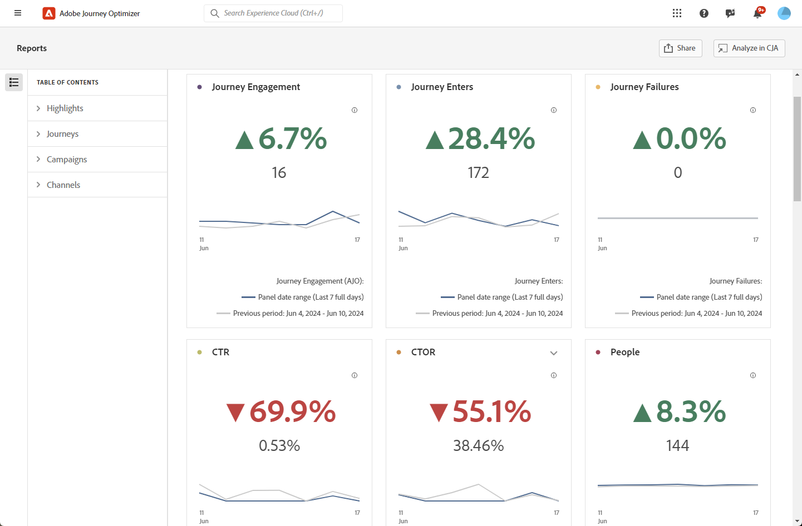

# “概述”报告 {#channel-report-cja}

>[!BEGINSHADEBOX]

**在此页面上：**&#x200B;了解如何使用概述报告来分析所有活动和历程的统一流量和参与量度，并专门针对历程、活动、渠道、历程上限规则集和优化模型创建选项卡。

>[!ENDSHADEBOX]

概述报表可为用户提供环境中所有活动和历程的流量和参与量度的全面摘要。 这些量度经过组合，可显示来自不同渠道（包含各种营销活动和历程）的操作的统一值。

您可以通过导航到&#x200B;**历程管理**&#x200B;部分中的&#x200B;**报表**&#x200B;菜单来访问概述报表。

此时将显示报告页面，其中包含以下选项卡：

* [历程](#journey)
* [营销活动](#campaign)
* [渠道](#channel)
* [规则集](#rule-sets)
* [优化模型](#optimization-models)

要了解有关Customer Journey Analytics Workspace以及如何过滤和分析数据的更多信息，请参阅[此页面](https://experienceleague.adobe.com/zh-hans/docs/analytics-platform/using/cja-workspace/home)。

## 高亮 {#highlights}

**[!UICONTROL 亮点]** KPI用作综合仪表板，提供环境中所有营销活动和历程的关键量度详细细目，使您能够快速评估绩效并识别需要改进的方面。

+++ 进一步了解重点量度

* **[!UICONTROL 历程参与度]**：接收通过历程发送的消息的独特个人的总数，代表到达历程中指定操作点的不同用户档案。

* **[!UICONTROL 历程进入者]**：到达历程进入事件的个人总数。

* **[!UICONTROL 历程失败]**：未成功执行的单个历程总数。

* **[!UICONTROL 点进率]**：邮件中的点进百分比。

* **[!UICONTROL 点进打开率(CTOR)]**：消息的打开次数。

* **[!UICONTROL 人员]**：符合消息目标用户档案资格的用户档案数。

* **[!UICONTROL 点击次数]**：在邮件中点击内容的次数。

* **[!UICONTROL 垃圾邮件投诉次数]**：将邮件声明为垃圾邮件或垃圾邮件的次数。

* **[!UICONTROL 取消订阅]**：取消订阅链接的点击次数。

+++

## 历程 {#journey}

**[!UICONTROL 历程]**&#x200B;表用作综合仪表板，提供与您的旅程相关的关键量度分析。 它包括详细信息（例如输入的用户档案数量和失败的个人历程的实例），从而可透彻了解历程的有效性和参与级别。

通过单击此表中所列任何历程的名称，您可以轻松单独浏览每个历程，并在新选项卡中立即访问其综合报告。

+++ 了解有关历程量度的更多信息

* **[!UICONTROL 历程进入者]**：到达历程进入事件的个人总数。

* **[!UICONTROL 历程退出]**：退出历程的个人总数。

* **[!UICONTROL 历程失败]**：未成功执行的单个历程总数。

+++

## 营销活动 {#campaign}

**[!UICONTROL Campaign]**&#x200B;表可用作一个包含所有内容的仪表板，提供营销活动关键量度的详细概述。 它提供基本数据（如用户档案和发送数量），可让您根据营销活动的绩效和参与程度来全面了解insight。

通过单击此表中所列任何促销活动的名称，您可以轻松逐个浏览每个促销活动，从而在新选项卡中立即访问其综合报告。

+++ 了解有关Campaign量度的更多信息

* **[!UICONTROL 人员]**：符合消息目标用户档案资格的用户档案数。

* **[!UICONTROL 点进率(CTR)]**：邮件中的点进百分比。

* **[!UICONTROL 发送]**：每个营销活动的发送总数。

* **[!UICONTROL 已投放]**：已成功发送的邮件数。

* **[!UICONTROL 显示]**：消息的打开次数。

* **[!UICONTROL 点击次数]**：在邮件中点击内容的次数。

+++

## 渠道 {#channel}

### 渠道

**[!UICONTROL 渠道]**&#x200B;表提供了您的用户档案在渠道级别与消息的参与情况的详细细目。 这样，您就可以更深入地了解不同渠道的运行情况。

+++ 了解有关渠道量度的更多信息

* **[!UICONTROL 人员]**：符合消息目标用户档案资格的用户档案数。

* **[!UICONTROL 点进率(CTR)]**：邮件中的点进百分比。

* **[!UICONTROL 已投放]**：已成功发送的邮件数。

* **[!UICONTROL 显示]**：消息的打开次数。

* **[!UICONTROL 点击次数]**：在邮件中点击内容的次数。

+++

### 出站错误

**[!UICONTROL 出站错误]**&#x200B;表允许您查明整个发送过程中发生的确切错误，从而便于明确了解遇到的任何问题。

### 出站排除项

**[!UICONTROL 出站排除项]**&#x200B;表提供了导致从目标受众中排除用户配置文件从而导致未收到该消息的各种因素的完整视图。

## 历程上限和冲突 {#rule-sets}

**[!UICONTROL 历程上限和冲突]**&#x200B;表提供了历程仲裁规则集如何执行的分析，并根据应用于历程的上限规则和优先级得分显示历程进入和排除。

+++ 了解有关规则集量度的更多信息

**[!UICONTROL 按规则集列出的历程条目]**&#x200B;列显示进入旅程的配置文件数。 入口有三种类型：

* **&#x200B;**&#x200B;[!UICONTROL 没有冲突]&#x200B;**&#x200B;**：配置文件进入历程时没有任何规则集冲突。 没有活动规则集阻止此条目，并且无论仲裁规则如何，都发生了历程条目。

* **更高的优先级**：用户档案进入旅程，因为其优先级高于其他竞争旅程。 即使存在冲突（用户档案符合多个历程的资格），但由于此历程的优先级分数较高，因此被选择。

* **未强制**：配置文件已进入历程，但规则集在进入时未处于活动状态或未应用于此历程条目。

**[!UICONTROL 排除项]**&#x200B;列显示从历程中排除的用户档案数。 出于两个原因，可以排除用户档案：

* **已达到上限**：配置文件已达到上限规则允许的最大历程条目数或并发历程数。

* **较低优先级**：尚未达到上限，但其他较高优先级的历程满足约束。 用户档案已从此历程中排除，并改为进入更高优先级的历程。

+++

要使用Adobe Experience Platform查询服务在数据湖级别调查这些排除项，请参阅[业务规则查询](query-examples.md#business-rules-queries)。

➡️ [了解有关历程上限和仲裁的更多信息](../conflict-prioritization/journey-capping.md)

## 优化模型 {#optimization-models}

**[!UICONTROL 发送时间优化]**&#x200B;表为您提供了有关优化和控制电子邮件或推送消息执行情况的分析。 使用它来比较关键量度，例如发送、打开、点击和跳出，这样您就可以查看每个变体的表现并告知您的优化决策。

请注意，此报表中的量度（包括&#x200B;**[!UICONTROL 提升]**&#x200B;和&#x200B;**[!UICONTROL 置信度]**）是根据发送和参与的&#x200B;**60天**&#x200B;计算的。

+++ 了解有关发送时间优化量度的更多信息

* **[!UICONTROL 发送]**：发送每个消息变体的总次数。

* **[!UICONTROL 打开]**：为邮件记录的打开事件总数。

* **[!UICONTROL 打开率]**：配置文件至少打开过一次该邮件的已发送邮件的百分比。

* **[!UICONTROL 提升]**：给定处理的转化率相对于基线变体的提升百分比。 提升量化了差异的大小；将其与&#x200B;**[!UICONTROL 置信度]**&#x200B;一起解释。

* **[!UICONTROL 置信度]**：证明发送时间优化变量的打开率或点击率与控制变量（随机分配的发送时间）不同的证据的统计强度。 它用二比例Z检验进行计算。

+++
