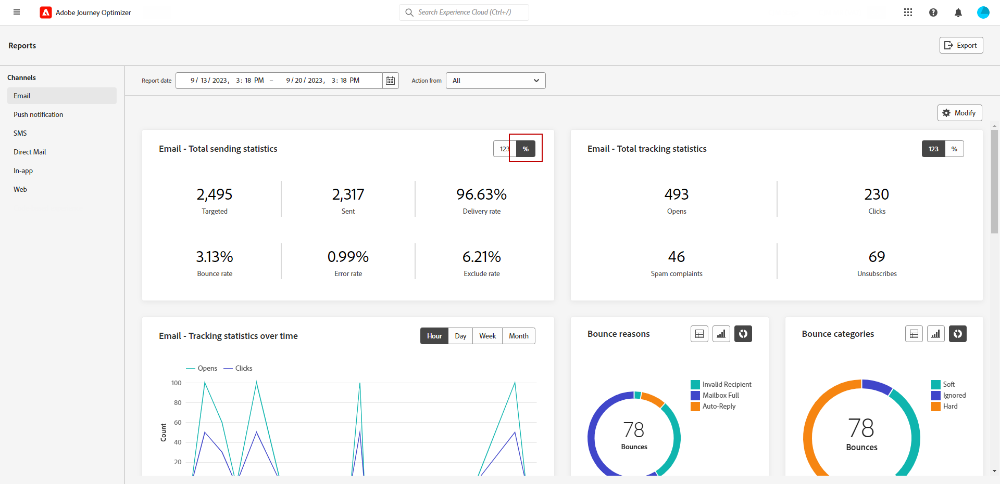

# 开始使用渠道报告 {#channel-report-gs}

渠道报表是一个功能强大的工具，可将流量和参与量度的全面概述纳入每个渠道的统一报表中，并包含所有营销活动和历程的所有操作。 该可视化图表分为不同的构件，每个构件都提供营销活动或历程表现的特定视图。

渠道报表是完全可自定义的，因此您可以调整或删除小组件以创建一个满足您特定需求的功能板。 您还可以将报表数据导出到PDF或CSV文件以供进一步分析。

在本节中了解有关渠道报表可用的不同量度和小组件的更多信息 [页面](channel-report.md).

## 开始前 {#manage-reports-prereq}

在开始之前，请检查您是否有权访问 **[!UICONTROL 报表]** 菜单。

如果您看不到 **[!UICONTROL 报表]** 菜单下，必须扩展您的访问权限以包含 **[!UICONTROL 查看渠道报表]** 许可。 如果您有权访问Adobe Experience Platform，则可以扩展自己的权限 [权限](https://experienceleague.adobe.com/docs/experience-platform/access-control/home.html?lang=zh-Hans){target="_blank"} 为您的组织而设计。 如果没有，请联系您的Adobe Journey Optimizer管理员。

+++了解如何分配报表权限

请注意，此权限包含在以下内置中 **[!UICONTROL 角色]**：Campaign经理、Campaign审批者、Campaign查看者和Campaign管理员。

要将相应的权限分配给您的 **[!UICONTROL 角色]**：

1. 从 [!DNL Permissions] 产品，导航到 **[!UICONTROL 角色]** 菜单，然后选择要使用新的更新角色 **[!UICONTROL 查看渠道报表]** 许可。

1. 来自您的 **[!UICONTROL 角色]** 仪表板，单击 **[!UICONTROL 编辑]**.

   

1. 拖放 **[!UICONTROL 报表]** 用于分配权限的资源。

   从 **[!UICONTROL 报表]** 资源下拉列表，选择 **[!UICONTROL 查看渠道报表]** 许可。

   

1. 单击&#x200B;**[!UICONTROL 保存]**。

分配给此的用户 **[!UICONTROL 角色]** 现在可以访问 **[!UICONTROL 报表]** 菜单。

+++

## 管理您的报表仪表板 {#manage-reports}

要访问和管理渠道报表，请执行以下步骤：

1. 导航至 **[!UICONTROL 报表]** 中的菜单 **[!UICONTROL 历程管理]** 部分。

   

1. 从功能板中选择 **开始** 和 **[!UICONTROL 结束时间]** 以定位特定数据。

1. 从 **[!UICONTROL 操作来源]** 下拉列表中，选择要定位促销活动和/或历程。

   

1. 单击 **[!UICONTROL 修改]** 以调整小部件的大小或删除小部件，从而创建满足您特定需求的仪表板。

   

1. 如果对小部件的显示顺序和大小满意，请单击 **[!UICONTROL 保存]**.

1. 根据小组件，您可以选择从表格、条形图或圆环图切换。

1. 单击百分比图标以费率显示您的数据。

   

## 导出您的报告 {#export-reports}

您可以轻松地将不同的报表导出为PDF或CSV格式，这使您能够共享、处理或打印这些报表。 导出渠道报表的详细步骤可在以下选项卡中找到：

>[!BEGINTABS]

>[!TAB 将报表导出为PDF文件]

1. 在报表中，单击 **[!UICONTROL 导出]** 并选择 **[!UICONTROL PDF文件]**.

1. 在“打印”窗口中，根据需要配置文档。 请注意，选项可能因您的浏览器而异。

1. 选择打印报表或将报表另存为PDF。

1. 找到要保存文件的文件夹，根据需要重命名它，然后单击“保存”。

您的报表现在可以在PDF文件中查看或共享。

>[!TAB 将报表导出为CSV文件]

1. 在报表中，单击 **[!UICONTROL 导出]** 并选择 **[!UICONTROL CSV文件]** 在整体报表级别生成CSV文件。

1. 您还可以选择从特定构件导出数据。 单击 **[!UICONTROL 将构件数据导出到CSV]** 在选定小组件旁边。

1. 您的文件会自动下载，并位于本地文件中。

   如果在报表级别生成文件，则它包含每个小组件的详细信息，包括其标题和数据。

   如果在小组件级别生成文件，则它会专门提供选定小组件的数据。

>[!ENDTABS]
