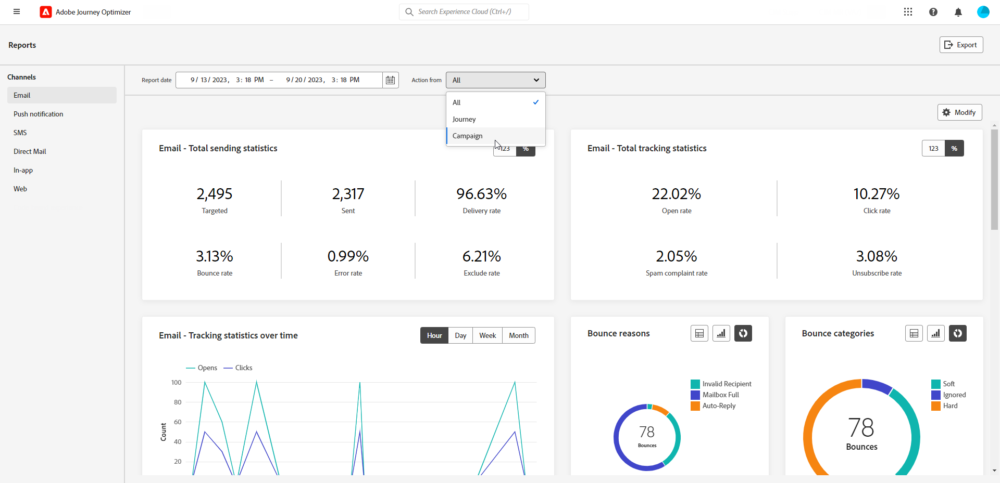

# 开始使用渠道报告 {#channel-report-gs}

>[!AVAILABILITY]
>
>目前的报告经验将于2025年1月停用。 在此日期之后，新的报告体验将成为标准。我们建议您熟悉新特性和功能，以确保顺利过渡。[开始使用Journey Optimizer的新报告界面。](report-gs-cja.md)

渠道报表是一个功能强大的工具，可将流量和参与量度的全面概述纳入每个渠道的统一报表中，并包含所有营销活动和历程的所有操作。 该可视化图表分为不同的构件，每个构件都提供营销活动或历程表现的特定视图。

渠道报表是完全可自定义的，因此您可以调整或删除小组件以创建一个满足您特定需求的功能板。 您还可以将报表数据导出到PDF或CSV文件以供进一步分析。

在[此页面](channel-report.md)上了解有关渠道报表可用的不同量度和小组件的更多信息。

## 开始前 {#manage-reports-prereq}

开始之前，请检查您是否有权访问&#x200B;**[!UICONTROL 报表]**&#x200B;菜单。

如果您看不到&#x200B;**[!UICONTROL 报表]**&#x200B;菜单，则必须扩展您的访问权限以包括&#x200B;**[!UICONTROL 查看渠道报表]**&#x200B;权限。 如果您有权访问组织的Adobe Experience Platform [权限](https://experienceleague.adobe.com/docs/experience-platform/access-control/home.html?lang=zh-Hans){target="_blank"}，则可以扩展自己的权限。 如果没有，请联系您的Adobe Journey Optimizer管理员。

+++了解如何分配报表权限

请注意，此权限包含在以下内置&#x200B;**[!UICONTROL 角色]**&#x200B;中：营销活动经理、营销活动批准者、营销活动查看者以及营销活动管理员。

要为您的&#x200B;**[!UICONTROL 角色]**&#x200B;分配相应的权限：

1. 从[!DNL Permissions]产品中，导航到&#x200B;**[!UICONTROL 角色]**&#x200B;菜单，然后选择要使用新的&#x200B;**[!UICONTROL 查看渠道报表]**&#x200B;权限更新的角色。

1. 在您的&#x200B;**[!UICONTROL 角色]**&#x200B;仪表板中，单击&#x200B;**[!UICONTROL 编辑]**。

   

1. 拖放&#x200B;**[!UICONTROL 报表]**&#x200B;资源以分配权限。

   从&#x200B;**[!UICONTROL 报表]**&#x200B;资源下拉列表中，选择&#x200B;**[!UICONTROL 查看渠道报表]**&#x200B;权限。

   

1. 单击&#x200B;**[!UICONTROL 保存]**。

分配到此&#x200B;**[!UICONTROL 角色]**&#x200B;的用户现在可以访问&#x200B;**[!UICONTROL 报告]**&#x200B;菜单。

+++

## 管理您的报表仪表板 {#manage-reports}

要访问和管理渠道报表，请执行以下步骤：

1. 导航到&#x200B;**[!UICONTROL 历程管理]**&#x200B;部分中的&#x200B;**[!UICONTROL 报表]**&#x200B;菜单。

   

1. 从仪表板中，选择一个&#x200B;**开始**&#x200B;和&#x200B;**[!UICONTROL 结束时间]**&#x200B;以定位特定数据。

1. 从&#x200B;**[!UICONTROL 从]**&#x200B;执行“操作”下拉列表中，选择是要定位促销活动、历程还是同时定位两者。

   

1. 单击&#x200B;**[!UICONTROL 修改]**&#x200B;以调整小部件的大小或移除小部件，以创建满足您特定需求的仪表板。

   

1. 如果对显示顺序和小部件的大小满意，请单击&#x200B;**[!UICONTROL 保存]**。

1. 根据小组件，您可以选择从表格、条形图或圆环图切换。

1. 单击百分比图标以费率显示您的数据。

   

## 导出您的报告 {#export-reports}

您可以轻松地将不同的报表导出为PDF或CSV格式，这允许您共享、处理或打印这些报表。 导出渠道报表的详细步骤可在以下选项卡中找到：

>[!BEGINTABS]

>[!TAB 将报表导出为PDF文件]

1. 在报表中，单击&#x200B;**[!UICONTROL 导出]**&#x200B;并选择&#x200B;**[!UICONTROL PDF文件]**。

1. 在“打印”窗口中，根据需要配置文档。 请注意，选项可能因您的浏览器而异。

1. 选择将报表打印或另存为PDF。

1. 找到要保存文件的文件夹，根据需要重命名它，然后单击“保存”。

您的报表现在可以在PDF文件中查看或共享。

>[!TAB 将报告导出为CSV文件]

1. 在报表中，单击&#x200B;**[!UICONTROL 导出]**&#x200B;并选择&#x200B;**[!UICONTROL CSV文件]**&#x200B;以生成整个报表级别的CSV文件。

1. 您还可以选择从特定构件导出数据。 单击所选构件旁边的&#x200B;**[!UICONTROL 将构件数据导出到CSV]**。

1. 您的文件会自动下载，并位于本地文件中。

   如果在报表级别生成文件，则它包含每个小组件的详细信息，包括其标题和数据。

   如果在小组件级别生成文件，则它会专门提供选定小组件的数据。

>[!ENDTABS]
