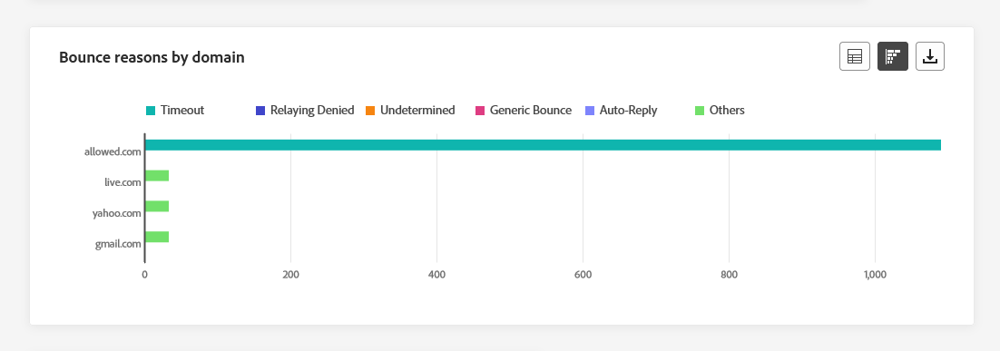
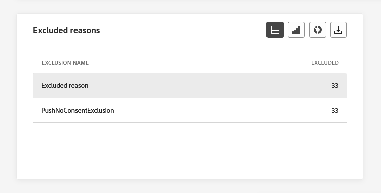
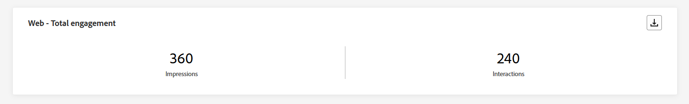

# 渠道报告 {#channel-report}

>[!CONTEXTUALHELP]
>id="ajo_channel_level_report"
>title="渠道级报告"
>abstract="渠道报告全面概述所有渠道上的流量和参与量度。报告分为不同的构件，详细说明营销活动和历程的成功和错误。可通过调整构件大小或删除构件而修改每个报告仪表板。"

>[!AVAILABILITY]
>
>目前的报告经验将于2025年1月停用。 在此日期之后，新的报告体验将成为标准。我们建议您熟悉新特性和功能，以确保顺利过渡。[开始使用Journey Optimizer的新报告界面。](report-gs-cja.md)

>[!IMPORTANT]
>
> 要访问&#x200B;**报表**&#x200B;菜单，您必须具有&#x200B;**[!UICONTROL 查看渠道报表]**&#x200B;权限。 [了解详情](channel-report-gs.md#before-starting-manage-reports-prereq)

渠道报表可在渠道级别为用户提供流量和参与量度的全面概述。 这些量度将进行聚合，以显示来自所选渠道（跨各种促销活动和历程）的操作的合并值。

您可以通过导航到&#x200B;**历程管理**&#x200B;部分中的&#x200B;**报表**&#x200B;菜单来访问渠道报表。 它是完全可自定义的，您可以根据报表日期或操作筛选数据。 [了解详情](channel-report-gs.md)

此时将显示报告页面，其中包含以下选项卡：

* [电子邮件](#email)
* [推送通知](#push)
* [短信](#sms)
* [应用程序内](#inapp)
* [Web](#web)
* [直邮](#direct-mail)

➡️ [在视频中了解此功能](#channel-report-video)

## 电子邮件 {#email}

在渠道报表中，电子邮件菜单详细说明与促销活动和历程中发送的电子邮件相关的主要信息。 指标详见下文。

### 电子邮件 - 发送总数统计数据 {#email-total-sending}

>[!CONTEXTUALHELP]
>id="ajo_channel_email_sending_statistics"
>title="电子邮件 - 发送总数统计数据"
>abstract="“电子邮件 - 发送总数统计数据”KPI 汇总有关您的电子邮件的基本数据，如定向邮件或送达的邮件。"

**[!UICONTROL 电子邮件总发送统计数据]**&#x200B;小组件提供了电子邮件性能的全面概述，其中显示汇总了电子邮件相关基本数据的关键性能指标(KPI)。

+++ 了解有关电子邮件发送总计统计量度的更多信息

* **[!UICONTROL 目标]**：已处理的电子邮件总数。

* **[!UICONTROL 已发送]**：发送总数。

* **[!UICONTROL 已投放]**：成功发送的电子邮件数与已发送的邮件总数相关。

* **[!UICONTROL 投放率]**：成功发送的电子邮件百分比。

* **[!UICONTROL 跳出次数]**：累计的错误总数以及相对于已发送消息总数的自动返回处理次数。

* **[!UICONTROL 跳出率]**：与已发送电子邮件相比跳出的电子邮件百分比。

* **[!UICONTROL 个错误]**：发生并阻止将其发送到配置文件的错误总数。

* **[!UICONTROL 错误率]**：与已发送的电子邮件相比，阻止发送该邮件的错误百分比。

* **[!UICONTROL 已排除]**： Adobe Journey Optimizer已排除的用户档案数。

* **[!UICONTROL 排除率]**： Adobe Journey Optimizer已排除的用户档案的百分比。

+++

### 电子邮件 - 跟踪总数统计数据 {#email-total-tracking}

>[!CONTEXTUALHELP]
>id="ajo_channel_email_tracking_statistics"
>title="电子邮件 - 跟踪总数统计数据"
>abstract="“电子邮件 - 跟踪总数统计数据”KPI 提供有关电子邮件的轮廓活动的数据。"

**[!UICONTROL 电子邮件总跟踪统计数据]**&#x200B;小组件提供与您的电子邮件关联的配置文件活动的详细快照，提供有关参与和电子邮件有效性的基本见解。

+++ 了解关于电子邮件总计跟踪统计量度的更多信息

* **[!UICONTROL 打开]**：消息的打开次数。

* **[!UICONTROL 打开率]**：与已传递电子邮件数相比已打开电子邮件的总数。

* **[!UICONTROL 点击次数]**：在消息中点击内容的次数。

* **[!UICONTROL 点击率]**：与电子邮件交互的用户百分比。

* **[!UICONTROL 垃圾邮件投诉次数]**：将邮件声明为垃圾邮件或垃圾邮件的次数。

* **[!UICONTROL 垃圾邮件投诉率]**：与已发送的电子邮件数量相比被声明为垃圾邮件或垃圾邮件的百分比。

* **[!UICONTROL 取消订阅]**：订阅链接的点击次数。

* **[!UICONTROL 取消订阅率]**：与已发送电子邮件数量相比的取消订阅百分比。

+++

### 电子邮件 - 一段时间内的发送统计数据 {#email-sending-statistics-overtime}

>[!CONTEXTUALHELP]
>id="ajo_channel_email_sending_statistics_overtime"
>title="电子邮件 - 一段时间内的发送统计数据"
>abstract="“电子邮件 - 一段时间内的发送统计数据”图表显示有关已发送电子邮件的数据，该数据按每小时、每天、每周或每月进行了细分。"

**[!UICONTROL 电子邮件 — 发送一段时间内的统计数据]**&#x200B;图形提供了动态表示形式，可显示电子邮件活动的分析。 此图形表示提供已发送电子邮件的全面分类，允许您以每小时、每天、每周或每月为单位观察趋势和模式。

+++ 了解有关电子邮件 — 发送随时间变化的统计信息的更多信息

* **[!UICONTROL 已发送]**：发送总数。

* **[!UICONTROL 已投放]**：成功发送的电子邮件数与已发送的电子邮件总数相关。

* **[!UICONTROL 跳出次数]**：累计的错误总数以及相对于已发送电子邮件总数的自动返回处理次数。

* **[!UICONTROL 个错误]**：发生并阻止将其发送到配置文件的错误总数。

+++

### 电子邮件 - 一段时间内的跟踪统计数据 {#email-tracking-statistics-overtime}

>[!CONTEXTUALHELP]
>id="ajo_channel_email_tracking_statistics_overtime"
>title="电子邮件 - 一段时间内的跟踪统计数据"
>abstract="“电子邮件 - 一段时间内的跟踪统计数据”图表提供有关您的电子邮件的轮廓活动的数据，该数据按每小时、每天、每周或每月进行了细分。"

**[!UICONTROL 电子邮件 — 随时间变化的跟踪统计数据]**&#x200B;图形提供与您的电子邮件相关的配置文件活动的详细概述。 此图形表示法以每小时、每天、每周或每月为单位细分数据，从而提供收件人参与度在不同时间间隔内演变情况的宝贵见解。

+++ 详细了解电子邮件 — 随时间变化的跟踪统计数据

* **[!UICONTROL 打开]**：消息的打开次数。

* **[!UICONTROL 点击次数]**：在消息中点击内容的次数。

+++

### 电子邮件 - 退回类别和原因 {#bounce-categories}

>[!CONTEXTUALHELP]
>id="ajo_channel_email_bounce_categories"
>title="退回类别"
>abstract="“退回类别”图表提供有关临时错误和永久性错误的数据。"

>[!CONTEXTUALHELP]
>id="ajo_channel_email_bounce_reasons"
>title="退回原因"
>abstract="“退回原因”图表包含与退回邮件相关的可用数据。"

**[!UICONTROL 退回类别]**&#x200B;和&#x200B;**[!UICONTROL 退回原因]**&#x200B;小组件封装与退回邮件关联的数据，全面概述邮件退回背后的各种类别和具体原因

有关退回的详细信息，请参阅[禁止显示列表](../reports/suppression-list.md)页面。

+++ 了解有关退回类别量度的更多信息

* **[!UICONTROL 硬退回]**：永久错误的总数，如电子邮件地址错误。 这涉及显式声明地址无效的错误消息，例如“未知用户”。

* **[!UICONTROL 软退回]**：临时错误的总数，如收件箱已满。

* **[!UICONTROL Ignored]**：临时总数，例如“不在办公室”或技术错误，例如，如果发件人类型为“邮递员”。

+++

### 错误原因 {#error-reasons}

>[!CONTEXTUALHELP]
>id="ajo_channel_email_error_reasons"
>title="错误原因"
>abstract="通过“错误原因”图表，可了解在发送过程中发生的具体错误。"

**[!UICONTROL 错误原因]**&#x200B;图形和表可让您查明整个发送过程中发生的确切错误，从而便于清楚地了解遇到的任何问题。

### 排除的原因 {#excluded-reasons}

>[!CONTEXTUALHELP]
>id="ajo_channel_email_excluded_reasons"
>title="排除的原因"
>abstract="“排除的原因”图表说明导致从目标受众中排除用户轮廓，从而收不到消息的各种因素。"

**[!UICONTROL 排除的原因]**&#x200B;图形和表全面介绍了导致从目标受众中排除用户个人资料导致未收到消息的各种因素。

有关排除原因的完整列表，请参阅[此页面](exclusion-list.md)。

### 按域列出的已发送和已送达邮件 {#sent-delivered-domains}

>[!CONTEXTUALHELP]
>id="ajo_channel_email_sending_delivered_domains"
>title="按域列出的已发送和已送达邮件"
>abstract="“按域列出的已发送和已送达邮件”图表表示所有重要电子邮件发送数据的域级细分。"

由域&#x200B;]**发送和投放的**[!UICONTROL &#x200B;表格和图形提供了域级别电子邮件投放的详细细目，提供了关于电子邮件性能的全面分析。

+++ 了解有关“按域发送和交付”指标的更多信息

* **[!UICONTROL 已发送]**：您的电子邮件的发送总数。

* **[!UICONTROL 已投放]**：成功发送的邮件数与已发送的邮件总数相关。

+++

### 按域列出的退回和错误 {#bounces-errors-domains}

>[!CONTEXTUALHELP]
>id="ajo_channel_email_bounces_errors_domains"
>title="按域列出的退回和错误"
>abstract="“按域列出的退回和错误”图表按域细分地呈现在发送过程中发生的具体错误。"

按域&#x200B;]**列出的**[!UICONTROL &#x200B;退回和错误图表和表格提供了发送过程中遇到的特定错误的域级细分，提供了所发生问题的详细分析。

+++ 详细了解按域列出的退回和错误量度

* **[!UICONTROL 跳出次数]**：在发送进程和自动返回处理期间累计的错误总数与已发送消息的总数之比。

* **[!UICONTROL 错误]**：发送过程中发生的阻止将错误发送到用户档案的错误总数。

+++

### 按域列出的打开和点击数 {#open-clicks-domains}

>[!CONTEXTUALHELP]
>id="ajo_channel_email_open_clicks_domains"
>title="按域列出的打开和点击数"
>abstract="“按域列出的打开和点击数”图表按域细分地呈现访客与电子邮件的参与。"

**[!UICONTROL 按域划分的打开和点击次数]**&#x200B;图形和表格显示了访客与您的电子邮件交互的域级细分，提供了有关不同域与您的内容如何交互的宝贵见解。

+++ 了解有关“按域列出的打开和点击次数”量度的更多信息

* **[!UICONTROL 打开次数]**：电子邮件的打开次数。

* **[!UICONTROL 点击次数]**：在电子邮件中点击内容的次数。

+++

### 按域列出的退回原因 {#bounce-reasons-domains}

>[!CONTEXTUALHELP]
>id="ajo_channel_email_bounce_reasons_domains"
>title="按域列出的退回原因"
>abstract="“按域列出的退回原因”图表按域细分地呈现临时错误和永久性错误数据。"

按域&#x200B;]**列出的**[!UICONTROL &#x200B;退回原因图表和表提供了有关临时和永久错误的域级数据细分，提供了有关退回消息背后原因的详细见解。

有关退回的详细信息，请参阅[禁止显示列表](../reports/suppression-list.md)页面。

## 推送通知 {#push}

在渠道报表中，**推送通知**&#x200B;菜单详细列出了与促销活动和历程中发送的推送通知相关的主要信息。 指标详见下文。

### 推送通知 - 发送总数统计数据 {#push-total-sending}

>[!CONTEXTUALHELP]
>id="ajo_channel_push_sending_statistics"
>title="推送通知 - 发送总数统计数据"
>abstract="“推送通知 - 发送总数统计数据”KPI 汇总有关推送通知的基本数据，如定向消息或已送达消息。"

**[!UICONTROL 推送通知 — 发送统计信息总数]** KPI用作综合摘要，封装与推送通知相关的基本数据。 这些量度包括对目标受众和实际投放状态的详细见解，从而更全面地了解推送通知的有效性和影响范围。

+++ 了解有关推送通知 — 发送总统计信息量度的更多信息

* **[!UICONTROL 目标]**：已处理的推送通知总数。

* **[!UICONTROL 已发送]**：已发送的推送通知总数。

* **[!UICONTROL 已传递]**：成功发送的推送通知数与已发送的推送通知总数相关。

* **[!UICONTROL 投放率]**：已成功发送的推送通知的百分比。

* **[!UICONTROL 跳出次数]**：累计的错误总数以及相对于已发送消息总数的自动返回处理次数。

* **[!UICONTROL 退回率]**：退回的推送通知与已发送的推送通知相比的百分比。

* **[!UICONTROL 个错误]**：发生并阻止将其发送到配置文件的错误总数。

* **[!UICONTROL 错误率]**：与发送的推送通知相比，阻止发送该通知的错误百分比。

* **[!UICONTROL 已排除]**： Adobe Journey Optimizer已排除的用户档案数。

* **[!UICONTROL 排除率]**： Adobe Journey Optimizer已排除的用户档案的百分比。

+++

### 推送通知 - 跟踪总数统计数据 {#push-total-tracking}

>[!CONTEXTUALHELP]
>id="ajo_channel_push_tracking_statistics"
>title="推送通知 - 跟踪总数统计数据"
>abstract="“推送通知 - 跟踪总数统计数据”提供有关推送通知的轮廓活动的数据。"

**[!UICONTROL 推送通知 — 跟踪统计信息总数]**&#x200B;构件提供与推送通知关联的用户档案活动的详细快照，提供有关参与和推送通知有效性的基本见解。

+++ 了解有关推送通知 — 总跟踪统计量度的更多信息

* **[!UICONTROL 打开]**：推送通知的打开次数。

* **[!UICONTROL 打开率]**：已打开推送通知的百分比。

* **[!UICONTROL 操作]**：对已送达推送通知执行的操作总数，例如按钮点击或解除。

* **[!UICONTROL 操作率]**：已送达推送通知上的操作与已发送推送通知相比的百分比。

+++

### 推送通知 - 一段时间内的发送统计数据 {#push-sending-overtime}

>[!CONTEXTUALHELP]
>id="ajo_channel_push_sending_statistics_overtime"
>title="推送通知 - 一段时间内的发送统计数据"
>abstract="“一段时间内的推送通知发送统计数据”图表显示有关已发送推送通知的数据，该数据按每小时、每天、每周或每月进行了细分。"

**[!UICONTROL 推送通知 — 发送一段时间内的统计数据]**&#x200B;图形提供动态表示形式，显示推送通知活动的分析。 此图形呈现方式提供了已发送推送通知的全面细分，允许您以每小时、每天、每周或每月为单位观察趋势和模式。

+++ 了解有关推送通知 — 发送一段时间量度的统计信息的更多信息

* **[!UICONTROL 已发送]**：已发送的推送通知总数。

* **[!UICONTROL 已传递]**：成功发送的推送通知数与已发送的推送通知总数相关。

* **[!UICONTROL 跳出次数]**：累计的错误总数以及相对于已发送消息总数的自动返回处理次数。

* **[!UICONTROL 个错误]**：发生并阻止将其发送到配置文件的错误总数。

+++

### 推送通知 - 一段时间内的跟踪统计数据 {#push-tracking-overtime}

>[!CONTEXTUALHELP]
>id="ajo_channel_push_tracking_statistics_overtime"
>title="推送通知 - 一段时间内的跟踪统计数据"
>abstract="“推送通知 - 一段时间内的跟踪统计数据”图表提供有关推送通知的轮廓活动的数据，该数据按每小时、每天、每周或每月进行了细分。"

**[!UICONTROL 推送通知 — 随时间变化的跟踪统计信息]**&#x200B;图形提供与推送通知相关的配置文件活动的详细概述。 此图形表示法以每小时、每天、每周或每月为单位细分数据，从而提供收件人参与度在不同时间间隔内演变情况的宝贵见解。

+++ 了解有关推送通知的更多信息 — 跟踪一段时间量度的统计数据

* **[!UICONTROL 打开次数]**：推送通知的打开次数。

* **[!UICONTROL 操作]**：对已送达推送通知执行的操作总数，例如按钮点击或解除。

+++

### 推送通知 - 排除的原因 {#push-excluded-reasons}

>[!CONTEXTUALHELP]
>id="ajo_channel_push_excluded_reasons"
>title="排除的原因"
>abstract="“排除的原因”图表说明导致从目标受众中排除用户轮廓，从而收不到消息的各种因素。"

**[!UICONTROL 排除的原因]**&#x200B;图形和表显示了阻止从目标用户档案排除的用户配置文件接收推送通知的不同原因。

有关排除原因的完整列表，请参阅[此页面](exclusion-list.md)。

### 推送通知 - 错误原因 {#push-error-reasons}

>[!CONTEXTUALHELP]
>id="ajo_channel_push_error_reasons"
>title="错误原因"
>abstract="通过“错误原因”图表，可了解在发送过程中发生的具体错误。"

**[!UICONTROL 错误原因]**&#x200B;图形和表允许您识别在推送通知发送过程中发生的特定错误，从而提供在此过程中遇到的任何问题的详细见解。

### 推送通知 - 各平台的跟踪 {#push-tracking-platform}

>[!CONTEXTUALHELP]
>id="ajo_channel_push_tracking_statistics_platform"
>title="按平台列出的跟踪统计数据"
>abstract="“按平台列出的跟踪统计数据”图表根据轮廓的操作系统提供有关推送通知的轮廓活动的数据。"

**[!UICONTROL 推送通知 — 按平台跟踪]**&#x200B;图形和表格根据用户档案的操作系统详细列出了推送通知的收件人活动。

### 推送通知 - 各平台的发送 {#push-sending-platform}

>[!CONTEXTUALHELP]
>id="ajo_channel_push_sending_statistics_platform"
>title="按平台列出的发送统计数据"
>abstract="“按平台列出的发送统计数据”图表显示有关已发送的推送通知的数据。"

**[!UICONTROL 推送通知 — 由平台]**&#x200B;发送的图形和表提供了全面的细分，详细说明了推送通知相对于用户档案操作系统的成功情况。 这种全面的分析对于不同平台上的推送通知的有效性提供了宝贵的见解。

## 短信 {#sms}

在&#x200B;**渠道**&#x200B;报表中，短信菜单详细列出了与营销活动和历程中发送的短信相关的主要信息。 指标详见下文。

### 短信 - 发送总数统计数据 {#sms-sending-statistics}

>[!CONTEXTUALHELP]
>id="ajo_channel_sms_sending_statistics"
>title="短信 - 发送总数统计数据"
>abstract="“短信 - 发送总数统计数据”KPI 汇总有关短信的基本数据，如定向消息或已送达消息。"

**[!UICONTROL SMS — 总发送统计数据]** KPI用作综合摘要，封装与您的SMS相关的基本数据。 这些量度包括对目标受众和实际投放状态的详细见解，从而全面地了解短信消息的有效性和影响范围。

+++ 了解有关推送通知 — 发送总统计信息量度的更多信息

* **[!UICONTROL 目标]**：符合短信渠道目标用户档案资格的用户档案数。

* **[!UICONTROL 已发送]**：已发送的短信消息总数。

* **[!UICONTROL 已投放]**：成功发送的短信消息数与已发送的短信消息总数相关。

* **[!UICONTROL 投放率]**：成功发送的短信消息百分比。

* **[!UICONTROL 跳出次数]**：累计的错误总数以及相对于已发送短信消息总数的自动返回处理次数。

* **[!UICONTROL 跳出率]**：与发送的短信消息相比跳出的短信消息的百分比。

* **[!UICONTROL 个错误]**：发生并阻止将其发送到配置文件的错误总数。

* **[!UICONTROL 错误率]**：与已发送的短信消息相比，阻止发送该消息的错误百分比。

* **[!UICONTROL 已排除]**：未收到消息的用户配置文件数（从定向配置文件中排除）。

* **[!UICONTROL 排除率]**： Adobe Journey Optimizer已排除的用户档案的百分比。

+++

### 短信 - 跟踪总数统计数据 {#sms-tracking-statistics}

>[!CONTEXTUALHELP]
>id="ajo_channel_sms_tracking_statistics"
>title="短信 - 跟踪总数统计数据"
>abstract="“短信 - 跟踪总数统计数据”提供有关短信的轮廓活动的数据。"

**[!UICONTROL SMS — 总跟踪统计数据]**&#x200B;小组件提供了与访客与URL的参与度相关的关键信息的详细概述，从而深入了解短信消息的有效性：

* **[!UICONTROL 点击次数]**：在短信消息中点击内容的次数。

### 短信 - 一段时间内的发送统计数据 {#sms-sending-statistics-overtime}

>[!CONTEXTUALHELP]
>id="ajo_channel_sms_sending_statistics_overtime"
>title="短信 - 一段时间内的发送统计数据"
>abstract="“短信 - 一段时间内的发送统计数据”图表显示有关已发送短信的数据，该数据按每小时、每天、每周或每月进行了细分。"

**[!UICONTROL SMS — 随时间变化的发送统计数据]**&#x200B;图表提供已发送SMS消息的全面视图，提供按小时、每天、每周或每月细分的数据。 此图形表示允许您跟踪和分析短信消息传送活动在不同时间间隔内的趋势。

+++ 详细了解短信 — 发送一段时间量度的统计数据

* **[!UICONTROL 已发送]**：已发送的短信消息总数。

* **[!UICONTROL 跳出次数]**：累计的错误总数以及相对于已发送短信消息总数的自动返回处理次数。

* **[!UICONTROL 个错误]**：发生并阻止将其发送到配置文件的错误总数。

+++

### 短信 - 一段时间内的跟踪统计数据 {#sms-tracking-statistics-overtime}

>[!CONTEXTUALHELP]
>id="ajo_channel_sms_tracking_statistics_overtime"
>title="短信 - 一段时间内的跟踪统计数据"
>abstract="“短信 - 一段时间内的跟踪统计数据”图表提供有关短信的轮廓活动的数据，该数据按每小时、每天、每周或每月进行了细分。"

**[!UICONTROL SMS — 随时间变化的跟踪统计数据]**&#x200B;图形提供与您的SMS消息相关的用户档案活动的数据，提供每小时、每天、每周或每月的详细细分。 此图形表示允许您分析和了解不同时间间隔内的用户参与模式。

* **[!UICONTROL 点击次数]**：在短信消息中点击内容的次数。

### 排除的原因 {#sms-excluded-reasons}

>[!CONTEXTUALHELP]
>id="ajo_channel_sms_excluded_reasons"
>title="排除的原因"
>abstract="“排除的原因”图表说明导致从目标受众中排除用户轮廓，从而收不到消息的各种因素。"

**[!UICONTROL 排除原因]**&#x200B;图形和表直观地描述了导致从目标受众中排除用户个人资料的各种因素，阻止他们接收您的短信消息。

有关排除原因的完整列表，请参阅[此页面](exclusion-list.md)。

### 退回原因 {#sms-bounce-reasons}

>[!CONTEXTUALHELP]
>id="ajo_channel_sms_bounce_reasons"
>title="退回原因"
>abstract="“退回原因”图表包含与退回邮件相关的可用数据。"

**[!UICONTROL 退回原因]**&#x200B;图形和表提供与退回的短信消息相关的数据的全面概述，从而针对SMS消息退回实例背后的具体原因提供有价值的见解。

### 错误原因 {#sms-error-reasons}

>[!CONTEXTUALHELP]
>id="ajo_channel_sms_error_reasons"
>title="错误原因"
>abstract="通过“错误原因”图表，可了解在发送过程中发生的具体错误。"

**[!UICONTROL 错误原因]**&#x200B;图形和表允许您识别在发送短信消息过程中发生的特定错误，从而便于彻底分析遇到的任何问题。

## 直邮 {#direct-mail}

在&#x200B;**渠道**&#x200B;报告中，**直邮**&#x200B;菜单详细列出了与在&#x200B;**促销活动**&#x200B;和&#x200B;**历程**&#x200B;中发送的直邮消息相关的主要信息。 量度详见下文。

### 直邮 - 发送总数统计数据 {#direct-mail-total-sending}

>[!CONTEXTUALHELP]
>id="ajo_channel_direct_sending_statistics"
>title="直邮 - 发送总数统计数据"
>abstract="“直邮 - 发送总数统计数据”KPI 汇总有关直邮的基本数据，如定向邮件或已送达邮件。"

**[!UICONTROL 直邮 — 总发送统计数据]**&#x200B;小组件提供直邮邮件性能的全面概述，显示概述有关直邮邮件基本数据的关键性能指标(KPI)。

+++ 了解有关直邮 — 发送总统计信息量度的更多信息

* **[!UICONTROL 目标]**：符合直邮消息目标用户档案资格的用户档案数。

* **[!UICONTROL 已发送]**：发送总数。

* **[!UICONTROL 个错误]**：发生并阻止将其发送到配置文件的错误总数。

* **[!UICONTROL 错误率]**：与发送的推送通知相比，阻止发送该通知的错误百分比。

* **[!UICONTROL 已排除]**：未收到消息的用户配置文件数（从定向配置文件中排除）。

* **[!UICONTROL 排除率]**： Adobe Journey Optimizer已排除的用户档案的百分比。

+++

### 排除的原因 {#direct-mail-excluded-reasons}

>[!CONTEXTUALHELP]
>id="ajo_channel_direct_excluded_reasons"
>title="排除的原因"
>abstract="“排除的原因”图表说明导致从目标受众中排除用户轮廓，从而收不到消息的各种因素。"

**[!UICONTROL 直邮 — 排除的原因]**&#x200B;图形和表直观地说明了导致从目标受众中排除用户配置文件，从而阻止他们接收您的直邮消息的各种因素。

有关排除原因的完整列表，请参阅[此页面](exclusion-list.md)。

### 错误原因 {#direct-mail-error-reasons}

>[!CONTEXTUALHELP]
>id="ajo_channel_direct_error_reasons"
>title="错误原因"
>abstract="通过“错误原因”图表，可了解在发送过程中发生的具体错误。"

**[!UICONTROL 直邮 — 错误原因]**&#x200B;提供了识别直邮消息发送过程中发生的特定错误的方法，从而允许对遇到的任何问题进行详细分析。

## 应用程序内 {#in-app}

在渠道报表中，应用程序内菜单详细列出与促销活动和历程中发送的应用程序内消息相关的主要信息。 指标详见下文。

### 应用程序内总参与次数 {#inapp-total-engagement}

>[!CONTEXTUALHELP]
>id="ajo_channel_inapp_engagement"
>title="应用程序内 - 总参与次数"
>abstract="“应用程序内 - 总参与次数”KPI 提供有关访客与应用程序内消息的交互情况的全面信息，包括展示次数和交互次数等量度。"

**[!UICONTROL 应用程序内总参与度]** KPI可全面分析访客与应用程序内消息的参与度，包括&#x200B;**展示次数**&#x200B;和&#x200B;**交互**&#x200B;等关键量度。

+++ 了解有关应用程序内总参与量度的更多信息

* **[!UICONTROL 展示次数]**：传递给所有用户的应用程序内消息总数。

* **[!UICONTROL 交互]**：与应用程序内消息的参与总数。 这包括用户执行的任何操作，例如单击、解除或任何其他交互。

+++

### 一段时间内的应用程序内参与次数 {#inapp-engagement-overtime}

>[!CONTEXTUALHELP]
>id="ajo_channel_inapp_engagement_overtime"
>title="一段时间内的应用程序内参与次数"
>abstract="“一段时间内的应用程序内参与次数”图表跟踪应用程序内展示次数和交互次数，并提供每小时、每日、每周和每月细分。"

**[!UICONTROL 应用程序内参与超时]**&#x200B;图表通过跟踪任何展示、拒绝或交互，显示相关时间段内应用程序内展示和交互的演变。

+++ 了解有关应用程序内参与超时量度的更多信息

* **[!UICONTROL 展示次数]**：传递给所有用户的应用程序内消息总数。

* **[!UICONTROL 交互]**：与应用程序内消息的参与总数。 这包括用户执行的任何操作，例如单击、解除或任何其他交互。

+++

## Web {#web}

在&#x200B;**渠道**&#x200B;报表中，Web菜单详细列出了与&#x200B;**促销活动**&#x200B;和&#x200B;**历程**&#x200B;中包含的网页相关的主要信息。 指标详见下文。

### Web - 总参与次数 {#web-engagement-total}

>[!CONTEXTUALHELP]
>id="ajo_channel_web_engagement"
>title="Web - 总参与次数"
>abstract="“Web - 总参与次数”KPI 提供有关访客与网页的交互情况的全面信息，包括展示次数和交互次数等量度。"

**[!UICONTROL Web总参与度]** KPI可全面分析访客与您的网页的参与度，包括关键量度，如展示次数和交互。

+++ 了解有关Web总参与量度的更多信息

* **[!UICONTROL 展示次数]**：提供给所有用户的Web体验总数。

* **[!UICONTROL 交互]**：与网页的互动总数。 这包括用户执行的任何操作，例如点击或任何其他交互。

+++

### Web - 一段时间内的总参与次数 {#web-engagement-total-overtime}

>[!CONTEXTUALHELP]
>id="ajo_channel_web_engagement_overtime"
>title="Web - 一段时间内的总参与次数"
>abstract="“Web - 一段时间内的参与次数”图表跟踪您的网页展示次数和交互次数，并提供每小时、每天、每周和每月细分。"

**[!UICONTROL Web参与超时]**&#x200B;图形监视网页的&#x200B;**展示次数**&#x200B;和&#x200B;**交互**，提供每小时、每天、每周和每月的详细细分。

+++ 了解有关Web参与超时量度的更多信息

* **[!UICONTROL 展示次数]**：提供给所有用户的Web体验总数。

* **[!UICONTROL 交互]**：与网页的互动总数。 这包括用户执行的任何操作，例如点击或任何其他交互。

+++

## 渠道报表（视频） {#channel-report-video}

请在此视频中了解如何在渠道级别访问、导航和导出报告

>[!VIDEO](https://video.tv.adobe.com/v/3424537?quality=12)
