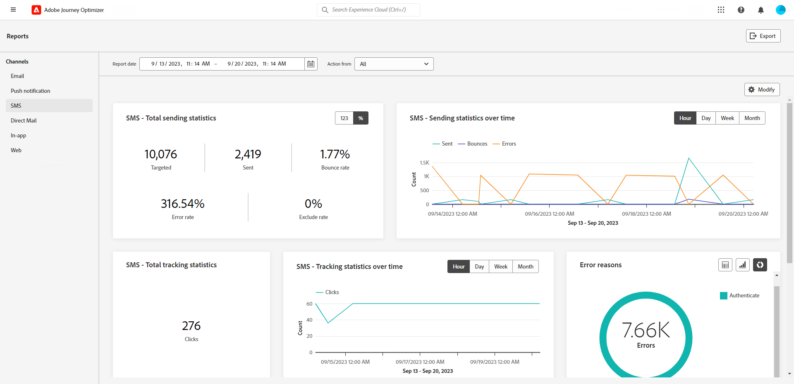
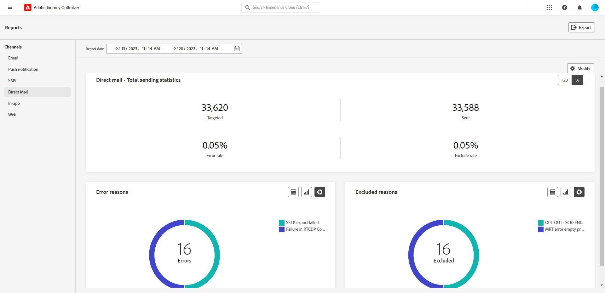

# 渠道报表 {#channel-report}

>[!CONTEXTUALHELP]
>id="ajo_channel_level_report"
>title="渠道级报告"
>abstract="渠道报告全面概述了跨所有渠道的流量和参与量度。报告分为不同的构件，详细说明营销活动和历程的成功和错误。每个报告仪表板都可以修改，您可以调整构件大小或删除构件。"

>[!IMPORTANT]
>
> 要访问 **报表** 菜单，您必须拥有 **[!UICONTROL 查看渠道报表]** 许可。 [了解详情](channel-report-gs.md#before-starting-manage-reports-prereq)

渠道报表可在渠道级别为用户提供流量和参与量度的全面概述。 这些量度将进行聚合，以显示来自所选渠道（跨各种促销活动和历程）的操作的合并值。

您可以通过导航到 **报表** 中的菜单 **历程管理** 部分。 它是完全可自定义的，您可以根据报表日期或操作筛选数据。 [了解详情](channel-report-gs.md)

此时将显示报告页面，其中包含以下选项卡：

* [电子邮件](#email)
* [推送 通知](#push)
* [短信](#sms)
* [应用程序内](#inapp)
* [Web](#web)
* [直邮](#direct-mail)

➡️ [在视频中发现此功能](#channel-report-video)

## 电子邮件 {#email}

在渠道报表中，电子邮件菜单详细说明与促销活动和历程中发送的电子邮件相关的主要信息。 指标详见下文。

+++  了解有关电子邮件报表可用的不同量度和小组件的更多信息。

此 **[!UICONTROL 电子邮件总发送统计数据]** 图表详细说明了电子邮件成功与否：

* **[!UICONTROL 已定位]**：已处理的电子邮件总数。

* **[!UICONTROL 已发送]**：发送总数。

* **[!UICONTROL 已投放]**：成功发送的电子邮件数，与已发送消息的总数相关。

* **[!UICONTROL 投放率]**：成功发送的电子邮件百分比。

* **[!UICONTROL 跳出次数]**：与已发送消息总数相关的累积和自动返回处理的错误总数。

* **[!UICONTROL 跳出率]**：退回的电子邮件与发送的电子邮件相比的百分比。

* **[!UICONTROL 错误]**：阻止将其发送到用户档案的错误总数。

* **[!UICONTROL 错误率]**：与已发送的电子邮件相比，阻止发送该邮件发生的错误百分比。

* **[!UICONTROL 已排除]**：Adobe Journey Optimizer已排除的用户档案数。

* **[!UICONTROL 排除率]**：Adobe Journey Optimizer已排除的用户档案的百分比。

此 **[!UICONTROL 电子邮件跟踪总数统计信息]** 小组件包含电子邮件收件人活动的可用数据：

* **[!UICONTROL 打开次数]**：消息的打开次数。

* **[!UICONTROL 打开率]**：打开的电子邮件总数，与已投放的电子邮件数相比。

* **[!UICONTROL 点击次数]**：在消息中单击内容的次数。

* **[!UICONTROL 点击率]**：与电子邮件交互的用户百分比。

* **[!UICONTROL 垃圾邮件投诉数]**：将消息声明为垃圾邮件或垃圾邮件的次数。

* **[!UICONTROL 垃圾邮件投诉率]**：与已发送电子邮件数量相比，声明为垃圾邮件或垃圾邮件的百分比。

* **[!UICONTROL 取消订阅]**：订阅链接的点击次数。

* **[!UICONTROL 取消订阅率]**：与已发送电子邮件数量相比的退订百分比。

此 **[!UICONTROL 随时间变化的发送统计数据]** 图形包含可用于已发送电子邮件的数据，例如：

* **[!UICONTROL 已发送]**：发送总数。

* **[!UICONTROL 已投放]**：成功发送的电子邮件数，与已发送电子邮件总数相关。

* **[!UICONTROL 跳出次数]**：与已发送电子邮件总数相关的累积和自动返回处理的错误总数。

* **[!UICONTROL 错误]**：阻止将其发送到用户档案的错误总数。

此 **[!UICONTROL 电子邮件跟踪统计数据超时]** 图形包含可用于打开和点击的数据。

此 **[!UICONTROL 退回原因]** 和 **[!UICONTROL 退回类别]** 小组件包含与退回邮件相关的可用数据，例如：

* **[!UICONTROL 硬退回]**：永久错误的总数，如错误的电子邮件地址。 这涉及显式声明地址无效的错误消息，例如“未知用户”。

* **[!UICONTROL 软退回]**：临时错误的总数，如收件箱已满。

* **[!UICONTROL 已忽略]**：临时总数，例如外出或技术错误，例如，如果发件人类型是邮递员。

有关退回的详细信息，请参阅 [禁止显示列表](../reports/suppression-list.md) 页面。

此 **[!UICONTROL 错误原因]** 通过图表和表格可查看发生的错误。

此 **[!UICONTROL 排除的原因]** 图形和表格可显示阻止从定向用户档案中排除的用户用户档案接收消息的不同原因。

此 **[!UICONTROL 按域列出的退回原因]**， **[!UICONTROL 按域发送和投放]**， **[!UICONTROL 按域划分的打开数和点击数]**  和 **[!UICONTROL 按域列出的退回和错误]** 表格和图形表示每个重要电子邮件投放和跟踪数据的域级细分。
+++

## 推送通知 {#push}

在渠道报表中，推送通知菜单详细列出了与促销活动和历程中发送的推送通知有关的主要信息。 指标详见下文。

+++  了解有关推送报表可用的不同量度和小组件的更多信息。

此 **[!UICONTROL 推送通知 — 发送统计信息总数]** 该表通过图表和KPI详细列出了与推送通知相关的主要信息：

* **[!UICONTROL 已定位]**：已处理的推送通知总数。

* **[!UICONTROL 已发送]**：已发送推送通知的总数。

* **[!UICONTROL 已投放]**：成功发送的推送通知数，与已发送推送通知的总数相关。

* **[!UICONTROL 投放率]**：已成功发送的推送通知的百分比。

* **[!UICONTROL 跳出次数]**：与已发送消息总数相关的累积和自动返回处理的错误总数。

* **[!UICONTROL 跳出率]**：退回的推送通知与已发送的推送通知相比的百分比。

* **[!UICONTROL 错误]**：阻止将其发送到用户档案的错误总数。

* **[!UICONTROL 错误率]**：与发送的推送通知相比，阻止发送该请求所发生的错误百分比。

* **[!UICONTROL 已排除]**：Adobe Journey Optimizer已排除的用户档案数。

* **[!UICONTROL 排除率]**：Adobe Journey Optimizer已排除的用户档案的百分比。

此 **[!UICONTROL 推送通知 — 跟踪统计信息总数]** 包含推送通知的收件人活动可用数据：

* **[!UICONTROL 打开次数]**：推送通知的打开次数。

* **[!UICONTROL 打开率]**：已打开推送通知的百分比。

* **[!UICONTROL 操作]**：对已投放推送通知执行的总操作数，例如按钮点击或解除。

* **[!UICONTROL 操作率]**：已投放推送通知上的操作相对于已发送推送通知的百分比。

* **[!UICONTROL 参与率]**：此推送通知的打开和操作百分比，即如果用户档案打开了推送或单击了按钮。

此 **[!UICONTROL 推送通知 — 发送一段时间内的统计数据]** 图形包含可用于已发送推送通知的数据，例如：

* **[!UICONTROL 已发送]**：已发送推送通知的总数。

* **[!UICONTROL 已投放]**：成功发送的推送通知数，与已发送推送通知的总数相关。

* **[!UICONTROL 跳出次数]**：与已发送消息总数相关的累积和自动返回处理的错误总数。

* **[!UICONTROL 错误]**：阻止将其发送到用户档案的错误总数。

此 **[!UICONTROL 排除的原因]** 图形和表格可显示阻止从定向用户档案中排除的用户用户档案接收消息的不同原因。

此 **[!UICONTROL 错误原因]** 通过图表和表格可查看发生的错误。

此 **[!UICONTROL 按平台跟踪]** 和 **[!UICONTROL 按平台发送]** 图表和表格会根据收件人的操作系统详细描述推送通知的成功情况。
+++

## 短信 {#sms}

在渠道报表中，短信菜单详细说明与促销活动和历程中发送的短信相关的主要信息。 指标详见下文。

+++ 了解更多有关可用于短信报告的不同量度和小组件。

此 **[!UICONTROL 短信 — 发送统计信息总数]** 该表详细列出了短信的成功情况：

* **[!UICONTROL 已定位]**：符合短信渠道目标配置文件资格的用户配置文件数。

* **[!UICONTROL 已发送]**：已发送的短信消息总数。

* **[!UICONTROL 已投放]**：成功发送的短信消息数，与已发送的短信消息总数相关。

* **[!UICONTROL 投放率]**：成功发送的短信消息的百分比。

* **[!UICONTROL 跳出次数]**：相对于已发送的短信消息总数，已累计和自动返回处理的错误总数。

* **[!UICONTROL 跳出率]**：退回的短信消息与发送的短信消息相比的百分比。

* **[!UICONTROL 错误]**：阻止将其发送到用户档案的错误总数。

* **[!UICONTROL 错误率]**：与已发送的短信消息相比，阻止发送该消息的错误百分比。

* **[!UICONTROL 已排除]**：从定向用户档案中排除且未收到消息的用户用户档案数。

* **[!UICONTROL 排除率]**：Adobe Journey Optimizer已排除的用户档案的百分比。

此 **[!UICONTROL 短信 — 跟踪统计信息总数]** 构件详细列出与访客对URL的参与度相关的主要信息：

* **[!UICONTROL 点击次数]**：内容在短信消息中被点击的次数。

* **[!UICONTROL 点击率]**：与短信消息交互的用户百分比。

此 **[!UICONTROL 短信 — 随时间变化的发送统计数据]** 构件以图表形式详细描述与消息相关的主要信息：

* **[!UICONTROL 已发送]**：已发送的短信消息总数。

* **[!UICONTROL 已投放]**：成功发送的短信消息数，与已发送的短信消息总数相关。

* **[!UICONTROL 跳出次数]**：相对于已发送的短信消息总数，已累计和自动返回处理的错误总数。

* **[!UICONTROL 错误]**：阻止将其发送到用户档案的错误总数。

此 **[!UICONTROL 排除原因]**， **[!UICONTROL 退回原因]** 和 **[!UICONTROL 错误原因]** 利用图形和表格，可查看发生了哪些错误和排除项。

+++

## 应用程序内 {#in-app}

在渠道报表中，应用程序内菜单详细列出与促销活动和历程中发送的应用程序内消息相关的主要信息。 指标详见下文。

+++  了解有关可用于应用程序内报表的不同量度和小组件的更多信息。

此 **[!UICONTROL 应用程序内总参与度]** KPI可详细列出与访客与应用程序内消息互动相关的主要信息，例如：

* **[!UICONTROL 展示次数]**：交付给所有用户的应用程序内消息总数。

* **[!UICONTROL 交互]**：应用程序内消息的参与总数。 这包括用户执行的任何操作，例如单击、解除或任何其他交互。

* **[!UICONTROL 消除]**：收件人通过单击关闭按钮或自动关闭而关闭的应用程序内消息总数。

* **[!UICONTROL 消除率]**：收件人已解除的应用程序内消息的百分比。

此 **[!UICONTROL 应用程序内参与加班]** 图形通过跟踪任何展示、拒绝或交互，显示了在相关时间段内应用程序内展示和交互的演变。

+++

## Web {#web}

在渠道报表中，Web菜单详细列出与促销活动和历程中包含的网页相关的主要信息。 指标详见下文。

+++ 了解更多可用于Web报表的不同量度和小组件。

此 **[!UICONTROL Web总体参与度]** KPI可详细列出与访客对Web体验的参与度相关的主要信息，例如：

* **[!UICONTROL 展示次数]**：交付给所有用户的Web体验总数。

* **[!UICONTROL 交互]**：与网页的互动总数。 这包括用户执行的任何操作，例如点击或任何其他交互。

* **[!UICONTROL 消除]**：收件人已关闭的网页总数。

* **[!UICONTROL 消除率]**：收件人关闭的网页的百分比。

此 **[!UICONTROL Web参与加班]** 图形可详细描述与访客对网页的参与度相关的主要信息。

+++

## 直邮 {#direct-mail}

在渠道报表中，直邮菜单详细列出与促销活动和历程中发送的直邮消息相关的主要信息。 量度详见下文。

+++ 了解有关直邮报表可用的不同量度和小组件的更多信息。
此 **[!UICONTROL 直邮 — 发送统计信息总数]** 该表详细列出了消息的成功情况：

* **[!UICONTROL 已定位]**：符合直邮消息目标用户档案资格的用户档案数。

* **[!UICONTROL 已发送]**：发送总数。

* **[!UICONTROL 错误]**：阻止将其发送到用户档案的错误总数。

* **[!UICONTROL 错误率]**：与发送的推送通知相比，阻止发送该请求所发生的错误百分比。

* **[!UICONTROL 已排除]**：从定向用户档案中排除且未收到消息的用户用户档案数。

* **[!UICONTROL 排除率]**：Adobe Journey Optimizer已排除的用户档案的百分比。

此 **[!UICONTROL 排除原因]** 和 **[!UICONTROL 错误原因]** 利用图形和表格，可查看发生了哪些错误和排除项。
+++

## 渠道报表（视频） {#channel-report-video}

请在此视频中了解如何在渠道级别访问、导航和导出报告

>[!VIDEO](https://video.tv.adobe.com/v/3424537?quality=12)
