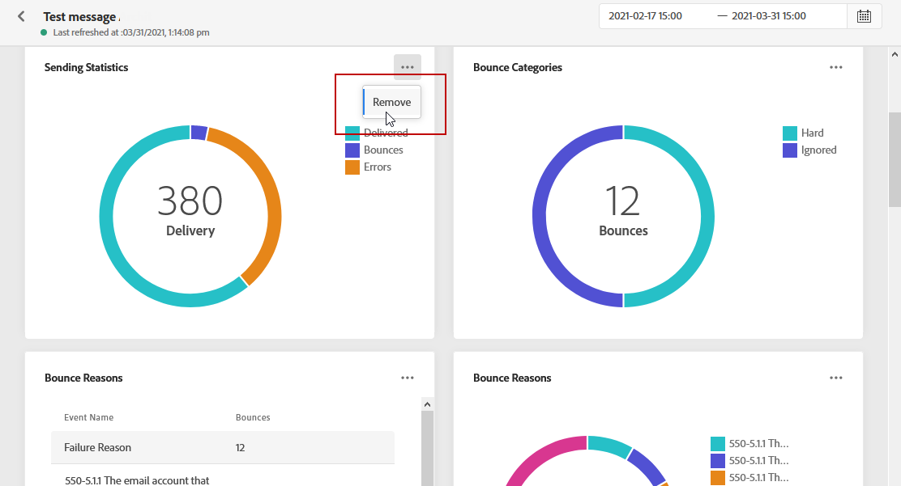

# 全局报告{#global-report}

>[!NOTE]
>
> 如果在使用查询服务时通过API进行自定义查询，则报表可能会出现延迟。

使用&#x200B;**[!UICONTROL Global report]**&#x200B;衡量选定时间段内历程和投放的影响。

* 如果要在历程上下文中定位历程或投放，请从&#x200B;**[!UICONTROL Journeys]**&#x200B;菜单访问历程，然后单击&#x200B;**[!UICONTROL Global report]**&#x200B;图标。 然后，您可以找到历程、电子邮件和推送&#x200B;**[!UICONTROL Global report]**。

* 如果要定位特定投放，请从消息&#x200B;**[!UICONTROL Executions]**&#x200B;选项卡的&#x200B;**[!UICONTROL Global view]**&#x200B;中，从选定投放的高级菜单中选择&#x200B;**[!UICONTROL Global Report]**。

## 自定义功能板{#modify-dashboard}

可通过调整大小或删除小组件或更改目标时间范围来修改每个报表功能板。 更改小组件仅会影响当前用户的功能板。 其他用户将看到他们自己的功能板或默认设置的功能板。

1. 在&#x200B;**[!UICONTROL Global report]**&#x200B;功能板中，单击调度程序按钮。

1. 选择开始日期和结束日期。 您可以通过选择&#x200B;**[!UICONTROL Start time]**&#x200B;和&#x200B;**[!UICONTROL End time]**&#x200B;来进一步优化报表。

   

1. click **[!UICONTROL Modify]**.

   

1. 通过拖动小组件的右下角来调整其大小。

   

1. 单击&#x200B;**[!UICONTROL Remove]**&#x200B;可删除您不需要跟踪退回的其他小组件。

   

1. 当您对小组件的显示顺序和大小感到满意后，单击&#x200B;**[!UICONTROL Save]**。

功能板现已保存。 您的不同更改将重新应用，以供日后使用全局报表。 如果需要，请使用&#x200B;**[!UICONTROL Reset]**&#x200B;选项恢复默认小组件和小组件的顺序。
